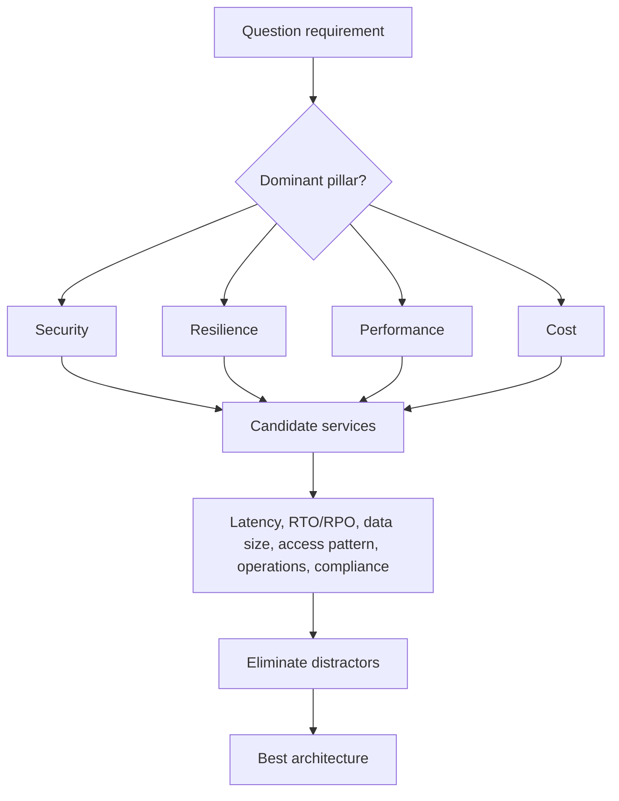

# 28 - SAA-C03 Alignment Audit and Scenario Playbook

## Why This Chapter Matters

The AWS Solutions Architect Associate exam is not a memorization exam where knowing service names is enough. It asks whether you can read a business requirement, notice the constraint, reject attractive wrong answers, and choose an architecture that is secure, resilient, high-performing, and cost-optimized.

This folder already contains strong service notes. This chapter connects those notes to the official SAA-C03 exam domains and teaches the decision method that turns service knowledge into correct architecture answers.

Source snapshot: 2026-05-27. AWS services and certification guides change. Recheck the official AWS SAA-C03 exam guide before booking the exam or using this note as a final checklist.

Official sources:

- AWS Certified Solutions Architect - Associate SAA-C03 exam guide: <https://docs.aws.amazon.com/aws-certification/latest/solutions-architect-associate-03/solutions-architect-associate-03.html>
- Official SAA-C03 PDF: <https://d1.awsstatic.com/training-and-certification/docs-sa-assoc/AWS-Certified-Solutions-Architect-Associate_Exam-Guide.pdf>
- AWS Well-Architected Framework: <https://docs.aws.amazon.com/wellarchitected/latest/framework/the-pillars-of-the-framework.html>

## The Big Picture

Official SAA-C03 scored content domains:

| Domain | Weight | What the exam is really asking |
| --- | ---: | --- |
| Design Secure Architectures | 30% | Can you protect identities, networks, data, and access paths without overexposing resources? |
| Design Resilient Architectures | 26% | Can you survive AZ/service/component failure and recover data/workloads correctly? |
| Design High-Performing Architectures | 24% | Can you pick scalable compute, storage, database, network, and integration patterns? |
| Design Cost-Optimized Architectures | 20% | Can you meet requirements without paying for unnecessary capacity, data transfer, or operations? |

The exam uses 65 questions total: 50 scored and 15 unscored. The minimum passing scaled score is 720. AWS uses a compensatory scoring model, so the goal is overall mastery, not passing each domain separately.

## First-Principles Explanation

Cause: Real cloud architecture is a tradeoff problem. The same workload can often be built with EC2, containers, serverless, managed databases, queues, object storage, CDN, or hybrid networking.

Mechanism: AWS provides many managed services with different reliability, security, performance, cost, and operational profiles. The architect chooses based on constraints.

Immediate result: A good solution meets the stated requirement and avoids hidden penalties.

Long-term impact: Architecture questions become pattern recognition plus tradeoff reasoning, not service flashcards.

Next connected topic: Well-Architected pillars, service selection tables, migration patterns, DR patterns, and scenario practice.

## Core Vocabulary

| Term | Meaning | Exam value |
| --- | --- | --- |
| Well-Architected | AWS framework for evaluating cloud architectures across six pillars. | Helps reason about tradeoffs. |
| Availability Zone | Physically separate location inside a Region. | Used for high availability design. |
| Multi-AZ | Design spanning multiple AZs in one Region. | Common resilience answer. |
| Multi-Region | Design spanning multiple Regions. | Higher resilience and lower latency, but more cost/complexity. |
| RTO | Recovery Time Objective. | How quickly service must recover. |
| RPO | Recovery Point Objective. | How much data loss is acceptable. |
| Least privilege | Grant only required permissions. | Central secure-architecture clue. |
| Decoupling | Use queues/events/buffers between components. | Helps resilience and scaling. |
| Managed service | AWS operates more of the stack. | Reduces operational burden but has service-specific constraints. |
| Serverless | No server management by customer. | Often cost/performance/ops answer for event-driven workloads. |

## Mental Model

Read an SAA question like an architect receiving a design ticket:

```text
business requirement
  -> non-negotiable constraint
  -> workload pattern
  -> candidate AWS services
  -> eliminate unsafe/overbuilt/underbuilt answers
  -> choose the simplest service combination that satisfies all constraints
```

The wrong answer is often a correct AWS service used for the wrong reason.

## Historical / Evolution / Causal Chain

Early cloud usage:

Lift-and-shift servers -> manual scaling and patching -> cloud bill without cloud architecture.

Managed services matured:

RDS, ELB, Auto Scaling, S3, CloudFront, SQS, Lambda -> fewer undifferentiated operations -> more design choices.

Architecture exams evolved:

Service recall -> scenario tradeoffs -> secure/resilient/performance/cost design decisions.

Current SAA-C03 emphasis:

Requirement wording -> Well-Architected tradeoff -> service limits and integration behavior -> best fit answer.

## Architecture or Conceptual Structure



## Domain Alignment Map

### Domain 1: Design Secure Architectures

Required thinking:

- Who or what needs access?
- Is access human, workload, cross-account, public, private, temporary, or federated?
- Is data protected in transit and at rest?
- Is the network path public or private?
- Are there explicit denies, SCPs, KMS key policies, resource policies, or endpoint policies?

Vault coverage:

- [2 - IAM and AWS CLI](2%20-%20IAM%20and%20AWS%20CLI.md)
- [12 - Amazon S3 Security](12%20-%20Amazon%20S3%20Security.md)
- [24 - Identity and Access Management (IAM) - Advanced](24%20-%20Identity%20and%20Access%20Management%20%28IAM%29%20-%20Advanced.md)
- [25 - AWS Security and Encryption](25%20-%20AWS%20Security%20and%20Encryption%20-%20KMS%2C%20SSM%20Parameter%20Store%2C%20Shield%20and%20WAF.md)
- [26 - Networking VPC](26%20-%20Networking%20VPC.md)

Common exam chains:

Public S3 risk -> Block Public Access + bucket policy review -> private access through CloudFront OAC or VPC endpoint -> audit with CloudTrail/S3 logs.

Application needs AWS API access -> IAM role, not long-term keys -> least privilege policy -> CloudTrail audit.

Cross-account access -> role trust policy + permissions policy -> sometimes resource policy too -> explicit deny wins.

### Domain 2: Design Resilient Architectures

Required thinking:

- What fails: instance, AZ, Region, database, queue consumer, network path, or storage?
- Does the workload need high availability or disaster recovery?
- What are the RTO/RPO constraints?
- Should recovery be backup/restore, pilot light, warm standby, or active/active?

Vault coverage:

- [6 - High Availability and Scalability ELB and ASG](6%20-%20High%20Availability%20and%20Scalability%20ELB%20and%20ASG.md)
- [7 - AWS Databases - RDS, Aurora and ElastiCache](7%20-%20AWS%20Databases%20-%20RDS%2C%20Aurora%20and%20ElastiCache.md)
- [8 - Route 53](8%20-%20Route%2053.md)
- [11 - Advanced - Amazon S3](11%20-%20Advanced%20-%20Amazon%20S3.md)
- [16 - Decoupling Applications](16%20-%20Decoupling%20Applications%20-%20SQS%2C%20SNS%2C%20Kinesis%20and%20Amazon%20MQ.md)
- [27 - Disaster Recovery and Management](27%20-%20Disaster%20Recovery%20%26%20Management.md)

Common exam chains:

Single EC2 instance fails -> ASG across multiple AZs behind ALB -> health checks replace failed targets.

Synchronous spikes overload app -> SQS queue decouples producers/consumers -> ASG/Lambda consumers scale -> DLQ captures poison messages.

Low RTO/RPO multi-Region need -> active/passive or active/active with Route 53/Global Accelerator and replicated data -> cost/complexity increases.

### Domain 3: Design High-Performing Architectures

Required thinking:

- What is the performance bottleneck: compute, database, storage, network, cache, or global latency?
- Is traffic synchronous, asynchronous, streaming, batch, read-heavy, write-heavy, or bursty?
- Can caching, CDN, partitioning, read replicas, or event-driven scaling help?

Vault coverage:

- [3 - EC2 Fundamentals](3%20-%20EC2%20Fundamentals.md)
- [5 - EC2 Instance Storage](5%20-%20EC2%20Instance%20Storage.md)
- [7 - AWS Databases - RDS, Aurora and ElastiCache](7%20-%20AWS%20Databases%20-%20RDS%2C%20Aurora%20and%20ElastiCache.md)
- [13 - CloudFront and AWS Global Accelerator](13%20-%20CloudFront%20and%20AWS%20Global%20Accelerator.md)
- [16 - Decoupling Applications](16%20-%20Decoupling%20Applications%20-%20SQS%2C%20SNS%2C%20Kinesis%20and%20Amazon%20MQ.md)
- [18 - Serverless Overview](18%20-%20Serverless%20Overview%20from%20Solutions%20Architect%20Perspective.md)
- [20 - Databases in AWS](20%20-%20Databases%20in%20AWS.md)

Common exam chains:

Static content global latency -> S3 origin + CloudFront -> edge cache reduces latency and origin load.

Read-heavy relational database -> read replicas or Aurora replicas -> offload reads; Multi-AZ alone is not read scaling for many engines.

Unpredictable event workload -> Lambda + SQS/EventBridge -> scales by events, but consider concurrency, retries, idempotency.

### Domain 4: Design Cost-Optimized Architectures

Required thinking:

- Is workload steady, spiky, interruptible, archival, read-heavy, or short-lived?
- Are you paying for idle compute, NAT data processing, over-provisioned database, cross-AZ data transfer, or wrong storage class?
- Can managed scaling, lifecycle policies, caching, or rightsizing reduce cost without violating requirements?

Vault coverage:

- [3 - EC2 Fundamentals](3%20-%20EC2%20Fundamentals.md)
- [10 - Amazon S3 Introduction](10%20-%20Amazon%20S3%20Introduction.md)
- [11 - Advanced - Amazon S3](11%20-%20Advanced%20-%20Amazon%20S3.md)
- [14 - AWS Storage Extras](14%20-%20AWS%20Storage%20Extras.md)
- [16 - Decoupling Applications](16%20-%20Decoupling%20Applications%20-%20SQS%2C%20SNS%2C%20Kinesis%20and%20Amazon%20MQ.md)
- [18 - Serverless Overview](18%20-%20Serverless%20Overview%20from%20Solutions%20Architect%20Perspective.md)
- [26 - Networking VPC](26%20-%20Networking%20VPC.md)

Common exam chains:

Steady compute -> Reserved Instances or Savings Plans -> lower cost than On-Demand.

Interruptible batch -> Spot Instances or Spot Fleet -> low cost with interruption handling.

Infrequent object access -> S3 lifecycle to lower-cost storage class -> retrieval time/cost must match requirement.

Private subnet downloads from S3 through NAT -> VPC gateway endpoint for S3 -> reduce NAT cost and improve private path.

## Step-by-Step Scenario Method

### 1. Identify the Primary Constraint

Look for exact words:

| Wording | Likely direction |
| --- | --- |
| "least operational overhead" | managed/serverless service |
| "must not be publicly accessible" | private subnet, VPC endpoint, private API, no public IP |
| "decouple" or "buffer" | SQS, SNS, EventBridge, Kinesis depending pattern |
| "ordered messages" | SQS FIFO or stream shard ordering |
| "global users with low latency" | CloudFront, Global Accelerator, Route 53 latency routing |
| "shared Linux file system" | EFS |
| "block storage for EC2" | EBS |
| "object storage" | S3 |
| "RTO minutes, RPO near zero" | warm standby/active-active, replicated data |
| "archive for years, rare access" | Glacier storage class family, retention controls |

### 2. Reject Answers That Violate a Hard Requirement

Examples:

- Requirement says private access, answer uses public internet.
- Requirement says least operational overhead, answer builds EC2-managed cluster.
- Requirement says ordered processing, answer uses standard SQS without considering ordering.
- Requirement says shared file access across multiple AZs, answer uses one EBS volume.
- Requirement says no data loss/minimal RPO, answer uses only daily backups.

### 3. Prefer Managed Services When Requirements Match

Cause:

Managed service -> AWS handles more operational work -> exam often rewards lower operational overhead.

But do not overuse:

Managed does not mean correct if the access pattern, latency, consistency, cost, or integration does not fit.

### 4. Check Security Last Before Choosing

Even if the architecture works, reject it if it exposes data:

- public S3 when private is required
- IAM user keys on EC2 instead of IAM role
- no encryption when encryption is required
- public subnet database
- broad wildcard permissions where least privilege is asked

## Internal Mechanics

### Security Evaluation Chain

```text
principal identity
  -> identity policy
  -> resource policy
  -> permissions boundary
  -> SCP
  -> session policy
  -> explicit deny check
  -> final allow/deny
```

Exam implication:

An IAM allow is not enough if an SCP, boundary, resource policy, or explicit deny blocks the action.

### Availability Chain

```text
one instance
  -> multiple instances
  -> multiple AZs
  -> health checks
  -> automated replacement
  -> data replication
  -> tested failover
```

Exam implication:

Scaling stateless compute is easy. Keeping data available and consistent is the harder part.

### Performance Chain

```text
measure bottleneck
  -> cache reads
  -> distribute globally
  -> scale horizontally
  -> choose correct storage/database model
  -> decouple spikes
```

Exam implication:

Do not solve a database bottleneck by only adding EC2 instances. Find the constrained layer.

### Cost Chain

```text
match capacity to demand
  -> remove idle resources
  -> choose pricing model
  -> reduce data transfer and NAT path costs
  -> lifecycle cold data
  -> use managed scaling where suitable
```

Exam implication:

Cost optimization is not "always cheapest." It is the cheapest option that still meets requirements.

## Practical Examples

### Example 1: Private S3 Access From Private Subnets

Question clue:

EC2 instances in private subnets must access S3 without using the internet and with lower data processing cost.

Reasoning:

Private subnet -> no public internet path.

S3 access through NAT works but costs NAT hourly/data processing and still routes through NAT.

S3 gateway endpoint -> private route-table path to S3, no NAT required for S3 traffic.

Best answer:

Use an S3 gateway VPC endpoint and route-table entries/policies as needed.

### Example 2: Multi-AZ Web App

Question clue:

Application must remain available if one AZ fails.

Reasoning:

Single EC2 -> instance/AZ single point.

ASG across multiple AZs -> replaces unhealthy instances.

ALB across subnets in multiple AZs -> routes only to healthy targets.

RDS Multi-AZ -> database failover.

Best answer:

ALB + ASG spanning at least two AZs + Multi-AZ database, with health checks and backups.

### Example 3: Message Spike Protection

Question clue:

Traffic spikes overwhelm a backend, but requests can be processed asynchronously.

Reasoning:

Synchronous scaling alone may still drop traffic.

Queue absorbs spikes.

Consumers scale independently.

DLQ preserves failed messages for inspection.

Best answer:

SQS queue between producers and consumers, with autoscaled consumers and DLQ.

## Small Details That Matter Later

- Multi-AZ improves availability inside one Region; it is not the same as multi-Region DR.
- Read replicas improve read scale; Multi-AZ is mainly availability/failover.
- Security groups are stateful; NACLs are stateless.
- IAM roles are preferred over long-term access keys for AWS workloads.
- Explicit deny wins in IAM evaluation.
- S3 bucket names are global; buckets live in Regions.
- S3 lifecycle choices must respect retrieval time and retrieval cost.
- CloudFront is a CDN; Global Accelerator improves network path to regional endpoints.
- EBS is AZ-scoped; EFS is regional and multi-AZ by design.
- VPC peering is not transitive.
- NAT Gateway can become a cost trap for high-volume AWS service traffic.
- SQS standard does not guarantee strict ordering; FIFO changes throughput/ordering tradeoffs.
- Lambda is not always cheapest for steady high-throughput compute.
- Serverless still needs IAM, retries, idempotency, observability, and concurrency planning.
- Cross-AZ and cross-Region data transfer can affect both cost and architecture.

## Common Misunderstandings

| Misunderstanding | Correction |
| --- | --- |
| Multi-AZ and read replica solve the same problem. | Multi-AZ is availability; read replicas are read scaling and sometimes DR depending service. |
| Any managed service is automatically best. | Managed services reduce operations only when they fit the requirement. |
| Public subnet means secure if security group is locked down. | Public routing may violate private-access requirements even if inbound is restricted. |
| Cheapest option is always correct for cost domain. | It must still meet availability, performance, durability, and security constraints. |
| S3 is a filesystem replacement for all cases. | S3 is object storage; use EFS/FSx/EBS for filesystem/block requirements. |

## Failure Modes / Mistakes / Traps

| Trap | Why it is wrong |
| --- | --- |
| Choosing EBS for multi-AZ shared file access | EBS is AZ-scoped block storage; EFS is the common shared Linux file system answer. |
| Choosing NAT Gateway for S3-heavy private traffic when endpoint is possible | Works but may be less cost-optimized and less direct than S3 gateway endpoint. |
| Choosing backup/restore for very low RTO/RPO | Recovery may be too slow or data loss too high. |
| Choosing SQS standard for strict ordering | Standard queues do not provide strict ordering guarantees. |
| Choosing public ALB for private internal app | Internal ALB or private connectivity may be required. |
| Giving Lambda broad admin permissions | Violates least privilege. |

## Debugging / Analysis / Answer-Writing Method

Use this answer frame for scenario questions:

1. Requirement: identify the exact requirement words.
2. Constraint: identify the hard constraint that cannot be violated.
3. Pattern: map to a known architecture pattern.
4. Eliminate: remove choices that break security/resilience/performance/cost.
5. Choose: state the minimal correct service combination.

Example:

"The requirement is private, cost-optimized S3 access from private subnets. NAT Gateway would work but adds NAT cost and is not the best private AWS-service path. An S3 gateway endpoint satisfies private connectivity and cost optimization."

## Real-World or Exam Relevance

SAA-C03 questions often bury the answer under:

- one hard security phrase
- one cost phrase
- one availability phrase
- one operational overhead phrase
- a tempting service name that solves a different problem

Your job is to identify which phrase dominates the answer.

## Connected Topics

- [9 - Classic Solutions Architect Discussions](9%20-%20Classic%20Solutions%20Architect%20Discussions.md)
- [16 - Decoupling Applications](16%20-%20Decoupling%20Applications%20-%20SQS%2C%20SNS%2C%20Kinesis%20and%20Amazon%20MQ.md)
- [19 - Serverless Solutions Architect Discussions](19%20-%20Serverless%20Solutions%20Architect%20Discussions.md)
- [26 - Networking VPC](26%20-%20Networking%20VPC.md)
- [27 - Disaster Recovery and Management](27%20-%20Disaster%20Recovery%20%26%20Management.md)
- [29 - SAA-C03 Practice Questions and Rationales](29%20-%20SAA-C03%20Practice%20Questions%20and%20Rationales.md)
- [30 - SAA-C03 Rapid Revision Cheatsheet and Glossary](30%20-%20SAA-C03%20Rapid%20Revision%20Cheatsheet%20and%20Glossary.md)

## Chapter Summary

SAA-C03 tests architecture judgment across four domains: security, resilience, performance, and cost. The correct answer is the architecture that satisfies the exact requirement with the least unnecessary risk, cost, and operational complexity. Service knowledge matters, but scenario reasoning matters more.

## Questions to Test Understanding

1. Why is Multi-AZ not the same as multi-Region?
2. Why can NAT Gateway be a cost trap for private S3 access?
3. Why does "least operational overhead" often point to managed or serverless services?
4. Why is an IAM role usually better than access keys on EC2?
5. Why can a read replica be the wrong answer for high availability?

## Answers and Reasoning

1. Multi-AZ spans failure domains inside one Region. Multi-Region survives regional disruption but costs more and needs data/traffic failover design.
2. NAT has hourly and data processing charges. S3 gateway endpoints can provide private S3 access without routing S3 traffic through NAT.
3. AWS operates more of the infrastructure, patching, scaling, and availability behavior, reducing customer management work when the service fits.
4. Roles provide temporary credentials and avoid storing long-term keys on instances.
5. Read replicas mainly scale reads and may require promotion or manual failover depending service; Multi-AZ is the classic availability/failover feature for RDS.
