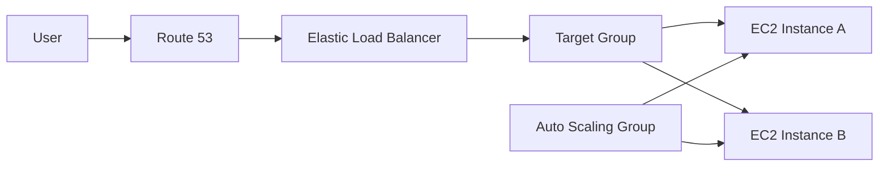

# 6 - High Availability and Scalability with ELB and ASG

## Quick Summary

High availability means an application stays usable even when part of the infrastructure fails. Scalability means an application can handle more or less load by changing capacity.

In AWS, two core services for EC2-based application design are:

- Elastic Load Balancing (ELB): distributes traffic across targets.
- Amazon EC2 Auto Scaling Groups (ASG): adds, removes, and replaces EC2 instances based on desired capacity, health, and scaling policies.

A common production pattern is:

```text
Users -> Route 53 -> Load Balancer -> Auto Scaling Group -> EC2 instances
```

## Why It Matters

Without load balancing and auto scaling:

- One unhealthy instance can break the application.
- Traffic spikes can overload fixed capacity.
- Manual instance replacement is slow.
- Deployments and maintenance create more downtime.

With ELB and ASG:

- Users get one stable entry point.
- Failed instances can be removed from traffic.
- New instances can be launched automatically.
- Applications can run across multiple Availability Zones.
- Capacity can be adjusted automatically based on demand.

## Core Concepts

| Concept            | Meaning                                                 |
| ------------------ | ------------------------------------------------------- |
| Scalability        | Ability to handle changing load.                        |
| Vertical scaling   | Increase or decrease the size of one server.            |
| Horizontal scaling | Increase or decrease the number of servers.             |
| Elasticity         | Automatically match capacity to demand.                 |
| High availability  | Keep the service running during component failure.      |
| Fault tolerance    | Continue operating even when failures happen.           |
| Load balancer      | Distributes traffic across targets.                     |
| Target group       | Set of targets behind a load balancer listener or rule. |
| Auto Scaling Group | Manages a fleet of EC2 instances.                       |
| Health check       | Determines whether a target or instance is healthy.     |

## Scalability vs High Availability

| Topic             | Main Question                      | Example                                           |
| ----------------- | ---------------------------------- | ------------------------------------------------- |
| Scalability       | Can it handle more load?           | Add more EC2 instances when CPU is high.          |
| High availability | Can it survive failure?            | Run instances in at least two Availability Zones. |
| Elasticity        | Can capacity adjust automatically? | ASG scales out or in based on target tracking.    |

They are related but not identical. A system can scale but still not be highly available if all capacity sits in one Availability Zone.

## Vertical Scaling

Vertical scaling means changing the size of one machine.

Example:

```text
t3.micro -> t3.large -> m7i.2xlarge
```

Good for:

- Databases with limited horizontal scaling.
- Stateful systems.
- Quick capacity increase in relatively simple architectures.

Limits:

- Hardware size has a ceiling.
- Often needs restart or replacement.
- One large instance can still be a single point of failure.
- Cost can rise quickly.

AWS examples:

- EC2 instance size changes.
- RDS instance class changes.
- ElastiCache node type changes.

## Horizontal Scaling

Horizontal scaling means adding more machines.

Example:

```text
2 app instances -> 4 app instances -> 8 app instances
```

Good for:

- Stateless web applications.
- API servers.
- Worker fleets.
- Containerized applications.

Requirements:

- Load balancer or queue-based distribution.
- Stateless application design, or externalized state.
- Shared database, cache, or storage where needed.
- A deployment strategy that handles multiple versions safely.

## High Availability Design

A basic highly available EC2 design looks like this:

```text
Availability Zone A: app instance 1
Availability Zone B: app instance 2
Load Balancer spans both AZs
Auto Scaling Group spans both AZs
```

Important design ideas:

- Use at least two Availability Zones for production-facing workloads.
- Put load balancer subnets in multiple AZs.
- Put ASG subnets in multiple AZs.
- Keep application state outside individual instances.
- Use health checks to remove broken targets.
- Prefer passive or active redundancy depending on the workload.

## Elastic Load Balancing Overview

Elastic Load Balancing is AWS's managed load balancing service.

It helps with:

- Traffic distribution.
- Health checks.
- TLS termination.
- One DNS endpoint for users.
- Multi-AZ application entry points.
- Integration with Auto Scaling, ECS, ACM, CloudWatch, Route 53, WAF, and Global Accelerator.

Why use managed ELB instead of self-managed HAProxy/Nginx?

- AWS manages the availability and maintenance of the load balancer service.
- It integrates directly with AWS target groups and health checks.
- It scales the load balancer infrastructure.
- It reduces operational work.

Self-managed load balancers may still be used for special requirements, but they add patching, scaling, HA, and monitoring responsibility.

## What is Load Balancing?

Load balancers are servers that forward traffic to multiple downstream servers such as EC2 instances.

Their job is to:

- Spread requests across multiple backends.
- Expose a single entry point to the application.
- Handle failures of downstream instances.
- Perform regular health checks.
- Provide SSL termination for HTTPS workloads.
- Enforce stickiness with cookies when needed.
- Improve availability across zones.
- Separate public traffic from private traffic.

## ELB Types

AWS supports four load balancer families.

| Load Balancer                   | Layer                       | Protocols / Use                                                        |
| ------------------------------- | --------------------------- | ---------------------------------------------------------------------- |
| Application Load Balancer (ALB) | Layer 7                     | HTTP, HTTPS, WebSocket, HTTP/2, gRPC-style application routing.        |
| Network Load Balancer (NLB)     | Layer 4                     | TCP, UDP, TLS, very high performance, static IP per AZ.                |
| Gateway Load Balancer (GWLB)    | Layer 3/4 appliance pattern | Third-party virtual appliances such as firewalls and inspection tools. |
| Classic Load Balancer (CLB)     | Legacy                      | Older generation; prefer ALB/NLB for new designs.                      |

For new solutions, choose ALB, NLB, or GWLB unless you are maintaining a legacy CLB design.

## Load Balancer Security Groups

A common and important design pattern is to place the load balancer in front of the application tier:

- The load balancer security group allows inbound traffic on ports 80 and 443 from the internet or allowed CIDRs.
- The EC2 instance security group allows inbound traffic only from the load balancer security group on the application port.
- The application instance should not usually be directly exposed to the internet.

This separation helps with least-privilege access and keeps the application tier protected.

## Application Load Balancer (ALB)

ALB is best for HTTP/HTTPS applications.

Use ALB when you need:

- Host-based routing.
- Path-based routing.
- Header/query based routing.
- HTTP to HTTPS redirects.
- TLS termination with AWS Certificate Manager.
- AWS WAF integration.
- WebSocket support.
- Container or microservice routing.
- Lambda targets for HTTP-style requests.
- Port mapping for container-based workloads.

Example routing:

```text
app.example.com/api  -> API target group
app.example.com/web  -> web target group
admin.example.com    -> admin target group
```

### ALB Components

| Component    | Purpose                                                                             |
| ------------ | ----------------------------------------------------------------------------------- |
| Listener     | Checks for traffic on a port/protocol such as HTTPS 443.                            |
| Rule         | Matches request conditions and forwards, redirects, or responds.                    |
| Target group | Group of targets such as instances, IPs, Lambda, or ALB targets in supported cases. |
| Health check | Verifies the health of each target.                                                 |

### ALB Target Types

| Target Type | Use                                                                                      |
| ----------- | ---------------------------------------------------------------------------------------- |
| Instance    | Targets EC2 instances by instance ID.                                                    |
| IP          | Targets private IP addresses, useful for containers or on-prem via private connectivity. |
| Lambda      | Invokes Lambda functions through ALB.                                                    |

### ALB Routing Features

ALB can route traffic using:

- Path in URL such as `/users` and `/posts`.
- Hostname such as `one.example.com` and `other.example.com`.
- Query strings and headers.

ALB is a strong fit for microservices and container-based applications such as Docker and Amazon ECS.

### ALB Client IP Headers

Application targets do not see the load balancer as the same as direct client access.

Common headers:

| Header              | Meaning                                      |
| ------------------- | -------------------------------------------- |
| `X-Forwarded-For`   | Original client IP chain.                    |
| `X-Forwarded-Port`  | Original destination port.                   |
| `X-Forwarded-Proto` | Original protocol such as `http` or `https`. |

Applications should use these carefully and only trust them when they come from the expected load balancer or proxy path.

## Network Load Balancer (NLB)

NLB is best for high-performance Layer 4 traffic.

Use NLB when you need:

- TCP or UDP load balancing.
- TLS pass-through or TLS listener behavior.
- Very high throughput and low latency.
- Static IP addresses per enabled Availability Zone.
- Elastic IP attachment for allow-listing.
- Source IP preservation depending on target type and configuration.
- ALB behind NLB for static-IP plus Layer 7 routing patterns.

Common use cases:

- Non-HTTP protocols.
- High-throughput TCP services.
- PrivateLink endpoint services.
- Static IP requirements.

Target groups for NLB can include:

- EC2 instances.
- IP addresses, which must be private IPs.
- Application Load Balancers.

Health checks support TCP, HTTP, and HTTPS depending on the configuration.

## Gateway Load Balancer (GWLB)

GWLB is used for virtual network appliances.

Use it for:

- Firewalls.
- Intrusion detection and prevention systems.
- Deep packet inspection.
- Payload manipulation and inspection.

It operates at Layer 3 and uses the GENEVE protocol on port 6081.

Mental model:

```text
Traffic source -> Gateway Load Balancer Endpoint -> Gateway Load Balancer -> appliance fleet
```

Do not choose GWLB for normal web application routing. Choose ALB or NLB instead.

## Internal vs Internet-Facing Load Balancers

| Scheme          | Use                                                    |
| --------------- | ------------------------------------------------------ |
| Internet-facing | Public entry point for users on the internet.          |
| Internal        | Private entry point inside a VPC or connected network. |

Use internal load balancers for:

- Private APIs.
- Internal microservices.
- Admin tools.
- Back-office systems.

## Health Checks

Health checks decide whether targets receive traffic.

ALB health checks commonly use:

- Protocol: HTTP or HTTPS.
- Path: `/health`, `/ready`, or another endpoint.
- Expected success codes.
- Interval, timeout, healthy threshold, and unhealthy threshold.

NLB health checks can use TCP, HTTP, or HTTPS depending on configuration.

Good health endpoint rules:

- Fast response.
- Does not require user authentication.
- Checks the app process and critical dependencies carefully.
- Does not fail because of optional dependencies.
- Returns a clear success status only when the target should receive traffic.

A common problem is:

```text
App works on port 8080
Target group checks port 80
Result: target unhealthy
```

## Sticky Sessions (Session Affinity)

It is possible to implement stickiness so that the same client is always redirected to the same instance behind a load balancer.

This works for:

- Classic Load Balancer.
- Application Load Balancer.
- Network Load Balancer.

The cookie used for stickiness has an expiration date that you control. This is useful when the application depends on in-memory session state and you do not want a user to be routed to a different backend during the same session.

Enabling stickiness may create imbalance across backend instances, so it should be used carefully.

### Cookie Names

There are different cookie styles:

- Application-based cookie: generated by the target or application; can include custom attributes; the cookie name must be specified individually for each target group.
- Application cookie: generated by the load balancer; the cookie name is `AWSALBAPP`.
- Duration-based cookie: generated by the load balancer; the cookie name is `AWSALB` for ALB and `AWSELB` for CLB.

Important: do not use reserved AWS cookie names for your own custom cookie unless you are intentionally using the AWS-managed behavior.

## Cross-Zone Load Balancing

Cross-zone load balancing lets load balancer nodes distribute traffic across targets in all enabled Availability Zones.

Without it:

- Requests may stay concentrated in the node or zone where the load balancer is handling the request.

With it:

- Each load balancer instance distributes traffic more evenly across registered targets in all enabled AZs.

Behavior by load balancer type:

- ALB: enabled by default and can be disabled at the target group level.
- NLB: disabled by default; inter-AZ data transfer may incur charges if enabled.
- CLB: disabled by default; no inter-AZ charges are generally associated with the feature in legacy designs.

## SSL/TLS Basics

An SSL certificate allows traffic between clients and the load balancer to be encrypted in transit.

- SSL stands for Secure Sockets Layer.
- TLS stands for Transport Layer Security and is the modern replacement.
- People still often use the term SSL even when the connection is actually TLS.

Public SSL certificates are issued by Certificate Authorities (CAs), such as Let’s Encrypt, DigiCert, GlobalSign, and others.

Certificates have an expiration date and must be renewed.

### Load Balancer Certificates

The load balancer uses an X.509 certificate, which is an SSL/TLS server certificate.

You can manage certificates using AWS Certificate Manager (ACM), or upload your own certificates.

HTTPS listeners require:

- A default certificate.
- Optional additional certificates for multiple domains.
- A security policy for compatibility with older clients when needed.

### Server Name Indication (SNI)

SNI solves the problem of loading multiple SSL certificates onto a web server so that it can serve multiple hostnames.

The client indicates the hostname in the initial TLS handshake, and the server chooses the correct certificate.

Important note:

- Works for ALB, NLB, and CloudFront.
- Does not work for CLB.

### SSL Support by ELB Type

- Classic Load Balancer: supports only one SSL certificate per listener.
- Application Load Balancer: supports multiple listeners and multiple certificates with SNI.
- Network Load Balancer: supports multiple listeners and multiple certificates with SNI.

## Connection Draining / Deregistration Delay

When an instance is deregistering or becoming unhealthy, the load balancer can allow in-flight requests to complete before sending new ones to it.

This feature is called:

- Connection Draining for CLB.
- Deregistration Delay for ALB and NLB.

Useful characteristics:

- Value can be set between 1 and 3600 seconds.
- Default is commonly 300 seconds.
- Can be disabled by setting it to 0.
- A low value is appropriate when requests are short-lived.

## Auto Scaling Group Overview

An Auto Scaling Group maintains EC2 instance capacity.

It controls:

- Minimum capacity.
- Desired capacity.
- Maximum capacity.
- Which subnets and Availability Zones instances can launch into.
- Launch template or launch configuration.
- Health check behavior.
- Scaling policies.
- Termination policies.

Basic capacity fields:

| Field   | Meaning                                       |
| ------- | --------------------------------------------- |
| Minimum | Lowest number of instances ASG should keep.   |
| Desired | Current intended number of instances.         |
| Maximum | Highest number of instances ASG can scale to. |

Example:

```text
min = 2
desired = 4
max = 10
```

## Launch Templates

A launch template defines how new EC2 instances are created.

It can include:

- AMI ID.
- Instance type.
- Key pair.
- Security groups.
- IAM instance profile.
- User data.
- EBS volume configuration.
- Purchase options.

Best practice: use launch templates instead of legacy launch configurations for new designs.

## ASG Health Checks

ASG can replace unhealthy instances.

Health check sources:

- EC2 status checks.
- Elastic Load Balancing health checks, if enabled and attached.
- Custom health status set by automation.

Health check grace period:

- Gives a new instance time to boot and start the application before health tests cause replacement.
- Set it long enough for user data, package install, app startup, and registration.

## Scaling Policies

| Policy Type        | Use                                                        |
| ------------------ | ---------------------------------------------------------- |
| Target tracking    | Keep a metric near a target, such as average CPU 50%.      |
| Step scaling       | Add or remove capacity in steps based on alarm thresholds. |
| Simple scaling     | Older/simple policy with cooldown behavior.                |
| Scheduled scaling  | Change capacity at known times.                            |
| Predictive scaling | Forecast demand from historical patterns.                  |

Dynamic scaling is commonly used for elastic workloads. A simple example is:

```text
Keep average ASG CPU utilization near 40%
If CPU rises, scale out
If CPU falls, scale in
```

## CloudWatch Alarms and Metrics

It is possible to scale an ASG based on CloudWatch alarms.

Useful metrics include:

- CPUUtilization.
- RequestCountPerTarget.
- Average Network In/Out.
- Queue depth for worker-based workloads.
- Any custom metric pushed to CloudWatch.

Good metrics should reflect the real bottleneck of the workload.

Bad example:

```text
Scale an API tier only on CPU when the real issue is database connection saturation.
```

## Scaling Cooldowns

After a scaling activity happens, the ASG enters a cooldown period, which is typically 300 seconds by default.

During this period, additional scaling activity is restrained so metrics can stabilize.

Using a pre-baked AMI can reduce configuration time and help instances become ready sooner, which can shorten effective downtime during scale-out events.

## Lifecycle Hooks

Lifecycle hooks pause instance launch or termination so automation can run.

Use cases:

- Install or register software before entering service.
- Drain connections before termination.
- Upload logs before shutdown.
- Deregister from external systems.

Possible states include:

- Launching.
- Terminating.

## Instance Refresh

An instance refresh replaces instances in an ASG gradually, commonly after a launch template or AMI update.

Use it for:

- Rolling out a new AMI.
- Updating instance configuration.
- Replacing old instances without manually terminating them.

Watch:

- Health checks.
- Minimum healthy percentage.
- Warmup time.
- Rollback behavior if configured.

## ELB + ASG Integration

A typical EC2 web application pattern looks like this:

```text
Route 53 alias
  -> ALB
      -> target group
          -> Auto Scaling Group instances in multiple AZs
```

Flow:

1. User resolves DNS to the load balancer.
2. The load balancer receives the request.
3. A listener rule selects a target group.
4. The target group forwards the request to a healthy instance.
5. The ASG replaces unhealthy instances and adjusts capacity.



## Benefits

- Better availability across Availability Zones.
- Automatic unhealthy instance replacement.
- Managed traffic distribution.
- Easier rolling deployments and instance refreshes.
- Supports least-privilege network access through security group chaining.
- Can scale capacity based on demand.

## Drawbacks / Limitations

- Load balancers add cost.
- Bad health checks can remove healthy capacity or keep broken targets in rotation.
- ASG scale-in can terminate instances that still have work unless lifecycle hooks or draining are handled.
- Scaling metrics can lag behind real demand.
- Stateful applications need externalized state before horizontal scaling works well.
- Load balancer choice matters because ALB, NLB, and GWLB solve different problems.

## Hidden Details / Caveats

- ELB DNS names are stable, but underlying IPs can change except for NLB static IP per AZ patterns.
- ALB works at the HTTP layer and can inspect host, path, header, and query conditions.
- NLB works at the transport layer and is better for non-HTTP, static-IP, or high-throughput cases.
- A target can be unhealthy because of security group rules, wrong port, wrong path, slow startup, bad response code, or app dependency failure.
- ASG launch template changes do not automatically replace existing instances unless you trigger a deployment, instance refresh, or a replacement event.
- Desired capacity is not the same as maximum capacity; ASG scales between min and max.
- Cross-zone behavior and pricing defaults can differ by load balancer type, so verify current AWS docs for production design.

## Common Mistakes

| Mistake                                                      | Fix                                                                             |
| ------------------------------------------------------------ | ------------------------------------------------------------------------------- |
| Using one EC2 instance in one AZ                             | Use ASG across multiple AZs behind a load balancer.                             |
| Exposing app instances directly                              | Put ALB/NLB in front and restrict instance security group to LB source.         |
| Health check path requires login                             | Use a simple unauthenticated health endpoint.                                   |
| Wrong target port                                            | Match target group port and protocol to the app listener.                       |
| Scaling on a weak metric                                     | Use request count, queue depth, or app-specific metrics when CPU is not enough. |
| Updating a launch template and expecting instant replacement | Use instance refresh or a deployment process.                                   |
| Choosing ALB for raw TCP/UDP                                 | Use NLB.                                                                        |
| Choosing NLB for path-based HTTP routing                     | Use ALB.                                                                        |
| Enabling stickiness without understanding session state      | Use it only when session affinity is truly required.                            |

## Troubleshooting

### Target Is Unhealthy

Check:

- Target group health reason.
- Instance security group allows health checks from the load balancer.
- The app listens on the target port.
- The health check path returns the expected status.
- Network ACLs and route tables.
- Instance boot logs and user-data logs.

Commands:

```bash
aws elbv2 describe-target-health --target-group-arn <target-group-arn>
aws autoscaling describe-auto-scaling-groups --auto-scaling-group-names <asg-name>
```

### ASG Does Not Scale Out

Check:

- Desired and maximum capacity.
- Scaling policy and CloudWatch alarm.
- Metric data exists.
- Launch template is valid.
- Subnet capacity.
- Service quotas.
- IAM permissions.

### New Instances Launch But the App Fails

Check:

- User-data logs.
- Security group egress.
- IAM instance profile.
- App configuration and secrets.
- AMI contents.
- Health check grace period.

## Interview Notes

- ALB is Layer 7 and supports host, path, header, and query routing.
- NLB is Layer 4 and supports TCP, UDP, TLS, high performance, and static IP per AZ.
- GWLB is for third-party network appliances.
- Classic Load Balancer is legacy.
- ASG maintains min, desired, and max EC2 capacity.
- Launch templates define instance configuration.
- Target tracking scaling keeps a metric near a target.
- Health checks remove broken targets from load balancer traffic and can trigger ASG replacement.
- Multi-AZ design is central to high availability.
- Sticky sessions are useful for session affinity but can create uneven distribution.

## Related Topics

- [EC2 Fundamentals](3%20-%20EC2%20Fundamentals.md)
- [EC2 Instance Storage](5%20-%20EC2%20Instance%20Storage.md)
- [AWS Cloud Practitioner - Storage, Networking and Database](../AWS%20Cloud%20Practitioner/2%20-%20Storage%2C%20Networking%20and%20Database.md)
- [Networking Fundamentals](../Networking%20Fundamentals/1%20-%20Fundamentals%20of%20Networking.md)

## Official References

- Elastic Load Balancing documentation: <https://docs.aws.amazon.com/elasticloadbalancing/>
- Application Load Balancer documentation: <https://docs.aws.amazon.com/elasticloadbalancing/latest/application/introduction.html>
- ELB health checks: <https://docs.aws.amazon.com/elasticloadbalancing/latest/application/target-group-health-checks.html>
- EC2 Auto Scaling groups: <https://docs.aws.amazon.com/autoscaling/ec2/userguide/auto-scaling-groups.html>
- Auto Scaling health checks: <https://docs.aws.amazon.com/autoscaling/ec2/userguide/ec2-auto-scaling-health-checks.html>
