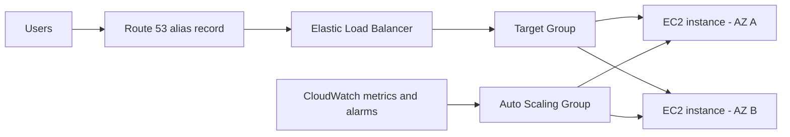
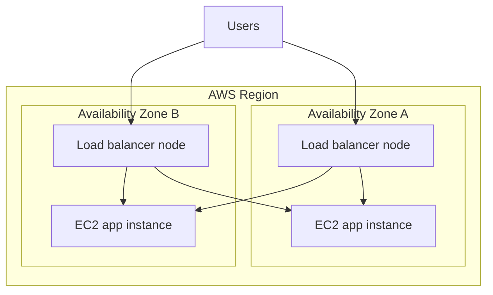
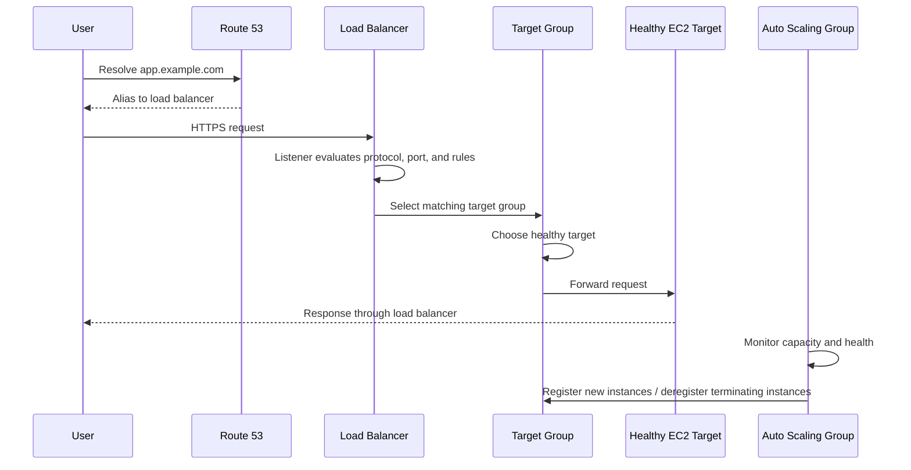
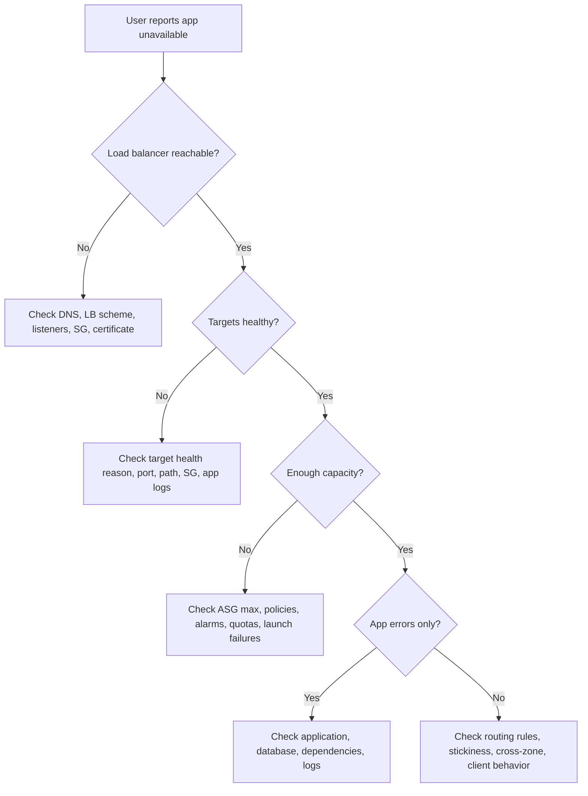

# 6 - High Availability and Scalability with ELB and ASG

## Why This Chapter Matters

Most real applications do not fail because one command was typed wrongly. They fail because the architecture assumes that one server, one data center, one health check, one scaling metric, or one deployment path will always behave correctly.

High availability and scalability exist because production traffic is uneven and infrastructure is imperfect:

```text
User demand changes
-> one server becomes too small or one Availability Zone fails
-> users experience slow responses or downtime
-> the architecture needs traffic distribution, health checks, replacement, and capacity adjustment
-> Elastic Load Balancing and Auto Scaling Groups become core EC2 design tools
```

For the AWS Solutions Architect Associate exam, ELB and ASG are not only "services to memorize". They are the machinery behind many scenario questions:

- "The application must survive an Availability Zone failure."
- "Users should not connect directly to EC2 instances."
- "The application should scale out during traffic spikes and scale in afterward."
- "Unhealthy instances should stop receiving traffic."
- "A static IP is required in front of a high-performance TCP service."
- "Microservices need path-based routing."
- "Instances need time to drain requests before termination."

If you understand this chapter properly, an EC2 web architecture stops looking like separate AWS icons and starts looking like a self-healing traffic system.

## The Big Picture

A common production pattern is:

```text
Users
-> Route 53
-> Elastic Load Balancer
-> Target Group
-> Auto Scaling Group
-> EC2 instances across multiple Availability Zones
```

The load balancer handles the traffic side:

- Gives users one stable entry point.
- Distributes requests across healthy targets.
- Performs health checks.
- Can terminate TLS.
- Can route HTTP requests by host, path, header, query string, or source IP depending on load balancer type.
- Can keep traffic inside the VPC when the load balancer is internal.

The Auto Scaling Group handles the fleet side:

- Maintains minimum, desired, and maximum EC2 capacity.
- Launches instances from a launch template.
- Replaces unhealthy instances.
- Spreads capacity across configured Availability Zones.
- Scales out and in based on policy, schedule, prediction, or manual change.
- Registers and deregisters instances with load balancer target groups when integrated.

Together they solve this causal chain:

```text
Traffic and failures are unpredictable
-> fixed single-instance capacity is fragile
-> load balancer distributes traffic and detects unhealthy targets
-> ASG keeps enough instances alive and adjusts capacity
-> the application becomes more available, elastic, and operationally manageable
```



## First-Principles Explanation

### What Problem Existed Before ELB and ASG?

Imagine a single EC2 instance running a web application.

It works while:

- Traffic is small.
- The instance is healthy.
- The Availability Zone is healthy.
- Deployments are rare.
- The application does not need maintenance.

It breaks when:

- Too many users arrive at once.
- The instance crashes.
- The OS or application becomes unhealthy.
- The Availability Zone has a problem.
- You need to patch or replace the instance.
- Users are pointed directly to an IP that later changes.

The old manual solution was:

```text
Watch metrics manually
-> launch more servers manually
-> edit DNS or proxy config manually
-> remove broken servers manually
-> hope users do not hit stale endpoints
```

That does not scale operationally.

AWS introduced managed building blocks:

- ELB for traffic distribution and target health.
- ASG for fleet size, replacement, and scaling.
- CloudWatch for metrics and alarms.
- Launch templates for repeatable EC2 instance creation.
- Route 53 aliases for stable DNS routing to AWS load balancers.

### Mental Model

Think of the system as two loops:

```text
Traffic loop:
Client request -> load balancer -> listener rule -> target group -> healthy target

Capacity loop:
Metric / desired capacity / health check -> ASG decision -> launch or terminate EC2 instance
```

The load balancer does not "own" the EC2 fleet. It forwards traffic to targets registered in target groups.

The ASG does not parse HTTP paths or terminate TLS. It maintains EC2 capacity and can attach that capacity to target groups.

That separation matters in exam and production design:

- If traffic distribution is wrong, inspect ELB listeners, rules, target groups, health checks, and security groups.
- If instance count is wrong, inspect ASG desired/min/max capacity, scaling policies, launch template, quotas, and CloudWatch metrics.

## Core Vocabulary

| Term | Meaning |
| --- | --- |
| Scalability | Ability of a system to handle changing load. |
| Vertical scaling | Increasing or decreasing the size of one machine. |
| Horizontal scaling | Increasing or decreasing the number of machines. |
| Elasticity | Automatically matching capacity to demand. |
| High availability | Keeping the service usable when components fail. |
| Fault tolerance | Continuing operation even when failures occur. |
| Load balancer | Service that distributes traffic across targets. |
| Listener | Load balancer process that listens on a protocol and port, such as HTTPS 443. |
| Listener rule | Condition and action that decide how traffic is routed. |
| Target group | Collection of targets behind a load balancer rule. |
| Target | Destination such as EC2 instance, IP address, Lambda function, or ALB depending on type. |
| Health check | Test used to decide whether a target should receive traffic. |
| ASG | Auto Scaling Group, a logical fleet of EC2 instances managed as a group. |
| Launch template | Reusable definition of how ASG launches EC2 instances. |
| Desired capacity | Number of instances the ASG is currently trying to maintain. |
| Scale out | Add capacity. |
| Scale in | Remove capacity. |
| Deregistration delay | Time allowed for in-flight requests before a target is fully removed from service. |

## Scalability, Elasticity, High Availability, and Fault Tolerance

These words are related, but they are not the same.

| Concept | Main Question | Example |
| --- | --- | --- |
| Scalability | Can the system handle more load? | Add more EC2 instances or use larger instances. |
| Elasticity | Can the system automatically adjust to load? | ASG scales out during high CPU and scales in afterward. |
| High availability | Can the system stay usable during a component failure? | Run instances in at least two Availability Zones. |
| Fault tolerance | Can the system continue despite failure with little or no interruption? | Multi-AZ active-active design, replicated data, automatic failover. |

Important exam trap:

```text
More instances in one AZ
-> better capacity
-> not enough high availability
```

You need multiple Availability Zones for Availability Zone failure survival.

## Vertical Scalability

Vertical scaling means changing the size of one machine.

Example:

```text
t3.micro -> t3.large -> m7i.2xlarge
```

Older course examples may mention `t2.micro` to `t2.large`, or from a very small instance such as `t2.nano` to a very large memory-optimized bare metal class. The exact instance family changes over time. The concept is stable: scale up means bigger instance; scale down means smaller instance.

Good for:

- Databases with limited horizontal scaling.
- Stateful systems.
- Quick capacity increase in simpler architectures.
- Applications that cannot easily run multiple active copies.

Limits:

- Hardware size has a ceiling.
- Instance resize may require stopping or replacing the instance depending on workload and service.
- One huge instance can still be a single point of failure.
- Cost can rise sharply.
- Vertical scaling does not automatically solve Availability Zone failure.

AWS examples:

- EC2 instance type change.
- RDS instance class change.
- ElastiCache node type change.

## Horizontal Scalability

Horizontal scaling means changing the number of machines.

Example:

```text
2 app instances -> 4 app instances -> 8 app instances
```

Good for:

- Stateless web applications.
- API servers.
- Worker fleets.
- Containerized workloads.
- Batch or queue consumers.

Requirements:

- Load balancer, queue, stream, or other distribution mechanism.
- Stateless application tier, or state externalized to database, cache, object storage, or shared storage.
- A deployment process that can handle many instances.
- Health checks that correctly identify readiness.
- Monitoring that reveals the true bottleneck.

Common beginner mistake:

```text
Application stores login session only in local memory
-> ASG adds more instances
-> load balancer sends same user to different instance
-> user appears logged out
-> team enables sticky sessions
-> imbalance appears later
```

Better long-term solution: move session state to an external store such as ElastiCache or a database when appropriate.

## High Availability Design

High availability usually means running across at least two Availability Zones for production-facing workloads.

Basic design:

```text
Availability Zone A: load balancer node + app instance
Availability Zone B: load balancer node + app instance
ASG spans both subnets
Target group contains healthy targets from both AZs
```



Design rules:

- Use at least two AZs for production web workloads.
- Put load balancer subnets in multiple AZs.
- Put ASG subnets in multiple AZs.
- Avoid storing critical state only on individual EC2 instances.
- Use health checks so failed targets are removed from traffic.
- Use lifecycle hooks and deregistration delay when termination needs cleanup.

Passive high availability example:

- RDS Multi-AZ primary/standby.

Active high availability example:

- Multiple EC2 app instances serving traffic behind an ALB.

## Elastic Load Balancing Overview

Elastic Load Balancing is AWS's managed load balancing service. AWS documentation describes ELB as distributing incoming traffic across multiple targets, monitoring registered target health, routing only to healthy targets, and scaling load balancer capacity as traffic changes.

Use ELB to:

- Spread load across downstream instances, containers, IPs, Lambda functions, or appliances depending on type.
- Expose a single DNS endpoint.
- Handle failures of downstream targets.
- Perform health checks.
- Terminate TLS for HTTPS workloads where appropriate.
- Enforce stickiness when session affinity is required.
- Improve availability across zones.
- Separate public traffic from private application tiers.

Why use managed ELB instead of self-managed Nginx or HAProxy?

- AWS manages load balancer availability and maintenance.
- ELB integrates directly with target groups, ASG, ACM, CloudWatch, Route 53, WAF, ECS, and Global Accelerator.
- ELB scales the load balancer infrastructure for most workloads.
- It reduces operational work.

Self-managed load balancers may still be valid for special appliances, custom routing behavior, or legacy constraints, but then you own patching, scaling, monitoring, security hardening, and HA.

## ELB Types

AWS supports four ELB families.

| Load Balancer | OSI Layer | Protocols / Main Use | New Design Guidance |
| --- | --- | --- | --- |
| Application Load Balancer (ALB) | Layer 7 | HTTP, HTTPS, HTTP/2, WebSocket, gRPC-style HTTP routing | Use for web apps, APIs, microservices, host/path/header/query routing. |
| Network Load Balancer (NLB) | Layer 4 | TCP, UDP, TCP_UDP, TLS, newer protocols where supported by AWS | Use for high-performance transport traffic, static IP, PrivateLink, non-HTTP workloads. |
| Gateway Load Balancer (GWLB) | Layer 3/4 appliance pattern | IP packets using GENEVE on port 6081 | Use for third-party virtual appliances such as firewalls and inspection tools. |
| Classic Load Balancer (CLB) | Legacy | HTTP, HTTPS, TCP, SSL | Avoid for new designs unless maintaining legacy architecture. |

Historic release clues often seen in courses:

- CLB: older generation.
- ALB: newer generation for Layer 7 HTTP routing.
- NLB: newer generation for Layer 4 performance.
- GWLB: appliance fleet pattern.

Exam rule:

```text
Path-based routing, host-based routing, WAF on web traffic -> ALB
TCP/UDP, static IP per AZ, ultra-low latency -> NLB
Third-party firewall/inspection appliance fleet -> GWLB
Legacy simple load balancer already exists -> CLB only if migration is not required
```

## Internal vs Internet-Facing Load Balancers

| Scheme | Meaning | Use |
| --- | --- | --- |
| Internet-facing | Has public-facing nodes and DNS for clients on the internet. | Public websites, public APIs. |
| Internal | Uses private IP addresses inside the VPC. | Private APIs, internal microservices, admin tools, back-office services. |

Small detail:

- A load balancer DNS name is stable.
- Underlying IPs may change, except NLB can provide static IP per enabled AZ and optional Elastic IPs for internet-facing NLBs.
- For friendly domain names, use Route 53 alias records rather than hardcoding ELB DNS names into user-facing documentation.

## Load Balancer Security Groups

The standard web-tier security pattern is:

```text
Internet
-> load balancer security group allows 80/443 from allowed clients
-> EC2 security group allows app port only from load balancer security group
```

Example:

| Component | Inbound Rule |
| --- | --- |
| ALB security group | TCP 443 from `0.0.0.0/0` and `::/0` if public HTTPS is intended. |
| EC2 app security group | TCP 8080 only from the ALB security group. |

This matters because:

- Users should not usually hit application instances directly.
- You can patch, replace, and scale instances without exposing them.
- Security group referencing gives clean least-privilege access.

NLB security group behavior has evolved over time and depends on load balancer configuration. For production, verify current AWS docs before assuming the exact NLB security group support and source-IP behavior.

## Application Load Balancer (ALB)

ALB is a Layer 7 load balancer for HTTP and HTTPS applications.

Use ALB when you need:

- Host-based routing.
- Path-based routing.
- Header-based routing.
- Query string routing.
- Source IP condition routing.
- HTTP to HTTPS redirects.
- Fixed responses.
- TLS termination with AWS Certificate Manager.
- AWS WAF integration.
- WebSocket support.
- HTTP/2 support.
- Microservice or container routing.
- Lambda targets for HTTP-style requests.
- Dynamic port mapping with Amazon ECS.

Example routing:

```text
app.example.com/api      -> API target group
app.example.com/web      -> web target group
admin.example.com        -> admin target group
example.com/users?id=123 -> user service target group
```

ALB is a strong fit for microservices because one ALB can route many application paths or hostnames to different target groups. With CLB, older designs often needed multiple load balancers for separate applications.

### ALB Components

| Component | Purpose |
| --- | --- |
| Listener | Checks for traffic on a protocol and port such as HTTPS 443. |
| Rule | Matches request conditions and performs actions. |
| Action | Forward, redirect, fixed response, authentication, or weighted routing depending on feature. |
| Target group | Group of targets using a protocol and port. |
| Health check | Verifies health of registered targets at target group level. |

AWS documentation notes that ALB evaluates listener rules in priority order, applies the matching rule, and selects a target from the selected target group.

### ALB Target Types

| Target Type | Use |
| --- | --- |
| Instance | Register EC2 instances by instance ID. |
| IP | Register private IP addresses, useful for containers, appliances, or private connected networks. |
| Lambda | Invoke Lambda functions from HTTP requests. |

Older notes sometimes say "ECS tasks" as targets. More precisely, ECS services commonly register tasks into a target group using instance or IP target mode depending on ECS network mode.

### ALB Health Checks

ALB health checks are configured per target group.

Common fields:

- Protocol: HTTP or HTTPS.
- Port: traffic port or a specific port.
- Path: `/health`, `/ready`, `/status`, or another route.
- Success codes: often `200`, but can be a range depending on design.
- Interval.
- Timeout.
- Healthy threshold.
- Unhealthy threshold.

Good health endpoint:

- Fast.
- Does not require authentication.
- Verifies the app is ready to serve.
- Does not fail because of optional dependencies.
- Does not perform expensive database queries on every health check.

Bad health endpoint:

```text
Checks app + database + payment gateway + email provider + optional analytics
-> analytics provider has a small outage
-> all app instances marked unhealthy
-> load balancer removes otherwise usable capacity
```

### ALB Client IP Headers

Application targets do not see the same client information they would see with direct access. The load balancer forwards client information through headers.

Common headers:

| Header | Meaning |
| --- | --- |
| `X-Forwarded-For` | Original client IP address chain. |
| `X-Forwarded-Port` | Original destination port. |
| `X-Forwarded-Proto` | Original protocol such as `http` or `https`. |

Security warning:

- Do not blindly trust forwarded headers from any source.
- Trust them only when the request came through your expected load balancer or proxy path.
- If app instances are internet-exposed, attackers can forge these headers.

## Network Load Balancer (NLB)

NLB is a Layer 4 load balancer for transport-level traffic.

Use NLB when you need:

- TCP or UDP load balancing.
- TLS listener behavior.
- Very high throughput.
- Very low latency.
- Static IP address per enabled Availability Zone.
- Elastic IP attachment for internet-facing NLBs where allow-listing is needed.
- Source IP preservation depending on target type and configuration.
- PrivateLink endpoint services.
- ALB behind NLB when you need NLB static IPs plus ALB Layer 7 routing.

Common use cases:

- Non-HTTP protocols.
- High-throughput TCP services.
- Gaming or UDP workloads.
- PrivateLink services.
- Static IP allow-listing requirements.

NLB target groups can include:

- EC2 instances.
- IP addresses, usually private IPs for normal VPC targets.
- Application Load Balancers.

Health checks support TCP, HTTP, and HTTPS depending on target group configuration.

Important mechanics:

- NLB is connection/flow oriented.
- For TCP, a connection is routed to one target for the life of that connection.
- For UDP, a flow is consistently routed for the life of the flow.
- With cross-zone disabled, each NLB node sends traffic only to targets in its own AZ.

Exam trap:

```text
Need path-based routing and static IPs
-> ALB alone gives path routing but not static IPs
-> NLB alone gives static IPs but not path routing
-> NLB in front of ALB can be a pattern when static IP plus Layer 7 routing is required
```

## Gateway Load Balancer (GWLB)

GWLB is for deploying, scaling, and managing fleets of third-party virtual network appliances.

Examples:

- Firewalls.
- Intrusion detection systems.
- Intrusion prevention systems.
- Deep packet inspection systems.
- Payload manipulation or inspection appliances.

GWLB operates on IP packets and uses the GENEVE protocol on port 6081.

Mental model:

```text
Traffic source
-> Gateway Load Balancer Endpoint
-> Gateway Load Balancer
-> appliance target group
-> inspected traffic continues
```

GWLB combines two functions:

- Transparent network gateway: a single entry and exit path for traffic.
- Load balancer: distributes traffic across virtual appliances.

GWLB target groups can include:

- EC2 appliance instances.
- IP addresses, typically private IPs.

Do not choose GWLB for normal web application routing. Choose ALB or NLB.

## Classic Load Balancer (CLB)

CLB is the previous-generation Elastic Load Balancer.

It can support older HTTP, HTTPS, TCP, and SSL style use cases, but for new architectures:

- Prefer ALB for Layer 7 HTTP/HTTPS applications.
- Prefer NLB for Layer 4 TCP/UDP/TLS workloads.
- Prefer GWLB for appliance fleets.

CLB still appears in exams and legacy environments because:

- Existing systems may still use it.
- Some older terminology such as "connection draining" comes from CLB.
- Migration questions may ask what newer load balancer type fits a requirement.

## Sticky Sessions / Session Affinity

Sticky sessions make the same client route to the same backend target for a period of time.

This can work with:

- Classic Load Balancer.
- Application Load Balancer.
- Network Load Balancer, using its supported stickiness mechanism.

Use case:

```text
Application stores session data in local instance memory
-> user must keep hitting same instance
-> sticky session reduces session loss
```

Tradeoff:

```text
Sticky sessions enabled
-> some targets receive more long-lived users than others
-> load distribution becomes uneven
-> one target may be overloaded while others are underused
```

Better architecture when possible:

- Store session state outside the EC2 instance.
- Use ElastiCache, DynamoDB, RDS, or another shared state store depending on requirements.
- Then the load balancer can distribute traffic more freely.

### Cookie Names and Reserved Names

Cookie behavior differs by load balancer type and target group configuration.

Important names from the existing notes:

- `AWSALB`: duration-based cookie for ALB.
- `AWSELB`: duration-based cookie for CLB.
- `AWSALBAPP`: application cookie generated by the load balancer.
- `AWSALBTG`: AWS-reserved target-group related cookie name.

For custom application cookies:

- The application generates the cookie.
- The target group specifies the cookie name.
- Do not use AWS-reserved cookie names such as `AWSALB`, `AWSALBAPP`, `AWSALBTG`, or `AWSELB`.

Small correction from older notes:

- A custom application cookie is generated by the application or target, not by the client as an arbitrary client-side decision.

## Cross-Zone Load Balancing

Cross-zone load balancing lets each load balancer node distribute traffic across registered targets in all enabled Availability Zones.

Without cross-zone load balancing:

```text
Load balancer node in AZ A
-> sends traffic only to targets in AZ A

Load balancer node in AZ B
-> sends traffic only to targets in AZ B
```

With cross-zone load balancing:

```text
Load balancer node in AZ A
-> can send traffic to healthy targets in AZ A and AZ B

Load balancer node in AZ B
-> can send traffic to healthy targets in AZ A and AZ B
```

Behavior by type:

| Load Balancer | Cross-Zone Default / Notes |
| --- | --- |
| ALB | Enabled by default at load balancer level; can be controlled at target group level for supported configurations. |
| NLB | Historically disabled by default; if enabled, inter-AZ data transfer charges may apply. Verify current pricing and defaults. |
| CLB | Historically disabled by default; older course notes often mention no inter-AZ data transfer charge for the feature. Verify current docs for production. |

Why this matters:

```text
Uneven targets across AZs
-> without cross-zone, one AZ's load balancer node may overload local targets
-> with cross-zone, traffic can be spread more evenly
-> but cross-AZ traffic and pricing must be considered
```

## SSL/TLS Basics

An SSL/TLS certificate allows traffic between clients and the load balancer to be encrypted in transit.

Terminology:

- SSL means Secure Sockets Layer, the older term.
- TLS means Transport Layer Security, the modern protocol family.
- People still say "SSL certificate" even when they mean a TLS certificate.

Public certificates are issued by Certificate Authorities such as DigiCert, GlobalSign, Let's Encrypt, and others.

Certificates:

- Have expiration dates.
- Must be renewed.
- Can be managed through AWS Certificate Manager.
- Can also be uploaded/imported depending on requirement.

### Load Balancer Certificates

The load balancer uses an X.509 server certificate.

For an HTTPS listener, you must specify:

- A default certificate.
- Optional additional certificates for multiple domains.
- A security policy that determines supported TLS protocol versions and ciphers.

Use ACM when possible because it simplifies certificate provisioning and renewal for supported public certificates.

### TLS Termination Patterns

| Pattern | Meaning | Use |
| --- | --- | --- |
| Terminate TLS at ALB | Client HTTPS ends at ALB; ALB forwards to targets over HTTP or HTTPS. | Common web app pattern, WAF and header routing available. |
| TLS listener on NLB | NLB handles TLS listener behavior. | High-performance Layer 4 TLS workloads. |
| TLS pass-through | Load balancer forwards encrypted traffic to targets without decrypting. | App must manage certificates; useful when end-to-end target termination is required. |
| Re-encryption | Client -> LB uses TLS; LB -> target also uses TLS. | Extra encryption inside VPC or compliance-driven designs. |

Exam clue:

```text
Need AWS WAF with HTTPS web app
-> ALB with ACM certificate and WAF association
```

### Server Name Indication (SNI)

SNI solves this problem:

```text
One load balancer serves multiple hostnames
-> each hostname may need a different certificate
-> server must know which certificate to present during TLS handshake
-> client sends requested hostname in TLS handshake
-> load balancer chooses matching certificate or falls back to default
```

Important:

- SNI works for ALB, NLB, and CloudFront.
- SNI does not work for CLB in the same modern multi-certificate way.

SSL support by ELB type:

| Type | Certificate Behavior |
| --- | --- |
| CLB | Supports only one SSL certificate per listener; multiple hostnames with different certificates usually require multiple CLBs. |
| ALB | Supports multiple listeners and multiple certificates using SNI. |
| NLB | Supports multiple listeners and multiple certificates using SNI where TLS listener features are used. |

## Connection Draining / Deregistration Delay

When a target is being removed, the load balancer should stop sending it new requests but may allow existing in-flight requests to complete.

Terminology:

- CLB: Connection Draining.
- ALB and NLB: Deregistration Delay.

Behavior:

```text
Target starts deregistering or becomes scheduled for termination
-> load balancer stops routing new requests to that target
-> existing in-flight requests are allowed time to finish
-> after delay expires, target is fully removed
```

Values from the existing notes:

- Range: 1 to 3600 seconds.
- Common default: 300 seconds.
- Can be disabled by setting value to 0 where supported.
- Use low values for short requests.
- Use higher values for long-running requests, uploads, or graceful shutdown.

Tradeoff:

```text
Delay too short
-> users may see dropped requests during scale-in or deployment

Delay too long
-> scale-in and replacement take longer
-> cost and deployment time may increase
```

## Health Checks

Health checks determine whether a target receives traffic. They are one of the most important small details in ELB and ASG design.

ELB health check questions:

- Is the target reachable on the configured port?
- Does the target respond using the configured protocol?
- Does the health path return an expected status code?
- Does the target respond before timeout?
- Has it passed enough healthy thresholds?
- Has it failed enough unhealthy thresholds?

Common failure chain:

```text
Application listens on port 8080
-> target group health check uses port 80
-> health checks fail
-> targets marked unhealthy
-> ALB returns errors even though app process is alive
```

Health endpoint design:

| Good | Bad |
| --- | --- |
| Fast and deterministic. | Slow or dependent on many external systems. |
| No login required. | Redirects to login page. |
| Checks readiness to serve traffic. | Returns 200 even when app cannot process requests. |
| Clear status codes. | Always returns 200 because "monitoring should not fail." |

## Auto Scaling Group Overview

An Auto Scaling Group is a logical collection of EC2 instances managed for automatic scaling and fleet health.

AWS documentation describes the core functions as:

- Maintaining the number of instances in the group.
- Replacing unhealthy instances.
- Increasing or decreasing capacity using scaling policies.
- Launching enough instances to meet desired capacity.
- Balancing capacity across configured Availability Zones.

The goal of an ASG:

- Scale out to match increased load.
- Scale in to match decreased load.
- Ensure minimum, maximum, and desired capacity boundaries.
- Automatically register new instances with load balancer target groups when configured.
- Re-create instances when previous ones are terminated or unhealthy.

ASG itself is free. You pay for the underlying resources such as EC2 instances, EBS volumes, load balancers, CloudWatch, and data transfer.

## ASG Capacity Fields

| Field | Meaning |
| --- | --- |
| Minimum capacity | Lowest number of instances the group should keep. |
| Desired capacity | Number of instances the group is currently trying to maintain. |
| Maximum capacity | Highest number of instances the group can scale to. |

Example:

```text
min = 2
desired = 4
max = 10
```

What happens:

- ASG tries to keep 4 instances right now.
- It should not go below 2.
- It should not go above 10.
- Scaling policies adjust desired capacity within min and max.

Exam trap:

```text
CPU is high and scaling policy says add 3 instances
current desired = 9
max = 10
-> ASG can only go to 10 unless max is increased
```

## Launch Templates

A launch template defines how new EC2 instances are created.

It can include:

- AMI ID.
- Instance type.
- Key pair.
- Security groups.
- IAM instance profile.
- User data.
- EBS volume configuration.
- Network settings.
- Subnet behavior when used with ASG configuration.
- Purchase options.
- Tags.

Older launch configurations are legacy. Use launch templates for new designs.

Launch template details matter because:

```text
ASG can only launch what the template describes
-> wrong AMI, wrong user data, missing IAM role, bad security group, or missing subnet route
-> new instances launch but never become healthy
```

Small detail:

- Updating a launch template does not automatically replace old ASG instances.
- You need an instance refresh, rolling deployment, manual replacement, or natural replacement event.

## ASG Health Checks

ASG can replace unhealthy instances.

Health check sources:

- EC2 status checks.
- Elastic Load Balancing health checks if enabled and attached.
- Custom health status set by automation.

Without ELB health checks:

```text
EC2 instance is running
-> EC2 status checks pass
-> app process is dead
-> ASG may still think instance is healthy
```

With ELB health checks:

```text
App health check fails in target group
-> target becomes unhealthy
-> ASG can replace it when ELB health checks are enabled for the ASG
```

Health check grace period:

- Gives a new instance time to boot and start the application.
- Prevents premature replacement while user data, package installation, or app startup is still running.
- Should match realistic startup time.

## Scaling Policies

### Dynamic Scaling

Dynamic scaling reacts to metrics.

Main types:

| Policy | Meaning | Example |
| --- | --- | --- |
| Target tracking | Keep a metric near a target value. | Keep average ASG CPU around 40%. |
| Step scaling | Add or remove capacity in steps based on alarm severity. | CPU > 70 add 2, CPU > 85 add 4. |
| Simple scaling | Older/simple alarm-triggered scaling with cooldown behavior. | CPU > 70 add 1, then wait cooldown. |

Target tracking is usually the easiest exam answer when the requirement is "keep average CPU around X%" or "keep requests per target near X".

AWS currently recommends target tracking or step scaling over simple scaling for better scaling behavior.

### Scheduled Scaling

Scheduled scaling changes capacity at known times.

Example:

```text
Every weekday at 8:45 AM
-> increase desired capacity before office traffic begins
Friday at 8:00 PM
-> reduce capacity for weekend baseline
```

Use when traffic pattern is predictable:

- Payroll system before salary processing.
- Ticket booking window.
- Daily business login spike.
- Batch job window.

### Predictive Scaling

Predictive scaling forecasts future demand using historical patterns and schedules capacity ahead.

Use when:

- Workload has recurring patterns.
- You want capacity ready before demand arrives.
- Reactive scaling is too late because instance boot time is significant.

### Good Metrics to Scale On

| Metric | Use When |
| --- | --- |
| CPUUtilization | CPU-bound web or app tier. |
| RequestCountPerTarget | Web tier where request load per instance should remain stable. |
| Average Network In/Out | Network-bound applications. |
| SQS queue depth per instance | Worker fleets consuming from a queue. |
| Custom CloudWatch metric | Built-in metrics do not represent the bottleneck. |

Bad metric example:

```text
API latency is high because database connections are exhausted
-> CPU is only 35 percent
-> CPU target tracking does not scale out
-> users still experience latency
```

Better:

- Track request count per target.
- Track queue depth.
- Track app-level latency.
- Track database connection saturation separately.

## CloudWatch Alarms and Scaling

CloudWatch alarms can trigger scaling policies.

Mechanism:

```text
Metric collected
-> alarm evaluates threshold
-> alarm enters ALARM state
-> scaling policy adjusts desired capacity
-> ASG launches or terminates instances
```

For ASG metrics:

- Average CPU is computed across ASG instances.
- RequestCountPerTarget comes from the ALB target group side.
- Custom metrics must be published correctly with useful dimensions.

Troubleshooting clue:

```text
Scaling policy exists but ASG does not scale
-> check if CloudWatch alarm has real datapoints
-> check alarm state
-> check max capacity
-> check policy attachment
```

## Scaling Cooldowns and Instance Warmup

Cooldowns exist to prevent repeated scaling before the effect of the last scaling action is visible.

Older/simple scaling mental model:

```text
Alarm triggers scale-out
-> ASG launches instances
-> cooldown starts
-> ASG waits before another simple scaling action
```

Common default cooldown:

- 300 seconds, or 5 minutes.

Current AWS guidance:

- Prefer target tracking or step scaling over simple scaling when possible.
- Target tracking and step scaling use instance warmup behavior rather than relying only on simple scaling cooldowns.

Warmup matters because:

```text
New instance launches
-> user data runs
-> application starts
-> health checks pass
-> instance begins receiving traffic
-> only then should metrics treat it as useful capacity
```

If warmup is too short:

- ASG may think new capacity is already helping.
- Metrics may remain high.
- Scaling may overshoot or behave erratically.

If warmup is too long:

- Scaling response may be slower than needed.

Pre-baked AMIs help because the instance does less work at boot time.

## Lifecycle Hooks

Lifecycle hooks pause instance launch or termination so automation can run.

Use cases:

- Install or register software before entering service.
- Wait for bootstrap scripts to finish before registration.
- Drain connections before termination.
- Upload logs before shutdown.
- Deregister from external systems.
- Notify EventBridge, Lambda, SNS, or SQS based workflows.

Lifecycle states include:

- Instance launching.
- Instance terminating.

Example launch chain:

```text
ASG launches instance
-> lifecycle hook puts it in wait state
-> bootstrap installs application
-> script signals complete-lifecycle-action
-> instance enters service
-> load balancer can route traffic
```

Example termination chain:

```text
ASG selects instance for termination
-> lifecycle hook pauses termination
-> app drains work and uploads logs
-> hook completes or times out
-> instance terminates
```

Important details:

- The default lifecycle hook heartbeat timeout is commonly one hour.
- Lifecycle hooks do not prevent Spot interruption when EC2 needs capacity back.
- Long hooks can delay scaling activity.

## Instance Refresh

Instance refresh replaces instances in an ASG gradually, commonly after a launch template, AMI, user data, or instance type update.

Use it for:

- Rolling out a new AMI.
- Updating user data.
- Moving from launch configurations to launch templates.
- Changing instance type.
- Applying security patches through immutable infrastructure.

Watch:

- Minimum healthy percentage.
- Instance warmup.
- Health checks.
- Checkpoints.
- Rollback behavior if configured.
- Whether old and new versions can coexist during rollout.

Important chain:

```text
Launch template version changes
-> ASG knows how to launch new instances with new config
-> old instances keep running
-> instance refresh intentionally replaces them
```

## ELB + ASG Request Lifecycle



Step-by-step:

1. User resolves the application domain.
2. Route 53 alias points to the load balancer.
3. Load balancer listener receives the request.
4. Listener rule selects a target group.
5. Target group selects a healthy target.
6. Target responds.
7. ASG separately keeps the fleet healthy and sized correctly.

## Practical Architecture Patterns

### Public Web Application

```text
Route 53
-> internet-facing ALB
-> private EC2 instances in ASG
-> RDS Multi-AZ
```

Use when:

- HTTP/HTTPS application.
- Need host/path routing.
- Need WAF.
- Need TLS termination.

### High-Performance TCP Service

```text
Route 53
-> NLB
-> EC2 targets in ASG
```

Use when:

- TCP/UDP workload.
- Static IP allow-listing is needed.
- Low latency and high throughput matter.

### Static IP Plus HTTP Routing

```text
Clients allow-list NLB static IPs
-> NLB
-> ALB
-> path-based target groups
```

Use carefully when both static IP and Layer 7 routing are required.

### Appliance Inspection

```text
Traffic route
-> GWLB endpoint
-> GWLB
-> firewall appliance target group
```

Use when:

- Third-party appliance must inspect traffic transparently.
- You need scale-out appliance fleet behavior.

### Worker Fleet

```text
SQS queue
-> ASG worker instances
-> scale on queue depth per instance
```

Load balancer may not be needed when work arrives through a queue rather than synchronous user requests.

## Important Commands

### Inspect Target Health

```bash
aws elbv2 describe-target-health --target-group-arn <target-group-arn>
```

Use when:

- ALB/NLB says targets are unhealthy.
- You need reason codes.
- You need to know which target is failing.

Interpretation:

- `healthy`: target can receive traffic.
- `unhealthy`: check reason and app logs.
- `initial`: target has not passed enough checks yet.
- `draining`: target is deregistering.
- `unused`: target group is not used by a listener rule or target is not in an enabled AZ.

### Inspect ASG

```bash
aws autoscaling describe-auto-scaling-groups --auto-scaling-group-names <asg-name>
```

Use when:

- Instance count is unexpected.
- Desired/min/max capacity needs verification.
- You need launch template, health check type, target groups, or instance lifecycle states.

### Inspect Scaling Activities

```bash
aws autoscaling describe-scaling-activities --auto-scaling-group-name <asg-name>
```

Use when:

- ASG did not launch an instance.
- Launch failed.
- Termination happened unexpectedly.
- Capacity is stuck.

### Update Desired Capacity

```bash
aws autoscaling set-desired-capacity \
  --auto-scaling-group-name <asg-name> \
  --desired-capacity 4
```

Use carefully:

- This is a direct capacity change.
- It may launch or terminate instances.
- Make sure max capacity allows the desired value.

### Start Instance Refresh

```bash
aws autoscaling start-instance-refresh \
  --auto-scaling-group-name <asg-name>
```

Use after:

- New launch template version.
- New AMI.
- New user data.
- Desired rolling replacement.

Verify current AWS CLI options for preferences such as minimum healthy percentage, warmup, checkpoints, and rollback.

## Small Details That Matter Later

- ALB is Layer 7; NLB is Layer 4; GWLB is for appliance fleets.
- CLB is legacy; use ALB, NLB, or GWLB for new designs.
- ELB gives a DNS name, not normally a fixed IP. NLB can provide static IP per AZ.
- ALB target group health checks are at target group level.
- ASG EC2 health checks alone may not detect a dead application process.
- ASG desired capacity is current intended capacity; max capacity is the upper boundary.
- Updating launch template does not automatically replace existing instances.
- Launch configurations are legacy; launch templates are preferred.
- Health check grace period protects slow-starting instances.
- Deregistration delay protects in-flight requests during removal.
- Sticky sessions solve session affinity but can create load imbalance.
- Custom app cookies must not use AWS-reserved cookie names.
- `X-Forwarded-For` can be forged if traffic bypasses the load balancer.
- ALB supports WAF; NLB is not chosen for WAF-based HTTP rules.
- Cross-zone load balancing behavior and pricing differ by load balancer type; verify current docs before production decisions.
- NLB with cross-zone disabled requires healthy targets in each enabled AZ for best fault tolerance.
- Security group chaining is a core pattern: EC2 allows inbound from load balancer security group, not the world.
- Scaling on CPU is not enough if the real bottleneck is memory, database connections, queue depth, or latency.
- Cooldowns are especially associated with simple scaling; target tracking and step scaling rely heavily on warmup behavior.
- Lifecycle hooks can delay scaling, which is useful for graceful automation but harmful if scripts hang.
- Spot Instances in ASG can be interrupted even if lifecycle hooks exist.

## Common Misunderstandings

| Misunderstanding | Correct Understanding |
| --- | --- |
| "Scalability means high availability." | Scalability handles load; high availability handles failure. You often need both. |
| "Two EC2 instances in one AZ are highly available." | They improve instance redundancy but not AZ redundancy. |
| "ALB can handle any protocol." | ALB is for HTTP/HTTPS style Layer 7 traffic. Use NLB for TCP/UDP. |
| "NLB is always better because it is faster." | NLB lacks ALB Layer 7 routing features. Choose based on requirement. |
| "ASG automatically updates old instances when launch template changes." | Existing instances remain until replaced by instance refresh, deployment, health replacement, or scale event. |
| "Health check path should test everything." | Health checks should test readiness carefully without making optional dependency failures take down the app. |
| "Sticky sessions are always good." | They may hide poor session design and create uneven load. |
| "A public ALB means public EC2 instances." | EC2 instances can be private and reachable only from the ALB security group. |
| "Cooldown means ASG never scales during the period." | Behavior depends on scaling policy type; target tracking and step scaling use warmup semantics. |

## Failure Modes / Mistakes / Traps

### Target Is Unhealthy

Possible causes:

- Wrong health check path.
- Wrong health check port.
- Security group blocks load balancer traffic.
- Network ACL blocks traffic.
- App is not listening.
- App startup is slower than grace period.
- Health endpoint redirects to login.
- Health endpoint returns non-expected status.
- Target is in an AZ not enabled for the load balancer.

Debug path:

```text
describe-target-health
-> check reason code
-> verify target group protocol, port, path, success codes
-> verify SG and NACL
-> curl health endpoint locally and from a similar network path
-> inspect app and user-data logs
```

### ASG Does Not Scale Out

Possible causes:

- Desired capacity already equals max capacity.
- CloudWatch alarm is not in ALARM state.
- Metric has missing data.
- Scaling policy is not attached.
- Launch template is invalid.
- Subnet has no IP capacity.
- EC2 service quota or instance limit reached.
- IAM permissions missing.
- Instance type unavailable in selected AZ.

Debug path:

```text
describe-auto-scaling-groups
-> describe-scaling-activities
-> inspect CloudWatch alarm and metric
-> check max capacity and launch template
-> check subnets, quotas, and failed activity messages
```

### New Instances Launch but Never Serve Traffic

Possible causes:

- User data failed.
- App package install failed.
- Secrets or environment variables missing.
- IAM role missing permissions.
- Security group egress blocked.
- Health check grace period too short.
- AMI missing dependencies.
- App binds to localhost instead of instance network interface.

### Scale-In Breaks Users

Possible causes:

- Deregistration delay too short.
- Application does not handle SIGTERM or shutdown gracefully.
- No lifecycle hook for draining work.
- Long-running requests or uploads are terminated.
- Worker instance killed while processing non-idempotent job.

Fix:

- Use deregistration delay.
- Implement graceful shutdown.
- Add lifecycle hook.
- Externalize job state.
- Use idempotent processing for queues.

### Wrong Load Balancer Type

| Requirement | Wrong Choice | Better Choice |
| --- | --- | --- |
| Path routing | NLB | ALB |
| Static IP allow-listing | ALB alone | NLB, or Global Accelerator depending on scenario |
| WAF web ACL | NLB | ALB or CloudFront |
| UDP traffic | ALB | NLB |
| Third-party firewall fleet | ALB/NLB | GWLB |
| Legacy simple app already on CLB | Forced redesign without reason | Migrate when requirements justify ALB/NLB |

## Debugging / Analysis Method

Use this order during troubleshooting:

1. Identify the symptom.
2. Separate traffic problem from capacity problem.
3. Inspect the load balancer type and listener.
4. Inspect target group health and reason codes.
5. Inspect security groups, NACLs, routes, and ports.
6. Inspect ASG desired/min/max and instance lifecycle states.
7. Inspect scaling activities.
8. Inspect CloudWatch metric data and alarm state.
9. Inspect instance boot logs, user-data logs, and app logs.
10. Check recent changes: launch template, AMI, security group, health path, certificate, DNS, or deployment.

Decision tree:



## Real-World and Exam Relevance

### SAA Requirement Clues

| Clue in Question | Likely Answer Direction |
| --- | --- |
| "HTTP path-based routing" | ALB. |
| "Host-based routing for multiple domains" | ALB. |
| "WebSocket support" | ALB. |
| "Static IP addresses for load balancer" | NLB or Global Accelerator depending on full scenario. |
| "Millions of requests per second at Layer 4" | NLB. |
| "UDP traffic" | NLB. |
| "Third-party firewall appliances" | GWLB. |
| "Automatically add/remove EC2 capacity" | ASG scaling policy. |
| "Replace unhealthy EC2 instances" | ASG health checks, possibly ELB health checks enabled. |
| "Known daily traffic spike" | Scheduled scaling, possibly predictive scaling. |
| "Keep average CPU around 40 percent" | Target tracking scaling. |
| "Allow in-flight requests before termination" | Deregistration delay and lifecycle hook. |
| "Private app tier, public entry point" | Internet-facing ALB + private EC2 instances. |

### Exam Traps

- One AZ with many instances is not enough for high availability.
- Scaling policy cannot exceed ASG maximum capacity.
- ALB path routing requires listener rules and target groups.
- NLB static IP does not mean Layer 7 routing.
- Health check success must match app behavior, not wishful thinking.
- Sticky sessions may be a workaround, not a clean stateless design.
- Launch template updates need instance replacement to affect existing instances.
- CLB is legacy even if it appears in older training material.
- "SSL" in a question usually means TLS certificate behavior.
- SNI is needed for multiple certificates on one listener/load balancer.

## Connected Topics

- [EC2 Fundamentals](3%20-%20EC2%20Fundamentals.md)
- [EC2 Solutions Architect Associate Level](4%20-%20EC2%20Solutions%20Architect%20Associate%20Level.md)
- [EC2 Instance Storage](5%20-%20EC2%20Instance%20Storage.md)
- [Route 53](8%20-%20Route%2053.md)
- [CloudFront and AWS Global Accelerator](13%20-%20CloudFront%20and%20AWS%20Global%20Accelerator.md)
- [Decoupling Applications - SQS, SNS, Kinesis and Amazon MQ](16%20-%20Decoupling%20Applications%20-%20SQS%2C%20SNS%2C%20Kinesis%20and%20Amazon%20MQ.md)
- [AWS Monitoring and Audit - CloudWatch, CloudTrail and Config](23%20-%20AWS%20Monitoring%20and%20Audit%20-%20CloudWatch%2C%20CloudTrail%20and%20Config.md)
- [Networking VPC](26%20-%20Networking%20VPC.md)
- [Disaster Recovery and Management](27%20-%20Disaster%20Recovery%20%26%20Management.md)

## Chapter Summary

High availability and scalability solve different but connected problems.

- Scalability means handling more load.
- Elasticity means adjusting capacity automatically.
- High availability means surviving failure.
- ELB handles traffic distribution, health checks, TLS, routing, and target selection.
- ASG handles EC2 fleet size, replacement, scaling, and launch configuration.
- ALB is for Layer 7 HTTP/HTTPS routing.
- NLB is for Layer 4 performance, TCP/UDP/TLS, static IP, and PrivateLink patterns.
- GWLB is for third-party network appliances.
- CLB is legacy.
- Health checks, security groups, deregistration delay, lifecycle hooks, and launch templates are the details that decide whether the architecture works in production.

The key causal chain:

```text
Unpredictable traffic and infrastructure failure
-> need multiple healthy targets across AZs
-> ELB distributes only to healthy targets
-> ASG maintains and adjusts EC2 capacity
-> CloudWatch metrics and policies drive elasticity
-> lifecycle hooks and deregistration delay protect graceful change
```

## Questions to Test Understanding

### Concept Questions

1. What is the difference between scalability and high availability?
2. Why is an ASG across two AZs more highly available than two instances in one AZ?
3. Why should EC2 instances behind a public ALB usually be private?
4. Why does updating a launch template not automatically update existing instances?
5. When should you use an ALB instead of an NLB?
6. When should you use an NLB instead of an ALB?
7. What problem does SNI solve?
8. Why can sticky sessions create uneven load?
9. Why might CPUUtilization be a bad scaling metric?
10. What is the purpose of deregistration delay?

### Scenario Questions

1. A company runs a web app on EC2. It needs `/api` and `/images` to route to different fleets. Which load balancer feature should be used?
2. A vendor needs to allow-list fixed public IPs for a TCP service. Which load balancer is the best default choice?
3. An ASG has desired 4 and max 4. CPU is high and the policy says add 2 instances. What happens?
4. Targets are unhealthy after deployment. The app listens on 8080, but target group health check uses port 80. What is the likely cause?
5. A scale-in event terminates instances while they are processing uploads. Which two features help?
6. An application must inspect all ingress and egress traffic through firewall appliances. Which ELB type fits?
7. Users lose login state when routed to different instances. What is the quick workaround and what is the better architecture?
8. A new AMI is added to a launch template. Existing instances still run the old AMI. What should be triggered?
9. A workload has a predictable spike every weekday at 9 AM. What scaling approach is appropriate?
10. A web app needs AWS WAF rules. Should you choose ALB or NLB?

## Answers and Reasoning

1. Scalability handles changing load; high availability handles failure. A system can scale in one AZ but still fail if that AZ fails.
2. Two AZs protect against an AZ-level problem. Two instances in one AZ protect only against individual instance failure.
3. The ALB should be the public entry point. EC2 instances should accept traffic only from the ALB security group to reduce attack surface.
4. A launch template describes future launches. Existing instances are not replaced until instance refresh, deployment, scale event, or manual replacement.
5. Use ALB for HTTP/HTTPS Layer 7 routing such as path, host, header, query, redirects, WAF, and Lambda targets.
6. Use NLB for TCP/UDP/TLS, high throughput, low latency, static IP per AZ, PrivateLink, or non-HTTP protocols.
7. SNI lets one listener/load balancer present different TLS certificates for different hostnames by reading the hostname sent in the TLS handshake.
8. Sticky sessions keep users attached to particular targets. Some targets may accumulate more active sessions and become hotter than others.
9. CPU may not represent the bottleneck. The real limit might be database connections, memory, queue depth, network throughput, or external dependency latency.
10. Deregistration delay allows in-flight requests to complete while a target is being removed and stops new requests from going to it.
11. Use ALB path-based routing with listener rules and separate target groups.
12. Use NLB because it can provide static IP per enabled AZ and supports TCP workloads.
13. The ASG cannot exceed max capacity. It remains capped at 4 unless max is increased.
14. The health check is hitting the wrong port. Change the health check or target group configuration to match the application.
15. Use deregistration delay and ASG lifecycle hooks, plus application graceful shutdown.
16. Use Gateway Load Balancer.
17. Quick workaround: sticky sessions. Better architecture: externalize session state to a shared store.
18. Start an instance refresh or another rolling replacement process.
19. Scheduled scaling, possibly predictive scaling if historical patterns are suitable.
20. Choose ALB for web WAF integration.

## Revision Cheatsheet

| Need | Choose |
| --- | --- |
| HTTP/HTTPS app routing | ALB |
| Host/path/header/query routing | ALB |
| WebSocket | ALB |
| AWS WAF on app traffic | ALB or CloudFront, commonly ALB for EC2 app tier |
| TCP/UDP | NLB |
| Static IP per AZ | NLB |
| PrivateLink endpoint service | NLB |
| Third-party firewall fleet | GWLB |
| Legacy load balancer | CLB |
| Automatic EC2 fleet size | ASG |
| Keep metric near target | Target tracking |
| Known future spike | Scheduled scaling |
| Forecast recurring demand | Predictive scaling |
| Graceful target removal | Deregistration delay |
| Custom launch/termination action | Lifecycle hook |
| Roll out new AMI to ASG | Instance refresh |

## Glossary

- ALB: Application Load Balancer, Layer 7 load balancer for HTTP/HTTPS workloads.
- ASG: Auto Scaling Group, EC2 fleet manager for capacity, health, and scaling.
- CLB: Classic Load Balancer, previous-generation load balancer.
- Cross-zone load balancing: Distribution of traffic by load balancer nodes across targets in multiple enabled AZs.
- Deregistration delay: Time allowed for in-flight requests before a target is fully removed.
- Desired capacity: Current number of instances the ASG tries to maintain.
- ELB: Elastic Load Balancing, AWS managed load balancing family.
- GWLB: Gateway Load Balancer, appliance fleet load balancer.
- Health check grace period: Time ASG gives a new instance before health replacement can occur.
- Instance refresh: ASG process to gradually replace instances after configuration change.
- Launch template: EC2 launch specification used by ASG.
- Lifecycle hook: ASG pause point for custom launch or termination actions.
- Listener: Load balancer protocol and port configuration.
- NLB: Network Load Balancer, Layer 4 load balancer for TCP/UDP/TLS and high performance.
- SNI: Server Name Indication, TLS extension that lets the client indicate the hostname for certificate selection.
- Sticky session: Session affinity mechanism that routes the same client to the same target for a period.
- Target group: Collection of targets and health check settings used by a load balancer.

## Official References

Source snapshot for this chapter refresh: 2026-06-28. Recheck official AWS documentation before production design or exam booking because AWS features, quotas, pricing, and certification guides change.

- Elastic Load Balancing documentation: <https://docs.aws.amazon.com/elasticloadbalancing/>
- What is Elastic Load Balancing?: <https://docs.aws.amazon.com/elasticloadbalancing/latest/userguide/what-is-load-balancing.html>
- Application Load Balancer documentation: <https://docs.aws.amazon.com/elasticloadbalancing/latest/application/introduction.html>
- Network Load Balancer documentation: <https://docs.aws.amazon.com/elasticloadbalancing/latest/network/introduction.html>
- Gateway Load Balancer documentation: <https://docs.aws.amazon.com/elasticloadbalancing/latest/gateway/introduction.html>
- ALB target group health checks: <https://docs.aws.amazon.com/elasticloadbalancing/latest/application/target-group-health-checks.html>
- Amazon EC2 Auto Scaling groups: <https://docs.aws.amazon.com/autoscaling/ec2/userguide/auto-scaling-groups.html>
- Amazon EC2 Auto Scaling lifecycle hooks: <https://docs.aws.amazon.com/autoscaling/ec2/userguide/lifecycle-hooks.html>
- Amazon EC2 Auto Scaling instance refresh: <https://docs.aws.amazon.com/autoscaling/ec2/userguide/asg-instance-refresh.html>
- Amazon EC2 Auto Scaling cooldowns: <https://docs.aws.amazon.com/autoscaling/ec2/userguide/ec2-auto-scaling-scaling-cooldowns.html>
