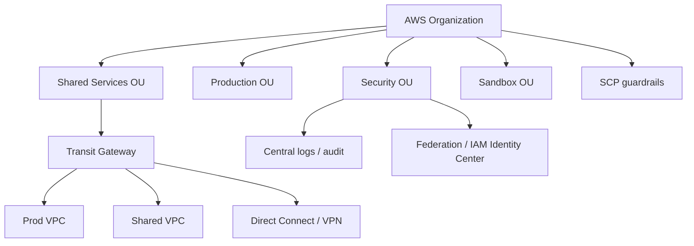

# 00 - Roadmap and Source Backbone

## Why This Chapter Matters

AWS Solutions Architect Professional is not a memorization exam about service names. It tests whether you can choose between imperfect architectures under constraints: cost, governance, migration risk, security, latency, organizational scale, and operational effort.

## The Big Picture

```text
single-account cloud use -> multi-account governance -> network scale -> workload migration -> continuous improvement -> professional tradeoff judgment
```

## First-Principles Explanation

Cause: as AWS adoption grows, one account and simple VPC patterns stop being enough.

Mechanism: organizations use multiple accounts, centralized guardrails, shared networking, cross-account roles, observability, and migration/modernization programs.

Immediate result: architecture decisions must optimize across teams, accounts, networks, regions, and business risk.

Long-term impact: the architect becomes a tradeoff judge, not only a service selector.

Next connected topic: AWS Organizations, SCPs, IAM boundaries, Transit Gateway, Direct Connect, multi-Region DR, and Well-Architected improvement.

## Core Vocabulary

| Term | Meaning | SAP relevance |
| --- | --- | --- |
| Organization | AWS account hierarchy under AWS Organizations. | Enables multi-account governance. |
| OU | Organizational unit. | Groups accounts for policy. |
| SCP | Service control policy. | Sets maximum account permissions. |
| Permission boundary | Maximum permissions for IAM identities. | Delegated administration control. |
| Transit Gateway | Hub for VPC/on-prem connectivity. | Common enterprise network pattern. |
| Direct Connect | Dedicated connectivity to AWS. | Hybrid reliability and latency. |
| RTO / RPO | Recovery time / recovery point objectives. | DR design driver. |
| Landing zone | Governed multi-account baseline. | Professional-scale foundation. |

## Architecture Diagram



## Required Chapters

1. SAP-C02 exam model and professional scenario method.
2. Multi-account strategy and AWS Organizations.
3. SCPs, permission boundaries, cross-account roles, identity federation.
4. Advanced VPC and hybrid networking.
5. Transit Gateway, Direct Connect, VPN, Cloud WAN.
6. Multi-Region architecture and DR strategies.
7. Migration planning and modernization decisions.
8. Cost optimization at scale.
9. Security architecture and centralized logging.
10. Event-driven, serverless, and container tradeoff scenarios.
11. Professional-level practice questions with wrong-answer analysis.

## Small Details That Matter Later

- SCPs do not grant permissions; they set boundaries for what accounts can do.
- Permission boundaries limit identity-based permissions but do not replace resource policy reasoning.
- Direct Connect is not encrypted by default at Layer 3; design encryption if required.
- Multi-Region active-active improves resilience but increases data consistency and operational complexity.
- "Most available" and "most cost-effective" are often different answers.
- SAP questions often hide migration constraints in wording such as downtime, licensing, IP retention, latency, and organizational control.

## Source Backbone

- SAP-C02 exam guide: <https://docs.aws.amazon.com/aws-certification/latest/solutions-architect-professional-02/solutions-architect-professional-02.html>
- SAP-C02 official PDF: <https://d1.awsstatic.com/training-and-certification/docs-sa-pro/AWS-Certified-Solutions-Architect-Professional_Exam-Guide.pdf>
- AWS Well-Architected pillars: <https://docs.aws.amazon.com/wellarchitected/latest/framework/the-pillars-of-the-framework.html>
- AWS Organizations SCPs: <https://docs.aws.amazon.com/organizations/latest/userguide/orgs_manage_policies_scps.html>
- IAM permissions boundaries: <https://docs.aws.amazon.com/IAM/latest/UserGuide/access_policies_boundaries.html>
- Direct Connect gateways: <https://docs.aws.amazon.com/directconnect/latest/UserGuide/direct-connect-gateways-intro.html>

## Questions to Test Understanding

1. Why are SCPs not the same as IAM policies?
2. Why does multi-account design exist?
3. Why is Transit Gateway common in enterprise AWS networks?
4. Why can active-active DR be the wrong answer?
5. Why does SAP require wrong-answer analysis?

## Answers and Reasoning

1. SCPs define maximum permissions for accounts/OUs; IAM policies still grant permissions within that boundary.
2. It separates workloads, blast radius, billing, governance, security, and team ownership.
3. It avoids fragile full-mesh peering and centralizes routing across many VPCs and hybrid links.
4. It may be too expensive or complex for the required RTO/RPO and consistency model.
5. Professional questions often include multiple plausible services; the rejected options reveal constraints.

