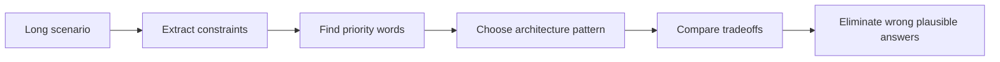

# 01 - SAP-C02 Exam Model and Professional Scenario Method

## Why This Chapter Matters

AWS Solutions Architect Professional is not an exam about remembering that S3 stores objects or that EC2 runs virtual machines. It is an exam about choosing architectures under constraints.

The hard part is that several answers may be technically possible. The correct answer is the one that best satisfies the hidden priority:

```text
least operational effort
highest availability
lowest cost
fastest migration
strongest governance
minimum downtime
least application change
best long-term architecture
```

Cause -> Mechanism -> Immediate Result -> Long-Term Impact -> Next Connected Topic:

```text
organizations outgrow single-account simple AWS designs
-> architects must judge governance, networking, migration, resilience, security, and cost tradeoffs
-> SAP-C02 tests scenario reasoning, not isolated service trivia
-> preparation must train wrong-answer elimination and design justification
-> multi-account, identity, networking, DR, migration, modernization, and cost architecture
```

Official source baseline:

- AWS SAP-C02 exam guide: <https://docs.aws.amazon.com/aws-certification/latest/solutions-architect-professional-02/solutions-architect-professional-02.html>
- AWS SAP-C02 PDF: <https://d1.awsstatic.com/training-and-certification/docs-sa-pro/AWS-Certified-Solutions-Architect-Professional_Exam-Guide.pdf>
- AWS Well-Architected Framework: <https://docs.aws.amazon.com/wellarchitected/latest/framework/>

Source check date: 2026-05-27. Current official AWS guide describes SAP-C02 domains as organizational complexity, new solutions, continuous improvement, and migration/modernization. Certification details can change; recheck the official guide before booking.

## The Big Picture

Current official SAP-C02 content domains:

| Domain | Weight | What it really tests |
| --- | --- | --- |
| Design Solutions for Organizational Complexity | 26% | Multi-account, governance, network strategy, centralized controls. |
| Design for New Solutions | 29% | New architecture choices across security, reliability, performance, cost. |
| Continuous Improvement for Existing Solutions | 25% | Improve running workloads, operations, cost, resilience, security. |
| Accelerate Workload Migration and Modernization | 20% | Migration strategy, modernization path, constraints, cutover risk. |

Current official guide also describes 65 scored questions and 10 unscored questions, with a scaled passing score of 750. Treat these as current as of 2026-05-27, not permanent facts.



## First-Principles Explanation

### Why Professional-Level AWS Is Different

Associate-level questions often test service selection:

```text
Need object storage -> S3
Need managed relational database -> RDS/Aurora
Need decoupling -> SQS/SNS/EventBridge
```

Professional-level questions test system judgment:

```text
many accounts
multiple networks
legacy workloads
compliance controls
hybrid connectivity
RTO/RPO targets
organizational delegation
cost constraints
migration deadlines
```

### The SAP Decision Chain

Use this chain:

```text
business constraint
-> architecture requirement
-> AWS control/service pattern
-> tradeoff
-> wrong-answer elimination
```

Example:

```text
central security team must prevent all member accounts from disabling CloudTrail
-> need organization-level guardrail
-> SCP denies CloudTrail stop/delete actions plus delegated security controls
-> IAM alone in each account is weaker and harder to enforce centrally
```

## Core Vocabulary

| Term | Meaning | Exam trap |
| --- | --- | --- |
| SCP | Organization policy setting maximum permissions. | SCP does not grant access. |
| OU | Account grouping in Organizations. | Poor OU design creates policy sprawl. |
| Landing zone | Governed multi-account baseline. | Not just account creation. |
| RTO | Maximum acceptable recovery time. | Drives DR architecture cost. |
| RPO | Maximum acceptable data loss window. | Drives replication/backup design. |
| Transit Gateway | Hub for VPC and hybrid routing. | Route tables and segmentation matter. |
| Direct Connect | Dedicated private connectivity. | Not encrypted by default at Layer 3. |
| Rehost | Lift and shift. | Fast but may not modernize. |
| Replatform | Move with modest optimization. | Middle path. |
| Refactor | Redesign application. | Highest change, often highest long-term benefit. |

## Mental Model

Read every question like an architect, not like a service catalog:

```text
Who owns it?
What must not fail?
How much downtime is allowed?
How much data loss is allowed?
What must be centralized?
What must be delegated?
What must be cheapest?
What must change least?
What must scale fastest?
```

## Architecture or Conceptual Structure

### The Six Professional Lenses

| Lens | Key question |
| --- | --- |
| Organization | How are accounts, OUs, teams, and guardrails structured? |
| Security | Who can do what, and how is it proven? |
| Network | How do VPCs, on-prem, Regions, and services connect? |
| Reliability | What fails, how quickly do we recover, and with how much data loss? |
| Migration | What changes now vs later? |
| Cost/operations | What is cheapest to run and simplest to operate under the requirement? |

### Wrong-Answer Types

| Wrong answer type | How it looks |
| --- | --- |
| Technically possible but too manual | Requires per-account/per-resource hand work despite central requirement. |
| Too expensive | Meets resilience but exceeds stated cost priority. |
| Too weak | Low cost but fails RTO/security/compliance. |
| Too much change | Requires refactor when question asks fastest migration. |
| Wrong scope | Solves one account when question says organization-wide. |
| Wrong data consistency | Active-active offered where app cannot handle conflict. |

## Step-by-Step Explanation

### Step 1: Extract Constraint Words

Look for:

- "all accounts"
- "centralized"
- "least operational overhead"
- "minimum downtime"
- "no application changes"
- "most cost-effective"
- "multi-Region"
- "hybrid"
- "compliance"
- "near real-time"
- "petabytes"
- "legacy licensing"

### Step 2: Identify the Primary Driver

If a question says:

```text
lowest cost
```

do not choose the most available active-active answer unless reliability requirements demand it.

If it says:

```text
least operational overhead
```

prefer managed services over self-managed EC2 designs when they meet constraints.

### Step 3: Map to Architecture Pattern

Examples:

| Constraint | Pattern |
| --- | --- |
| central preventive guardrails | SCPs plus IAM/access controls |
| delegate account creation | Control Tower / account vending pattern |
| many VPCs and on-prem | Transit Gateway / Cloud WAN / Direct Connect depending scope |
| private service access | VPC endpoints / PrivateLink |
| strict RPO/RTO | multi-AZ, backup, pilot light, warm standby, active-active |
| fastest migration | rehost/replatform, Application Migration Service, Database Migration Service |
| event decoupling | EventBridge/SNS/SQS/Step Functions depending routing and workflow |

### Step 4: Eliminate Plausible Wrong Answers

Ask:

- Does this answer satisfy the exact scope?
- Does it violate cost/effort wording?
- Does it require unsupported service behavior?
- Does it ignore data migration?
- Does it ignore identity/governance?
- Does it solve only compute while storage/database remains unavailable?

## Small Details That Matter Later

- SAP questions often hide the answer in adjectives: centralized, least, fastest, existing, no changes, all accounts.
- SCPs set maximum permissions and do not grant permissions.
- Permission boundaries limit IAM entities but are not organization-wide account guardrails by themselves.
- Resource policies can grant cross-account access, but identity policy and boundaries still matter.
- Multi-account is usually for blast radius, governance, billing, and ownership, not decoration.
- Direct Connect gives dedicated connectivity but encryption must be designed if required.
- Active-active is not automatically best; consistency and operations may be worse.
- Migration questions often prioritize downtime, compatibility, licensing, data volume, and rollback.
- "Managed service" often wins when least operational overhead is explicit.
- "Existing application cannot change" rules out many refactor/serverless answers.

## Common Misunderstandings

### Misunderstanding 1: "Professional means choose the most advanced service."

Professional means choose the best fit. Sometimes the answer is a simpler managed migration path.

### Misunderstanding 2: "More availability is always correct."

Not when the requirement emphasizes cost, simplicity, or lower RTO/RPO that a cheaper pattern already satisfies.

### Misunderstanding 3: "Security answer is always IAM."

At organization scale, the right answer may involve SCPs, permission boundaries, resource policies, IAM Identity Center, Control Tower, AWS Config, CloudTrail, Security Hub, or delegated administrator patterns.

## Failure Modes / Mistakes / Traps

### Trap 1: Ignoring Scope

Question says "all current and future accounts"; answer configures one account manually.

### Trap 2: Ignoring Operations

Question says "least operational overhead"; answer deploys self-managed clusters and custom scripts.

### Trap 3: Ignoring Migration Deadline

Question says "must migrate in 3 months with minimal changes"; answer refactors to serverless microservices.

## Exam Answer Method

1. Underline scope.
2. Underline priority.
3. Underline constraints.
4. Identify the architecture family.
5. Eliminate answers that violate priority.
6. Eliminate answers with wrong scope.
7. Choose the simplest answer satisfying all requirements.

## Practice Questions

### Question 1

A company has 200 AWS accounts. Security wants to prevent all member accounts from disabling CloudTrail. What is the most appropriate preventive guardrail?

Answer: Use AWS Organizations SCPs applied to relevant OUs to deny CloudTrail stop/delete actions, combined with central logging controls.

Reasoning: SCPs set maximum permissions across accounts/OUs. IAM policies in individual accounts are weaker for central preventive control.

### Question 2

A workload needs 15-minute RTO and 5-minute RPO. The company wants lower cost than active-active. Which DR pattern is likely closer?

Answer: Warm standby may fit better than backup/restore or pilot light, depending workload details.

Reasoning: Active-active may be excessive; backup/restore likely misses RTO; warm standby keeps scaled-down resources ready.

## Chapter Summary

SAP-C02 rewards architectural judgment:

```text
requirement -> constraint -> pattern -> tradeoff -> wrong-answer elimination
```

The correct answer is rarely "the most AWS services." It is the answer that satisfies the scenario with the right balance of security, reliability, cost, migration effort, and operations.

## Questions to Test Understanding

1. What are the four current SAP-C02 domains?
2. Why is SAP-C02 not a service memorization exam?
3. Why do SCPs not replace IAM policies?
4. What is the difference between RTO and RPO?
5. Why is active-active sometimes wrong?

## Answers and Reasoning

1. Organizational complexity, new solutions, continuous improvement, and migration/modernization.
2. It tests tradeoff decisions across complex organizations and workloads.
3. SCPs limit maximum permissions; IAM/resource policies still grant permissions within boundaries.
4. RTO is time to recover; RPO is acceptable data loss window.
5. It can be too costly/complex or incompatible with data consistency requirements.

