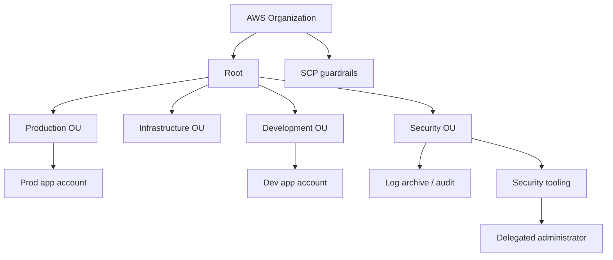

# 02 - Multi-Account Identity, Security, and Governance

## Why This Chapter Matters

A single AWS account is easy to start and hard to govern at scale. Professional AWS architecture uses multiple accounts to separate blast radius, ownership, billing, environments, and security controls.

Cause -> Mechanism -> Immediate Result -> Long-Term Impact -> Next Connected Topic:

```text
one account accumulates teams, environments, and permissions
-> organizations split workloads into governed accounts and OUs
-> SCPs, IAM Identity Center, permission boundaries, logging, and delegated admin create guardrails
-> teams get autonomy without unlimited blast radius
-> network architecture, centralized security, and workload migration
```

Official source baseline:

- AWS Organizations SCPs: <https://docs.aws.amazon.com/organizations/latest/userguide/orgs_manage_policies_scps.html>
- IAM policies and boundaries: <https://docs.aws.amazon.com/IAM/latest/UserGuide/access_policies.html>
- AWS Well-Architected security pillar: <https://docs.aws.amazon.com/wellarchitected/latest/security-pillar/>

## Big Picture



## First-Principles Explanation

### Why Multi-Account Exists

Multi-account design solves:

- blast radius isolation
- environment separation
- team ownership
- billing/cost allocation
- security audit separation
- service quota separation
- policy guardrails
- network segmentation

Bad single-account chain:

```text
many teams share account
-> IAM becomes broad
-> dev/prod separation weakens
-> accidental deletion or compromise has large blast radius
```

### SCPs

SCPs define maximum available permissions for accounts/OUs.

They do not grant access.

Meaning:

```text
IAM says "allow"
SCP says "not allowed"
-> final result is denied
```

If SCP allows an action, IAM still must grant it.

### Permission Boundaries

Permission boundaries set maximum permissions for an IAM user or role.

Use case:

```text
delegate IAM role creation to application team
but prevent created roles from exceeding approved permissions
```

SCP vs boundary:

| Control | Scope | Grants permissions? |
| --- | --- | --- |
| SCP | Account/OU maximum | No |
| Permission boundary | IAM identity maximum | No |
| IAM identity policy | User/role permissions | Yes, within boundaries |
| Resource policy | Resource-side access | Can grant access depending service |

## Core Governance Patterns

### Account Vending

Use controlled account creation so every account starts with:

- baseline logging
- security roles
- guardrails
- network settings
- tagging policy
- budget/cost controls

### Centralized Logging

Common pattern:

```text
workload accounts -> CloudTrail/Config/VPC Flow Logs -> log archive account
```

Security teams need logs protected from workload-account admins.

### Delegated Administrator

Many AWS security/management services support delegated admin so a security tooling account can administer org-wide service features without using the management account for daily work.

### IAM Identity Center

Use centralized workforce access and permission sets rather than long-lived IAM users in each account.

## Small Details That Matter Later

- Avoid using the management account for workloads.
- SCPs apply to principals in member accounts, including root, but not to the management account in the same way; verify exact AWS behavior.
- SCPs do not affect service-linked roles in the same way as normal IAM identities; verify service-specific behavior.
- Deny guardrails are often easier to reason about than massive allow lists.
- Break-glass access must exist and be audited.
- Permission boundaries are useful for delegated IAM administration.
- Resource policies and cross-account roles are both common cross-account patterns.
- Central log archive must be protected against deletion/modification.
- Tag policies help standardization but do not replace cost allocation design.
- Control Tower is a landing-zone service, not magic governance by itself.

## Common Exam Traps

- Choosing IAM policy when question asks organization-wide preventive guardrail.
- Choosing SCP when question needs to grant access.
- Forgetting central logging account.
- Allowing developers to create roles without permission boundaries.
- Designing all workloads in the management account.

## Practice Question

A company lets application teams create IAM roles in their own accounts. Security requires that these roles never grant access to IAM or Organizations. What control fits?

Answer: Use permission boundaries on roles/users used by teams to create IAM roles, and require created roles to include approved boundaries.

Reasoning: This is delegated IAM administration at identity level. SCPs may also provide broad guardrails, but permission boundaries directly cap roles the team creates.

## Chapter Summary

Professional AWS governance is layered:

```text
Organizations/OUs
-> SCPs
-> account vending
-> IAM Identity Center
-> permission boundaries
-> cross-account roles/resource policies
-> centralized logging/security tooling
```

The key exam phrase is "maximum permissions." SCPs and boundaries limit; they do not grant.

