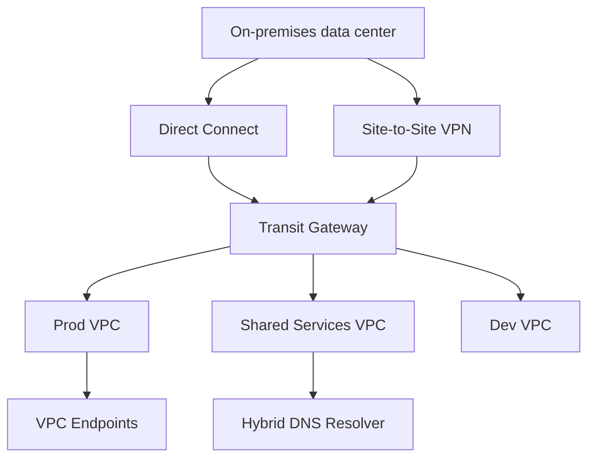

# 03 - Advanced Networking, Hybrid Connectivity, and Multi-Region DR

## Why This Chapter Matters

At professional scale, networking and resilience become architecture, not plumbing. The exam expects you to reason about thousands of routes, many VPCs, on-premises networks, private service access, DNS, latency, encryption, and failover.

Cause -> Mechanism -> Immediate Result -> Long-Term Impact -> Next Connected Topic:

```text
many VPCs and hybrid systems outgrow simple peering
-> architects use Transit Gateway, Direct Connect, VPN, VPC endpoints, DNS design, and multi-Region patterns
-> connectivity and recovery become explicit design choices
-> tradeoffs between cost, latency, availability, encryption, and operations dominate SAP scenarios
```

Official source baseline:

- AWS Transit Gateway docs: <https://docs.aws.amazon.com/vpc/latest/tgw/what-is-transit-gateway.html>
- AWS Direct Connect gateways: <https://docs.aws.amazon.com/directconnect/latest/UserGuide/direct-connect-gateways-intro.html>
- AWS Well-Architected reliability pillar: <https://docs.aws.amazon.com/wellarchitected/latest/reliability-pillar/>

## Networking Big Picture



## First-Principles Explanation

### Why VPC Peering Stops Scaling

VPC peering is simple for few VPCs.

At scale:

```text
many VPCs
-> peering mesh grows
-> route tables become hard
-> transitive routing not supported through peering
-> central inspection/shared services become awkward
```

Transit Gateway creates a hub-and-spoke routing model.

### Direct Connect vs VPN

| Option | Use when | Caveat |
| --- | --- | --- |
| Site-to-Site VPN | Quick encrypted connectivity over internet. | Internet path variability. |
| Direct Connect | Dedicated private connectivity, predictable bandwidth/latency. | Not encrypted at Layer 3 by default; lead time/cost. |
| DX plus VPN | Need dedicated path plus encryption. | More design complexity. |

Exam wording:

- "quickly establish encrypted connectivity" often points to VPN.
- "consistent low latency/private dedicated connectivity" often points to Direct Connect.
- "encryption required over Direct Connect" requires VPN over DX or MACsec where applicable and supported.

### VPC Endpoints and PrivateLink

Use VPC endpoints to reach AWS services privately without public internet path.

Types:

- gateway endpoints for services such as S3/DynamoDB
- interface endpoints powered by PrivateLink for many AWS/private services

Exam trap:

```text
private subnet needing S3 access
-> S3 gateway endpoint may avoid NAT data processing cost
```

## Multi-Region DR

DR design starts with RTO/RPO.

| Pattern | Cost | RTO/RPO | Notes |
| --- | --- | --- | --- |
| Backup and restore | Lowest | Longest | Cheapest, slower recovery. |
| Pilot light | Low-medium | Better | Core services ready, scale at event. |
| Warm standby | Medium | Short | Scaled-down full environment. |
| Active-active | Highest | Shortest | Complexity, consistency, cost. |

### Active-Active Trap

Active-active is not always best.

It can introduce:

- data conflict
- global consistency complexity
- higher cost
- operational burden
- application architecture changes

Choose it only when RTO/RPO and business need justify complexity.

## Small Details That Matter Later

- Transit Gateway route tables can segment traffic; do not assume all attachments talk to all.
- VPC peering is non-transitive.
- Direct Connect does not automatically encrypt traffic at Layer 3.
- VPN over internet is encrypted but subject to internet path quality.
- NAT Gateway has data processing cost; VPC endpoints can reduce cost for AWS service access.
- Security groups are stateful; NACLs are stateless.
- Route 53 health checks and failover routing can help DNS failover, but DNS caching affects recovery time.
- Multi-AZ is not Multi-Region.
- Aurora Global Database, DynamoDB global tables, S3 CRR, and database replication each have different consistency/RPO behavior.
- DR must include operational runbooks and regular tests.

## Practice Question

A company has 50 VPCs and two data centers. It currently uses many peering connections and route management is painful. It needs centralized routing and future VPC onboarding. What is the likely pattern?

Answer: Transit Gateway hub-and-spoke, with Direct Connect/VPN attachments as required.

Reasoning: Peering mesh does not scale operationally and is not transitive. TGW centralizes routing and attachment management.

## Chapter Summary

Networking and DR questions are tradeoff questions:

```text
scale of connectivity
-> routing model
-> private/public path
-> encryption requirement
-> latency and bandwidth
-> failure domain
-> RTO/RPO and cost
```

Professional answers satisfy the stated requirement without overbuilding.

