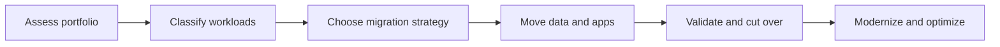

# 04 - Migration, Modernization, Cost, and Continuous Improvement

## Why This Chapter Matters

Professional architects are often asked to improve systems that already exist. The best architecture is constrained by deadlines, licensing, data size, downtime, team skill, budget, and risk.

Cause -> Mechanism -> Immediate Result -> Long-Term Impact -> Next Connected Topic:

```text
existing workloads have business and technical constraints
-> migration strategy chooses rehost, replatform, refactor, retire, retain, or repurchase
-> modernization balances speed, risk, cost, and long-term value
-> continuous improvement uses Well-Architected reviews, observability, automation, and cost governance
```

Official source baseline:

- AWS Prescriptive Guidance migration strategy: <https://docs.aws.amazon.com/prescriptive-guidance/latest/migration-strategies/>
- AWS Well-Architected Framework: <https://docs.aws.amazon.com/wellarchitected/latest/framework/>
- AWS cost optimization pillar: <https://docs.aws.amazon.com/wellarchitected/latest/cost-optimization-pillar/>

## Migration Big Picture



## First-Principles Explanation

### Migration Strategies

| Strategy | Meaning | When it fits |
| --- | --- | --- |
| Rehost | Lift and shift. | Fast migration, minimal change. |
| Replatform | Small optimization without major rewrite. | Managed DB/containerization with modest change. |
| Refactor | Redesign application. | Long-term agility/scaling, but more time/risk. |
| Repurchase | Move to SaaS/product. | Commodity capability. |
| Retire | Shut down unused system. | No business value. |
| Retain | Keep as-is for now. | Not ready, dependency, compliance, timing. |

Exam trap:

```text
fastest migration with minimal application changes
-> rehost/replatform usually beats refactor
```

### Data Migration Drives Architecture

Apps are often easier to move than data.

Ask:

- How much data?
- How much downtime allowed?
- Is replication possible?
- Is schema conversion needed?
- Can source stay live during migration?
- What is rollback plan?

Service patterns:

- Application Migration Service for lift-and-shift servers.
- Database Migration Service for database replication/migration.
- Snow family for huge offline data transfer.
- DataSync for file/object movement.
- Storage Gateway for hybrid storage integration.

## Modernization Tradeoffs

Modernization choices:

| Move | Benefit | Risk |
| --- | --- | --- |
| EC2 to Auto Scaling | resilience and elasticity | still manages OS/app |
| self-managed DB to RDS/Aurora | lower ops | engine/version constraints |
| monolith to containers | deployment consistency | orchestration complexity |
| containers to serverless | ops reduction | runtime/service limits |
| sync calls to events | decoupling | eventual consistency |

Professional judgment:

```text
do not refactor more than the requirement allows
```

## Cost Optimization

Cost is architecture feedback.

Levers:

- right-size compute
- use Auto Scaling
- choose Savings Plans/Reserved Instances for steady usage
- use Spot for interruptible workloads
- tier S3 storage
- reduce NAT Gateway data path with endpoints
- use managed services when ops cost matters
- shut down unused resources
- tag and allocate costs
- use budgets/anomaly detection

Exam trap:

```text
lowest cost
-> do not pick multi-Region active-active unless required
```

## Continuous Improvement

Use Well-Architected review style:

- operational excellence: run, observe, improve
- security: identity, detection, protection, response
- reliability: fault isolation, recovery, testing
- performance efficiency: right resources and scaling
- cost optimization: financial management and optimization
- sustainability: efficient resource use

## Small Details That Matter Later

- Migration questions often hide downtime and data size constraints.
- DMS can support ongoing replication for some engines/sources, but verify compatibility.
- Schema conversion is separate from data copy.
- Snow devices solve transfer bandwidth constraints but add logistics.
- Refactor is rarely "least effort."
- Reserved capacity helps predictable steady state, not spiky unknown workloads.
- Spot is for fault-tolerant interruptible work.
- NAT Gateway can become expensive with high data processing.
- Cost Explorer shows history; Budgets alerts; anomaly detection finds unusual spend.
- Modernization should improve measurable pain, not satisfy fashion.

## Practice Questions

### Question 1

A company must migrate 300 VMs quickly with minimal changes. What strategy is most likely?

Answer: Rehost using a migration service pattern, then optimize later.

Reasoning: Time and minimal changes dominate. Refactor is too slow.

### Question 2

A batch workload can tolerate interruption and needs lowest compute cost. What compute purchase option is likely?

Answer: Spot capacity, often with diversification and retry design.

Reasoning: Interruptible workloads fit Spot; critical steady workloads may fit Savings Plans/Reserved capacity.

## Chapter Summary

Migration and modernization are sequencing problems:

```text
move safely first when deadline dominates
modernize deliberately when value justifies change
measure and improve continuously
optimize cost without violating reliability/security requirements
```

## Questions to Test Understanding

1. What is rehost?
2. Why can refactor be wrong even if it is architecturally cleaner?
3. Why does data size matter in migration?
4. When is Spot a good fit?
5. What does Well-Architected continuous improvement provide?

## Answers and Reasoning

1. Moving workload with minimal change, often called lift and shift.
2. It may violate deadline, cost, or minimum-change constraints.
3. Transfer time, downtime, replication, consistency, and cutover risk depend on data.
4. Interruptible, fault-tolerant, flexible workloads.
5. A structured way to identify and prioritize improvements across architecture pillars.

