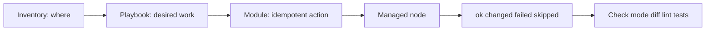

# 7 - Idempotency, Infrastructure Labs, and Operational Runbooks

## Why This Chapter Matters

Idempotency is the heart of Ansible. People often define it as "safe to run again," but that is too shallow.

The real definition for infrastructure work is:

```text
same desired state + same inputs + repeated execution -> no unnecessary change and no accumulating damage
```

Cause -> Mechanism -> Immediate Result -> Long-Term Impact -> Next Connected Topic:

```text
manual server changes drift and are hard to repeat
-> Ansible describes desired state with modules and inventories
-> repeated runs converge systems instead of stacking changes
-> operations become reviewable, testable, and recoverable
-> roles, collections, vault, CI, dynamic inventory, and production automation
```

Official source baseline:

- Latest Ansible community docs: <https://docs.ansible.com/projects/ansible/latest/index.html>
- Getting started: <https://docs.ansible.com/projects/ansible/latest/getting_started/index.html>
- Playbooks: <https://docs.ansible.com/projects/ansible-core/devel/playbook_guide/playbooks_intro.html>
- Command-line tools: <https://docs.ansible.com/projects/ansible/latest/command_guide/command_line_tools.html>
- Vault guide: <https://docs.ansible.com/ansible/latest/vault_guide/index.html>

Source check date: 2026-05-27. Current Ansible docs note that ansible-core 2.19 / Ansible 12 introduced significant templating changes; validate playbooks and roles against the version actually used.

## The Big Picture



Ansible is a convergence tool:

```text
current state -> module compares desired state -> changes only if needed -> reports result
```

## First-Principles Explanation

### Why Shell Tasks Break Idempotency

Bad:

```yaml
- name: Append setting
  ansible.builtin.shell: echo "enabled=true" >> /etc/app.conf
```

Every run appends again.

Better:

```yaml
- name: Ensure setting is present once
  ansible.builtin.lineinfile:
    path: /etc/app.conf
    regexp: '^enabled='
    line: 'enabled=true'
```

The module checks and changes only when needed.

### What `ok`, `changed`, `failed`, and `skipped` Mean

| Result | Meaning | Operational interpretation |
| --- | --- | --- |
| `ok` | Already in desired state. | Good convergence. |
| `changed` | Ansible modified target. | Expected on first run or real drift. |
| `failed` | Task could not complete. | Must inspect error and host state. |
| `skipped` | Condition prevented task. | Verify condition is intentional. |

`changed` is not bad. Repeated unexpected `changed` is the warning sign.

## Lab 1: Connectivity and Inventory

### Inventory

```ini
[web]
web1 ansible_host=10.0.1.10
web2 ansible_host=10.0.1.11

[web:vars]
ansible_user=ubuntu
```

### Command

```bash
ansible web -i inventory.ini -m ansible.builtin.ping
```

### Purpose

Verify Ansible can connect to managed nodes.

### Expected Output

Each host returns `pong`.

### Bad Output

- unreachable: SSH/network/user/key issue.
- module failure: Python/interpreter issue on target.
- permission denied: authentication or sudo setup issue.

### Interpretation

Do not debug playbook logic until inventory and connectivity are proven.

## Lab 2: Idempotent Package and Service

### Playbook

```yaml
- name: Configure web servers
  hosts: web
  become: true
  tasks:
    - name: Install nginx
      ansible.builtin.apt:
        name: nginx
        state: present
        update_cache: true

    - name: Ensure nginx is enabled and running
      ansible.builtin.service:
        name: nginx
        state: started
        enabled: true
```

### Command

```bash
ansible-playbook -i inventory.ini site.yml
ansible-playbook -i inventory.ini site.yml
```

### Purpose

First run may change. Second run should mostly report `ok` if state already matches.

### Bad Output

- package task changes every run due to cache/update design.
- service changes every run due to service manager issue.
- privilege failure due to missing `become`.

### Interpretation

The second run is the idempotency exam.

## Lab 3: Template With Handler

### Playbook

```yaml
- name: Render nginx config
  hosts: web
  become: true
  tasks:
    - name: Install config
      ansible.builtin.template:
        src: nginx.conf.j2
        dest: /etc/nginx/nginx.conf
        owner: root
        group: root
        mode: '0644'
      notify: Restart nginx

  handlers:
    - name: Restart nginx
      ansible.builtin.service:
        name: nginx
        state: restarted
```

### Purpose

Restart service only when config changes.

### Expected Output

Handler runs only when template task reports changed.

### Bad Output

- service restarts every run because template content changes each run.
- templating error due to undefined variable.
- mode parsed incorrectly if not quoted.

### Interpretation

Handlers turn change detection into controlled side effects.

## Lab 4: Check Mode and Diff

### Command

```bash
ansible-playbook -i inventory.ini site.yml --check --diff
```

### Purpose

Preview changes before applying where modules support check mode.

### Expected Output

Shows what would change and file diffs for supported modules.

### Bad Output

- task skipped or inaccurate because module does not support check mode fully.
- secret values appear in diff.

### Interpretation

Check mode reduces risk but is not proof. Know module support and protect secrets with `no_log` where appropriate.

## Lab 5: Vault Workflow

### Command

```bash
ansible-vault create group_vars/prod/vault.yml
ansible-vault edit group_vars/prod/vault.yml
ansible-playbook -i inventory.ini site.yml --ask-vault-pass
```

### Purpose

Encrypt sensitive variables at rest.

### Expected Output

Vault file begins with an Ansible vault header and playbook can decrypt when password is provided.

### Bad Output

- vault password missing.
- wrong vault ID/password.
- secret accidentally committed in plain text.
- secret leaked in logs.

### Interpretation

Vault protects files, not runtime exposure. Logging and template output still need care.

## Small Details That Matter Later

- Use fully qualified collection names such as `ansible.builtin.copy` to avoid module ambiguity.
- Idempotency depends on module behavior and playbook design.
- `changed_when` and `failed_when` can correct reporting, but can also lie if abused.
- `shell` and `command` are not automatically idempotent.
- `check mode` is only as reliable as module support.
- `--diff` can leak secrets.
- Variable precedence can make a playbook use a different value than expected.
- Facts cost time; disable `gather_facts` only when you know they are not needed.
- Handlers run after tasks by default; use `meta: flush_handlers` only deliberately.
- ansible-core 2.19 / Ansible 12 templating changes can reveal previously hidden problematic behavior.

## Common Misunderstandings

### Misunderstanding 1: "Ansible is just SSH loops."

Ansible uses SSH for transport in many cases, but modules implement desired-state logic and reporting.

### Misunderstanding 2: "Changed means failed."

Changed means Ansible modified target state. Unexpected repeated changed is the problem.

### Misunderstanding 3: "Vault means secrets are safe everywhere."

Vault encrypts at rest. Secrets can still leak through logs, diffs, templates, or remote files.

## Failure Modes / Mistakes / Traps

### Trap 1: Non-Idempotent Shell

Use modules or add creates/removes/changed_when carefully.

### Trap 2: Variable Precedence Surprise

A host var may override group var, extra vars may override many sources, and role defaults have low precedence.

### Trap 3: Running Against Wrong Inventory

Production and staging inventory mistakes are operationally severe. Print target hosts with `--list-hosts`.

## Debugging / Analysis Method

1. Run `ansible-inventory -i inventory.ini --graph`.
2. Run `ansible all -i inventory.ini -m ping`.
3. Run `ansible-playbook --syntax-check`.
4. Run `ansible-playbook --check --diff`.
5. Run against one host with `--limit`.
6. Increase verbosity with `-vvv` when needed.
7. Inspect `ok/changed/failed/skipped` counts.
8. Repeat run to test idempotency.

## Questions to Test Understanding

1. What is idempotency in Ansible?
2. Why is shell often risky?
3. What does a handler do?
4. Why is check mode not absolute proof?
5. What should you run before touching production inventory?

## Answers and Reasoning

1. Repeated runs converge to desired state without unnecessary changes.
2. Shell commands usually execute blindly unless guarded and can accumulate changes.
3. It runs a task, often restart/reload, only when notified by a changed task.
4. Module support varies and runtime conditions may differ.
5. Inventory graph/list-hosts, connectivity checks, syntax check, and preferably check/diff on a narrow limit.

