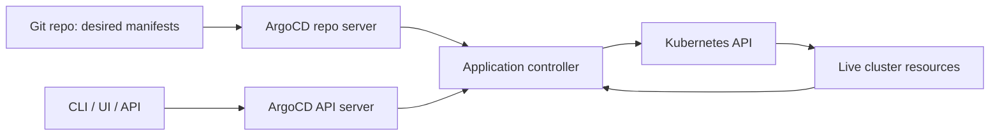

# 00 - Roadmap and Source Backbone

## Why This Chapter Matters

ArgoCD is not "a deployment button with a UI." It is a Kubernetes reconciliation system whose source of truth is Git. That difference changes how teams deploy, audit, recover, and debug applications.

## The Big Picture

```text
manual deployment pain -> CI/CD drift -> Git as source of truth -> GitOps -> ArgoCD reconciliation
```

## First-Principles Explanation

Cause: manual deployments and pipeline-only deployments can drift from the repository.

Mechanism: ArgoCD watches Git and the Kubernetes cluster, compares desired state with live state, and syncs differences.

Immediate result: the cluster can be brought back to the Git-declared state.

Long-term impact: deployment history, review, rollback, and drift detection become Git-centered.

Next connected topic: ArgoCD Applications, AppProjects, sync policies, pruning, self-healing, Helm, Kustomize, RBAC, and multi-cluster patterns.

## Core Vocabulary

| Term | Meaning | Why it matters |
| --- | --- | --- |
| GitOps | Operational model where Git stores desired state. | Makes review/audit central. |
| Desired state | Manifests rendered from Git. | What ArgoCD wants live state to match. |
| Live state | Actual Kubernetes resources. | Drift is detected here. |
| Application | ArgoCD unit linking source repo to destination cluster/namespace. | Main deployment object. |
| AppProject | Boundary for repos, destinations, and permissions. | Multi-team control. |
| Sync | Apply desired state to cluster. | Deployment action. |
| Prune | Delete live resources no longer in Git. | Prevents leftovers, but risky if misused. |
| Self-heal | Revert manual cluster drift. | Enforces Git source of truth. |
| Sync wave | Ordered sync grouping. | Handles dependencies inside an app. |
| Hook | Resource executed at sync phases. | Pre/post sync workflows. |

## Architecture Diagram



## Required Chapters

1. GitOps foundations and deployment drift.
2. ArgoCD architecture and control loops.
3. Applications, sources, destinations, and projects.
4. Sync policies: manual, auto-sync, prune, self-heal.
5. Helm and Kustomize integration.
6. Secrets and external secret patterns.
7. RBAC, SSO, projects, and multi-team boundaries.
8. Sync waves, hooks, app-of-apps, ApplicationSet.
9. Multi-cluster deployment and promotion.
10. Troubleshooting OutOfSync, Degraded, ComparisonError, failed syncs.

## Small Details That Matter Later

- Pruning deletes resources not in desired state. A wrong app boundary can delete the wrong things.
- Self-heal enforces Git against manual cluster edits; useful in production, surprising during emergency fixes.
- Sync waves order resources within an Application; they are not a universal dependency solver across all applications.
- Helm values rendered by ArgoCD must be debugged as rendered manifests, not only source templates.
- ArgoCD "Healthy" and Kubernetes readiness are related but not identical.
- GitOps does not remove the need for image promotion discipline.

## Source Backbone

- Argo CD docs: <https://argo-cd.readthedocs.io/>
- Argo CD auto-sync: <https://argo-cd.readthedocs.io/en/stable/user-guide/auto_sync/>
- Argo CD sync waves and hooks: <https://argo-cd.readthedocs.io/en/release-3.0/user-guide/sync-waves/>
- AWS Prescriptive Guidance for Argo CD: <https://docs.aws.amazon.com/prescriptive-guidance/latest/eks-gitops-tools/argo-cd.html>

## Questions to Test Understanding

1. Why does GitOps use a pull model?
2. What is the difference between desired and live state?
3. Why can pruning be dangerous?
4. Why is self-heal useful and risky?
5. Why is ArgoCD not a replacement for CI?

## Answers and Reasoning

1. The cluster-side controller pulls and reconciles desired state, avoiding broad deploy credentials in external pipelines.
2. Desired state is what Git declares; live state is what currently exists in Kubernetes.
3. If the app scope is wrong, ArgoCD may delete resources that still matter.
4. It removes drift, but can undo emergency manual changes unless those changes are committed to Git.
5. CI still builds, tests, scans, and publishes artifacts; ArgoCD deploys declared desired state.

