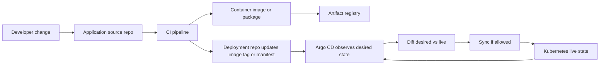
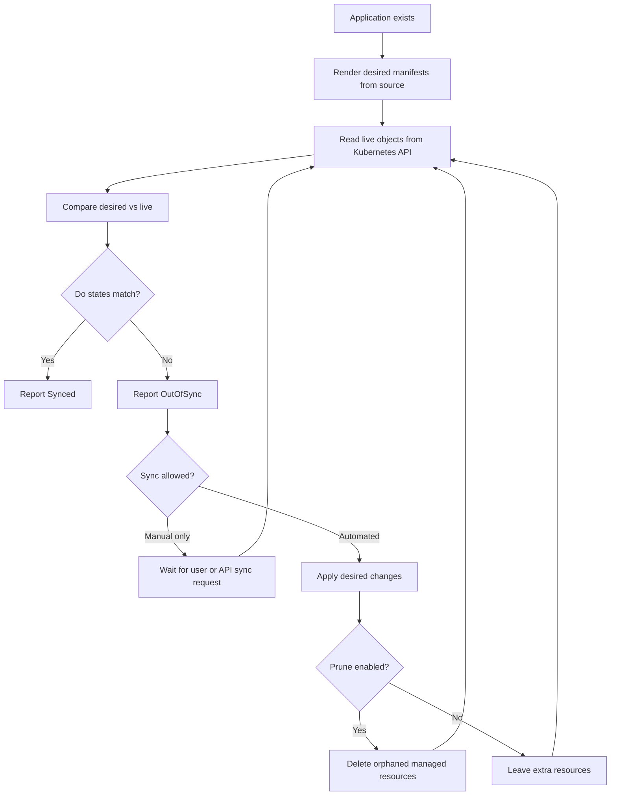
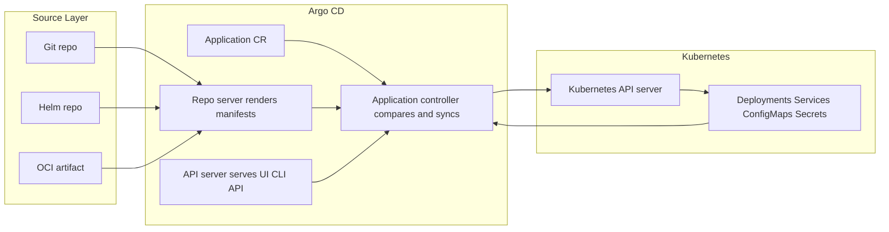
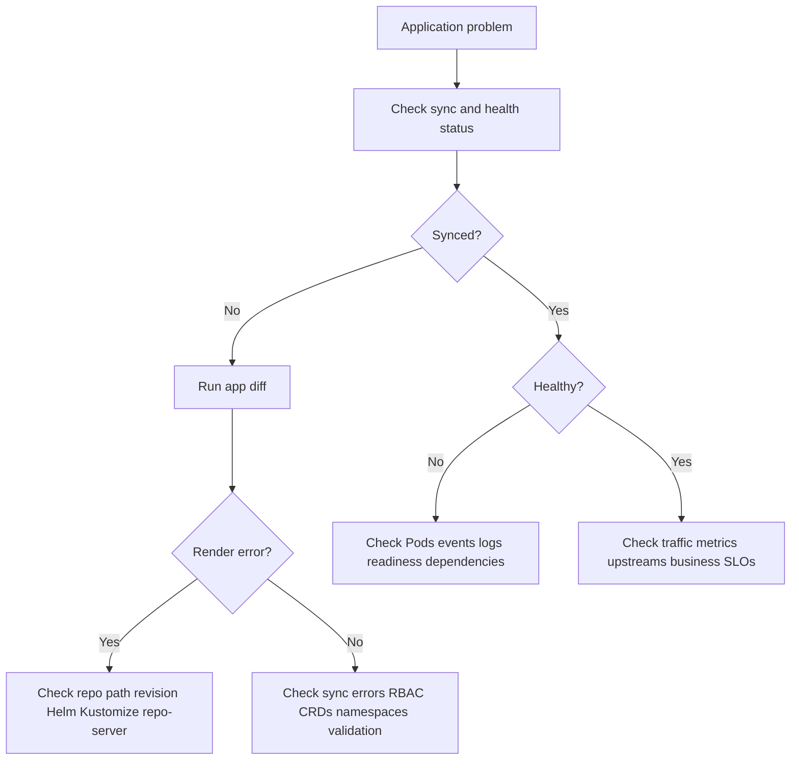

# 01 - GitOps Foundations and Reconciliation

## Why This Chapter Matters

Argo CD only makes sense after you understand the failure it is trying to remove.

Many teams start with manual deployments. A person runs `kubectl apply`, copies a YAML file, changes an image tag, or clicks something in a dashboard. Then the team improves and moves deployment into CI/CD. That is better, but it still has a common weakness: the pipeline may know what it applied, while the cluster may slowly become something else.

GitOps exists because production systems need a stronger source of truth than memory, chat messages, and last week's pipeline logs. Argo CD is the Kubernetes implementation of that idea: it treats Git as desired state, observes Kubernetes as live state, compares both, and reconciles the difference.

Cause -> Mechanism -> Immediate Result -> Long-Term Impact -> Next Connected Topic:

```text
manual deployment pain
-> Git stores reviewed desired state
-> Argo CD compares Git with live Kubernetes state
-> drift becomes visible and correctable
-> deployment, rollback, audit, and recovery become Git-centered
-> Applications, AppProjects, sync policy, RBAC, hooks, and multi-cluster GitOps
```

Official source baseline:

- Argo CD documentation: <https://argo-cd.readthedocs.io/>
- Argo CD architectural overview: <https://argo-cd.readthedocs.io/en/stable/operator-manual/architecture/>
- Argo CD automated sync policy: <https://argo-cd.readthedocs.io/en/stable/user-guide/auto_sync/>
- Argo CD sync phases and waves: <https://argo-cd.readthedocs.io/en/latest/user-guide/sync-waves/>

Version assumption: this chapter is written against the current Argo CD documentation checked on 2026-05-27. Exact CLI output, controller flags, sync options, health checks, and UI behavior can vary by Argo CD release, Kubernetes version, installation mode, and enabled plugins. Verify operational flags against the version running in your cluster.

## The Big Picture

Argo CD does not replace CI.

CI answers:

```text
Can this code be built, tested, scanned, packaged, and published?
```

Argo CD answers:

```text
Does the cluster match the deployment state declared in Git?
```

That difference is not cosmetic. It separates artifact production from environment reconciliation.



The important discipline is this:

- Application source code is not always the same as deployment desired state.
- CI produces an artifact.
- GitOps declares which artifact should run in which environment.
- Argo CD reconciles Kubernetes to that declaration.

In small projects, one repository may hold both code and manifests. In serious production setups, separating application code from environment configuration is often cleaner because promotion becomes explicit: dev can run image `A`, staging can run image `B`, and production can run image `C`, each through a reviewed Git change.

## First-Principles Explanation

### The Problem Before GitOps

Kubernetes already has a declarative model. You tell the API server, "I want three replicas of this Deployment," and controllers work to make that true.

But there is a missing question:

```text
Where does the declaration itself come from?
```

If the answer is "whoever ran the last command," the system has a weak source of truth.

Common pre-GitOps failure chain:

```text
urgent production issue
-> engineer runs manual kubectl patch
-> service recovers
-> Git is not updated
-> the next deployment overwrites or conflicts with the manual fix
-> nobody can easily explain which state was intended
```

Another common chain:

```text
CI pipeline applies manifests directly
-> pipeline has powerful cluster credentials
-> pipeline logs show what happened at one time
-> cluster later drifts due to manual edits or other controllers
-> CI is idle and does not continuously compare state
-> drift remains hidden until an incident or redeploy
```

GitOps fixes this by making the declaration durable and reviewable.

### The GitOps Design

GitOps uses Git as the record of desired operational state.

That means:

- Every desired Kubernetes object is represented directly or indirectly in Git.
- Changes are reviewed through commits, pull requests, and branch policy.
- Rollback is usually a Git revert or reset to a previous known-good commit.
- The deployment controller continuously compares Git-rendered desired state with live cluster state.

Argo CD is one implementation of this pattern for Kubernetes.

### Why Pull-Based Deployment Matters

Traditional deployment pipelines are often push-based:

```text
external CI system -> authenticate to cluster -> apply manifests
```

Argo CD is usually pull-based:

```text
controller inside or near cluster -> read Git -> apply to cluster
```

This changes the security model.

With push-based deployment, the external pipeline needs credentials that can change the cluster. If the CI system is compromised, cluster credentials become a high-value target.

With pull-based GitOps, the external CI system can often be limited to updating Git and artifact registries. The cluster-side reconciler owns deployment credentials. This does not eliminate risk, but it narrows where powerful Kubernetes permissions live.

## Core Vocabulary

| Term | Meaning | Why it matters |
| --- | --- | --- |
| Desired state | The Kubernetes manifests Argo CD renders from the configured source. | This is what should exist. |
| Live state | The actual Kubernetes resources in the destination cluster. | This is what currently exists. |
| Sync status | Whether desired and live state match. | `Synced` means no diff; `OutOfSync` means drift exists. |
| Health status | Whether live resources appear operational according to health checks. | A resource can be synced but unhealthy. |
| Application | Argo CD custom resource that binds source, destination, project, and sync policy. | Main unit of GitOps deployment. |
| AppProject | Boundary that restricts sources, destinations, resources, and permissions. | Critical for multi-team safety. |
| Sync | Operation that applies desired state to live cluster. | The deployment action. |
| Prune | Delete live resources that are no longer part of desired state. | Prevents leftovers, but can delete the wrong objects if scope is wrong. |
| Self-heal | Automatically correct live drift back to Git. | Protects desired state, but can undo emergency manual edits. |
| Refresh | Recompute comparison between desired and live state. | Used when Argo CD needs to notice new Git or cluster state. |
| Revision | Git commit, tag, branch, Helm chart version, or other source target. | Determines exactly what desired state is rendered from. |

## Mental Model

Think of Argo CD as a Kubernetes-native auditor with permission to repair what it finds.

It repeatedly asks four questions:

1. What should this application look like according to Git?
2. What does it look like in the Kubernetes cluster right now?
3. Are there differences?
4. If policy allows, should I apply, delete, or update resources to remove those differences?



The phrase "reconciliation" is the center of the model. Argo CD is not trying to remember a one-time deployment event. It is trying to keep a relationship true over time:

```text
rendered desired state from Git == live Kubernetes state
```

## Historical / Evolution / Causal Chain

### Before Containers

Applications were often deployed directly onto long-lived servers. Each server accumulated small differences:

- one had a patched package
- another had an old configuration file
- another had a manual hotfix
- another had different environment variables

This created configuration drift.

Cause -> Mechanism -> Result:

```text
manual server changes
-> no durable source of truth
-> servers with the same role behave differently
```

### Containers Improved Packaging, Not Deployment Truth

Containers made application artifacts more repeatable. An image could contain code, dependencies, and startup behavior.

But an image alone does not answer:

- Which image tag should production run?
- How many replicas?
- Which Service, Ingress, ConfigMap, and Secret should exist?
- Which team approved this change?
- What should happen if someone manually changes the cluster?

### Kubernetes Made Workloads Declarative

Kubernetes introduced controllers that reconcile desired state:

```text
Deployment desired replicas -> ReplicaSet -> Pods -> kubelet execution
```

But Kubernetes does not automatically know which Git commit is the source of the desired YAML. `kubectl apply` can send declarations from a laptop, a CI job, or a generated directory. Kubernetes accepts the object; it does not enforce the human workflow that created it.

### GitOps Connected Declaration to Review

GitOps connects operational state to Git review.

Cause -> Mechanism -> Immediate Result -> Long-Term Impact:

```text
deployment state needs auditability
-> desired state stored in Git
-> changes use commits and reviews
-> deployment history becomes explainable
```

### Argo CD Brought GitOps Into Kubernetes

Argo CD makes GitOps practical by acting as a controller:

- it watches configured sources
- it renders manifests with tools like plain YAML, Kustomize, Helm, Jsonnet, or plugins
- it compares against the live cluster
- it shows diffs and health
- it applies changes manually or automatically
- it supports multi-cluster deployment and multi-team boundaries

## Architecture or Conceptual Structure

At a foundation level, four ideas matter:

1. Source: where desired state comes from.
2. Render: how raw source becomes Kubernetes manifests.
3. Compare: how desired manifests differ from live objects.
4. Reconcile: how Argo CD applies changes to remove drift.



The official Argo CD architecture describes the API server as the component used by the Web UI, CLI, and automation; the repo server as the component that caches and renders source; and the application controller as the controller that monitors applications, compares live state with target state, and optionally corrects differences.

## Step-by-Step Explanation

### Step 1: A Repository Declares the Desired State

Example repository layout:

```text
platform-config/
  apps/
    payments/
      base/
        deployment.yaml
        service.yaml
      overlays/
        dev/
          kustomization.yaml
        prod/
          kustomization.yaml
```

This is not just file organization. It expresses operational intent:

- `base` contains shared resources.
- `dev` and `prod` can differ deliberately.
- every environment change can be reviewed.

### Step 2: An Argo CD Application Points to Source and Destination

Minimal example:

```yaml
apiVersion: argoproj.io/v1alpha1
kind: Application
metadata:
  name: payments-prod
  namespace: argocd
spec:
  project: payments
  source:
    repoURL: https://github.com/example/platform-config.git
    targetRevision: main
    path: apps/payments/overlays/prod
  destination:
    server: https://kubernetes.default.svc
    namespace: payments
  syncPolicy:
    automated:
      prune: false
      selfHeal: true
```

What each field means:

| Field | Meaning | Mistake to avoid |
| --- | --- | --- |
| `metadata.name` | Argo CD application name. | Reusing unclear names like `app1` makes audit painful. |
| `metadata.namespace` | Namespace where Argo CD watches Application resources, commonly `argocd`. | Creating the Application where Argo CD is not watching it. |
| `spec.project` | AppProject boundary. | Leaving everything in `default` in multi-team clusters. |
| `spec.source.repoURL` | Desired-state repository. | Pointing production at an unreviewed or personal repository. |
| `spec.source.targetRevision` | Branch, tag, or commit to render. | Using a floating branch when production needs pinned promotion. |
| `spec.source.path` | Directory inside source repo. | Pointing too high in the repo and accidentally managing unrelated resources. |
| `spec.destination.server` | Destination cluster API endpoint. | Sending workloads to the wrong cluster context. |
| `spec.destination.namespace` | Default namespace for namespaced resources. | Assuming this overrides explicit namespaces in manifests. |
| `syncPolicy.automated` | Enables automatic sync behavior. | Enabling prune/self-heal without understanding deletion and emergency-change behavior. |

### Step 3: Argo CD Renders Desired Manifests

If the source path is plain YAML, rendering may be simple.

If the source is Helm or Kustomize, the repo server generates manifests first.

Important chain:

```text
Git source
-> render tool resolves templates and overlays
-> Argo CD receives concrete Kubernetes manifests
-> comparison happens on rendered output, not on your mental model of the template
```

This is why debugging a Helm-based Argo CD application requires looking at rendered manifests, not only `values.yaml`.

### Step 4: Argo CD Reads Live Cluster State

The application controller reads the Kubernetes API to find resources that belong to the Application. It compares live objects with the rendered desired objects.

If a desired Deployment says `replicas: 3` and the live Deployment says `replicas: 2`, the application can become `OutOfSync`.

If the live Deployment matches desired state but Pods are crashing, sync status can be `Synced` while health is `Degraded`.

This distinction matters:

```text
Synced answers: "Does the object spec match Git?"
Healthy answers: "Does the object appear operational?"
```

### Step 5: Sync Applies Desired State

A manual sync asks Argo CD to apply the desired state now.

Common CLI command:

```bash
argocd app sync payments-prod
```

Purpose: apply the desired manifests for the `payments-prod` Application to the destination cluster.

Expected good result: the operation finishes successfully, resources show `Synced`, and health eventually becomes `Healthy`.

Bad result examples:

- `permission denied`: Argo CD or the destination service account lacks Kubernetes RBAC.
- `ComparisonError`: Argo CD could not render or compare desired state.
- `InvalidSpecError`: the Application source or destination is invalid.
- Kubernetes validation errors: a manifest field is invalid for the API version.

Troubleshooting interpretation:

```text
render error -> inspect repo path, Helm/Kustomize config, repo-server logs
apply error -> inspect Kubernetes API validation, RBAC, CRDs, namespaces
health stuck -> inspect workload events, Pods, readiness, controller status
```

### Step 6: Auto-Sync Can Apply Without a Human Click

With automated sync, Argo CD can sync when it detects drift from Git.

Example:

```yaml
syncPolicy:
  automated:
    prune: true
    selfHeal: true
```

What this means:

- `automated`: Argo CD may sync without a manual sync request.
- `prune: true`: resources managed by the app but removed from desired state can be deleted.
- `selfHeal: true`: live manual changes can be corrected back to Git.

This is powerful and dangerous for the same reason: it enforces the declared state.

## Internal Mechanics

### Desired-State Rendering

Argo CD has to answer:

```text
Given this source, revision, path, and tool settings, what Kubernetes objects should exist?
```

The repo server is central here. It maintains repository cache and generates manifests based on source settings. If manifest generation is slow, broken, or plugin-dependent, reconciliation slows or fails before Kubernetes even sees the desired changes.

Internal risk chain:

```text
large monorepo or expensive Helm/Kustomize generation
-> repo server takes too long
-> application comparison fails or queues grow
-> deployment visibility and sync reliability degrade
```

### Live-State Observation

Argo CD reads Kubernetes resources through the Kubernetes API. It must know which resources are part of which Application. Resource tracking can involve labels, annotations, or tracking IDs depending on configuration and version.

Small operational implication:

```text
if resource tracking metadata is changed or stripped
-> Argo CD may lose ownership clarity
-> pruning, orphan detection, or diff behavior can become surprising
```

### Diff and Sync

Diffing sounds simple, but Kubernetes objects are not plain files after admission and defaulting.

Kubernetes may add:

- default fields
- managed fields
- status fields
- generated names
- controller-owned fields
- admission-mutated annotations or labels

Argo CD must decide what differences matter.

This is why real Argo CD operations often involve diff customization, ignore rules, and health customizations. Those tools are useful, but dangerous if used to hide meaningful drift.

### Health Is Not the Same as Sync

Example:

```text
Deployment spec matches Git
-> Argo CD sync status is Synced
-> Pods crash due to bad image or missing secret
-> Argo CD health is Degraded
```

Another example:

```text
Service matches Git
-> sync status is Synced
-> cloud load balancer is still provisioning
-> health may be Progressing or not fully useful depending on resource type
```

## Practical Examples

### Inspect an Application

```bash
argocd app get payments-prod
```

Purpose: show source, destination, sync status, health, revision, and resource tree for an Application.

Expected useful output:

```text
Name:               argocd/payments-prod
Project:            payments
Server:             https://kubernetes.default.svc
Namespace:          payments
URL:                ...
Repo:               https://github.com/example/platform-config.git
Target:             main
Path:               apps/payments/overlays/prod
Sync Status:        Synced to main (...)
Health Status:      Healthy
```

Bad output patterns:

- `OutOfSync`: desired and live differ.
- `Degraded`: resources exist but are not healthy.
- `Missing`: expected resource is not present.
- `Unknown`: Argo CD cannot determine health.

How to interpret:

```text
OutOfSync + Healthy -> configuration drift but workload may still run
Synced + Degraded -> Git matches cluster, but the workload is failing
OutOfSync + Degraded -> both declaration mismatch and runtime health need attention
```

### Compare Desired and Live State

```bash
argocd app diff payments-prod
```

Purpose: show differences between rendered desired manifests and live resources.

Use when:

- a manual edit may have changed the cluster
- a Git change did not behave as expected
- an application is `OutOfSync`
- a sync would be risky and you want to inspect first

Bad output pattern:

```text
field differs because a controller or admission webhook mutates it every time
```

Interpretation: this may require understanding the mutating controller or carefully adding an ignore rule. Do not blindly ignore diffs because they are noisy; noisy drift is sometimes the clue to a broken ownership boundary.

### Manual Sync

```bash
argocd app sync payments-prod
```

Purpose: apply desired state.

Safe usage:

- run `argocd app diff` first for critical workloads
- check destination cluster and namespace
- understand whether pruning is active
- watch workload events after sync

Dangerous usage:

```bash
argocd app sync payments-prod --prune
```

This may delete resources that are no longer in Git and still tracked by the Application. It is correct when Git is the intended source of truth. It is dangerous when the Application scope is too broad or the repo path accidentally removed resources.

### Kubernetes-Side Inspection

```bash
kubectl get applications.argoproj.io -n argocd
```

Purpose: see Argo CD Application custom resources directly through Kubernetes.

Expected output:

```text
NAME            SYNC STATUS   HEALTH STATUS
payments-prod   Synced        Healthy
```

Bad output:

- Application missing: it was never created, was created in wrong namespace, or Argo CD watches a different namespace.
- Status not updating: controller may be down, lacks permissions, or cannot reconcile.

### Render Before Blaming Argo CD

For Kustomize:

```bash
kustomize build apps/payments/overlays/prod
```

For Helm:

```bash
helm template payments ./chart -f values-prod.yaml
```

Purpose: verify what the source tool produces before Argo CD applies it.

Important interpretation:

```text
if local render is wrong
-> fix source manifests, values, overlays, or chart logic

if local render is right but Argo CD render is wrong
-> inspect Argo CD source settings, tool version, repo-server plugins, credentials, and revision
```

## Small Details That Matter Later

- `Synced` does not mean the application is working. It means desired and live object definitions match closely enough under Argo CD comparison rules.
- `Healthy` does not mean there is no business outage. It means Argo CD's resource health checks see acceptable Kubernetes status. A service can be healthy while an upstream dependency is failing.
- `targetRevision: main` is convenient but not always safe for production. A moving branch means the desired production state changes as the branch changes.
- `targetRevision` can be a branch, tag, or commit depending on source type. Pinned commits improve reproducibility; branches improve convenience.
- `destination.namespace` does not magically rewrite every manifest. If a manifest has an explicit namespace, understand how your tool and Argo CD settings handle it.
- Automated sync without prune leaves removed Git resources alive. Automated sync with prune can delete resources. Both choices have failure modes.
- Self-heal can fight emergency manual fixes. The proper long-term fix is to commit the emergency change to Git or temporarily change sync policy with a clear rollback plan.
- Argo CD compares rendered manifests, not the source templates as humans read them.
- Diff noise from admission webhooks, autoscalers, and controllers should be understood before it is ignored.
- Sync waves order resources inside a sync operation. They are not a substitute for application architecture, readiness, health checks, or proper dependency design.
- GitOps does not solve secret management by itself. It only says desired state is declared. Secret storage, encryption, rotation, and access control still need design.
- A Git revert can be a deployment rollback only if the previous desired state still works with current data, external dependencies, and database schema.
- Argo CD cannot fix a bad image tag. If Git declares a broken image, Argo CD will faithfully deploy the broken desired state.
- Application names, project names, repo paths, and namespaces become audit vocabulary. Sloppy naming makes incidents harder to investigate.

## Common Misunderstandings

### Misunderstanding 1: "Argo CD is CI/CD."

More accurate:

```text
CI builds and validates artifacts.
Argo CD reconciles declared Kubernetes desired state.
```

Argo CD can be part of a CD system, but it is not a replacement for tests, image scans, artifact signing, or release promotion policy.

### Misunderstanding 2: "GitOps means everything is automatic."

GitOps means Git is the desired state source. Sync can be manual or automatic. Many production teams use manual sync for sensitive environments and automatic sync for lower environments, or automatic sync with strict approval gates before Git changes reach production.

### Misunderstanding 3: "If Argo CD says Synced, production is fine."

Synced only means configuration alignment. Runtime behavior still depends on Pods, networks, databases, queues, permissions, capacity, and external services.

### Misunderstanding 4: "Prune is just cleanup."

Prune is deletion. It is cleanup only when desired state boundaries are correct.

Cause -> Mechanism -> Failure:

```text
repo path accidentally loses manifests
-> Argo CD sees resources removed from desired state
-> prune deletes tracked live resources
-> outage
```

### Misunderstanding 5: "Self-heal prevents all bad changes."

Self-heal prevents unmanaged live drift from persisting. It does not prevent a bad Git commit from becoming desired state.

## Failure Modes / Mistakes / Traps

### Trap 1: Broad Application Scope

Bad pattern:

```yaml
source:
  path: clusters/prod
```

when that path contains unrelated resources owned by multiple teams.

Failure chain:

```text
one Application owns too much
-> unrelated resources are tracked together
-> prune or sync errors affect many systems
-> blast radius becomes too large
```

Better pattern: use AppProjects and Applications that match ownership boundaries.

### Trap 2: Floating Production Revisions

Using a branch for production can be acceptable with strong branch protection. But it means production desired state is whatever the branch currently says.

Risk:

```text
mistaken merge to main
-> Argo CD detects new desired state
-> auto-sync applies change
-> production changes faster than humans notice
```

Mitigation:

- protected branches
- required reviews
- promotion branches or tags
- pinned image digests where appropriate
- manual sync for critical workloads

### Trap 3: Ignoring Diff Noise Without Understanding It

Diff noise often comes from:

- defaulted Kubernetes fields
- mutating admission webhooks
- autoscalers changing replicas
- controllers adding annotations
- generated certificates or secrets

Bad response:

```text
"ignore all diffs under this object"
```

Better response:

```text
identify the owning controller
-> ignore only the precise field if safe
-> document why the field is ignored
-> monitor for real drift elsewhere
```

### Trap 4: GitOps Without Image Promotion Discipline

If manifests use mutable tags like `latest`, Git does not fully identify what runs.

Failure chain:

```text
Git says image: app:latest
-> registry tag is overwritten
-> cluster pulls different bytes for same desired text
-> Git audit no longer proves runtime artifact
```

Better:

- immutable version tags
- image digests for high-control environments
- signed artifacts where needed
- CI updates deployment repo with a concrete artifact reference

### Trap 5: Treating Rollback as Only a Git Revert

Git revert changes manifests. It does not reverse database migrations, external API changes, message schema changes, or irreversible data writes.

Rollback analysis must ask:

- Is the old container image still available?
- Is the old config compatible with current data?
- Did the release include schema migration?
- Are consumers and producers compatible?
- Did CRDs or cluster-level resources change?

## Debugging / Analysis / Answer-Writing Method

When an Argo CD app is wrong, do not start by randomly syncing. Diagnose where the chain broke.



Operational checklist:

1. Confirm the Application name, project, source repo, revision, path, destination cluster, and namespace.
2. Run `argocd app get <app>` and separate sync status from health status.
3. Run `argocd app diff <app>` if it is `OutOfSync`.
4. If rendering fails, inspect source repository, branch, credentials, Helm/Kustomize configuration, and repo-server logs.
5. If apply fails, inspect Kubernetes API errors, RBAC, CRDs, namespaces, resource quotas, and admission webhooks.
6. If sync succeeds but health fails, inspect workload controllers, Pods, events, logs, Services, Ingress, and dependencies.
7. Before enabling prune or self-heal, confirm ownership boundaries and emergency-change process.

Exam or interview answer structure:

```text
Define GitOps
-> separate CI artifact creation from CD reconciliation
-> explain desired vs live state
-> explain Argo CD Application
-> explain manual sync, auto-sync, prune, self-heal
-> mention risks: bad Git commit, prune blast radius, mutable tags, secrets, RBAC
-> close with debugging method: status, diff, render, apply, runtime health
```

## Real-World or Exam Relevance

Argo CD appears in real platform engineering conversations because it answers several production needs:

- Who changed production?
- Which Git commit describes production?
- Why did the cluster drift?
- Can we detect manual edits?
- Can we roll back declarative config?
- Can many teams deploy safely to shared clusters?
- Can deployment credentials stay inside the cluster boundary?

Interviewers often test whether you understand the boundary:

Bad answer:

```text
"Argo CD deploys apps from Git."
```

Better answer:

```text
"Argo CD is a Kubernetes GitOps controller. An Application points to a source and destination. Argo CD renders desired manifests, compares them to live resources, reports sync and health status, and can manually or automatically reconcile drift. The dangerous settings are prune and self-heal because they enforce Git strongly, including deletion and reversal of manual edits."
```

## Connected Topics

- Kubernetes controllers and reconciliation loops: Argo CD applies the same controller idea at the application delivery layer.
- Helm and Kustomize: Argo CD often renders these before comparison and sync.
- Kubernetes RBAC: Argo CD needs permissions to read and apply resources in destination clusters.
- Secrets management: GitOps needs a safe design for secret encryption, external secret operators, or secret injection.
- CI pipelines: CI should produce tested artifacts and update desired-state repositories.
- Progressive delivery: Argo Rollouts, canary patterns, blue/green, and metrics-based promotion build on the deployment foundation.
- Multi-cluster platform design: AppProjects, ApplicationSet, cluster credentials, and environment promotion become important at scale.

## Chapter Summary

GitOps exists because production needs a durable and reviewable desired state. Kubernetes already reconciles objects, but teams still need a source of truth for the objects themselves. Argo CD connects Git to Kubernetes by rendering desired state, reading live state, comparing the two, and syncing when requested or allowed.

The most important distinction is:

```text
Synced != Healthy
Git desired state != good desired state
Automated sync != safe release process by itself
```

Argo CD is powerful because it faithfully enforces Git. That is also why Git quality, repository boundaries, RBAC, prune settings, image immutability, and emergency-change policy matter.

## Questions to Test Understanding

1. Why did GitOps become important even though Kubernetes already has declarative YAML?
2. What is the difference between desired state and live state?
3. Why is pull-based deployment often safer than push-based deployment from CI?
4. Why can an Application be `Synced` but not `Healthy`?
5. What does `prune` do, and why is it dangerous?
6. What does `selfHeal` do, and when can it surprise operators?
7. Why are mutable image tags weak in a GitOps workflow?
8. Why should you debug rendered Helm or Kustomize output?
9. What are the first three checks when an Argo CD app is `OutOfSync`?
10. Why does GitOps not eliminate the need for CI?

## Answers and Reasoning

1. Kubernetes accepts declarations, but it does not decide which Git commit should be the durable source of those declarations. GitOps makes desired operational state reviewable, auditable, and continuously reconcilable.
2. Desired state is what Argo CD renders from the configured source revision and path. Live state is what actually exists in Kubernetes. Drift is the gap between them.
3. Pull-based deployment keeps powerful deployment credentials closer to the cluster-side controller. CI may only need to publish artifacts and update Git, reducing the need for external systems to hold broad cluster credentials.
4. Sync status compares object configuration. Health status evaluates whether resources appear operational. A Deployment can match Git while its Pods crash due to a bad image or missing Secret.
5. Prune deletes managed live resources that are no longer in desired state. It is dangerous when the app source path, ownership boundary, or Git change is wrong because deletion can be automated.
6. Self-heal corrects live cluster drift back to Git. It can surprise operators when they make emergency manual edits and Argo CD immediately reverts them.
7. A mutable tag like `latest` can point to different image bytes over time while Git text stays unchanged. That weakens auditability and reproducibility.
8. Argo CD compares rendered manifests. If Helm values, Kustomize overlays, or plugins render unexpected YAML, the source templates may look reasonable while desired state is wrong.
9. Check the Application source/destination, run `argocd app get`, and run `argocd app diff`. Then separate render errors from apply errors and runtime health problems.
10. CI still builds, tests, scans, signs, and publishes artifacts. Argo CD deploys and reconciles the desired state that references those artifacts.

