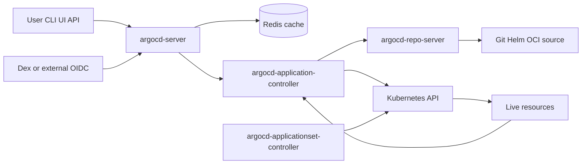
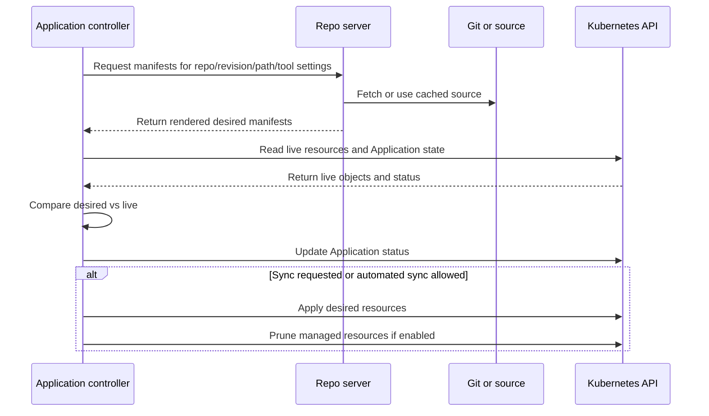
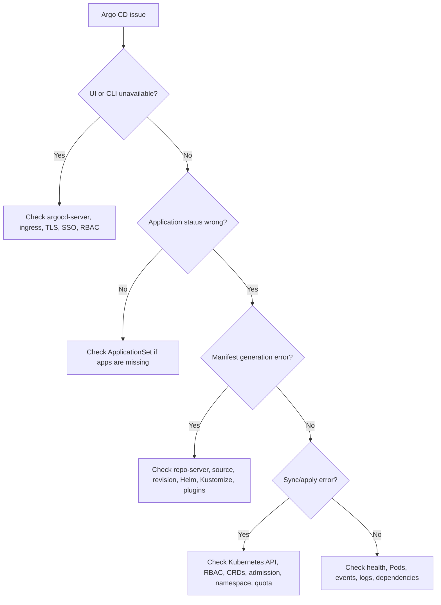

# 02 - Argo CD Architecture and Control Loops

## Why This Chapter Matters

Argo CD becomes easy to operate when you stop seeing it as a single dashboard and start seeing it as a small distributed system.

The UI is only the visible surface. Behind it, Argo CD has separate components for API access, repository rendering, application reconciliation, authentication, caching, and Kubernetes writes. When syncs fail, health is stale, diffs are wrong, or the UI is slow, the failure usually belongs to one of these components.

Cause -> Mechanism -> Immediate Result -> Long-Term Impact -> Next Connected Topic:

```text
GitOps needs continuous comparison
-> Argo CD splits API, rendering, cache, and reconciliation responsibilities
-> each component has a clear job and failure mode
-> operators can diagnose render, compare, sync, auth, and scale problems separately
-> Application design, AppProject boundaries, sync policy, HA, and troubleshooting become understandable
```

Official source baseline:

- Architecture overview: <https://argo-cd.readthedocs.io/en/stable/operator-manual/architecture/>
- Component architecture: <https://argo-cd.readthedocs.io/en/release-3.4/developer-guide/architecture/components/>
- High availability guidance: <https://argo-cd.readthedocs.io/en/stable/operator-manual/high_availability/>
- Argo CD Core: <https://argo-cd.readthedocs.io/en/stable/operator-manual/core/>
- TLS guidance: <https://argo-cd.readthedocs.io/en/stable/operator-manual/tls/>

Version assumption: this chapter reflects Argo CD documentation checked on 2026-05-27. Component names are stable, but flags, default processor counts, HA manifests, Redis options, TLS settings, and ApplicationSet behavior can vary by Argo CD release and installation method.

## The Big Picture

Argo CD has one main promise:

```text
continuously compare desired state with live state and reconcile when policy allows
```

To keep that promise, it separates work:

| Component | Main job | Failure usually looks like |
| --- | --- | --- |
| `argocd-server` | API for UI, CLI, SSO, RBAC, app operations. | Login problems, API errors, CLI/UI unavailable. |
| `argocd-repo-server` | Fetch and render desired manifests from Git, Helm, Kustomize, Jsonnet, plugins, or OCI sources. | Comparison errors, manifest generation timeouts, wrong rendered YAML. |
| `argocd-application-controller` | Reconcile Applications: compare desired and live state, update status, perform syncs. | Apps stuck, stale status, slow syncs, reconciliation backlog. |
| `argocd-applicationset-controller` | Generate Applications from templates and generators. | Missing or wrong generated Applications. |
| `argocd-redis` | Cache layer for API, repository, and cluster information. | Slowness, cache rebuilds, UI delays; usually disposable cache, not source of truth. |
| `argocd-dex-server` | Optional OIDC/SAML identity broker. | SSO login failures or token problems. |
| Kubernetes API | Stores Argo CD CRs and target resources; receives apply/delete operations. | RBAC errors, validation errors, admission failures, API rate/latency issues. |
| Git or artifact source | Stores desired state. | Fetch failures, bad revision, credentials errors, webhook delays. |



The architecture matters because each part owns a different question:

```text
Who can do this?                 -> argocd-server, SSO, RBAC, AppProject policy
What should exist?               -> repo-server rendering from source
What exists right now?           -> application-controller reading Kubernetes API
What is different?               -> application-controller comparison
Should changes be applied?       -> sync policy, user request, project permissions
How fast can this scale?         -> repo-server, controller queues, API load, Redis, monorepo design
```

## First-Principles Explanation

### Why Argo CD Is Split Into Components

If Argo CD were one giant process, every concern would compete inside the same failure boundary:

- UI/API requests
- Git clone and fetch
- Helm/Kustomize rendering
- Kubernetes watch and list operations
- sync execution
- authentication
- cache management
- ApplicationSet generation

That would be hard to scale and hard to debug.

Argo CD splits the system because the jobs have different resource profiles:

- Manifest rendering can be CPU and memory heavy.
- Application reconciliation needs queues and Kubernetes API access.
- API/UI traffic needs authentication, authorization, and responsiveness.
- Cache can be rebuilt and should not be treated as authoritative data.
- Identity integration may require optional OIDC/SAML components.

Cause -> Mechanism -> Result:

```text
different GitOps tasks have different scaling and security needs
-> Argo CD separates API, rendering, reconciliation, cache, and auth
-> each component can be diagnosed, scaled, and hardened separately
```

### What Is the Source of Truth?

There are three important stores:

1. Git or source repository: desired Kubernetes state.
2. Kubernetes etcd: Argo CD CRs, live cluster resources, and controller status.
3. Redis: cache.

Redis is not the source of truth. Official HA guidance treats Argo CD as largely stateless and persists data as Kubernetes objects, with Redis used as disposable cache. That does not mean Redis is irrelevant; a bad cache layer can hurt performance and UI behavior. But losing Redis should not be treated like losing application desired state.

### The Main Control Loop

At the heart of Argo CD is the Application controller loop:



This sequence explains many errors:

- If source fetch fails, repo-server or credentials are likely involved.
- If rendering fails, repo-server, tool config, plugin config, or source content is likely involved.
- If compare is stale, the controller queue or Kubernetes API access may be involved.
- If apply fails, Kubernetes validation, RBAC, CRDs, namespaces, or admission webhooks are likely involved.
- If the UI is unavailable but syncs continue, `argocd-server` may be failing while the controller still runs.

## Core Vocabulary

| Term | Meaning | Why it matters |
| --- | --- | --- |
| API server | Argo CD service used by UI, CLI, API clients, SSO, RBAC, and app operations. | It is not the Kubernetes API server. |
| Repo server | Internal service that fetches/caches source and renders manifests. | Rendering failures usually surface as comparison errors. |
| Application controller | Kubernetes controller that reconciles Application resources. | Main sync and status engine. |
| ApplicationSet controller | Controller that generates many Applications from a template and generator. | Used for multi-cluster or fleet deployments. |
| Redis | Cache for performance and UI/controller operations. | Important for scale but not authoritative desired state. |
| Dex | Optional identity service for external SSO integration. | Affects login, not core reconciliation in every setup. |
| Core mode | Minimal Argo CD installation without the full API/RBAC/OIDC feature set. | Useful when Kubernetes RBAC and API-only GitOps are preferred. |
| Reconciliation queue | Work queue where Applications wait for status refresh or sync operation. | Queue pressure causes stale status or slow sync. |
| Manifest generation | Rendering raw source into concrete Kubernetes YAML. | Helm/Kustomize/plugin issues live here. |

## Mental Model

Use this map when diagnosing:

```text
argocd-server = front door
argocd-repo-server = desired-state factory
argocd-application-controller = comparison and repair engine
argocd-redis = cache
argocd-dex-server = optional identity bridge
Kubernetes API = storage and execution boundary
Git = desired-state record
```

If the front door is broken, users may not log in, but controllers can still reconcile.

If the desired-state factory is broken, apps cannot render or compare correctly.

If the comparison engine is broken, apps stop refreshing, syncing, or reporting correctly.

If Kubernetes API access is broken, Argo CD cannot read live state or apply changes.

If Git access is broken, Argo CD cannot know current desired state.

## Historical / Evolution / Causal Chain

### From Deployment Scripts to Controllers

Deployment scripts are event-driven:

```text
run command once -> hope target state remains correct
```

Controllers are relationship-driven:

```text
desired state should equal live state -> continuously compare and repair
```

Argo CD borrows the controller idea from Kubernetes and applies it to application delivery.

### From CI Push to GitOps Pull

CI push model:

```text
CI has cluster credentials
-> CI applies manifests
-> deployment happens at pipeline runtime
-> drift after deployment is not continuously corrected by CI
```

Argo CD pull model:

```text
cluster-side controller has deployment access
-> controller reads Git desired state
-> drift remains visible after deployment
-> sync can be manual or automatic
```

This does not make Argo CD automatically safer. A badly configured Argo CD instance with broad cluster-admin rights and weak project boundaries can be dangerous. The architecture only gives you the pieces to build a safer system.

## Architecture or Conceptual Structure

### `argocd-server`

The API server exposes the API used by:

- Web UI
- CLI
- automation systems
- SSO and auth flows
- user-triggered sync, rollback, and actions

Responsibilities include:

- application management and status reporting
- invoking operations such as sync and rollback
- repository and cluster credential management, commonly stored as Kubernetes Secrets
- authentication delegation to identity providers
- Argo CD RBAC enforcement
- Git webhook listening and forwarding

Key misunderstanding:

```text
argocd-server is not the component that continuously reconciles Applications.
```

It lets users and systems interact with Argo CD. The application controller does the main reconciliation work.

Failure clues:

- UI not loading
- CLI cannot connect
- login redirect loop
- SSO failures
- API permission denied
- webhook not accepted

Useful checks:

```bash
kubectl get pods -n argocd -l app.kubernetes.io/name=argocd-server
kubectl logs -n argocd deploy/argocd-server
argocd version
argocd account get-user-info
```

### `argocd-repo-server`

The repo server is the desired-state renderer.

Inputs:

- repository URL
- revision
- path
- chart or manifest settings
- Helm values
- Kustomize settings
- plugin parameters

Output:

```text
concrete Kubernetes manifests ready for comparison and sync
```

Failure clues:

- `ComparisonError`
- manifest generation failed
- repository authentication errors
- Helm dependency errors
- Kustomize build errors
- plugin timeout
- large monorepo refresh slowness

Useful checks:

```bash
kubectl logs -n argocd deploy/argocd-repo-server
argocd app manifests <app-name>
argocd repo list
argocd repo get <repo-url>
```

If local rendering differs from Argo CD rendering, check:

- tool version
- Argo CD repo-server image version
- configured Helm values
- Kustomize version and build options
- plugin sidecar configuration
- environment variables
- path and revision
- credentials and submodules

### `argocd-application-controller`

The application controller is the main reconciliation engine.

It:

- watches Application resources
- asks repo-server for rendered manifests
- reads live state from Kubernetes API
- computes sync status
- computes or delegates health assessment
- updates Application status
- performs sync operations
- prunes resources when enabled
- invokes sync hooks

Failure clues:

- Application status not updating
- sync operations stuck
- auto-sync not triggering
- slow refresh across many apps
- controller logs showing queue pressure or Kubernetes API errors

Useful checks:

```bash
kubectl logs -n argocd statefulset/argocd-application-controller
kubectl get applications.argoproj.io -n argocd
kubectl describe application -n argocd <app-name>
argocd app get <app-name>
```

Operational concept:

```text
status refresh and sync execution are separate kinds of work
```

Official HA documentation describes separate queue processor settings for application reconciliation and application syncing. That distinction matters at scale: many apps can make status slow even when sync execution capacity looks fine.

### `argocd-applicationset-controller`

ApplicationSet is a higher-level generator. It creates Argo CD Applications from templates and generators.

Typical use cases:

- deploy the same app to many clusters
- generate apps from directories in a repo
- generate apps from cluster lists
- manage environment fleets

Failure clues:

- expected Applications are not created
- generated apps use wrong cluster or namespace
- template variables render unexpectedly
- deleting generator input removes generated apps

Important boundary:

```text
ApplicationSet creates Applications.
Application controller reconciles Applications.
```

Do not debug ApplicationSet generation and Application sync as if they are the same problem.

### Redis

Redis is a cache layer used to reduce load and improve performance.

It can help with:

- API/UI responsiveness
- reducing repeated source and cluster lookups
- application tree and state caching

Operationally:

```text
Redis loss should be recoverable, but Redis failure can still hurt performance and user experience.
```

Failure clues:

- UI is slow or inconsistent
- cache rebuild causes temporary load
- logs mention Redis connection errors

Useful checks:

```bash
kubectl get pods -n argocd -l app.kubernetes.io/name=argocd-redis
kubectl logs -n argocd deploy/argocd-redis
```

In HA mode, Redis architecture can differ. Verify whether your installation uses standalone Redis, Redis HA, or external Redis.

### Dex and External Identity

Dex is commonly used as an identity broker for OIDC/SAML providers, but Argo CD can be configured differently depending on environment.

Failure clues:

- SSO login fails
- groups are not mapped correctly
- users authenticate but lack expected Argo CD permissions
- token or callback errors

Debug chain:

```text
identity provider auth
-> Dex or OIDC mapping
-> Argo CD RBAC policy
-> AppProject permission
-> Kubernetes permission for target resource
```

Do not stop at "login works." A user can authenticate successfully and still be forbidden from syncing an app.

### Kubernetes API

Argo CD depends on the Kubernetes API in two ways:

1. It stores Argo CD objects such as Applications and AppProjects.
2. It reads and changes destination resources.

Failure clues:

- RBAC forbidden errors
- CRD not found
- namespace not found
- admission webhook rejects object
- quota prevents resource creation
- API latency causes reconciliation slowness

Useful checks:

```bash
kubectl auth can-i get deployments --as system:serviceaccount:argocd:argocd-application-controller -n payments
kubectl get events -n payments --sort-by=.lastTimestamp
kubectl describe application -n argocd payments-prod
```

The exact service account depends on installation and destination cluster model. Verify names in your cluster before relying on commands.

## Step-by-Step Explanation

### Step 1: User or Git Event Causes a Refresh

A refresh can be triggered by:

- Git webhook
- periodic polling
- user action from UI or CLI
- Application update
- cluster event or cache invalidation

The API server can receive webhooks and forward events. The controller eventually reconciles the affected app.

### Step 2: Controller Requests Desired Manifests

The controller asks repo-server to render:

```text
repo URL + revision + path + tool settings -> manifests
```

If this fails, the cluster is not the first suspect. The desired-state factory failed.

### Step 3: Controller Reads Live State

The controller reads Kubernetes resources and identifies those associated with the Application.

If this fails, check:

- destination cluster credentials
- Kubernetes API availability
- RBAC
- namespace existence
- CRD availability

### Step 4: Controller Compares Desired and Live State

Comparison produces:

- sync status
- diff
- resource statuses
- health calculation

Comparison can be complicated by defaulting, webhooks, generated fields, and controller-owned fields.

### Step 5: Controller Syncs If Requested or Allowed

Sync may be:

- manual
- automated
- automated with prune
- automated with self-heal
- phased with hooks and waves

During sync, resources are applied according to ordering rules, kind priorities, waves, hooks, and sync options.

### Step 6: Status and Health Are Reported

The controller writes status back to the Application resource. The UI and CLI read that status through the API.

If UI is stale but `kubectl describe application` shows fresh status, suspect API/UI/cache path. If both are stale, suspect controller reconciliation.

## Internal Mechanics

### Comparison Is a Rendered-State Problem

Argo CD does not compare your Helm chart source directly to live Deployments. It compares rendered manifests.

Example failure:

```text
values-prod.yaml accidentally sets replicaCount: 0
-> Helm template renders Deployment replicas: 0
-> Argo CD sees replicas: 0 as desired
-> sync correctly scales production down
```

Argo CD did not "break production." It enforced a bad desired state.

### Sync Is a Kubernetes API Problem

After desired state is rendered, sync depends on Kubernetes accepting the objects.

Possible blockers:

- missing CRD
- invalid API version
- forbidden by RBAC
- rejected by admission policy
- namespace missing
- quota exceeded
- immutable field changed
- finalizer preventing deletion

These are not repo-server problems. They are apply/delete problems.

### Health Is Resource-Specific

Argo CD knows health for common Kubernetes resource kinds and can be customized for CRDs. For custom resources, health may be `Unknown` unless Argo CD has logic to interpret status.

Failure chain:

```text
custom operator creates CRD
-> Argo CD applies custom resource
-> operator status format is unknown to Argo CD
-> app health is Unknown or misleading
-> team needs custom health assessment or operational convention
```

### Cache Can Hide or Amplify Problems

Cache improves scale, but it also means you need to know when you are looking at:

- freshly observed state
- cached state
- state waiting in a queue
- source revision not yet refreshed

Operational habit:

```bash
argocd app get <app-name> --refresh
```

Purpose: ask Argo CD to refresh app state before reporting.

Use when:

- UI status looks stale
- Git changed but Argo CD has not noticed
- a manual cluster fix is not reflected

## Practical Examples

### Identify Component Health

```bash
kubectl get pods -n argocd
```

Purpose: see whether Argo CD components are running.

Expected healthy pattern:

```text
argocd-application-controller-0     Running
argocd-applicationset-controller    Running
argocd-repo-server                  Running
argocd-server                       Running
argocd-redis                        Running
argocd-dex-server                   Running
```

Not every installation has every component. Core mode and custom installations may omit API server, Dex, notifications, or other pieces.

Bad output:

- `CrashLoopBackOff`: inspect logs and recent config changes.
- `Pending`: scheduling, resource requests, taints, node pressure, PVC issues.
- `ImagePullBackOff`: registry, image tag, credentials, network.
- `Running` with high restarts: unstable component.

### Debug a Manifest Generation Error

```bash
argocd app get payments-prod
argocd app manifests payments-prod
kubectl logs -n argocd deploy/argocd-repo-server
```

Purpose: confirm whether desired-state rendering fails.

Interpretation:

```text
app manifests fails
-> source rendering problem
-> inspect repo URL, revision, path, Helm values, Kustomize overlays, plugins, credentials
```

### Debug an Apply Error

```bash
argocd app sync payments-prod
kubectl describe application -n argocd payments-prod
kubectl get events -n payments --sort-by=.lastTimestamp
```

Purpose: find Kubernetes API errors after manifests are rendered.

Interpretation:

```text
render succeeds but sync fails
-> Kubernetes rejected or could not apply objects
-> inspect RBAC, CRDs, admission, namespaces, quotas, immutable fields
```

### Debug Slow Reconciliation

```bash
kubectl logs -n argocd statefulset/argocd-application-controller
kubectl logs -n argocd deploy/argocd-repo-server
```

Possible causes:

- too many Applications
- monorepo refresh spikes
- slow manifest generation
- Kubernetes API latency
- repo-server timeout
- insufficient controller processors
- plugin bottleneck
- cache pressure

Do not tune first. Identify where time is being spent.

## Small Details That Matter Later

- `argocd-server` is Argo CD's API server, not the Kubernetes API server. Confusing the two leads to wrong debugging.
- Repo-server errors often appear as Application comparison failures even though the cluster itself is fine.
- Application controller status and operation queues are separate concerns. An app can refresh slowly even before sync work begins.
- Redis is cache, not desired state. But cache failure can still make Argo CD painful to use.
- The UI can be down while reconciliation continues if the controller and repo-server are healthy.
- An ApplicationSet problem is not automatically an Application sync problem. First ask whether the Application was generated correctly.
- Multi-cluster Argo CD introduces destination-cluster credentials. A failure may be in the management cluster, destination cluster, or network path between them.
- Core mode removes several user-facing features. Do not assume every Argo CD installation has the same API, RBAC, or SSO surface.
- HA mode requires more than "replicas: 3." Check anti-affinity, Redis mode, repo-server scaling, controller behavior, and Kubernetes API pressure.
- Plugin-based manifest generation can create security and concurrency concerns. Treat plugins as part of the trusted deployment pipeline.
- Cluster-scoped resources need stricter ownership boundaries than namespaced app resources.
- CRDs should usually be handled carefully with sync waves or separate platform apps because custom resources can fail if their CRDs are not established first.
- Webhook events reduce detection delay, but polling and manual refresh still matter when webhooks fail.
- Argo CD status can lag during queue pressure. Stale status should be investigated before assuming Git or Kubernetes is wrong.

## Common Misunderstandings

### Misunderstanding 1: "If the UI is down, deployments are down."

Not necessarily. The UI/API server is only one component. If the application controller and repo-server are healthy, reconciliation may continue.

### Misunderstanding 2: "Repo-server just clones Git."

Repo-server also renders manifests. It is the place where Helm, Kustomize, Jsonnet, and plugin failures often surface.

### Misunderstanding 3: "Redis stores my Argo CD data."

Argo CD persists its important objects in Kubernetes. Redis is a cache layer. Losing it can hurt behavior temporarily, but it should not be treated like losing Git or Kubernetes etcd.

### Misunderstanding 4: "ApplicationSet syncs workloads."

ApplicationSet generates Applications. The application controller syncs workloads from those Applications.

### Misunderstanding 5: "Scaling Argo CD means scaling every Deployment equally."

Different bottlenecks need different scaling:

- render bottleneck -> repo-server, plugin performance, monorepo design
- sync bottleneck -> controller operation processors and Kubernetes API
- UI/API bottleneck -> argocd-server and Redis
- auth bottleneck -> SSO/Dex/provider path

## Failure Modes / Mistakes / Traps

### Failure Mode 1: Repo-Server Bottleneck

Cause -> Mechanism -> Result:

```text
many apps in a large monorepo
-> refresh causes many render operations
-> repo-server CPU/memory/timeouts increase
-> Applications show comparison errors or stale status
```

Mitigation:

- reduce unnecessary monorepo refresh load
- use webhook path filtering where supported
- scale repo-server appropriately
- avoid expensive plugins
- set resource requests/limits consciously
- measure render time before tuning

### Failure Mode 2: Controller Queue Pressure

Cause:

```text
too many Applications, frequent changes, slow Kubernetes API, or slow manifest generation
```

Result:

- delayed refresh
- delayed sync
- stale UI status
- operations sitting in queue

Mitigation:

- inspect controller logs and metrics
- tune controller processors only after measuring
- reduce app churn
- split noisy apps
- improve repo-server performance
- avoid unnecessary full refreshes

### Failure Mode 3: Wrong Destination Cluster

Bad Application:

```yaml
destination:
  server: https://kubernetes.default.svc
  namespace: payments
```

This points to the in-cluster Kubernetes API. That is correct only if the destination is the same cluster where Argo CD runs.

In multi-cluster setups, confirm the destination server or cluster name.

Failure chain:

```text
wrong destination
-> sync applies to the wrong cluster or fails
-> app status is misleading to the operator
-> incident response starts in the wrong place
```

### Failure Mode 4: Missing CRDs

Custom resource sync can fail if its CRD is not installed or not established.

Mitigation:

- install CRDs before custom resources
- separate platform CRD apps from workload apps
- use sync waves carefully
- understand Helm chart CRD behavior

### Failure Mode 5: Broad Cluster Permissions

Giving Argo CD broad cluster-admin rights everywhere is operationally easy but risky.

Better pattern:

- AppProjects restrict sources and destinations
- Kubernetes RBAC restricts destination permissions
- cluster-scoped resources are handled by platform-owned apps
- production sync rights are limited

### Failure Mode 6: Broken SSO Group Mapping

Authentication can succeed while authorization fails.

Debug chain:

```text
user logs in
-> identity provider sends claims
-> Dex or OIDC maps groups
-> Argo CD RBAC evaluates role
-> AppProject policy limits operation
```

Check each boundary instead of assuming "login works" means permissions are correct.

## Debugging / Analysis / Answer-Writing Method

Use a component-first diagnosis:



Command sequence:

1. `kubectl get pods -n argocd`
2. `argocd app get <app> --refresh`
3. `argocd app diff <app>`
4. `argocd app manifests <app>`
5. `kubectl describe application -n argocd <app>`
6. `kubectl logs -n argocd deploy/argocd-repo-server`
7. `kubectl logs -n argocd statefulset/argocd-application-controller`
8. `kubectl get events -n <destination-namespace> --sort-by=.lastTimestamp`

Interpretation table:

| Symptom | First component to suspect | Next check |
| --- | --- | --- |
| UI cannot login | `argocd-server`, Dex/OIDC | Server logs, ingress/TLS, identity claims, RBAC policy. |
| App has `ComparisonError` | `argocd-repo-server` | Render manifests, repo credentials, Helm/Kustomize/plugin logs. |
| App status stale | application controller | Controller logs, queue pressure, Kubernetes API latency. |
| Sync fails with forbidden | Kubernetes RBAC or AppProject | Argo CD project policy and destination service account permissions. |
| CRD resource fails | Kubernetes API / ordering | CRD installation, sync waves, Helm CRD handling. |
| Generated app missing | ApplicationSet controller | Generator input, template, ApplicationSet logs. |

## Real-World or Exam Relevance

In platform interviews, Argo CD architecture questions usually test whether you can separate concerns:

- Which component renders manifests?
- Which component performs reconciliation?
- What happens if the UI is down?
- Why is Redis not the source of truth?
- Why can Helm render locally but fail in Argo CD?
- How do AppProjects and Kubernetes RBAC differ?
- What breaks first at 1000 Applications?

Strong answer pattern:

```text
Argo CD is component-based. The API server handles UI/CLI/API, auth, RBAC, and user operations. Repo-server fetches source and renders manifests. The application controller reconciles Application resources by comparing rendered desired state with live Kubernetes state and syncing when allowed. Redis is cache, not authoritative state. Kubernetes stores Argo CD CRs and target objects. Failures should be debugged by classifying them as API/auth, render, compare, sync/apply, or runtime health problems.
```

## Connected Topics

- [GitOps Foundations and Reconciliation](01%20-%20GitOps%20Foundations%20and%20Reconciliation.md)
- Kubernetes controllers and reconciliation loops.
- Helm and Kustomize rendering.
- Kubernetes RBAC and admission controllers.
- Argo CD AppProjects.
- ApplicationSet fleet deployment.
- Sync waves, hooks, pruning, and self-healing.
- High availability, backup, and disaster recovery for platform tooling.

## Chapter Summary

Argo CD is a component-based GitOps controller system. The UI is not the system; it is one access path into the system.

The durable model is:

```text
Git/source -> repo-server renders desired state
Kubernetes API -> application controller observes live state
application controller -> compares, reports, and syncs
argocd-server -> exposes API/UI/CLI/auth/RBAC
Redis -> cache
Dex/OIDC -> identity integration
```

Most production debugging becomes easier when you classify the problem:

```text
front door problem
desired-state rendering problem
live-state observation problem
sync/apply problem
runtime health problem
generation problem
scale/cache problem
```

## Questions to Test Understanding

1. Which Argo CD component renders Helm or Kustomize manifests?
2. Which component performs the main Application reconciliation loop?
3. Why can the Argo CD UI be unavailable while Applications still reconcile?
4. Why is Redis not considered the authoritative Argo CD data store?
5. What is the difference between `argocd-server` and the Kubernetes API server?
6. What component should you inspect first for `ComparisonError`?
7. Why can sync fail even after manifest rendering succeeds?
8. What does ApplicationSet do, and what does it not do?
9. Why can a monorepo create Argo CD scaling problems?
10. What is the safest debugging sequence for a failed Application sync?

## Answers and Reasoning

1. `argocd-repo-server` renders desired manifests from source repositories and tools such as Helm, Kustomize, Jsonnet, plain YAML, or configured plugins.
2. `argocd-application-controller` reconciles Application resources by comparing rendered desired state with live Kubernetes state and performing sync operations when requested or allowed.
3. The UI depends on `argocd-server`. The controller and repo-server can continue reconciling even if the API/UI surface is down, depending on the failure.
4. Argo CD persists important objects as Kubernetes resources. Redis is a cache layer used for performance and UI/controller operations, so it can be rebuilt.
5. `argocd-server` is Argo CD's API for UI, CLI, auth, RBAC, and operations. The Kubernetes API server stores and manages Kubernetes resources.
6. Start with repo-server, source repository access, revision, path, Helm/Kustomize settings, and plugin logs because comparison depends on rendered desired state.
7. Kubernetes may reject the rendered objects due to RBAC, missing CRDs, invalid API versions, admission policies, quotas, namespaces, or immutable fields.
8. ApplicationSet generates Application resources from templates and generators. It does not directly sync workloads; the application controller syncs the generated Applications.
9. A monorepo can trigger many app refreshes and expensive manifest generations, increasing repo-server load and controller queue pressure.
10. Check component pods, refresh app status, inspect diff, inspect rendered manifests, describe the Application, check repo-server and controller logs, then inspect destination namespace events and workload logs.

