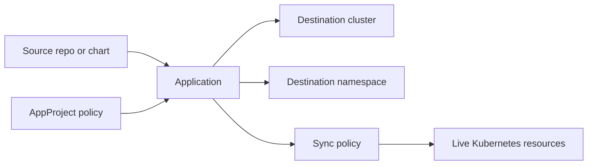
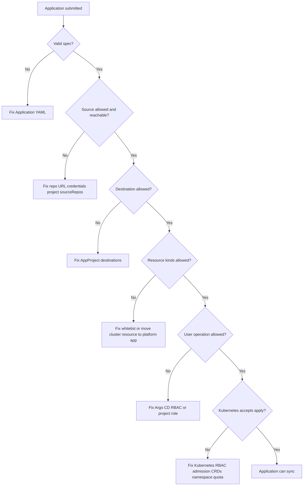

# 03 - Applications, Projects, and Deployment Boundaries

## Why This Chapter Matters

The Argo CD `Application` is where GitOps becomes concrete. It says:

```text
take this desired state from this source and reconcile it into this destination under this project boundary
```

The `AppProject` is where GitOps becomes safe enough for teams. It says:

```text
these applications may use these repositories, deploy to these destinations, and create these resource kinds
```

If you understand Applications but ignore Projects, you can deploy. If you understand both, you can build a platform that multiple teams can use without every application having unlimited blast radius.

Cause -> Mechanism -> Immediate Result -> Long-Term Impact -> Next Connected Topic:

```text
many teams need to deploy through one Argo CD
-> Applications define source-to-destination reconciliation
-> AppProjects restrict repositories, clusters, namespaces, resource kinds, and roles
-> platform teams get safe delegation instead of all-or-nothing admin access
-> RBAC, sync policy, app-of-apps, ApplicationSet, and multi-cluster governance
```

Official source baseline:

- Argo CD Projects: <https://argo-cd.readthedocs.io/en/stable/user-guide/projects/>
- Argo CD Application specification: <https://argo-cd.readthedocs.io/en/stable/user-guide/application-specification/>
- Argo CD declarative setup: <https://argo-cd.readthedocs.io/en/stable/operator-manual/declarative-setup/>
- Argo CD RBAC: <https://argo-cd.readthedocs.io/en/stable/operator-manual/rbac/>

Version assumption: checked on 2026-05-27. AppProject policy features, application namespace behavior, RBAC inheritance, resource tracking, and project-scoped repository/cluster configuration can vary by Argo CD release and installation settings. Verify against the exact Argo CD version before designing multi-tenant controls.

## The Big Picture

An Argo CD Application has four essential boundaries:

```text
source -> project -> destination -> sync policy
```



An AppProject has four essential safety questions:

```text
Which sources are trusted?
Which destinations are allowed?
Which resource kinds are allowed or denied?
Which users or groups can operate apps in this project?
```

The default project exists for convenience. Official Argo CD documentation describes it as automatically created and initially permissive. That is useful for first demos and dangerous as a long-term multi-team default.

## First-Principles Explanation

### Why an Application Exists

Kubernetes has Deployments, Services, ConfigMaps, Secrets, Ingresses, Jobs, and many custom resources. A real product release may need several of these at once.

The Argo CD Application groups those resources around an operational intent:

```text
"This set of rendered manifests from this source path should exist in this cluster and namespace."
```

Without that grouping, Argo CD would only see random Kubernetes objects. With the grouping, it can answer:

- Which Git path controls this workload?
- Which revision is live?
- Which resources are part of the app?
- Is the app synced?
- Is it healthy?
- Should extra resources be pruned?
- Who may sync it?

### Why an AppProject Exists

If every Application can deploy from any repo to any cluster and create any resource kind, then Argo CD becomes a cluster-admin portal.

An AppProject narrows the allowed space.

Cause -> Mechanism -> Result:

```text
shared Argo CD instance has multiple teams
-> one team's app should not deploy from another team's repo or into another team's namespace
-> AppProject restricts source repos, destinations, resource kinds, and roles
-> teams get autonomy within defined boundaries
```

This is the difference between "Argo CD is installed" and "Argo CD is platform-ready."

## Core Vocabulary

| Term | Meaning | Why it matters |
| --- | --- | --- |
| `Application` | Argo CD custom resource defining source, destination, project, and sync behavior. | Main GitOps deployment unit. |
| `AppProject` | Argo CD custom resource defining app grouping and policy boundaries. | Main multi-team safety boundary. |
| Source repo | Git, Helm, or supported source containing desired state. | Controls what can be deployed. |
| Target revision | Branch, tag, commit, chart version, or source revision. | Controls which desired state is rendered. |
| Source path | Path inside repository for manifests or Kustomize app. | Controls app scope. |
| Destination server | Kubernetes API endpoint or registered cluster. | Controls where resources are applied. |
| Destination namespace | Namespace for namespaced resources when not explicitly set. | Important for tenant isolation. |
| Cluster resource | Kubernetes resource not limited to a namespace, such as CRD or ClusterRole. | High blast radius; should be restricted. |
| Namespace resource | Resource scoped to one namespace, such as Deployment or Service. | Easier to delegate safely. |
| Project role | AppProject-scoped Argo CD role. | Lets teams operate project apps without global admin. |

## Mental Model

Think of Application as a train route and AppProject as the railway rules.

Application:

```text
source station -> destination station -> schedule/policy
```

AppProject:

```text
which sources are allowed
which destinations are allowed
which cargo is allowed
who may operate the train
```

Bad platform design lets every train go everywhere with anything.

Good platform design gives each team controlled freedom:

```text
team repo -> team namespaces -> allowed resource kinds -> team roles
```

## Historical / Evolution / Causal Chain

### Single-Team Demo Phase

Most people first use Argo CD with one cluster and one app:

```text
default project
-> one Git repo
-> one namespace
-> one Application
```

This is fine for learning.

### Multi-Team Reality

Then the platform grows:

```text
more teams
-> more repositories
-> more namespaces
-> shared clusters
-> more sensitive cluster-scoped resources
-> need for boundaries
```

Without Projects:

```text
developer creates app
-> app can point to broad repo or wrong cluster
-> sync can create resources outside intended ownership
-> platform team loses control of blast radius
```

With Projects:

```text
platform team defines project
-> app must fit allowed source/destination/resource policy
-> team can deploy within limits
-> multi-tenant Argo CD becomes manageable
```

## Architecture or Conceptual Structure

### Application Anatomy

Example:

```yaml
apiVersion: argoproj.io/v1alpha1
kind: Application
metadata:
  name: payments-prod
  namespace: argocd
  finalizers:
    - resources-finalizer.argocd.argoproj.io
spec:
  project: payments
  source:
    repoURL: https://github.com/example/platform-config.git
    targetRevision: main
    path: apps/payments/overlays/prod
  destination:
    server: https://kubernetes.default.svc
    namespace: payments
  syncPolicy:
    automated:
      prune: false
      selfHeal: true
    syncOptions:
      - CreateNamespace=true
```

Important fields:

| Field | What it controls | Why it matters |
| --- | --- | --- |
| `metadata.name` | Argo CD Application identity. | Used in UI, CLI, RBAC policy, audit, and resource tracking. |
| `metadata.namespace` | Where the Application CR lives. | Argo CD must watch this namespace. |
| `metadata.finalizers` | Whether deleting the Application cascades to app resources. | Dangerous if misunderstood during deletion. |
| `spec.project` | AppProject boundary. | Determines allowed source, destination, kinds, and project roles. |
| `spec.source.repoURL` | Desired-state source. | Must be trusted and permitted by project. |
| `spec.source.targetRevision` | Revision to render. | Floating branch vs pinned commit/tag changes reproducibility. |
| `spec.source.path` | Directory to render. | Too broad a path increases blast radius. |
| `spec.destination.server` | Target cluster. | Wrong value can deploy to wrong cluster. |
| `spec.destination.namespace` | Target namespace for namespaced resources. | Does not remove need to inspect explicit namespaces in manifests. |
| `syncPolicy` | Manual or automated reconciliation behavior. | Defines how aggressively Argo CD enforces Git. |

### AppProject Anatomy

Example:

```yaml
apiVersion: argoproj.io/v1alpha1
kind: AppProject
metadata:
  name: payments
  namespace: argocd
spec:
  description: Payments team workloads
  sourceRepos:
    - https://github.com/example/platform-config.git
  destinations:
    - server: https://kubernetes.default.svc
      namespace: payments
    - server: https://kubernetes.default.svc
      namespace: payments-preview
  clusterResourceWhitelist:
    - group: ""
      kind: Namespace
  namespaceResourceWhitelist:
    - group: apps
      kind: Deployment
    - group: ""
      kind: Service
    - group: ""
      kind: ConfigMap
    - group: networking.k8s.io
      kind: Ingress
  roles:
    - name: deployer
      description: Payments deployment access
      policies:
        - p, proj:payments:deployer, applications, sync, payments/*, allow
        - p, proj:payments:deployer, applications, get, payments/*, allow
      groups:
        - payments-platform
```

Important fields:

| Field | What it controls | Trap |
| --- | --- | --- |
| `sourceRepos` | Repositories apps in this project may use. | `*` trusts every repo. |
| `destinations` | Clusters/namespaces apps may target. | `*` for both cluster and namespace is broad. |
| `clusterResourceWhitelist` | Allowed cluster-scoped resources. | ClusterRole/CRD/Namespace can affect many teams. |
| `namespaceResourceWhitelist` | Allowed namespaced resource kinds. | Too narrow blocks valid apps; too broad permits risky objects. |
| `roles` | Project-scoped Argo CD permissions. | Does not replace Kubernetes RBAC everywhere. |

## Step-by-Step Explanation

### Step 1: Define Ownership

Before YAML, answer:

- Which team owns this application?
- Which repository is trusted?
- Which environments does it deploy to?
- Which namespaces are allowed?
- Does it need cluster-scoped resources?
- Who may sync, rollback, or delete?

If you cannot answer these, do not start with the default project and broad permissions.

### Step 2: Create the AppProject

Use the narrowest reasonable policy first.

```bash
kubectl apply -n argocd -f payments-project.yaml
```

Purpose: create the project boundary declaratively.

Expected result:

```text
appproject.argoproj.io/payments created
```

Bad output:

- CRD not found: Argo CD CRDs are not installed.
- forbidden: you lack permission to create AppProjects.
- invalid spec: source/destination/resource fields are malformed.

### Step 3: Create the Application

```bash
kubectl apply -n argocd -f payments-prod-application.yaml
```

Purpose: create the GitOps reconciliation unit.

Expected result:

```text
application.argoproj.io/payments-prod created
```

Then inspect:

```bash
argocd app get payments-prod
```

### Step 4: Confirm Project Enforcement

Try to reason through what should happen:

```text
Application repo is not in sourceRepos -> reject or invalid project configuration
Application destination namespace is not allowed -> app cannot deploy there
Application creates denied resource kind -> sync fails
User lacks project role -> operation denied
```

This is how Projects become safety controls instead of paperwork.

## Internal Mechanics

### Application Validation Has Multiple Gates

An Application must satisfy:

1. Its own spec must be valid.
2. Its source must be reachable and renderable.
3. Its project must allow the source.
4. Its project must allow the destination.
5. Its project must allow resource kinds.
6. Argo CD RBAC must allow the user operation.
7. Kubernetes RBAC/admission must allow the actual apply.

Failure at any gate can look like "Argo CD does not deploy," but the fix depends on the gate.



### Project RBAC and Kubernetes RBAC Are Different

Argo CD RBAC decides what a user can do through Argo CD.

Kubernetes RBAC decides what Argo CD's service account or destination credential can do to the cluster.

Example:

```text
user has Argo CD permission to sync
-> sync request is accepted
-> Argo CD tries to create ClusterRole
-> Kubernetes RBAC denies Argo CD credential
-> sync fails
```

Both layers matter.

### Finalizers Affect Deletion

Application finalizers can make deleting an Application also delete its managed resources.

This is useful when decommissioning an app intentionally. It is dangerous if someone thinks deleting the Application only removes Argo CD tracking.

Analysis question before deletion:

```text
Do I want to stop Argo CD from managing these resources, or do I want to delete the resources themselves?
```

Those are different operations.

## Practical Examples

### List Applications

```bash
argocd app list
```

Purpose: show Applications known to Argo CD.

Look for:

- project
- sync status
- health status
- destination
- repo
- revision

Bad clues:

- app in `default` when it should have a team project
- destination namespace not matching environment
- repo URL from an unexpected source
- repeated `OutOfSync` or `Unknown`

### Get Project Details

```bash
argocd proj get payments
```

Purpose: inspect project source/destination/kind/role boundaries.

Expected useful fields:

- allowed source repositories
- allowed destinations
- cluster resource allow/deny rules
- namespace resource allow/deny rules
- roles

Bad clues:

- `*` for source repos
- `*` for destinations
- broad cluster resource allow lists
- no project roles in a multi-team environment

### Move an Application to a Project

```bash
argocd app set payments-prod --project payments
```

Purpose: assign an Application to a project.

Expected result: the Application uses the `payments` AppProject.

Danger: the app may stop syncing if its current source, destination, or resource kinds are not allowed by the new project. That is not a bug; it is the boundary doing its job.

### Direct Kubernetes Inspection

```bash
kubectl get applications.argoproj.io -n argocd
kubectl get appprojects.argoproj.io -n argocd
kubectl describe appproject -n argocd payments
```

Purpose: inspect Argo CD objects through Kubernetes.

Use this when:

- CLI access is broken
- you need raw CR status
- GitOps bootstrapping is being debugged

## Small Details That Matter Later

- The default project is convenient and initially permissive. Treat it as a learning tool or tightly lock it down for production.
- Every Application belongs to exactly one project. If unspecified, it uses `default`.
- `sourceRepos: ["*"]` means any repository. That can turn repository compromise into cluster compromise.
- `destinations: ["*"]` style broad destination policy can allow accidental cross-environment deployment.
- Cluster-scoped resources deserve separate review. CRDs, ClusterRoles, Namespaces, and admission objects can affect unrelated teams.
- `destination.namespace` is not a universal namespace rewrite. Explicit namespaces and tool behavior still matter.
- Application finalizers determine whether deletion cascades to managed resources. Read them before deleting.
- Project roles control Argo CD actions, not every Kubernetes permission underneath.
- An Application can be valid but unsyncable because the AppProject forbids its source, destination, or resource kind.
- Repository and cluster credentials may be stored as Kubernetes Secrets. Their scope and labels matter in declarative setup.
- App-of-apps lets one Application manage other Application manifests. That is powerful but can hide a large blast radius behind one parent app.
- ApplicationSet is usually better than hand-copying many similar Application YAMLs, but it adds generator/template failure modes.
- Names matter. Application and project names become incident, audit, and RBAC language.

## Common Misunderstandings

### Misunderstanding 1: "An AppProject is just a folder."

No. It is a policy boundary. It restricts what apps can deploy, where they can deploy, and what kinds they can create.

### Misunderstanding 2: "The default project is fine for production."

It can be modified and locked down, but its initial posture is broad. A serious platform should define project boundaries deliberately.

### Misunderstanding 3: "If a user can sync in Argo CD, Kubernetes will allow it."

Argo CD permission and Kubernetes permission are separate. A sync can be authorized by Argo CD and still fail at the Kubernetes API.

### Misunderstanding 4: "Deleting an Application always leaves workloads alone."

Not if a resource finalizer causes cascading deletion. Always inspect finalizers and deletion policy before deleting.

## Failure Modes / Mistakes / Traps

### Trap 1: Application Path Too Broad

Bad pattern:

```yaml
source:
  path: clusters/prod
```

when the path contains unrelated teams and platform resources.

Failure chain:

```text
broad path
-> Application tracks many unrelated objects
-> prune or sync failure affects more than intended
-> incident blast radius expands
```

### Trap 2: Wildcard Project Policy

Bad pattern:

```yaml
sourceRepos:
  - '*'
destinations:
  - server: '*'
    namespace: '*'
```

This may be acceptable only in a controlled admin-only project. It is not a good team boundary.

### Trap 3: Team App Creates Platform Resources

If a team app can create ClusterRoles, CRDs, MutatingWebhookConfigurations, or Namespaces freely, it can affect more than its namespace.

Better:

- platform project manages cluster-scoped resources
- team projects manage namespaced workloads
- exceptions are explicit and reviewed

### Trap 4: App-of-Apps Without Ownership Discipline

App-of-apps pattern:

```text
parent Application deploys child Application manifests
```

Useful for bootstrapping and grouping. Risky when one parent app controls too many unrelated children or when child projects are too permissive.

## Debugging / Analysis / Answer-Writing Method

When an Application does not deploy, ask in this order:

1. Does the Application exist in a namespace Argo CD watches?
2. Is `spec.project` correct?
3. Does the AppProject allow the source repository?
4. Does the AppProject allow the destination cluster and namespace?
5. Does the AppProject allow the resource kinds?
6. Does the user have Argo CD permission for the operation?
7. Does Argo CD have Kubernetes permission to apply the resources?
8. Are source manifests renderable?
9. Are Kubernetes resources valid for the cluster?

Command chain:

```bash
argocd app get payments-prod
argocd proj get payments
argocd app diff payments-prod
kubectl describe application -n argocd payments-prod
kubectl describe appproject -n argocd payments
kubectl get events -n payments --sort-by=.lastTimestamp
```

## Real-World or Exam Relevance

Interview question:

```text
"How would you let multiple teams use one Argo CD safely?"
```

Weak answer:

```text
"Give each team an Application."
```

Strong answer:

```text
"Create AppProjects per team or ownership boundary. Restrict each project to trusted repos, approved destination clusters/namespaces, and allowed resource kinds. Use project roles and Argo CD RBAC for user operations, and Kubernetes RBAC for what Argo CD can apply. Keep cluster-scoped resources in platform-owned projects. Avoid leaving production apps in the default permissive project."
```

## Connected Topics

- [GitOps Foundations and Reconciliation](01%20-%20GitOps%20Foundations%20and%20Reconciliation.md)
- [Argo CD Architecture and Control Loops](02%20-%20Argo%20CD%20Architecture%20and%20Control%20Loops.md)
- Sync policy, prune, and self-heal.
- Argo CD RBAC and SSO.
- Kubernetes RBAC and admission policy.
- ApplicationSet fleet deployment.
- App-of-apps bootstrapping.
- Multi-cluster platform architecture.

## Chapter Summary

The Application tells Argo CD what to reconcile. The AppProject tells Argo CD what is allowed.

The safe platform pattern is:

```text
trusted source repos
-> narrow project boundaries
-> explicit destinations
-> controlled resource kinds
-> project roles and RBAC
-> Kubernetes permissions aligned underneath
```

If a team says "Argo CD is dangerous," they are often reacting to Argo CD without good project boundaries. The tool enforces the boundaries you define. If you define none, the blast radius is your design decision.

## Questions to Test Understanding

1. What is the main purpose of an Argo CD Application?
2. What is the main purpose of an AppProject?
3. Why is the default project risky in a multi-team setup?
4. What is the difference between Argo CD RBAC and Kubernetes RBAC?
5. Why are cluster-scoped resources more sensitive than namespaced resources?
6. What can go wrong when an Application source path is too broad?
7. Why can moving an Application to a stricter project make it stop syncing?
8. What should you check before deleting an Application?
9. Why is `sourceRepos: ["*"]` risky?
10. How would you safely structure Argo CD for several teams sharing one cluster?

## Answers and Reasoning

1. It defines the GitOps reconciliation unit: source, revision, path, destination, project, and sync policy.
2. It defines policy boundaries for a group of Applications: allowed sources, destinations, resource kinds, and project roles.
3. It is initially broad and permissive, which can allow apps to deploy from many sources to many destinations unless locked down.
4. Argo CD RBAC controls what users can do through Argo CD. Kubernetes RBAC controls what Argo CD credentials can do to Kubernetes resources.
5. Cluster-scoped resources can affect many namespaces and teams, so mistakes have wider blast radius.
6. Argo CD may track and prune unrelated resources, making a small Git change or sync operation affect too much.
7. The stricter project may reject the app's repo, destination, or resource kinds. That means the project boundary is working.
8. Check finalizers and decide whether you want to stop managing resources or delete the resources themselves.
9. It trusts any repository as desired state, so a wrong or compromised repo can become a deployment source.
10. Create team AppProjects with narrow source repos, namespaces, resource allow lists, project roles, and Kubernetes RBAC aligned to those boundaries; reserve cluster-scoped resources for platform projects.

