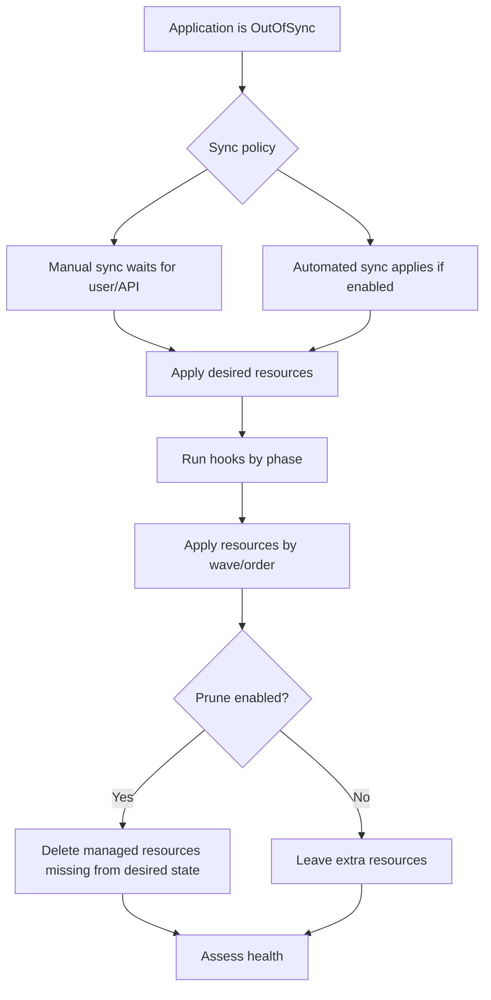
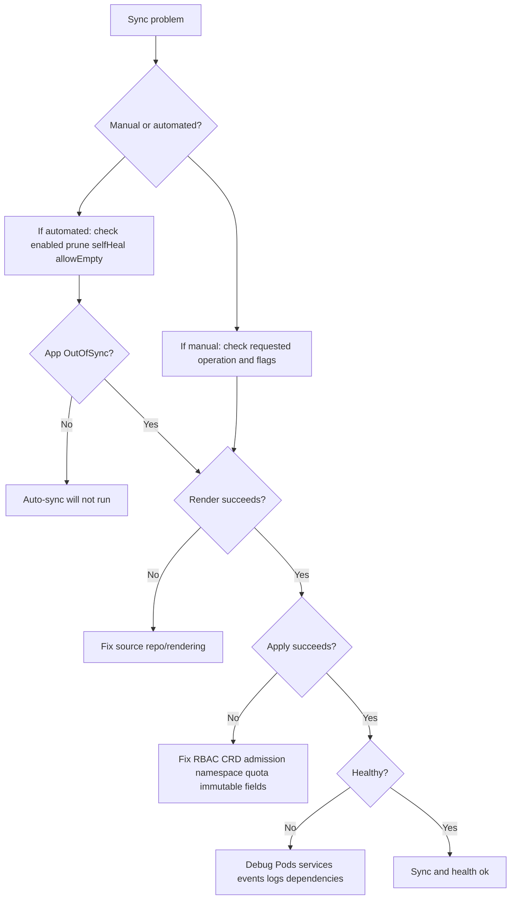

# 04 - Sync, Drift, Rollback, Waves, and Hooks

## Why This Chapter Matters

Argo CD's most dangerous settings are also its most useful settings.

Manual sync gives humans control. Automated sync gives fast convergence. Prune removes abandoned resources. Self-heal reverses cluster drift. Hooks and waves control order. Rollback recovers prior desired state. Each feature solves a real problem, but each feature can also create outages when used without ownership boundaries and release discipline.

Cause -> Mechanism -> Immediate Result -> Long-Term Impact -> Next Connected Topic:

```text
clusters drift and deployments need order
-> Argo CD provides sync, prune, self-heal, hooks, waves, and rollback
-> teams can reconcile Git to Kubernetes deliberately or automatically
-> release operations become repeatable but stronger enforcement increases blast radius
-> troubleshooting, progressive delivery, database migration safety, and production governance
```

Official source baseline:

- Automated sync policy: <https://argo-cd.readthedocs.io/en/stable/user-guide/auto_sync/>
- Sync phases and waves: <https://argo-cd.readthedocs.io/en/latest/user-guide/sync-waves/>
- Sync options: <https://argo-cd.readthedocs.io/en/stable/user-guide/sync-options/>
- Application deletion: <https://argo-cd.readthedocs.io/en/stable/user-guide/app_deletion/>

Version assumption: checked on 2026-05-27. Sync options, hook phases, wave ordering, default reconciliation timeout, retry semantics, and ApplicationSet managed-application behavior can vary by Argo CD release. Verify with the docs for the deployed version.

## The Big Picture

Argo CD sync is not one behavior. It is a family of behaviors:

| Behavior | What it does | Main risk |
| --- | --- | --- |
| Manual sync | Human/API-triggered apply of desired state. | Humans forget, sync wrong app, or skip diff review. |
| Automated sync | Argo CD syncs when it detects OutOfSync state. | Bad Git commit becomes live quickly. |
| Prune | Deletes tracked live resources absent from desired state. | Wrong scope or bad commit deletes resources. |
| Self-heal | Corrects live manual drift back to Git. | Emergency manual fixes get reverted. |
| Allow empty | Allows app desired state to contain zero resources with prune. | Empty repo/path can delete everything in app scope. |
| Hooks | Run resources at sync phases. | Non-idempotent hooks can break releases. |
| Waves | Order resources inside phases. | People mistake waves for full dependency management. |
| Rollback | Return app to a previous deployed revision. | Not safe for irreversible data/schema changes. |



## First-Principles Explanation

### What Sync Actually Means

Sync means:

```text
apply the desired Kubernetes manifests rendered from source to the destination cluster
```

It does not mean:

- the app is healthy
- the release is safe
- the database schema is compatible
- the new image is correct
- downstream consumers are ready

Sync is a configuration operation. Health and business correctness are separate.

### Why Drift Happens

Drift is a difference between desired state and live state.

Common drift causes:

- manual `kubectl edit` or `kubectl patch`
- HPA changing replica counts
- admission webhooks mutating objects
- controllers adding fields
- emergency hotfixes
- changes applied by another tool
- Git changes not yet synced
- failed or partial syncs

Drift is not always bad. Some live changes are expected controller behavior. The skill is knowing which differences are meaningful.

### Why Automated Sync Exists

Manual sync has a human bottleneck:

```text
Git change merged
-> app is OutOfSync
-> someone must click or run sync
-> deployment waits
```

Automated sync removes that wait:

```text
Git change merged
-> Argo CD detects OutOfSync
-> Argo CD syncs according to policy
-> cluster converges without CI holding cluster credentials
```

The tradeoff is obvious: if Git receives a bad desired state, automation can deploy it quickly.

## Core Vocabulary

| Term | Meaning | Why it matters |
| --- | --- | --- |
| Sync operation | Argo CD operation that applies desired state. | Main deployment action. |
| OutOfSync | Desired and live state differ. | Automated sync only acts when this condition is present. |
| Automated sync | Argo CD syncs without manual operation when conditions match. | Faster convergence, higher need for Git discipline. |
| Prune | Delete live resources missing from desired state. | Turns Git removal into Kubernetes deletion. |
| Self-heal | Re-sync when live cluster changes away from Git. | Enforces Git against manual edits. |
| Allow empty | Allows an automated prune sync when desired resources are empty. | Must be used cautiously. |
| Hook | Kubernetes resource annotated to run during a sync phase. | Used for migrations, checks, notifications, cleanup. |
| Wave | Numeric ordering annotation for sync resources. | Useful for CRDs, namespaces, dependencies. |
| Rollback | Sync to a previous deployed revision. | Not equivalent to data rollback. |

## Mental Model

Use this rule:

```text
sync makes live state match desired state
prune removes things no longer desired
self-heal removes live drift
hooks do side work
waves order work
rollback changes desired revision
```

The question is never "should auto-sync be on?" in isolation.

The question is:

```text
Is the desired state trustworthy enough, scoped enough, and reversible enough for Argo CD to enforce it automatically?
```

## Historical / Evolution / Causal Chain

### Manual Deployments

```text
human applies change
-> deployment is slow and inconsistent
-> drift is easy
-> audit depends on human notes
```

### CI Push Deployments

```text
CI applies manifests
-> repeatability improves
-> CI needs cluster access
-> post-deploy drift is still not continuously reconciled
```

### GitOps Manual Sync

```text
Git stores desired state
-> Argo CD shows OutOfSync
-> human syncs after review
-> audit improves but deployment still has manual gate
```

### GitOps Automated Sync

```text
Git stores desired state
-> Argo CD detects drift
-> controller syncs automatically
-> fast convergence but Git mistakes become operational mistakes
```

## Architecture or Conceptual Structure

### Manual Sync

Manual sync is best when:

- production requires explicit operator approval
- database migrations need coordinated timing
- dependencies are fragile
- a change is high blast radius
- teams are still building confidence

Command:

```bash
argocd app sync payments-prod
```

Safe pattern:

```bash
argocd app get payments-prod --refresh
argocd app diff payments-prod
argocd app sync payments-prod
argocd app wait payments-prod --health --sync
```

### Automated Sync

Enable with CLI:

```bash
argocd app set payments-prod --sync-policy automated
```

Declarative form:

```yaml
spec:
  syncPolicy:
    automated: {}
```

Newer Argo CD docs also describe explicit `enabled`:

```yaml
spec:
  syncPolicy:
    automated:
      enabled: true
```

Important detail: the docs state that setting `enabled` to false disables automated sync even if `prune`, `selfHeal`, or `allowEmpty` are set. A null enabled value is treated as enabled.

### Automatic Pruning

CLI:

```bash
argocd app set payments-prod --auto-prune
```

Declarative:

```yaml
spec:
  syncPolicy:
    automated:
      prune: true
```

Meaning:

```text
if a tracked live resource is no longer in desired state, Argo CD may delete it during automated sync
```

Official docs call out that automated sync does not prune by default as a safety mechanism.

### Allow Empty

Declarative:

```yaml
spec:
  syncPolicy:
    automated:
      prune: true
      allowEmpty: true
```

Meaning:

```text
an application with zero desired resources may still sync and prune
```

This is dangerous if an empty render is accidental.

Failure chain:

```text
wrong repo path or broken generator renders zero resources
-> allowEmpty permits empty desired state
-> prune deletes app resources
-> outage
```

### Automatic Self-Healing

CLI:

```bash
argocd app set payments-prod --self-heal
```

Declarative:

```yaml
spec:
  syncPolicy:
    automated:
      selfHeal: true
```

Meaning:

```text
if live cluster state drifts from Git, Argo CD can re-sync to restore Git state
```

Use it when Git is mature and emergency-change process is clear.

Avoid or gate it when operators still rely on manual cluster changes during incidents.

### Hooks and Phases

Hooks are Kubernetes resources annotated for sync phases.

Example:

```yaml
apiVersion: batch/v1
kind: Job
metadata:
  name: payments-db-migrate
  annotations:
    argocd.argoproj.io/hook: PreSync
spec:
  template:
    spec:
      restartPolicy: Never
      containers:
        - name: migrate
          image: example/payments-migrator:1.8.4
          command: ["./migrate"]
```

Common hook phases include:

- `PreSync`: run before main sync resources.
- `Sync`: run during sync.
- `PostSync`: run after successful sync.
- `SyncFail`: run when sync fails.
- `PostDelete`: runs during Application deletion in versions that support it.

Version-sensitive note: verify exact hook types and semantics against your Argo CD version.

### Sync Waves

Sync waves order resources by annotation:

```yaml
metadata:
  annotations:
    argocd.argoproj.io/sync-wave: "5"
```

Default wave is usually `0`. Lower numbers run earlier.

Useful wave pattern:

```text
wave -2: namespaces
wave -1: CRDs and platform prerequisites
wave 0: service accounts, config, secrets, services
wave 1: deployments and statefulsets
wave 2: ingress, smoke-test jobs, post-sync checks
```

Do not overuse waves. If an app needs complex orchestration, investigate whether the deployment architecture is too tightly coupled.

## Step-by-Step Explanation

### Step 1: Decide Manual vs Automated

Ask:

- How mature is Git review?
- Are manifests generated deterministically?
- Is image tagging immutable?
- Are database migrations backward compatible?
- Is app scope narrow?
- Is rollback understood?
- Are alerts and health checks reliable?

If these are weak, start manual.

### Step 2: Decide Prune

Ask:

- Should removing YAML from Git delete live resources?
- Is the Application path narrow?
- Are finalizers understood?
- Are cluster-scoped resources separated?
- Can accidental empty renders happen?

If app scope is not precise, do not enable auto-prune casually.

### Step 3: Decide Self-Heal

Ask:

- Are manual emergency changes allowed?
- If allowed, how are they recorded back to Git?
- Will HPA/admission/controller changes create noisy drift?
- Do ignore differences need to be configured precisely?

Self-heal is excellent when Git is truly authoritative. It is frustrating when the team still treats the cluster as editable source of truth.

### Step 4: Decide Hooks and Waves

Use hooks/waves for ordering that Kubernetes itself does not solve.

Good uses:

- CRDs before custom resources
- namespace before namespaced resources
- database migration before deployment
- smoke test after deployment

Bad uses:

- trying to encode a fragile distributed startup sequence
- non-idempotent database changes without rollback plan
- using hooks as a general workflow engine

## Internal Mechanics

### Automated Sync Semantics That Matter

Current official docs describe several important behaviors:

- automated sync runs only when an application is `OutOfSync`
- apps in `Synced` or error state do not attempt automated sync
- automated sync generally attempts one sync per unique commit SHA and application parameters
- with `selfHeal`, re-sync can be attempted after the self-heal timeout
- automatic sync will not keep retrying a failed sync for the same commit/parameters in the same way unless conditions change
- rollback cannot be performed against an app while automated sync is enabled
- reconciliation interval is controlled by `timeout.reconciliation` in `argocd-cm`, with documented defaults and jitter that must be checked for the deployed version

Why this matters:

```text
"auto-sync is enabled" does not mean "Argo CD retries forever every second."
```

### Prune Is Ownership-Dependent

Prune is only safe when Argo CD has clear ownership.

If resource tracking is wrong, labels are stripped, or app boundaries are broad, prune can surprise you.

Prune is not "delete all resources in a namespace." It deletes resources Argo CD sees as managed by the app and no longer desired. Understanding tracking is essential.

### Hooks Must Be Idempotent

A hook might run more than once after retries, failures, or operator actions. If a hook sends email, mutates data, or runs migrations, design it to be safe under repeat attempts.

Good migration hook:

```text
checks current schema version
-> applies only missing migrations
-> can be retried safely
```

Bad migration hook:

```text
blindly runs destructive SQL
-> second run fails or corrupts state
```

## Practical Examples

### Safe Manual Production Sync

```bash
argocd app get payments-prod --refresh
argocd app diff payments-prod
argocd app sync payments-prod
argocd app wait payments-prod --sync --health --timeout 600
```

Purpose:

- refresh status
- review diff
- apply desired state
- wait for sync and health

Bad output:

- diff shows unexpected deletion
- sync fails with RBAC or validation errors
- app syncs but health stays degraded

### Enable Automated Sync Without Prune

```bash
argocd app set payments-dev --sync-policy automated
```

Use case: lower environment where Git changes should deploy automatically, but removed manifests should not yet delete live resources.

### Enable Automated Sync With Prune and Self-Heal

```bash
argocd app set payments-dev --sync-policy automated --auto-prune --self-heal
```

Use case: mature lower environment or tightly controlled app where Git should be enforced.

Before using in production, confirm:

- app scope is narrow
- production branch is protected
- image references are immutable
- deletion process is reviewed
- alerts exist
- rollback and migration plans exist

### Hook With Sync Wave

```yaml
apiVersion: batch/v1
kind: Job
metadata:
  name: smoke-test
  annotations:
    argocd.argoproj.io/hook: PostSync
    argocd.argoproj.io/sync-wave: "10"
spec:
  template:
    spec:
      restartPolicy: Never
      containers:
        - name: smoke
          image: curlimages/curl:8.7.1
          command: ["sh", "-c", "curl -fsS http://payments/healthz"]
```

Purpose: run a post-sync smoke test after app resources are applied.

Risk: this only checks what the command checks. A trivial health endpoint does not prove business correctness.

## Small Details That Matter Later

- Automated sync is triggered by `OutOfSync`, not by human hope that a deployment should happen.
- Auto-prune is disabled by default as a safety mechanism.
- `allowEmpty` is dangerous unless empty desired state is a valid operational state.
- Self-heal can undo emergency manual changes quickly.
- Rollback is blocked while automated sync is enabled; disable automated sync before rollback if required by your version and workflow.
- Sync waves operate inside a sync operation. They are not a universal cross-application dependency graph.
- Hook resources should be idempotent and observable.
- Database migrations need application compatibility design, not only a `PreSync` hook.
- Prune is deletion. Treat it as a production change.
- `argocd app wait --health` waits on Argo CD health, not every business SLO.
- Mutable image tags make rollback and audit weaker.
- HPA, admission webhooks, and operators can create expected live differences. Configure ignore rules narrowly.
- ApplicationSet-managed apps may need ApplicationSet-level changes to toggle auto-sync; directly editing generated Applications may be overwritten or ineffective depending on setup.

## Common Misunderstandings

### Misunderstanding 1: "Automated sync means fully safe deployment."

Automated sync only automates applying desired state. It does not prove the desired state is correct.

### Misunderstanding 2: "Prune just cleans unused resources."

Prune deletes resources missing from desired state. If desired state is accidentally empty or scoped wrong, prune can delete live production resources.

### Misunderstanding 3: "Self-heal protects against bad releases."

Self-heal protects Git state from live drift. If Git is bad, self-heal enforces bad state.

### Misunderstanding 4: "Hooks solve deployment ordering."

Hooks and waves help with ordering. They do not solve distributed system compatibility, data migration safety, or service dependency design.

## Failure Modes / Mistakes / Traps

### Trap 1: Auto-Prune on a Broad App

```text
broad source path
-> Git change removes directory
-> auto-prune sees resources absent
-> deletes unrelated resources
```

Mitigation: narrow Applications, separate platform/team resources, review deletion diffs.

### Trap 2: Non-Idempotent Migration Hook

```text
PreSync migration runs
-> Deployment fails later
-> operator retries sync
-> migration runs again
-> schema/data damage
```

Mitigation: versioned migrations, backward-compatible releases, retry-safe migration tools.

### Trap 3: Self-Heal Fights Incident Response

```text
incident occurs
-> engineer manually patches replicas or config
-> self-heal reverts it
-> outage continues or confusion increases
```

Mitigation: document emergency process; commit hotfix to Git or pause/disable auto-sync deliberately with audit.

### Trap 4: Rollback Ignores Data Reality

```text
Git rollback restores old Deployment
-> database schema remains new
-> old app cannot read/write
-> rollback fails
```

Mitigation: expand/contract migrations, compatibility windows, data rollback plans.

## Debugging / Analysis / Answer-Writing Method

Sync problem method:



Answer-writing framework:

```text
define sync
-> explain manual vs automated
-> explain prune and self-heal
-> mention hooks/waves for ordering
-> warn about deletion, emergency edits, mutable images, and migrations
-> give debugging chain: diff, render, apply, health
```

## Real-World or Exam Relevance

Interviewers often ask:

```text
"Would you enable auto-sync with prune and self-heal in production?"
```

Strong answer:

```text
"Only after validating Git review, app scope, immutable artifacts, monitoring, deletion review, and rollback/migration strategy. Auto-sync enforces Git quickly. Prune turns Git removal into deletion. Self-heal reverts manual drift. Those are excellent when boundaries are correct and dangerous when the desired state source is weak."
```

## Connected Topics

- [Applications Projects and Deployment Boundaries](03%20-%20Applications%20Projects%20and%20Deployment%20Boundaries.md)
- AppProject source/destination/resource controls.
- Kubernetes admission webhooks and defaulting.
- Helm and Kustomize render behavior.
- Progressive delivery with Argo Rollouts.
- Database migration patterns.
- Incident response and emergency-change policy.

## Chapter Summary

Sync is Argo CD's apply operation. Automated sync, prune, self-heal, hooks, waves, and rollback are controls around that operation.

The core safety rule:

```text
the stronger the automation, the stronger the desired-state discipline must be
```

Manual sync is slower but controlled. Auto-sync is faster but less forgiving. Prune is necessary for cleanup but dangerous under wrong scope. Self-heal is excellent for drift control but can surprise incident responders. Hooks and waves help with order but do not replace compatibility design.

## Questions to Test Understanding

1. What does sync mean in Argo CD?
2. Why does automated sync not remove resources by default?
3. What does `selfHeal` do?
4. Why is `allowEmpty` risky?
5. Why can rollback be unsafe even if Git rollback works?
6. What is a sync wave?
7. What is a `PreSync` hook useful for?
8. Why should hooks be idempotent?
9. Why can self-heal fight emergency manual changes?
10. What should you check before enabling auto-sync with prune in production?

## Answers and Reasoning

1. Sync applies rendered desired state from source to the destination Kubernetes cluster.
2. Because deletion is dangerous. Argo CD treats automated pruning as an explicit opt-in safety decision.
3. It automatically corrects live cluster drift back to Git-declared desired state.
4. If desired state accidentally renders empty and prune is enabled, Argo CD may delete all tracked resources for the app.
5. Git rollback does not undo database migrations, external side effects, or irreversible data changes.
6. A sync wave is numeric ordering for resources or hooks inside a sync operation.
7. It can run preparatory work such as a migration or prerequisite check before main resources sync.
8. Hooks may run more than once after retries or failures; non-idempotent hooks can corrupt data or produce duplicate side effects.
9. Manual patches create live drift; self-heal treats drift as something to correct.
10. Confirm narrow app scope, protected Git flow, immutable image references, deletion review, monitoring, rollback plan, migration compatibility, and emergency-change procedure.

