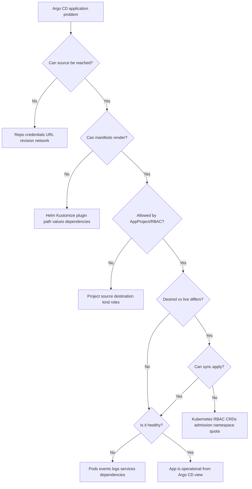

# 05 - Troubleshooting OutOfSync, Degraded, and Failed Syncs

## Why This Chapter Matters

Argo CD troubleshooting is hard when every problem is described as "sync failed."

That phrase hides several different failure classes:

- desired state could not be fetched
- manifests could not be rendered
- project policy rejected the app
- Kubernetes rejected the apply
- resources applied but stayed unhealthy
- live drift was expected but noisy
- the UI was stale while the controller was fine

The first duty of troubleshooting is classification. Once you know where the failure sits, the fix becomes much narrower.

Cause -> Mechanism -> Immediate Result -> Long-Term Impact -> Next Connected Topic:

```text
Argo CD spans Git, rendering, policy, Kubernetes API, and runtime health
-> one visible app status can hide many failure classes
-> classify by source, render, compare, policy, apply, health, and scale
-> incidents become diagnosable instead of random sync retries
-> production runbooks, platform SLOs, and release safety
```

Official source baseline:

- Architecture overview: <https://argo-cd.readthedocs.io/en/stable/operator-manual/architecture/>
- Automated sync policy: <https://argo-cd.readthedocs.io/en/stable/user-guide/auto_sync/>
- Sync phases and waves: <https://argo-cd.readthedocs.io/en/latest/user-guide/sync-waves/>
- High availability: <https://argo-cd.readthedocs.io/en/stable/operator-manual/high_availability/>
- RBAC: <https://argo-cd.readthedocs.io/en/stable/operator-manual/rbac/>

Version assumption: checked on 2026-05-27. Status names are stable enough for learning, but exact messages, CLI output, health behavior, diff customization, metrics, and controller flags vary by Argo CD release and installation.

## The Big Picture

Argo CD troubleshooting follows the reconciliation path:

```text
source -> render -> project/RBAC -> compare -> sync/apply -> health -> scale/cache
```



Do not start with "click sync again." Start by identifying the failed boundary.

## First-Principles Explanation

### Argo CD Has Two Main Status Dimensions

Sync status answers:

```text
Does live state match desired state?
```

Health status answers:

```text
Do the live resources appear operational according to Argo CD health checks?
```

That produces important combinations:

| Sync | Health | Meaning | First investigation |
| --- | --- | --- | --- |
| Synced | Healthy | Desired/live match and health looks good. | If users still fail, check traffic, dependencies, app metrics. |
| Synced | Degraded | Desired/live match, but runtime health is bad. | Pods, events, logs, readiness, dependencies. |
| OutOfSync | Healthy | Runtime may work, but config drift exists. | Diff desired vs live and decide sync/prune. |
| OutOfSync | Degraded | Both drift and runtime failure exist. | Diff first, then render/apply/runtime. |
| Unknown | Unknown | Argo CD cannot determine status reliably. | Controller, cluster access, health customization, CRDs. |

### Why Retrying Sync Is Often Wrong

Retrying helps if the failure was temporary:

- API server transient issue
- image registry delay
- webhook timeout
- temporary network failure

Retrying does not fix:

- wrong Git path
- invalid Helm values
- forbidden AppProject destination
- missing CRD
- immutable field change
- non-idempotent hook
- bad container image
- missing Secret

Retries without classification waste time and can worsen hooks or deletion behavior.

## Core Vocabulary

| Term | Meaning | Troubleshooting clue |
| --- | --- | --- |
| `OutOfSync` | Desired and live state differ. | Run diff, inspect expected vs unexpected drift. |
| `Degraded` | Resource health indicates failure. | Check runtime status, events, logs. |
| `Progressing` | Resource is changing but not complete. | Watch rollout, probes, dependencies, timeouts. |
| `Missing` | Desired resource is absent live. | Sync failed, prune/deletion occurred, namespace wrong. |
| `ComparisonError` | Argo CD could not compare desired and live state. | Source/render/repo-server issue. |
| `InvalidSpecError` | Application spec is invalid. | Fix Application fields or Project boundary. |
| `OperationError` | Sync operation failed. | Kubernetes apply/delete/hook problem. |
| `Unknown` | Health or status cannot be determined. | Custom resources, controller issues, permissions. |

## Mental Model

Every Argo CD problem belongs to one of seven buckets:

1. Source problem.
2. Render problem.
3. Project or Argo CD RBAC problem.
4. Diff or comparison problem.
5. Kubernetes apply/delete problem.
6. Runtime health problem.
7. Scale, cache, or controller problem.

Use that bucket before choosing a command.

## Historical / Evolution / Causal Chain

Before GitOps, troubleshooting deployment often meant reading CI logs and asking who last touched the cluster.

GitOps improves this:

```text
Git desired state
-> Argo CD application status
-> resource tree and diff
-> controller logs and Kubernetes events
-> faster path from symptom to boundary
```

But GitOps also adds layers:

```text
Git
-> render tool
-> Argo CD policy
-> Kubernetes API
-> runtime controllers
```

A good operator uses the layers. A poor operator treats the UI status as the whole truth.

## Architecture or Conceptual Structure

### Troubleshooting Map by Component

| Component | Symptoms | Useful commands |
| --- | --- | --- |
| Git/source | repo unreachable, revision missing, auth failure | `argocd repo list`, `argocd repo get <repo>`, repo-server logs |
| Repo server | comparison error, render failure, timeout | `argocd app manifests <app>`, repo-server logs |
| AppProject/RBAC | permission denied, invalid destination/source | `argocd proj get <project>`, `kubectl describe appproject` |
| Application controller | stale status, sync not happening | controller logs, app describe, metrics if available |
| Kubernetes API | forbidden, invalid object, missing CRD, quota | events, `kubectl describe`, API error message |
| Workloads | degraded, progressing, crash loops | pods, logs, events, rollouts |
| Redis/cache/UI | stale UI, slowness, connection errors | server logs, Redis pod/logs, refresh app |

## Step-by-Step Explanation

### Step 1: Read the Application, Do Not Guess

```bash
argocd app get payments-prod --refresh
```

Purpose: refresh and inspect source, destination, sync status, health, revision, resources, and messages.

Interpretation:

- If source/destination is wrong, stop there.
- If status is `ComparisonError`, go to render/source.
- If sync failed, inspect operation message.
- If health is degraded, go to Kubernetes runtime.

### Step 2: Inspect the Diff

```bash
argocd app diff payments-prod
```

Purpose: show what Argo CD thinks differs.

Interpretation:

- desired field differs from live due to Git change -> sync may be correct
- live field differs due to manual edit -> self-heal or manual correction may be correct
- field differs due to HPA/admission/controller -> evaluate ignore differences carefully
- deletion appears in diff -> inspect prune risk before syncing

### Step 3: Inspect Rendered Manifests

```bash
argocd app manifests payments-prod
```

Purpose: see concrete manifests Argo CD generated.

If this fails, do not debug Pods yet. The desired state was not generated.

Common causes:

- wrong source path
- missing Helm values file
- chart dependency issue
- Kustomize resource path wrong
- plugin missing
- repo credentials failure
- target revision not found

### Step 4: Inspect Application and Project Through Kubernetes

```bash
kubectl describe application -n argocd payments-prod
kubectl describe appproject -n argocd payments
```

Purpose: see raw CR status, conditions, events, and project rules.

Use when:

- Argo CD CLI is not enough
- UI is stale
- project policy may be blocking source/destination/kinds

### Step 5: Inspect Argo CD Component Logs

```bash
kubectl logs -n argocd deploy/argocd-repo-server
kubectl logs -n argocd statefulset/argocd-application-controller
kubectl logs -n argocd deploy/argocd-server
```

Interpretation:

- repo-server logs: source/render/plugin issues
- application-controller logs: comparison, sync, Kubernetes API, queue issues
- server logs: UI/API/auth/RBAC/webhook issues

### Step 6: Inspect Kubernetes Runtime

```bash
kubectl get pods -n payments
kubectl get events -n payments --sort-by=.lastTimestamp
kubectl describe deployment -n payments payments-api
kubectl logs -n payments deploy/payments-api
```

Use when Argo CD applied resources but health is not good.

Common runtime causes:

- image pull failure
- crash loop
- failed readiness/liveness probes
- missing Secret or ConfigMap
- service account permission denied
- node scheduling failure
- resource quota
- network policy
- database or external dependency failure

## Internal Mechanics

### `OutOfSync` Is a Comparison Result

`OutOfSync` means desired and live differ under Argo CD's comparison rules.

It does not automatically mean:

- production is broken
- sync is safe
- prune should run
- live state is wrong

You must inspect diff.

### `Degraded` Is a Health Result

`Degraded` usually comes from Kubernetes resource status:

- Deployment rollout failed
- Pods not ready
- Job failed
- custom resource health says degraded

It does not automatically mean Git is wrong. Git can correctly declare a Deployment that runs a bad image.

### `ComparisonError` Usually Points Before Kubernetes Apply

If desired manifests cannot be rendered, Argo CD cannot compare correctly.

This is often:

- source access
- target revision
- Helm/Kustomize configuration
- plugin behavior
- repo-server timeout

### Failed Sync Often Points at Kubernetes API or Hooks

If render succeeds but sync fails, inspect:

- Kubernetes validation
- missing CRDs
- forbidden operations
- immutable fields
- admission webhooks
- namespace creation
- quota
- finalizers
- hook Job failures

## Practical Examples

### Example 1: App Is OutOfSync But Healthy

Symptoms:

```text
Sync Status: OutOfSync
Health Status: Healthy
```

Method:

```bash
argocd app diff payments-prod
```

Interpretation:

- If diff is expected Git change, schedule sync.
- If diff is manual live edit, decide whether to keep it by committing to Git or revert via sync.
- If diff is HPA changing replicas, configure the app to avoid fighting HPA rather than blindly forcing replicas.

### Example 2: App Is Synced But Degraded

Symptoms:

```text
Sync Status: Synced
Health Status: Degraded
```

Method:

```bash
kubectl get pods -n payments
kubectl get events -n payments --sort-by=.lastTimestamp
kubectl logs -n payments deploy/payments-api
```

Interpretation:

Argo CD did its configuration job. Now debug runtime.

Possible causes:

- bad image
- missing environment variable
- failed probe
- service account denied
- no nodes available
- dependency outage

### Example 3: ComparisonError

Symptoms:

```text
ComparisonError: Failed to load target state
```

Method:

```bash
argocd app manifests payments-prod
kubectl logs -n argocd deploy/argocd-repo-server
```

Interpretation:

Focus on source/rendering, not live Pods.

### Example 4: Sync Fails Due to Missing CRD

Symptoms:

```text
no matches for kind "ServiceMonitor" in version "monitoring.coreos.com/v1"
```

Cause:

```text
custom resource applied before CRD exists
```

Fix options:

- install Prometheus Operator CRDs first
- separate platform CRDs into platform app
- use sync waves carefully
- verify CRD establishment before custom resources

### Example 5: Auto-Sync Does Not Trigger

Check:

- Is Application `OutOfSync`?
- Is automated sync enabled?
- Is `spec.syncPolicy.automated.enabled` false?
- Is the app managed by ApplicationSet?
- Did a previous sync fail for same commit/parameters?
- Is self-heal required for live drift?
- Is controller reconciling?

Commands:

```bash
argocd app get payments-prod --refresh
kubectl describe application -n argocd payments-prod
kubectl logs -n argocd statefulset/argocd-application-controller
```

## Small Details That Matter Later

- Always separate sync status from health status.
- `OutOfSync` needs diff inspection before action.
- `Synced` does not prove the application works.
- `ComparisonError` usually means source/render, not Kubernetes runtime.
- `InvalidSpecError` often points to Application fields or project boundaries.
- A failed hook can fail the whole sync even if main manifests are fine.
- Missing CRDs are ordering or platform-dependency problems, not application Pod problems.
- UI status can be stale under cache or queue pressure. Use refresh and raw Kubernetes CR inspection.
- Argo CD ignore rules can hide real drift if too broad.
- Resource pruning problems often come from ownership boundary mistakes.
- ApplicationSet may overwrite direct edits to generated Applications.
- Destination cluster errors can be management-cluster, destination-cluster, or network/credential problems.
- Debugging Helm in Argo CD means debugging the rendered output under Argo CD's settings.
- Business failure with Synced/Healthy status means you need observability beyond Argo CD.

## Common Misunderstandings

### Misunderstanding 1: "OutOfSync means broken."

Not necessarily. It means difference. The app may still serve traffic correctly.

### Misunderstanding 2: "Healthy means users are fine."

Health is resource-level. Users can still be failing due to application logic, external dependencies, DNS, traffic routing, or data issues.

### Misunderstanding 3: "Sync failed, so Argo CD is broken."

Often Argo CD is correctly reporting that Kubernetes rejected a bad object or a hook failed.

### Misunderstanding 4: "Ignore differences is harmless."

It can hide meaningful drift. Ignore only exact fields with a documented reason.

## Failure Modes / Mistakes / Traps

### Trap 1: Retrying a Failed Hook

If a hook is non-idempotent, repeated sync attempts can cause repeated side effects.

Mitigation:

- make hooks idempotent
- use migration tools that track version
- inspect hook Job logs before retrying

### Trap 2: Syncing Without Reading Deletion Diff

If diff shows deletions and prune is enabled, sync can remove resources.

Mitigation:

- review delete operations explicitly
- keep app scope narrow
- require PR review for manifest removal

### Trap 3: Fighting HPA

If Git declares `replicas: 3` and HPA changes live replicas, Argo CD may report drift or revert depending on settings.

Mitigation:

- omit or ignore replica fields where HPA owns scaling
- document ownership of scaling fields

### Trap 4: Debugging Pods for a Render Error

No rendered desired state means Kubernetes may never have received the intended manifests.

Mitigation:

- check repo-server and `argocd app manifests` first for comparison errors

## Debugging / Analysis / Answer-Writing Method

The runbook:

1. `argocd app get <app> --refresh`
2. Classify sync status and health status.
3. If `OutOfSync`, run `argocd app diff <app>`.
4. If comparison/render error, run `argocd app manifests <app>` and inspect repo-server logs.
5. If project/RBAC error, inspect `argocd proj get <project>` and AppProject YAML.
6. If sync/apply error, inspect Application conditions, controller logs, Kubernetes events, CRDs, RBAC, and admission.
7. If degraded after sync, inspect workload controllers, Pods, events, logs, Services, Ingress, NetworkPolicy, and dependencies.
8. If status is stale or many apps are slow, inspect controller/repo-server queues, logs, metrics, Redis, and API latency.

Short interview answer:

```text
I classify the issue by the reconciliation path: source, render, project/RBAC, compare, sync/apply, health, and scale. I separate sync status from health status, inspect diff before syncing, render manifests before blaming Kubernetes, and use Kubernetes events/logs only after desired state has been applied.
```

## Real-World or Exam Relevance

Platform teams are judged by how quickly they can answer:

- Is Git wrong?
- Is Argo CD wrong?
- Is Kubernetes rejecting something?
- Is the workload broken after deployment?
- Is this a permissions problem?
- Is this a scale or queue problem?
- Is this deletion safe?

Argo CD gives you excellent clues, but only if you read them in the right order.

## Connected Topics

- [Argo CD Architecture and Control Loops](02%20-%20Argo%20CD%20Architecture%20and%20Control%20Loops.md)
- [Applications Projects and Deployment Boundaries](03%20-%20Applications%20Projects%20and%20Deployment%20Boundaries.md)
- [Sync Drift Rollback Waves and Hooks](04%20-%20Sync%20Drift%20Rollback%20Waves%20and%20Hooks.md)
- Kubernetes Events, Pods, Deployments, Services, Ingress, NetworkPolicy.
- Helm and Kustomize.
- Platform observability and incident response.

## Chapter Summary

Argo CD troubleshooting is classification work.

The golden path:

```text
read status
-> inspect diff
-> inspect rendered manifests
-> inspect project/RBAC
-> inspect sync/apply errors
-> inspect runtime health
-> inspect scale/cache/controller behavior
```

The most important discipline is not clicking sync again until you know what failed.

## Questions to Test Understanding

1. What is the difference between `OutOfSync` and `Degraded`?
2. Why should you run `argocd app diff` before syncing an OutOfSync production app?
3. What does `ComparisonError` usually point to?
4. What should you inspect when render succeeds but sync fails?
5. Why can an app be `Synced` and still unavailable to users?
6. Why is `ignoreDifferences` risky when used broadly?
7. What does a missing CRD error usually mean?
8. Why can ApplicationSet-managed apps ignore direct edits?
9. What is the first thing to check when auto-sync does not trigger?
10. Why is retrying a failed sync sometimes harmful?

## Answers and Reasoning

1. `OutOfSync` means desired and live state differ. `Degraded` means live resources do not appear healthy.
2. Because sync may apply unexpected changes or delete resources if prune is active. Diff shows what will change.
3. Source or render problems: repo access, revision, path, Helm, Kustomize, plugin, or repo-server timeout.
4. Kubernetes RBAC, missing CRDs, invalid manifests, admission webhooks, namespace existence, quota, immutable fields, and hook failures.
5. Argo CD health is resource-level. External dependencies, traffic routing, app logic, or business checks may still fail.
6. Broad ignore rules can hide real drift and make Git no longer accurately describe live state.
7. The custom resource is being applied before its CRD exists or before the CRD is established.
8. The ApplicationSet controller regenerates Applications from templates, so direct changes to generated apps can be overwritten or ineffective.
9. Confirm the app is actually `OutOfSync` and automated sync is enabled; then inspect sync policy and controller behavior.
10. Non-idempotent hooks, prune operations, or repeated bad applies can worsen damage. Classify the failure before retrying.

