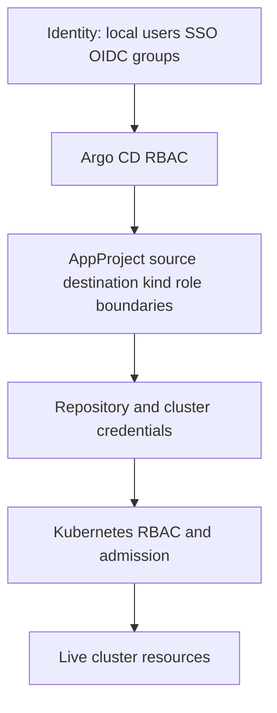

# 06 - Security, RBAC, Secrets, and Tenant Boundaries

## Why This Chapter Matters

Argo CD can become one of the most privileged systems in a Kubernetes platform. It reads deployment repositories, stores or references cluster credentials, applies resources, deletes resources when pruning is enabled, and exposes a UI/API that humans and automation use to operate production.

That means Argo CD security is not an optional hardening task after installation. It is part of the deployment model itself.

Cause -> Mechanism -> Immediate Result -> Long-Term Impact -> Next Connected Topic:

```text
Argo CD can change clusters from Git
-> repositories, credentials, RBAC, AppProjects, and Kubernetes permissions define blast radius
-> weak defaults or broad policies turn GitOps into a privileged attack path
-> secure tenant boundaries allow teams to deploy without giving everyone cluster-admin
-> multi-cluster design, ApplicationSet, production governance, and incident response
```

Official source baseline:

- RBAC configuration: <https://argo-cd.readthedocs.io/en/stable/operator-manual/rbac/>
- Projects: <https://argo-cd.readthedocs.io/en/stable/user-guide/projects/>
- Declarative setup: <https://argo-cd.readthedocs.io/en/stable/operator-manual/declarative-setup/>
- TLS configuration: <https://argo-cd.readthedocs.io/en/stable/operator-manual/tls/>
- Security considerations: <https://argo-cd.readthedocs.io/en/stable/operator-manual/security/>

Version assumption: checked on 2026-05-27. RBAC inheritance behavior, application namespaces, local accounts, Dex/OIDC integration, credential templates, project-scoped repositories/clusters, and TLS settings can vary by Argo CD release and installation method.

## The Big Picture

Argo CD security has five layers:



Each layer answers a different question:

| Layer | Question | Common mistake |
| --- | --- | --- |
| Identity | Who is the user or automation? | Leaving admin account active and shared. |
| Argo CD RBAC | What can this identity do in Argo CD? | Broad default role for all authenticated users. |
| AppProject | What repos, destinations, and resource kinds are allowed? | Putting all apps in permissive `default`. |
| Credentials | Which repos and clusters can Argo CD access? | Broad credentials shared across teams. |
| Kubernetes RBAC/admission | What can Argo CD actually apply in the cluster? | Giving cluster-admin to every app path. |

Security is the alignment of all five. If one layer is strict but another is broad, the broad layer may decide the real blast radius.

## First-Principles Explanation

### Why Argo CD Needs Permissions

Argo CD must:

- read source repositories
- render desired manifests
- read live Kubernetes resources
- create, update, and delete Kubernetes resources
- update Application status
- expose operations through API/UI/CLI

Therefore it needs credentials. Security design decides how narrow those credentials are and who can trigger them.

### Why Authentication Is Not Authorization

Authentication:

```text
Who are you?
```

Authorization:

```text
What are you allowed to do?
```

A user can successfully log in and still be forbidden from syncing production. That is correct.

### Why Argo CD RBAC Is Not Enough

Argo CD RBAC controls operations through Argo CD.

Kubernetes RBAC controls what Argo CD can do to the destination cluster.

Failure chain:

```text
Argo CD RBAC allows user to sync
-> application controller applies resources
-> Kubernetes denies ClusterRole creation
-> sync fails
```

This is not inconsistent. It is layered authorization.

## Core Vocabulary

| Term | Meaning | Why it matters |
| --- | --- | --- |
| Local user | User configured in Argo CD itself. | Useful for break-glass, risky if shared. |
| SSO/OIDC | External identity provider integration. | Enables group-based access and audit. |
| `admin` user | Built-in superuser account. | Should be protected, rotated, or disabled according to policy. |
| `argocd-rbac-cm` | ConfigMap commonly used for global Argo CD RBAC policy. | Defines default and role policies. |
| `policy.default` | Role granted to authenticated users by default. | Broad defaults cannot be denied away later. |
| AppProject role | Project-scoped Argo CD role. | Good for team-limited operations. |
| Repository credential | Secret/token/key used to access Git/Helm/OCI sources. | Source compromise can become deployment compromise. |
| Cluster credential | Credential Argo CD uses to access destination cluster. | Determines apply/delete blast radius. |
| Secret management | Handling sensitive config in GitOps workflows. | Git is not automatically safe for raw secrets. |

## Mental Model

Treat Argo CD like a production deployment robot.

You should know:

```text
who may command it
which source repos it trusts
which clusters it can reach
which namespaces it can touch
which resource kinds it may create
which secrets it can read
which deletions it can perform
```

If you cannot answer those, the platform is not ready for broad team access.

## Architecture or Conceptual Structure

### Argo CD RBAC

Argo CD RBAC uses policy rules to grant actions on resources.

Conceptual example:

```text
p, role:payments-deployer, applications, get, payments/*, allow
p, role:payments-deployer, applications, sync, payments/*, allow
g, payments-platform, role:payments-deployer
```

Meaning:

- role can get and sync apps in the `payments` project
- identity group maps to that role

Important warning from current docs: all authenticated users get at least the permissions in `policy.default`; this access cannot be blocked later with a deny rule. Therefore the default role should be minimal.

### AppProject Security

AppProject narrows deployment scope:

```yaml
spec:
  sourceRepos:
    - https://github.com/example/payments-config.git
  destinations:
    - server: https://kubernetes.default.svc
      namespace: payments
  namespaceResourceWhitelist:
    - group: apps
      kind: Deployment
    - group: ""
      kind: Service
```

This means the payments app cannot simply deploy from any repo to any namespace.

### Kubernetes RBAC

Kubernetes still decides whether Argo CD can perform the actual API operation.

For a team namespace model, the destination credential should often be limited to team namespaces and allowed kinds. A broad cluster-admin credential may be operationally easy but weakens all upper-layer boundaries.

### Secrets

GitOps does not mean committing raw secrets.

Common safer patterns:

- Sealed Secrets
- External Secrets Operator
- SOPS with KMS/age/PGP
- cloud secret managers integrated into Kubernetes
- Argo CD Vault Plugin or other controlled secret rendering approaches

The principle:

```text
Git may store encrypted secret material or secret references, but raw production secrets should not be readable by everyone with repo access.
```

Version and tool warning: secret workflows vary widely. Verify the tool's threat model, key custody, rotation behavior, and Argo CD plugin support before standardizing.

## Step-by-Step Explanation

### Step 1: Lock Down Defaults

Ask:

- Is the built-in admin account still enabled?
- Is the admin password rotated and stored safely?
- Is SSO configured?
- What is `policy.default`?
- Is anonymous access disabled unless intentionally allowed?

Safe default idea:

```text
authenticated users get minimal read or no access
team roles grant specific project actions
admin role is limited to platform administrators
```

### Step 2: Define Project Boundaries

For each team:

- allowed repositories
- allowed destination namespaces
- allowed clusters
- allowed namespaced resources
- restricted cluster-scoped resources
- project roles

Do not let every team use `default` forever.

### Step 3: Align Kubernetes Permissions

If the project allows only namespace workloads but Argo CD uses cluster-admin credentials, the Kubernetes layer is broader than the project layer.

Better:

```text
project policy restricts intent
Kubernetes RBAC restricts execution
admission policy restricts unsafe specs
```

### Step 4: Design Secret Flow

Ask:

- Are raw secrets stored in Git?
- Who can decrypt secrets?
- Where are encryption keys stored?
- How are secrets rotated?
- Can Argo CD render secrets without exposing them in logs/UI?
- Does diffing reveal secret values?

### Step 5: Audit Dangerous Actions

Dangerous Argo CD capabilities:

- sync production
- override manifests
- delete applications
- update projects
- manage repositories and clusters
- access logs and exec depending on policy
- create applications in broad projects
- enable prune/self-heal

Grant these deliberately.

## Internal Mechanics

### Default Role Is Additive

If `policy.default` grants broad access to all authenticated users, deny rules do not remove that baseline. This is why the default role must be minimal from the start.

### Project Roles Are Scoped

Project roles are useful because they limit permissions to apps inside that project. They are cleaner than giving every team global Argo CD permissions.

### Source Repo Trust Is Critical

If a project permits a repository, that repository can become deployment desired state for that project.

Risk chain:

```text
repo write access is broad
-> user commits privileged manifest
-> Argo CD syncs it if project and Kubernetes allow
-> Git write becomes cluster mutation
```

Therefore repository branch protection, CODEOWNERS, reviews, and signed commits can be part of Argo CD security.

### Secret Plugins Extend Trust Boundary

A secret plugin or sidecar can decrypt or inject sensitive data during render. That plugin becomes part of the trusted deployment path.

Risk:

```text
plugin misconfigured
-> secrets appear in rendered manifests, logs, or UI
-> sensitive data leaks
```

## Practical Examples

### Check RBAC Config

```bash
kubectl get configmap argocd-rbac-cm -n argocd -o yaml
```

Purpose: inspect global Argo CD RBAC policy.

Look for:

- `policy.default`
- broad `role:admin` group mappings
- anonymous access assumptions
- permissions for `applications`, `repositories`, `clusters`, `exec`, and `logs`

### Check Project Boundaries

```bash
argocd proj get payments
kubectl describe appproject -n argocd payments
```

Purpose: confirm allowed sources, destinations, resources, and roles.

Bad signs:

- `sourceRepos: ["*"]`
- all clusters/namespaces allowed
- broad cluster resource whitelist
- no meaningful roles

### Test Kubernetes Permission

```bash
kubectl auth can-i create deployments -n payments --as system:serviceaccount:argocd:argocd-application-controller
```

Purpose: test whether a service account can create Deployments in a namespace.

Warning: service account name and impersonation permission depend on installation. Verify the actual destination credential and run with appropriate admin access.

### Check Repository Credentials

```bash
argocd repo list
argocd repo get https://github.com/example/payments-config.git
```

Purpose: verify whether the repository is registered and accessible.

Bad signs:

- unexpected repositories
- shared credentials across unrelated teams
- personal access tokens without rotation policy
- credentials for broad organizations instead of narrow repos

## Small Details That Matter Later

- `policy.default` is powerful because every authenticated user receives it.
- The built-in `admin` user is a superuser. Treat it as break-glass or disable it according to policy after SSO is working.
- Argo CD RBAC and Kubernetes RBAC must both be correct.
- AppProject source repo allow lists are security controls, not documentation.
- A Git repository with deployment manifests is a privileged asset.
- Branch protection and review policy are part of GitOps security.
- `override` permission is dangerous because it can let users sync local manifests rather than desired Git state.
- `exec` and logs permissions can expose runtime data or secrets.
- Raw Kubernetes Secrets in Git are usually a bad default.
- Secret decryption plugins become part of the trusted computing base.
- Cluster-scoped resources should usually be platform-owned.
- Anonymous access must be paired with a tightly restricted default role if enabled at all.
- TLS and ingress configuration matter because Argo CD exposes operational controls.
- ApplicationSet can let non-admins indirectly create Applications; understand the security model before delegating it.

## Common Misunderstandings

### Misunderstanding 1: "SSO means Argo CD is secure."

SSO proves identity. It does not automatically grant least privilege. RBAC and Projects still decide what identities can do.

### Misunderstanding 2: "AppProject is enough."

AppProjects restrict Argo CD intent. Kubernetes RBAC and admission still need to restrict actual cluster operations.

### Misunderstanding 3: "Git is safe because it has reviews."

Git review is necessary, not sufficient. Repo access, branch protection, secret storage, artifact immutability, and Argo CD project scope all matter.

### Misunderstanding 4: "Secrets encrypted in Git are always safe."

They are only as safe as key custody, decryption path, plugin behavior, repo access, and rotation process.

## Failure Modes / Mistakes / Traps

### Trap 1: Broad Default Role

```text
all authenticated users get broad app permissions
-> deny rule cannot remove default baseline
-> every SSO user can do too much
```

Mitigation: create a minimal default role and grant specific roles deliberately.

### Trap 2: Broad Repository Credentials

```text
one token can read many repos
-> compromise leaks multiple desired-state sources
-> attacker can inspect or influence deployments
```

Mitigation: narrow credentials, rotate tokens, prefer deploy keys or fine-scoped access where appropriate.

### Trap 3: Cluster-Admin Destination Credential

```text
Argo CD can create anything anywhere
-> project mistake or compromised repo has maximum blast radius
```

Mitigation: namespace-scoped credentials where feasible, AppProject restrictions, admission policy, separate platform apps.

### Trap 4: Secret Values in Rendered Output

```text
secret plugin renders plaintext Secret
-> UI/diff/logs may expose sensitive data depending on settings
```

Mitigation: choose secret tooling carefully, review diff behavior, restrict access, avoid logging secrets.

## Debugging / Analysis / Answer-Writing Method

Security review checklist:

1. Identify all Argo CD users and groups.
2. Inspect `policy.default`.
3. Map groups to roles.
4. Review AppProjects for wildcard sources/destinations/kinds.
5. Review repo credentials and rotation.
6. Review cluster credentials and Kubernetes RBAC.
7. Check whether production apps use prune/self-heal.
8. Check secret storage and decryption path.
9. Check branch protection and CODEOWNERS for desired-state repos.
10. Check audit logs and incident response process.

Interview answer framework:

```text
Argo CD security is layered: identity, Argo CD RBAC, AppProject policy, repo/cluster credentials, Kubernetes RBAC/admission, and secret management. I avoid broad default roles, restrict Projects, narrow destination credentials, protect deployment repos, avoid raw secrets in Git, and treat prune/self-heal as privileged operational actions.
```

## Real-World or Exam Relevance

A serious platform design question is not:

```text
"Can Argo CD deploy?"
```

It is:

```text
"Can many teams deploy safely without giving every team the power to mutate every cluster?"
```

That is why AppProjects, RBAC, repository policy, cluster credentials, and secret handling are central design topics.

## Connected Topics

- [Applications Projects and Deployment Boundaries](03%20-%20Applications%20Projects%20and%20Deployment%20Boundaries.md)
- [Sync Drift Rollback Waves and Hooks](04%20-%20Sync%20Drift%20Rollback%20Waves%20and%20Hooks.md)
- Kubernetes RBAC and admission controllers.
- Secret management tools such as SOPS, Sealed Secrets, External Secrets Operator.
- Supply chain security, image signing, and immutable artifact promotion.
- Multi-cluster platform governance.

## Chapter Summary

Argo CD security is the discipline of controlling who can turn Git into cluster state, from which repos, into which destinations, with which resource kinds, using which credentials.

The safe mental model:

```text
least privilege in Argo CD
least privilege in Kubernetes
trusted and protected desired-state repos
explicit project boundaries
safe secret flow
auditable production operations
```

## Questions to Test Understanding

1. Why is Argo CD a privileged system?
2. What is the difference between Argo CD RBAC and Kubernetes RBAC?
3. Why is `policy.default` important?
4. Why are AppProject source allow lists security controls?
5. Why should raw production Secrets usually not be committed to Git?
6. What is risky about broad cluster-admin credentials?
7. Why can `override` permission be dangerous?
8. How do branch protection rules relate to GitOps security?
9. What should you check before allowing developers to create Applications through ApplicationSet?
10. What are the five major Argo CD security layers?

## Answers and Reasoning

1. It can read desired-state repos and apply/delete resources in clusters, so compromise or misconfiguration can directly affect production.
2. Argo CD RBAC controls user actions through Argo CD; Kubernetes RBAC controls what Argo CD credentials can do to Kubernetes resources.
3. Every authenticated user receives the default role, and broad default permissions cannot be denied away later.
4. A repo allowed by a project can become deployment source for that project's destinations.
5. Git access is often wider than secret access should be; raw secrets also create audit, rotation, and leak risks.
6. It makes project or repo mistakes much higher blast radius because Argo CD can create or delete almost anything.
7. It can allow synchronization of local arbitrary manifests instead of the audited Git desired state.
8. Deployment repos define operational state; branch protection controls who can change production intent.
9. AppProject boundaries, generator inputs, template scope, who can edit ApplicationSets, and whether generated apps can target sensitive destinations.
10. Identity, Argo CD RBAC, AppProject policy, repository/cluster credentials, and Kubernetes RBAC/admission plus secret management.

