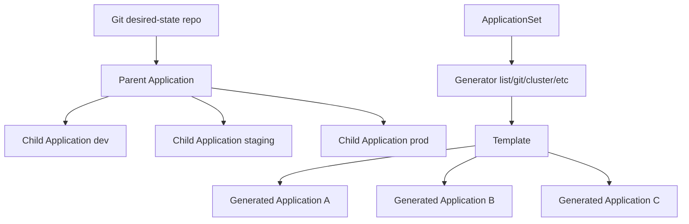

# 07 - Multi-Cluster, ApplicationSet, and App-of-Apps Patterns

## Why This Chapter Matters

One Argo CD Application is easy. Hundreds of Applications across many clusters are a platform design problem.

At scale, teams need repeatable generation, clear ownership, environment promotion, and safe deletion. Argo CD provides patterns such as ApplicationSet and app-of-apps, but both can amplify mistakes if used without project boundaries.

Cause -> Mechanism -> Immediate Result -> Long-Term Impact -> Next Connected Topic:

```text
many apps and clusters make hand-written Application YAML repetitive
-> ApplicationSet and app-of-apps generate or group Applications
-> platform teams manage fleets through templates and Git structure
-> consistency improves but generator mistakes can affect many apps
-> promotion strategy, tenant boundaries, and multi-cluster operations
```

Official source baseline:

- ApplicationSet user guide: <https://argo-cd.readthedocs.io/en/stable/user-guide/application-set/>
- ApplicationSet operator manual: <https://argo-cd.readthedocs.io/en/latest/operator-manual/applicationset/>
- Projects: <https://argo-cd.readthedocs.io/en/stable/user-guide/projects/>
- Cluster management: <https://argo-cd.readthedocs.io/en/stable/operator-manual/declarative-setup/>

Version assumption: checked on 2026-05-27. ApplicationSet generators, deletion behavior, templating options, merge/matrix behavior, and multi-source application support are version-sensitive.

## The Big Picture

There are three common scaling patterns:

| Pattern | What it does | Best for | Risk |
| --- | --- | --- | --- |
| Many hand-written Applications | Each app has its own YAML. | Small platforms. | Copy/paste drift. |
| App-of-apps | A parent Application manages child Application manifests. | Bootstrap and environment grouping. | Parent app blast radius. |
| ApplicationSet | Controller generates Applications from a template and generator. | Multi-cluster, multi-tenant, many similar apps. | Bad template/generator affects many generated apps. |



## First-Principles Explanation

### Why Multi-Cluster Changes the Problem

Single cluster:

```text
one destination
-> one failure boundary
-> simpler credentials and troubleshooting
```

Multi-cluster:

```text
many destinations
-> many credentials, network paths, cluster versions, namespaces, policies
-> more need for generation and governance
```

If each cluster has copied Application YAML, the copies drift. If one template generates everything, the template can break everything. The design challenge is controlled repetition.

### Why ApplicationSet Exists

Official docs describe ApplicationSet as automation for generating Applications and improving multi-cluster and multitenant support.

The key idea:

```text
one ApplicationSet template + generator input -> many Argo CD Applications
```

This removes copy/paste but makes generator input and template correctness critical.

## Core Vocabulary

| Term | Meaning | Why it matters |
| --- | --- | --- |
| ApplicationSet | CR that generates Applications from templates and generators. | Fleet automation. |
| Generator | Source of parameters for generated apps. | Determines how many apps and destinations are produced. |
| List generator | Explicit list of app/cluster/environment values. | Simple and auditable. |
| Cluster generator | Uses clusters known to Argo CD as generator input. | Useful for multi-cluster rollout. |
| Git generator | Uses files or directories in Git as generator input. | Useful for repo-driven app discovery. |
| Matrix/merge generator | Combines generator outputs. | Powerful but easier to misunderstand. |
| App-of-apps | Parent Application deploys child Application manifests. | Bootstrap and grouping pattern. |
| Promotion | Moving a release from dev to staging to prod. | Must be explicit and auditable. |

## Mental Model

ApplicationSet is a factory.

```text
generator input = list of orders
template = product design
generated Applications = products
```

If the template is wrong, every generated Application can be wrong.

App-of-apps is a folder of control files:

```text
parent app points at child app manifests
children do real workload reconciliation
```

If the parent path is too broad, it controls too much.

## Architecture or Conceptual Structure

### ApplicationSet Example

```yaml
apiVersion: argoproj.io/v1alpha1
kind: ApplicationSet
metadata:
  name: payments-fleet
  namespace: argocd
spec:
  goTemplate: true
  goTemplateOptions: ["missingkey=error"]
  generators:
    - list:
        elements:
          - cluster: dev
            url: https://kubernetes.default.svc
            namespace: payments-dev
          - cluster: prod
            url: https://prod.example.internal
            namespace: payments
  template:
    metadata:
      name: 'payments-{{.cluster}}'
    spec:
      project: payments
      source:
        repoURL: https://github.com/example/platform-config.git
        targetRevision: main
        path: apps/payments/overlays/{{.cluster}}
      destination:
        server: '{{.url}}'
        namespace: '{{.namespace}}'
```

Key details:

- `missingkey=error` is safer because missing template values fail instead of silently rendering bad names or paths.
- The project still matters. Generated Applications should not bypass AppProject boundaries.
- Destination clusters must be registered and reachable.

### App-of-Apps Example

Parent app:

```yaml
apiVersion: argoproj.io/v1alpha1
kind: Application
metadata:
  name: platform-prod
  namespace: argocd
spec:
  project: platform
  source:
    repoURL: https://github.com/example/platform-config.git
    targetRevision: main
    path: environments/prod/apps
  destination:
    server: https://kubernetes.default.svc
    namespace: argocd
```

The path contains child `Application` manifests.

Risk:

```text
parent app path includes too many child apps
-> one sync can modify app fleet control plane
-> parent blast radius is large
```

## Step-by-Step Explanation

### Step 1: Choose the Unit of Ownership

Ask:

- Is the app owned by one team?
- Does it deploy to many clusters?
- Are environments promoted independently?
- Are cluster-specific values small and structured?
- Who owns generated app deletion?

Use hand-written Applications for small scope. Use ApplicationSet when repetition is real and generator input is well controlled.

### Step 2: Choose the Generator

List generator:

- best for explicit small fleets
- easy to review
- verbose for many clusters

Cluster generator:

- best when registered clusters define deployment fleet
- powerful in platform-managed multi-cluster setups
- cluster labels become deployment controls

Git generator:

- best when directory/file presence should generate apps
- risky if repo structure changes casually
- needs strict review around additions/deletions

### Step 3: Protect Generated Applications With Projects

Generated apps should still use specific AppProjects:

```yaml
spec:
  project: payments
```

Project policy should restrict:

- source repository
- destination namespaces
- destination clusters
- allowed resource kinds
- team roles

### Step 4: Design Promotion

Promotion models:

| Model | How it works | Tradeoff |
| --- | --- | --- |
| Branch per environment | `dev`, `staging`, `prod` branches. | Easy to understand; branch drift possible. |
| Directory per environment | `overlays/dev`, `overlays/prod`. | Clear config differences; PR discipline needed. |
| Tag/commit pinning | Production targets immutable revision. | Strong audit; requires explicit promotion process. |
| Image update automation | Tool updates desired-state repo with new image. | Fast; must preserve review and safety. |

## Internal Mechanics

### Generated Applications Are Real Applications

ApplicationSet creates Application resources. Once created, the normal application controller reconciles them.

Debug distinction:

```text
Application missing -> ApplicationSet/generator/template problem
Application exists but failed sync -> normal Application/render/apply/health problem
```

### Generator Changes Can Delete Apps

If generator input removes an element, the corresponding generated Application may be removed depending on controller policy and finalizers.

Risk chain:

```text
cluster label removed or directory deleted
-> ApplicationSet no longer generates app
-> generated Application removed
-> if finalizer/prune behavior applies, workload resources may be deleted
```

Always understand deletion semantics before changing generator input.

### Multi-Cluster Adds Three Failure Planes

1. Argo CD management cluster.
2. Destination cluster.
3. Network/credential path between them.

Failure example:

```text
Argo CD UI is fine
-> destination cluster credential expired
-> generated prod app cannot sync
-> issue is not source or repo-server
```

## Practical Examples

### Inspect Generated Applications

```bash
kubectl get applicationsets.argoproj.io -n argocd
kubectl get applications.argoproj.io -n argocd
kubectl describe applicationset -n argocd payments-fleet
```

Purpose: see whether ApplicationSet exists and what Applications it generated.

### Debug a Missing Generated App

Check:

- ApplicationSet exists
- generator input contains expected element
- template rendered without missing keys
- AppProject allows source/destination
- ApplicationSet controller logs

Command:

```bash
kubectl logs -n argocd deploy/argocd-applicationset-controller
```

### Check Registered Clusters

```bash
argocd cluster list
```

Purpose: see clusters Argo CD can deploy to.

Bad signs:

- missing expected cluster
- unknown server URL
- connection errors
- stale cluster credentials

## Small Details That Matter Later

- ApplicationSet creates Applications; it does not directly sync workloads.
- Generated Applications should still belong to narrow AppProjects.
- `missingkey=error` prevents silent template mistakes in Go templates.
- Cluster labels can become deployment control inputs. Protect who can change them.
- Deleting generator input can remove generated Applications.
- App-of-apps is simple but can hide large blast radius behind one parent.
- Multi-cluster sync failure might be destination credential or network, not Git.
- Promotion must be explicit. "Main branch deploys everywhere" is simple but risky.
- Generated app names should be deterministic and readable.
- Avoid putting dev and prod under identical automation if production needs stronger approval.
- ApplicationSet delegation has security implications; official docs warn to review them before allowing developers to create Applications this way.

## Common Misunderstandings

### Misunderstanding 1: "ApplicationSet is just templating."

It is templating plus reconciliation of Application objects. Deletion and update behavior matter.

### Misunderstanding 2: "Generated Applications do not need project boundaries."

They need boundaries more, because one generator can create many apps.

### Misunderstanding 3: "App-of-apps and ApplicationSet are the same."

App-of-apps uses a parent Application to deploy child Application manifests. ApplicationSet uses a controller to generate Applications from generators and templates.

## Failure Modes / Mistakes / Traps

### Trap 1: Generator Deletes Production App

```text
prod element removed from list
-> ApplicationSet stops generating prod app
-> generated Application may be deleted
-> finalizer or prune can delete resources
```

Mitigation: protect generator changes with review and understand deletion policy.

### Trap 2: Cluster Label Drives Wrong Deployment

```text
cluster accidentally labeled env=prod
-> cluster generator creates prod app for wrong cluster
```

Mitigation: restrict cluster label editing and validate generator selectors.

### Trap 3: Parent App Too Broad

```text
parent app manages all child Application manifests
-> one sync controls entire platform fleet
```

Mitigation: split by environment/team and use AppProjects.

## Debugging / Analysis / Answer-Writing Method

Multi-cluster/ApplicationSet runbook:

1. Is the Application supposed to be generated or hand-written?
2. If generated, inspect ApplicationSet generator input and template.
3. Confirm the generated Application exists.
4. Confirm AppProject allows source/destination/kinds.
5. Confirm destination cluster is registered and reachable.
6. Run normal Application troubleshooting: diff, manifests, sync, health.
7. Inspect destination cluster events and logs.

Interview answer:

```text
I use ApplicationSet when I need many similar Applications across clusters or tenants. I keep generated Applications inside strict AppProjects, protect generator inputs, use deterministic names, and treat deletion semantics carefully. App-of-apps is useful for bootstrapping or grouping child apps, but I avoid one giant parent controlling unrelated systems.
```

## Real-World or Exam Relevance

Real platform questions:

- How do we deploy the same baseline to every cluster?
- How do we onboard a new team namespace?
- How do we promote staging to production?
- Who can add a production Application?
- What happens when a cluster is removed?

ApplicationSet and app-of-apps answer parts of these questions, but only with governance around source, destination, and deletion.

## Connected Topics

- [Applications Projects and Deployment Boundaries](03%20-%20Applications%20Projects%20and%20Deployment%20Boundaries.md)
- [Security RBAC Secrets and Tenant Boundaries](06%20-%20Security%20RBAC%20Secrets%20and%20Tenant%20Boundaries.md)
- Multi-cluster Kubernetes operations.
- Environment promotion and release governance.
- Platform bootstrap and disaster recovery.

## Chapter Summary

ApplicationSet and app-of-apps are scaling patterns for Argo CD.

Use ApplicationSet when repeated Application definitions should be generated from structured input. Use app-of-apps when a parent Application should bootstrap or group child Application manifests. In both cases, the main danger is amplified blast radius.

The safe pattern:

```text
controlled generator input
-> narrow AppProjects
-> clear destination clusters
-> deterministic names
-> protected deletion semantics
-> explicit promotion flow
```

## Questions to Test Understanding

1. What does ApplicationSet generate?
2. How is app-of-apps different from ApplicationSet?
3. Why can generator input deletion be dangerous?
4. Why should generated Applications still use AppProjects?
5. What is the value of `missingkey=error` in templates?
6. Why are cluster labels sensitive in cluster-generator patterns?
7. What are the three failure planes in multi-cluster Argo CD?
8. When is hand-written Application YAML acceptable?
9. Why is "main deploys everywhere" risky?
10. What should you check when an expected generated Application is missing?

## Answers and Reasoning

1. It generates Argo CD Application resources from templates and generator input.
2. App-of-apps uses a parent Application to manage child Application manifests; ApplicationSet uses a controller and generators to create Applications.
3. Removing input can remove generated Applications, which can cascade into resource deletion depending on finalizers and policies.
4. Project boundaries restrict source, destination, resource kinds, and roles even for generated apps.
5. It prevents missing template values from silently rendering bad paths, names, or destinations.
6. Labels can select where apps deploy; wrong labels can deploy workloads to unintended clusters.
7. Management cluster, destination cluster, and network/credential path between them.
8. For small platforms or unique apps where repetition is low and manual YAML remains clear.
9. A single merge can change desired state across environments without explicit promotion controls.
10. ApplicationSet existence, generator input, template errors, controller logs, project policy, and cluster/destination data.

