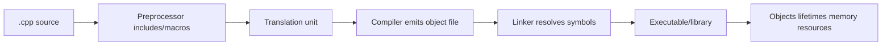

# 01 - Compilation, Memory, and Lifetime Foundations

## Why This Chapter Matters

C++ is powerful because it gives the programmer control over compilation, memory layout, object lifetime, and abstraction cost. Those are the same reasons C++ punishes vague thinking.

In Python or Java, many invalid actions become exceptions. In C++, many invalid actions become undefined behavior: the standard gives no required meaning, and the optimizer may assume the invalid case never happens.

Cause -> Mechanism -> Immediate Result -> Long-Term Impact -> Next Connected Topic:

```text
systems code needs native performance and control
-> C++ uses separate compilation, deterministic lifetimes, stack/heap control, RAII, and templates
-> efficient abstractions are possible
-> correctness depends on lifetime, ownership, initialization, linking, and undefined behavior rules
-> pointers, references, RAII, move semantics, STL, templates, and performance debugging
```

Official/source baseline:

- ISO C++ standards overview: <https://isocpp.org/std/the-standard>
- cppreference C++ language: <https://en.cppreference.com/w/cpp/language>
- cppreference RAII: <https://en.cppreference.com/w/cpp/language/raii>
- cppreference undefined behavior: <https://en.cppreference.com/w/cpp/language/ub>

Version assumption: source checked on 2026-05-27. Current stable teaching baseline here is modern C++17/C++20 style unless noted. C++23/C++26 features and compiler support are version-sensitive. Always verify compiler flags, standard mode, standard library, and platform ABI in real projects.

## The Big Picture



C++ asks you to understand two timelines:

1. Build-time: preprocessing, compilation, linking, templates, headers.
2. Runtime: object lifetime, stack, heap, ownership, destruction.

Most C++ errors belong to one of these timelines.

## First-Principles Explanation

### Why Compilation Is Different From Scripting

In a scripting language, source is often loaded by an interpreter.

In C++:

```text
source files are compiled separately
object files are linked together
headers share declarations between translation units
```

This model enables fast native binaries but creates:

- header dependency problems
- linker errors
- ABI issues
- One Definition Rule issues
- template compile-time complexity

### Why Lifetime Is Central

Every object has a lifetime:

```text
storage acquired
object initialized
object used
object destroyed
storage released
```

Using an object before its lifetime begins or after its lifetime ends is a serious bug.

Example:

```cpp
int* p = nullptr;
{
    int x = 42;
    p = &x;
}
std::cout << *p << '\n'; // dangling pointer, undefined behavior
```

`x` is destroyed at the closing brace. `p` still stores an address, but the object no longer exists.

## Core Vocabulary

| Term | Meaning | Why it matters |
| --- | --- | --- |
| Translation unit | Source file after preprocessing. | Unit compiled by compiler. |
| Header | File containing declarations included into source. | Shares interfaces. |
| Declaration | Introduces name/type. | Lets compiler know something exists. |
| Definition | Provides storage/body/full entity. | Linker needs definitions. |
| Linker | Combines object files and resolves symbols. | Explains unresolved external errors. |
| ODR | One Definition Rule. | Violations can be undefined or linker failures. |
| Automatic storage | Usually stack-like local lifetime. | Destroyed at scope exit. |
| Dynamic storage | Allocated with `new` or allocators. | Must be owned and released safely. |
| RAII | Resource Acquisition Is Initialization. | Ties resource cleanup to object lifetime. |
| Undefined behavior | No required program meaning. | Compiler may optimize unpredictably. |

## Mental Model

Think in lifetimes, not just variables:

```text
Who owns this object?
When does its lifetime begin?
When does it end?
Who can refer to it?
Can any reference/pointer outlive it?
What cleanup must happen?
```

C++ safety comes from making those answers obvious in code.

## Architecture or Conceptual Structure

### Build Model

```text
main.cpp includes app.hpp
app.cpp includes app.hpp
both compile independently
linker connects main.o and app.o
```

Header should normally contain declarations:

```cpp
// app.hpp
#pragma once

int add(int a, int b);
```

Source contains definition:

```cpp
// app.cpp
#include "app.hpp"

int add(int a, int b) {
    return a + b;
}
```

### Memory Areas

Conceptual categories:

| Area | What lives there | Trap |
| --- | --- | --- |
| automatic storage | local variables with scope lifetime | dangling references after scope |
| dynamic storage | heap allocations | leaks, double delete, use-after-free |
| static storage | globals/statics | initialization order and shared state |
| thread storage | thread-local variables | lifetime per thread |

Modern C++ prefers ownership types over raw owning pointers.

## Step-by-Step Explanation

### A Simple Program

```cpp
#include <iostream>

int main() {
    std::cout << "Hello C++\n";
}
```

Compile:

```bash
g++ -std=c++20 -Wall -Wextra -pedantic main.cpp -o app
```

Flags:

- `-std=c++20`: choose language standard.
- `-Wall -Wextra`: enable many useful warnings.
- `-pedantic`: warn about non-standard extensions.
- `-o app`: output executable.

Warnings should be treated seriously. They are often future bugs.

### Initialization

Prefer initialization over assignment after default construction:

```cpp
std::string name{"jay"};
int count{0};
```

Brace initialization can prevent some narrowing conversions:

```cpp
int x{3.14}; // compile error
```

### RAII

Bad manual resource pattern:

```cpp
FILE* f = std::fopen("data.txt", "r");
// many possible returns/exceptions
std::fclose(f);
```

RAII pattern:

```cpp
std::ifstream file{"data.txt"};
std::string line;
while (std::getline(file, line)) {
    std::cout << line << '\n';
}
```

The file closes when `file` is destroyed.

RAII applies to:

- memory
- files
- sockets
- mutex locks
- database handles
- temporary directories
- transactions

## Internal Mechanics

### Undefined Behavior

Undefined behavior is not a C++ exception. It means the program has no required meaning according to the standard.

Examples:

- signed integer overflow
- out-of-bounds array access
- dereferencing null pointer
- use-after-free
- data race
- reading uninitialized object
- returning reference to local object

Why it matters:

```text
optimizer assumes UB does not happen
-> compiler may remove checks or transform code
-> program behavior can change under optimization
```

### Destructor Determinism

Objects with automatic storage are destroyed at scope exit.

```cpp
{
    std::lock_guard<std::mutex> lock{m};
    // mutex locked
}
// mutex unlocked
```

This deterministic destruction is the core of C++ resource safety.

### Static Initialization

Global/static objects can create initialization-order problems across translation units.

Safer pattern:

```cpp
Logger& logger() {
    static Logger instance;
    return instance;
}
```

Even this needs design care for shutdown order and multithreading, but it avoids some global initialization hazards.

## Practical Examples

### Linker Error

Header:

```cpp
int add(int, int);
```

But no source definition linked.

Error:

```text
undefined reference to `add(int, int)'
```

Meaning:

```text
compiler accepted declaration
linker could not find definition
```

### Use RAII for Locks

```cpp
std::mutex m;

void update() {
    std::lock_guard<std::mutex> guard{m};
    // protected critical section
}
```

If an exception occurs, `guard` still unlocks at scope exit.

## Small Details That Matter Later

- Header inclusion is textual; include guards or `#pragma once` prevent repeated inclusion in one translation unit.
- Declarations and definitions are different.
- Linker errors happen after compilation.
- ODR violations can be subtle and dangerous.
- Local object lifetime ends at scope exit.
- Returning pointer/reference to local variable is invalid.
- `new`/`delete` should be rare in modern application code; prefer standard containers and smart pointers.
- RAII is for every resource, not just memory.
- Signed integer overflow is undefined behavior.
- Array bounds are not checked by built-in arrays or `operator[]`.
- Warnings are valuable evidence; do not ignore them casually.
- Compiler flags and standard versions change what code is accepted.

## Common Misunderstandings

### Misunderstanding 1: "A pointer with an address is valid."

An address value can remain after the object's lifetime ended. That pointer dangles.

### Misunderstanding 2: "Undefined behavior means random runtime error."

It means no required meaning. It may appear to work, fail, or be optimized into surprising behavior.

### Misunderstanding 3: "RAII is only smart pointers."

RAII is any resource tied to object lifetime.

### Misunderstanding 4: "If it compiles, it is safe."

C++ compilers accept many programs that can still have undefined behavior.

## Failure Modes / Mistakes / Traps

### Trap 1: Dangling Reference

```cpp
const std::string& bad() {
    std::string s{"temporary"};
    return s;
}
```

Reference outlives object.

### Trap 2: Manual Delete

```cpp
int* p = new int{5};
delete p;
delete p; // UB
```

Use `std::unique_ptr` or stack objects instead.

### Trap 3: Header Definition Mistakes

Putting non-inline function definitions in headers included by many source files can create multiple definition errors.

## Debugging / Analysis / Answer-Writing Method

When C++ code misbehaves:

1. Check compiler warnings.
2. Enable sanitizers when possible.
3. Ask which object lifetime is invalid.
4. Check ownership and aliasing.
5. Check out-of-bounds access.
6. Check initialization.
7. Check standard mode and compiler flags.
8. Distinguish compile error, linker error, runtime error, and undefined behavior.

Useful flags:

```bash
g++ -std=c++20 -Wall -Wextra -Werror -pedantic main.cpp
g++ -std=c++20 -fsanitize=address,undefined -g main.cpp -o app
```

## Real-World or Exam Relevance

Common questions:

- What is RAII?
- Header vs source file?
- Compile error vs linker error?
- Stack vs heap?
- What is undefined behavior?
- Why can returning reference to local variable fail?
- Why prefer smart pointers?

Strong answer:

```text
C++ safety is built around object lifetime. RAII ties resource cleanup to destructor execution, so resources are released deterministically at scope exit. Undefined behavior means the standard gives no required meaning, so correct C++ must avoid invalid lifetime, bounds, aliasing, and data race mistakes.
```

## Connected Topics

- [Ownership RAII Move Semantics Templates and STL](02%20-%20Ownership%20RAII%20Move%20Semantics%20Templates%20and%20STL.md)
- [Undefined Behavior Performance and Competitive Programming Patterns](03%20-%20Undefined%20Behavior%20Performance%20and%20Competitive%20Programming%20Patterns.md)
- Java JVM memory and GC.
- Python object references and mutability.

## Chapter Summary

C++ is a language of lifetime and ownership.

The foundation:

```text
separate compilation
headers for declarations
linker for definitions
objects have lifetimes
resources should be owned by objects
RAII gives deterministic cleanup
undefined behavior must be avoided, not caught
```

## Questions to Test Understanding

1. What is a translation unit?
2. What is the difference between declaration and definition?
3. Why do linker errors happen after compilation?
4. What is RAII?
5. Why is returning a reference to a local variable wrong?
6. What is undefined behavior?
7. Why should warnings be taken seriously?
8. What does `-std=c++20` do?
9. Why should raw `new` and `delete` be rare?
10. What is the main advantage of deterministic destruction?

## Answers and Reasoning

1. A source file after preprocessing, compiled as one unit.
2. Declaration introduces a name/interface; definition provides the actual entity/body/storage.
3. The compiler accepted each unit, but the linker could not resolve symbols across units.
4. A technique binding resource acquisition/release to object construction/destruction.
5. The local object is destroyed at scope exit, leaving a dangling reference.
6. Program behavior with no required meaning under the C++ standard.
7. Warnings often point to bugs, portability issues, narrowing, lifetime mistakes, or non-standard extensions.
8. It selects the C++ language standard mode for compilation.
9. Standard containers and smart pointers encode ownership and prevent leaks/double delete.
10. Cleanup happens predictably at scope exit, even during exceptions.

