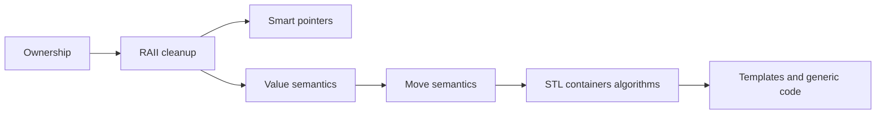

# 02 - Ownership, RAII, Move Semantics, Templates, and STL

## Why This Chapter Matters

Modern C++ is not "manual `new` and `delete` with classes." Modern C++ is ownership expressed through types, resources protected by RAII, efficient transfer through move semantics, and generic algorithms built on templates and the standard library.

If you write C++ like C with objects, you will fight the language. If you write C++ with ownership and lifetime in mind, the compiler and library become allies.

Cause -> Mechanism -> Immediate Result -> Long-Term Impact -> Next Connected Topic:

```text
manual resource control is powerful but error-prone
-> C++ uses RAII, smart pointers, value semantics, move semantics, templates, and STL containers
-> resources can be managed deterministically with efficient abstractions
-> correctness depends on ownership clarity, move state, iterator validity, and generic contracts
-> undefined behavior, performance, concurrency, and competitive programming patterns
```

Source baseline:

- cppreference RAII: <https://en.cppreference.com/w/cpp/language/raii>
- cppreference move constructor: <https://en.cppreference.com/w/cpp/language/move_constructor>
- cppreference `std::move`: <https://en.cppreference.com/w/cpp/utility/move>
- cppreference containers: <https://en.cppreference.com/w/cpp/container>
- cppreference templates: <https://en.cppreference.com/w/cpp/language/templates>

Version assumption: examples use C++17/C++20 style. Some library methods and range features are newer; verify compiler standard mode.

## The Big Picture



Core modern C++ idea:

```text
make ownership visible in types
```

## First-Principles Explanation

### Ownership

Ownership answers:

```text
who is responsible for destroying this resource?
```

Common ownership forms:

| Ownership type | C++ expression |
| --- | --- |
| automatic ownership | local object |
| exclusive dynamic ownership | `std::unique_ptr<T>` |
| shared dynamic ownership | `std::shared_ptr<T>` |
| non-owning observation | raw pointer, reference, `std::span`, iterator |
| container ownership | `std::vector<T>`, `std::map<K,V>` |

If ownership is unclear, bugs follow.

### Smart Pointers

Exclusive:

```cpp
auto user = std::make_unique<User>("jay");
```

Shared:

```cpp
auto config = std::make_shared<Config>();
```

Use `shared_ptr` only when ownership is genuinely shared. It is not a default replacement for thinking.

### Move Semantics

Copy:

```text
create another equivalent object
```

Move:

```text
transfer resources from an expiring object to a new owner
```

`std::move` does not move by itself. It casts an expression to an rvalue so move construction/assignment can be selected.

```cpp
std::string a = "large data";
std::string b = std::move(a);
```

After move, `a` is valid but its value is unspecified. You may destroy it or assign to it; do not rely on its old content.

## Core Vocabulary

| Term | Meaning | Why it matters |
| --- | --- | --- |
| Owner | Code/object responsible for cleanup. | Prevents leaks/double free. |
| Non-owning pointer | Observes object without deleting it. | Must not outlive object. |
| `unique_ptr` | Exclusive owning smart pointer. | Default dynamic ownership tool. |
| `shared_ptr` | Reference-counted shared ownership. | Useful but can create cycles/overhead. |
| `weak_ptr` | Non-owning reference to shared object. | Breaks shared cycles. |
| Value semantics | Objects behave like values. | Simpler ownership and copying. |
| Move semantics | Efficient resource transfer. | Avoids expensive copies. |
| Template | Compile-time generic code. | Powers STL. |
| Iterator | Object representing position in range. | Can be invalidated. |
| STL | Containers, iterators, algorithms, utilities. | Core modern C++ toolkit. |

## Mental Model

Prefer this hierarchy:

```text
local object if lifetime is simple
standard container if managing many objects
unique_ptr for exclusive dynamic ownership
shared_ptr only for real shared ownership
raw pointer/reference for non-owning use with clear lifetime
```

Do not use owning raw pointers in ordinary modern code.

## Architecture or Conceptual Structure

### Rule of Zero

Best case:

```cpp
struct User {
    std::string name;
    std::vector<int> scores;
};
```

No custom destructor/copy/move needed because members manage themselves.

Rule of Zero:

```text
if your members own resources correctly, your class should not manually manage special member functions
```

### Rule of Five

If you manually manage a resource, you likely need to consider:

- destructor
- copy constructor
- copy assignment
- move constructor
- move assignment

But modern C++ often avoids manual resource management by using RAII members.

### STL Container Choice

| Need | Container |
| --- | --- |
| dynamic contiguous array | `std::vector` |
| fixed-size array | `std::array` |
| double-ended queue | `std::deque` |
| unique unordered membership | `std::unordered_set` |
| sorted membership | `std::set` |
| key-value hash map | `std::unordered_map` |
| sorted map | `std::map` |
| string text bytes/chars | `std::string` |

`std::vector` should be your default sequence container unless you have a reason otherwise.

## Step-by-Step Explanation

### `unique_ptr`

```cpp
std::unique_ptr<User> make_user(std::string name) {
    return std::make_unique<User>(std::move(name));
}
```

Properties:

- cannot be copied
- can be moved
- deletes owned object when destroyed

### `shared_ptr` and `weak_ptr`

Cycle problem:

```cpp
struct Node {
    std::shared_ptr<Node> next;
    std::shared_ptr<Node> prev;
};
```

Two nodes can keep each other alive forever.

Use `weak_ptr` for non-owning back references:

```cpp
struct Node {
    std::shared_ptr<Node> next;
    std::weak_ptr<Node> prev;
};
```

### Templates

```cpp
template <typename T>
T max_value(T a, T b) {
    return b < a ? a : b;
}
```

Templates generate code for types used. Errors can be verbose because templates are instantiated at compile time.

### Algorithms

Prefer standard algorithms:

```cpp
std::sort(values.begin(), values.end());

auto it = std::find(values.begin(), values.end(), target);

std::erase_if(values, [](int x) { return x < 0; });
```

Version note: `std::erase_if` availability depends on C++20 for many containers.

## Internal Mechanics

### Iterator Invalidation

Containers have rules about when iterators/references/pointers become invalid.

Example:

```cpp
std::vector<int> v{1, 2, 3};
auto it = v.begin();
v.push_back(4); // may reallocate
std::cout << *it; // possibly invalid
```

Reason:

```text
vector may allocate new storage and move elements
```

Know the container's invalidation rules.

### `std::move` Is a Cast

```cpp
std::move(x)
```

means:

```text
treat x as movable from
```

It does not guarantee that resources physically moved. The selected constructor/assignment decides.

### Perfect Forwarding

Advanced generic code uses forwarding references and `std::forward` to preserve value category.

You do not need this for everyday code at first. But you must know that `std::move` and `std::forward` are not interchangeable.

## Practical Examples

### Ownership API Design

```cpp
void observe(const User& user);          // does not own
void maybe_observe(const User* user);    // non-owning, can be null
void take(std::unique_ptr<User> user);   // takes ownership
std::unique_ptr<User> make_user();       // returns ownership
std::shared_ptr<User> share_user();      // shared ownership
```

Good APIs make ownership visible.

### Vector Reserve

```cpp
std::vector<int> values;
values.reserve(1000);
for (int i = 0; i < 1000; ++i) {
    values.push_back(i);
}
```

Why:

```text
reserve reduces reallocations when size estimate is known
```

## Small Details That Matter Later

- `std::unique_ptr` is the default smart pointer for ownership.
- `std::shared_ptr` cycles leak unless broken with `weak_ptr`.
- Raw pointers can be fine as non-owning observers if lifetime is clear.
- References cannot be reseated and should not be null.
- `std::move` can leave the source valid but unspecified.
- Moving from a `const` object usually cannot call a move constructor that modifies source.
- Iterator invalidation differs by container.
- `vector::reserve` changes capacity, not size.
- `vector::operator[]` does not bounds-check; `at()` checks and throws.
- Templates move errors to compile time but can produce long diagnostics.
- Prefer algorithms over hand-written loops when they clarify intent.
- Use `const` aggressively to communicate non-mutation.

## Common Misunderstandings

### Misunderstanding 1: "shared_ptr is safer than unique_ptr."

`shared_ptr` is more permissive, not automatically safer. Shared ownership can hide lifetime design and create cycles.

### Misunderstanding 2: "std::move moves."

It casts to an rvalue; moving happens only if a move operation is selected.

### Misunderstanding 3: "Raw pointers are always bad."

Owning raw pointers are bad in normal modern code. Non-owning raw pointers can be appropriate when null is meaningful and lifetime is clear.

## Failure Modes / Mistakes / Traps

### Trap 1: Use After Move

```cpp
std::string a{"data"};
std::string b{std::move(a)};
std::cout << a; // valid but content not guaranteed
```

### Trap 2: Shared Pointer Cycle

Two shared owners referencing each other can leak.

### Trap 3: Invalidated Iterator

Modifying a container while holding iterators can invalidate them.

### Trap 4: Template Error Overload

Template errors can be long. Look for the first meaningful user-code instantiation point.

## Debugging / Analysis / Answer-Writing Method

Ownership review checklist:

1. Who owns each resource?
2. Is ownership unique or shared?
3. Can any pointer/reference outlive object?
4. Are moved-from objects used safely?
5. Can a container operation invalidate iterators?
6. Are APIs using references, pointers, values, or smart pointers intentionally?
7. Can Rule of Zero replace custom special members?

## Real-World or Exam Relevance

Common questions:

- `unique_ptr` vs `shared_ptr`.
- What is RAII?
- What is move semantics?
- What does `std::move` do?
- Rule of Three/Five/Zero.
- Iterator invalidation.
- Vector vs list.
- Template basics.

Strong answer:

```text
Modern C++ expresses ownership in types. Prefer automatic objects and containers, use `unique_ptr` for exclusive ownership, `shared_ptr` only for genuine shared ownership, and raw pointers/references as non-owning views. `std::move` is a cast enabling move operations; moved-from objects remain valid but their value is usually unspecified.
```

## Connected Topics

- [Compilation Memory and Lifetime Foundations](01%20-%20Compilation%20Memory%20and%20Lifetime%20Foundations.md)
- [Undefined Behavior Performance and Competitive Programming Patterns](03%20-%20Undefined%20Behavior%20Performance%20and%20Competitive%20Programming%20Patterns.md)
- Competitive Programming STL.
- Java generics and collections.

## Chapter Summary

Modern C++ is ownership-aware C++.

The core rules:

```text
prefer values and containers
use RAII for resources
make ownership visible
use unique_ptr by default for dynamic ownership
use shared_ptr only for real shared ownership
understand moves and moved-from state
respect iterator invalidation
use STL algorithms and containers deliberately
```

## Questions to Test Understanding

1. What does ownership mean?
2. Why is `unique_ptr` usually preferred over `shared_ptr`?
3. What problem does `weak_ptr` solve?
4. What does `std::move` actually do?
5. What is Rule of Zero?
6. Why can vector iterators be invalidated?
7. What does `reserve` do?
8. When is a raw pointer acceptable?
9. Why are templates powerful?
10. What is a moved-from object's state?

## Answers and Reasoning

1. Responsibility for destroying/releasing a resource.
2. Exclusive ownership is clearer and cheaper; shared ownership should be exceptional and intentional.
3. It breaks shared ownership cycles and observes a shared object without owning it.
4. It casts an expression to an rvalue so move operations may be selected.
5. Let member types manage resources so the class needs no custom destructor/copy/move.
6. Reallocation can move elements to new storage.
7. It increases capacity without changing size.
8. For non-owning observation when lifetime is clear, especially when null is meaningful.
9. They allow generic code generated and checked at compile time.
10. It is valid but its value is usually unspecified unless the type documents more.

