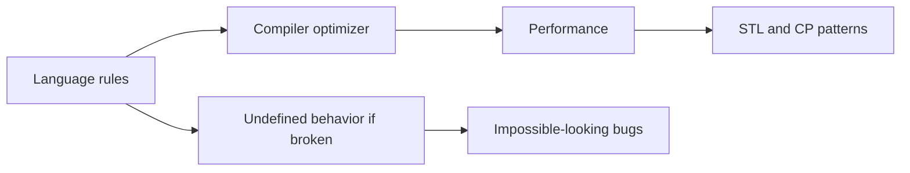

# 03 - Undefined Behavior, Performance, and Competitive Programming Patterns

## Why This Chapter Matters

C++ performance comes from trust. The compiler trusts that your program follows the rules. If you violate those rules, especially through undefined behavior, the compiler can produce output that seems impossible.

For interviews and competitive programming, C++ gives speed and STL power. For production systems, it gives control over allocation, layout, and CPU behavior. In both cases, correctness comes first.

Cause -> Mechanism -> Immediate Result -> Long-Term Impact -> Next Connected Topic:

```text
C++ exposes low-level control
-> compiler optimizes under strict language assumptions
-> legal code can be extremely fast
-> undefined behavior, invalid iterators, overflow, and data races can destroy correctness
-> sanitizer-driven debugging, performance profiling, and safe CP templates
```

Source baseline:

- cppreference undefined behavior: <https://en.cppreference.com/w/cpp/language/ub>
- cppreference containers: <https://en.cppreference.com/w/cpp/container>
- cppreference algorithms: <https://en.cppreference.com/w/cpp/algorithm>
- cppreference integer types: <https://en.cppreference.com/w/cpp/types/integer>

Version assumption: examples use common C++17/C++20 competitive/programming style. Compiler extensions such as non-standard variable-length arrays or `bits/stdc++.h` are not portable standard C++.

## The Big Picture



Performance in C++ should be approached as:

```text
correctness
-> measurements
-> algorithmic complexity
-> data structure choice
-> memory/layout awareness
-> micro-optimization only after evidence
```

## First-Principles Explanation

### Undefined Behavior

Undefined behavior means:

```text
the C++ standard imposes no requirements on what happens
```

It is not:

- a guaranteed crash
- a catchable exception
- a random value rule
- something safe if tests pass

Examples:

```cpp
int a[3]{1, 2, 3};
std::cout << a[3]; // out of bounds, UB
```

```cpp
int x = std::numeric_limits<int>::max();
++x; // signed overflow, UB
```

```cpp
int* p = nullptr;
*p = 5; // UB
```

### Complexity Still Dominates

C++ does not save a bad algorithm.

```text
O(n^2) with fast code loses to O(n log n) with ordinary STL at scale
```

Competitive programming mental model:

```text
constraints -> complexity budget -> data structure -> implementation details -> edge cases
```

## Core Vocabulary

| Term | Meaning | Why it matters |
| --- | --- | --- |
| Undefined behavior | No required meaning. | Optimizer may do anything. |
| Implementation-defined | Implementation must document choice. | Compiler/platform-specific. |
| Unspecified behavior | Several allowed outcomes, not required to specify which. | Do not depend on order/value. |
| Complexity | Growth rate with input size. | Dominates performance. |
| Cache locality | Memory access friendliness to CPU cache. | Explains vector speed. |
| Iterator invalidation | Iterator/reference becomes invalid after container operation. | Common STL bug. |
| Data race | Concurrent unsynchronized conflicting access. | Undefined behavior. |
| Sanitizer | Runtime instrumentation to catch bugs. | Essential debugging tool. |

## Mental Model

For each C++ optimization, ask:

```text
Is the code legal?
Is the algorithm good enough?
Is the data structure appropriate?
Have I measured?
Will this stay readable?
```

For competitive programming:

```text
read constraints
estimate complexity
choose data structures
handle overflow
handle empty/single cases
avoid UB
test edge cases
```

## Step-by-Step Explanation

### Fast I/O for Competitive Programming

```cpp
std::ios::sync_with_stdio(false);
std::cin.tie(nullptr);
```

Purpose:

- speed up iostreams by decoupling from C stdio
- avoid flushing `cout` before every `cin`

Use at program start.

### Use Correct Integer Width

```cpp
long long total = 0;
for (int x : values) {
    total += x;
}
```

If constraints say `n <= 2e5` and `a[i] <= 1e9`, sum needs 64-bit.

### Avoid Non-Standard VLAs

Bad portable C++:

```cpp
int n;
std::cin >> n;
int a[n]; // not standard C++
```

Use:

```cpp
std::vector<int> a(n);
```

### Sorting and Binary Search

```cpp
std::sort(values.begin(), values.end());
bool exists = std::binary_search(values.begin(), values.end(), target);
```

Precondition: range must be sorted for binary search.

### Prefix Sum

```cpp
std::vector<long long> pref(n + 1);
for (int i = 0; i < n; ++i) {
    pref[i + 1] = pref[i] + a[i];
}

long long sum_l_r = pref[r + 1] - pref[l];
```

Index convention must be explicit.

## Internal Mechanics

### Why Vector Is Often Fast

`std::vector` stores elements contiguously.

Benefits:

- cache locality
- simple iteration
- low per-element overhead
- compatible with many algorithms

This is why `std::list` is rarely faster in practice despite O(1) insertion if you already have an iterator. Pointer chasing hurts locality.

### Signed Overflow UB

Unsigned overflow wraps modulo 2^N. Signed overflow is undefined behavior.

In CP, use `long long` early and reason about maximum values.

### Data Race UB

If two threads access the same memory concurrently, at least one writes, and there is no synchronization, the program has a data race, which is undefined behavior.

This is stronger and more dangerous than "might read stale data."

## Practical Examples

### Edge-Case Checklist for CP

Before submit:

- n = 0 if allowed
- n = 1
- all equal
- already sorted
- reverse sorted
- negative values
- large values near overflow
- duplicate values
- disconnected graph
- multiple components
- no solution
- maximum constraints

### Safe Erase While Iterating

```cpp
std::vector<int> v{1, -2, 3, -4};
std::erase_if(v, [](int x) { return x < 0; });
```

For older standards:

```cpp
v.erase(
    std::remove_if(v.begin(), v.end(), [](int x) { return x < 0; }),
    v.end()
);
```

## Small Details That Matter Later

- `bits/stdc++.h` is common in CP but non-standard.
- `using namespace std;` is common in CP, discouraged in headers/production.
- Built-in array bounds are unchecked.
- `vector::operator[]` is unchecked; `at()` checks.
- Signed overflow is UB.
- `size_t` is unsigned; mixing signed/unsigned can create bugs.
- Iterator invalidation rules differ across containers.
- `std::sort` requires random-access iterators.
- `lower_bound` assumes sorted range.
- Recursion depth can overflow stack.
- Floating-point comparison needs tolerance when appropriate.
- Sanitizers can find many bugs tests do not explain.
- Do not optimize before choosing the correct algorithm.

## Common Misunderstandings

### Misunderstanding 1: "C++ is fast even with bad complexity."

Fast constants do not beat wrong complexity at scale.

### Misunderstanding 2: "Undefined behavior will crash."

It may appear to work and fail only after optimization or input changes.

### Misunderstanding 3: "list is faster for insertion."

Only in specific conditions. Poor cache locality often makes vector better.

### Misunderstanding 4: "Accepted CP code is production C++."

CP code often uses shortcuts that are not portable or maintainable.

## Failure Modes / Mistakes / Traps

### Trap 1: Integer Overflow

```cpp
int ans = n * max_value;
```

Both operands are int, so overflow can happen before assignment to larger type.

Fix:

```cpp
long long ans = 1LL * n * max_value;
```

### Trap 2: Invalidated Iterator

```cpp
for (auto it = v.begin(); it != v.end(); ++it) {
    if (*it < 0) v.erase(it); // wrong
}
```

Use erase-remove or handle iterator returned from erase.

### Trap 3: Wrong Binary Search Bounds

Off-by-one errors happen when you do not define invariant.

### Trap 4: Recursion Stack Overflow

DFS on a deep graph/tree can overflow stack. Use iterative DFS or increase stack only when allowed and understood.

## Debugging / Analysis / Answer-Writing Method

Debugging toolkit:

```bash
g++ -std=c++20 -Wall -Wextra -Werror -pedantic -g main.cpp -o app
g++ -std=c++20 -fsanitize=address,undefined -g main.cpp -o app
```

Method:

1. Reproduce with smallest input.
2. Enable warnings.
3. Enable sanitizers.
4. Check overflow.
5. Check bounds.
6. Check lifetime/dangling.
7. Check iterator invalidation.
8. Check algorithm invariant.
9. Check constraints and complexity.

## Real-World or Exam Relevance

Interview/CP questions often test:

- UB examples
- vector vs list
- iterator invalidation
- integer overflow
- binary search invariants
- RAII and smart pointers
- move semantics
- STL algorithm complexity
- debugging with sanitizers

Strong answer:

```text
C++ performance comes from legal code plus good algorithms and data structure choices. Undefined behavior is not a runtime error; it removes guarantees. I use warnings, sanitizers, clear ownership, correct integer widths, STL containers/algorithms, and explicit invariants to keep C++ fast and correct.
```

## Connected Topics

- [Compilation Memory and Lifetime Foundations](01%20-%20Compilation%20Memory%20and%20Lifetime%20Foundations.md)
- [Ownership RAII Move Semantics Templates and STL](02%20-%20Ownership%20RAII%20Move%20Semantics%20Templates%20and%20STL.md)
- Competitive Programming algorithms.
- Systems performance and profiling.

## Chapter Summary

C++ is fast when the code is legal and the algorithm is appropriate.

The survival rules:

```text
avoid UB
measure before micro-optimizing
choose vector by default for sequences
know iterator invalidation
use correct integer widths
use sanitizers
respect algorithm complexity
write clear invariants
```

## Questions to Test Understanding

1. What is undefined behavior?
2. Why does signed overflow matter?
3. Why is vector often faster than list?
4. What precondition does binary search require?
5. Why is `int a[n]` not portable standard C++?
6. What does AddressSanitizer help find?
7. Why can `1LL * a * b` matter?
8. What is iterator invalidation?
9. Why can recursion fail on deep graphs?
10. What should you optimize first?

## Answers and Reasoning

1. A program state for which the C++ standard gives no required meaning.
2. Signed overflow is UB, so results are not guaranteed.
3. Contiguous memory gives cache locality and low overhead.
4. The searched range must be sorted according to the comparison.
5. Variable-length arrays are not standard C++.
6. Use-after-free, out-of-bounds, and other memory errors.
7. It promotes multiplication to 64-bit before overflow in 32-bit int multiplication.
8. A previously valid iterator/reference/pointer becomes invalid after container modification.
9. Each recursive call consumes stack space.
10. Algorithmic complexity and data structure choice before micro-optimization.

