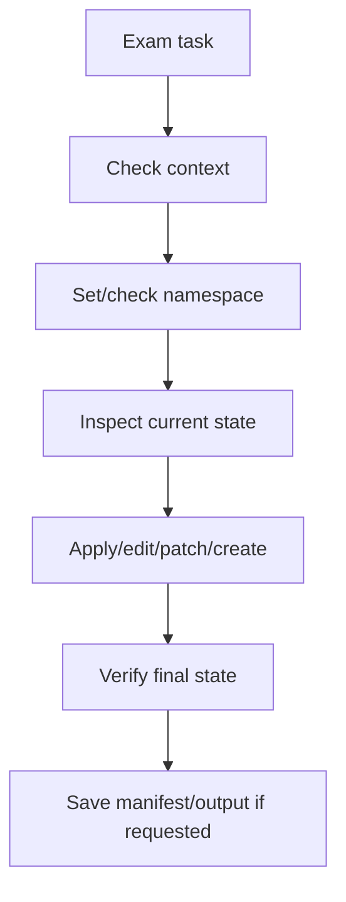

# 7 - Command Labs and Verification Playbook

## Why This Chapter Matters

CKA is performance-based. You do not pass by knowing that Kubernetes has an API server. You pass by changing a real cluster and proving the final state.

This chapter turns commands into administrator reasoning:

```text
command -> purpose -> expected output -> bad output -> interpretation -> next action
```

Official source baseline:

- CKA exam page: <https://training.linuxfoundation.org/certification/certified-kubernetes-administrator-cka/>
- kubectl quick reference: <https://kubernetes.io/docs/reference/kubectl/quick-reference/>
- Kubernetes documentation: <https://kubernetes.io/docs/>

Source check date: 2026-05-27. The official Linux Foundation page currently lists CKA as based on Kubernetes v1.34 and states that the environment aligns with recent Kubernetes minor versions within approximately 4 to 8 weeks after release. Recheck the official page before booking.

## The Big Picture

```text
read task
-> confirm context and namespace
-> inspect current state
-> make smallest correct change
-> verify with get/describe/logs/events/connectivity
-> save required output/manifests
```



## Lab 1: Context and Namespace Safety

### Command

```bash
kubectl config current-context
kubectl config get-contexts
kubectl config set-context --current --namespace=<namespace>
```

### Purpose

Confirm where commands will run and reduce namespace mistakes.

### Expected Output

`current-context` prints one context name. `get-contexts` marks the active context with `*`. Setting namespace returns a context-modified message.

### Bad Output

- Wrong context active.
- Namespace in prompt does not match task.
- `error: no context exists`.

### Interpretation

Do not create resources until context and namespace match the task. A technically correct manifest in the wrong namespace is wrong.

## Lab 2: Fast Object Inspection

### Command

```bash
kubectl get nodes -o wide
kubectl get pods -A -o wide
kubectl get deploy,rs,pod,svc -n <namespace> -o wide
kubectl get events -n <namespace> --sort-by=.lastTimestamp
```

### Purpose

Build a quick picture of node health, workload placement, controller state, Services, and recent errors.

### Expected Output

- Nodes show `Ready`.
- Pods show expected namespace, node, IP, and readiness.
- Deployments show desired/current/ready counts aligned.
- Events show normal scheduling/pulling/started events after a successful change.

### Bad Output

- Node `NotReady`.
- Pod `Pending`, `CrashLoopBackOff`, `ImagePullBackOff`, `CreateContainerConfigError`.
- Deployment ready count lower than desired.
- Events mention insufficient resources, failed image pull, failed mount, or forbidden.

### Interpretation

`get` shows symptoms. `describe` and logs explain causes.

## Lab 3: Describe, Logs, and Events

### Command

```bash
kubectl describe pod -n <namespace> <pod>
kubectl logs -n <namespace> <pod>
kubectl logs -n <namespace> <pod> -c <container>
kubectl logs -n <namespace> <pod> --previous
```

### Purpose

Diagnose application and kubelet-level failures.

### Expected Output

- `describe` shows container states, conditions, volumes, node, and events.
- `logs` shows application stdout/stderr.
- `--previous` shows logs from a crashed previous container instance.

### Bad Output

- `pod not found`: wrong namespace/name.
- `container not found`: multi-container Pod and wrong container name.
- `previous terminated container not found`: no previous crash for that container.
- Events show `FailedScheduling`, `FailedMount`, `BackOff`, `Failed`.

### Interpretation

Use `describe` for Kubernetes lifecycle evidence. Use logs for application process evidence.

## Lab 4: Generate Manifests Quickly

### Command

```bash
kubectl create deployment web --image=nginx:1.27 --replicas=3 --dry-run=client -o yaml > web.yaml
kubectl run debug --image=busybox:1.36 --restart=Never --dry-run=client -o yaml > debug.yaml
kubectl expose deployment web --port=80 --target-port=8080 --dry-run=client -o yaml > svc.yaml
```

### Purpose

Avoid writing boilerplate YAML from memory.

### Expected Output

YAML file is created with valid `apiVersion`, `kind`, `metadata`, and `spec`.

### Bad Output

- Redirection path wrong.
- Generated selector/labels need adjustment.
- `targetPort` wrong for application.

### Interpretation

Generated YAML is a skeleton, not a guarantee of correctness. Read and edit it before applying.

## Lab 5: RBAC Verification

### Command

```bash
kubectl create role pod-reader --verb=get,list,watch --resource=pods -n dev
kubectl create rolebinding read-pods --role=pod-reader --serviceaccount=dev:app-sa -n dev
kubectl auth can-i list pods -n dev --as=system:serviceaccount:dev:app-sa
kubectl auth can-i delete pods -n dev --as=system:serviceaccount:dev:app-sa
```

### Purpose

Create and verify least-privilege access.

### Expected Output

- `yes` for allowed verbs/resources.
- `no` for denied verbs/resources.

### Bad Output

- `no` for expected permission: wrong namespace, subject, binding, role, or verb.
- `yes` for too much permission: binding too broad, ClusterRoleBinding used accidentally.

### Interpretation

RBAC work is not complete until `kubectl auth can-i` proves the intended permission and denial.

## Lab 6: Static Pod Control Plane Check

### Command

```bash
ls /etc/kubernetes/manifests
sudo crictl ps
sudo journalctl -u kubelet -xe
```

### Purpose

Troubleshoot kubeadm-style control-plane static Pods and kubelet behavior.

### Expected Output

Static Pod manifests such as `kube-apiserver.yaml`, `kube-controller-manager.yaml`, `kube-scheduler.yaml`, and `etcd.yaml` exist on control-plane nodes.

### Bad Output

- Manifest missing or malformed.
- kubelet logs show static Pod parse errors.
- control-plane containers restarting.

### Interpretation

For kubeadm clusters, kubelet watches static Pod manifests. Bad YAML here can break control-plane components.

## Lab 7: Service and DNS Debugging

### Command

```bash
kubectl get svc,endpoints,endpointslice -n <namespace>
kubectl run curl --image=curlimages/curl:8.7.1 --restart=Never -it --rm -- sh
curl http://<service-name>.<namespace>.svc.cluster.local:<port>
nslookup <service-name>.<namespace>.svc.cluster.local
```

### Purpose

Verify Service selector, endpoints, DNS, and application reachability.

### Expected Output

- Service exists with expected port.
- EndpointSlice contains Pod IPs.
- DNS resolves service name.
- curl returns expected response.

### Bad Output

- Service exists but no endpoints: selector does not match Pod labels or Pods not ready.
- DNS fails: CoreDNS or namespace/name error.
- Connection refused: Pod listening on different port or app not running.
- Timeout: NetworkPolicy, routing, kube-proxy, or app issue.

### Interpretation

Service debugging is a chain:

```text
Service selector -> endpoints -> DNS -> network policy -> target port -> app process
```

## Lab 8: Storage Verification

### Command

```bash
kubectl get storageclass
kubectl get pv,pvc -n <namespace>
kubectl describe pvc -n <namespace> <pvc>
kubectl describe pod -n <namespace> <pod>
```

### Purpose

Confirm dynamic provisioning, binding, access mode, and Pod volume mount status.

### Expected Output

- PVC status `Bound`.
- PV reclaim policy and storage class are as expected.
- Pod volume mounts succeed.

### Bad Output

- PVC `Pending`: no matching PV, no default/proper StorageClass, provisioner issue.
- Pod `ContainerCreating` with mount errors.
- Access mode mismatch.

### Interpretation

Storage has two stages: claim binding and Pod mounting. Diagnose both.

## Small Details That Matter Later

- CKA tasks often specify context and namespace; wrong context makes everything wrong.
- `kubectl get` shows state; `describe` explains lifecycle evidence.
- `events` are chronological clues, not noise.
- `--dry-run=client -o yaml` creates a starting point, not a finished answer.
- `auth can-i` should test both allowed and denied actions.
- Static Pod mistakes can break the control plane quickly.
- EndpointSlice is the modern endpoint data path; `endpoints` may still be useful for quick checks.
- A Service with no endpoints usually means selector/readiness mismatch.
- PVC `Bound` does not prove the Pod mounted it successfully.

## Questions to Test Understanding

1. Why should you check context before every exam task?
2. What is the difference between `kubectl get` and `kubectl describe`?
3. Why should RBAC tasks be verified with `auth can-i`?
4. What does a Service with no endpoints usually indicate?
5. Why can PVC be `Bound` while a Pod still fails?

## Answers and Reasoning

1. The exam can use multiple clusters/contexts; changes in the wrong context do not answer the task.
2. `get` summarizes current object state; `describe` includes detailed fields, conditions, and events.
3. RBAC YAML can look correct while binding the wrong subject, namespace, role, or verb.
4. Selector does not match ready Pods, Pods are not ready, or labels are wrong.
5. Binding only attaches PVC to PV; Pod mount can still fail due to node/plugin/permission/path issues.

