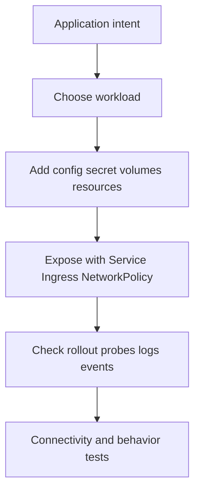

# 6 - Application Command Labs and Verification Playbook

## Why This Chapter Matters

CKAD measures whether you can describe and fix application behavior in Kubernetes quickly. YAML that applies successfully is not enough. The app must run, receive config, expose the right port, pass probes, roll out safely, and be debuggable.

Use this pattern:

```text
generate -> edit -> apply -> observe -> verify behavior
```

Official source baseline:

- CKAD exam page: <https://training.linuxfoundation.org/certification/certified-kubernetes-application-developer-ckad/>
- kubectl quick reference: <https://kubernetes.io/docs/reference/kubectl/quick-reference/>
- Kubernetes documentation: <https://kubernetes.io/docs/>

Source check date: 2026-05-27. The official Linux Foundation page currently lists CKAD as based on Kubernetes v1.35 and states that the environment aligns with recent Kubernetes minor versions within approximately 4 to 8 weeks after release. Recheck before booking.

## The Big Picture



## Lab 1: Generate Pod and Deployment YAML

### Command

```bash
kubectl run app --image=nginx:1.27 --restart=Never --dry-run=client -o yaml > pod.yaml
kubectl create deployment app --image=nginx:1.27 --replicas=3 --dry-run=client -o yaml > deploy.yaml
```

### Purpose

Create valid starting manifests quickly.

### Expected Output

YAML files with correct `apiVersion`, `kind`, metadata, and container image.

### Bad Output

- Wrong workload type for the task.
- Missing labels or selectors needed by Service.
- Wrong namespace if applied without `-n` or metadata namespace.

### Interpretation

Generated YAML is a draft. CKAD tasks usually require precise edits: command, args, env, probes, resources, labels, or volumes.

## Lab 2: ConfigMap and Secret Consumption

### Command

```bash
kubectl create configmap app-config --from-literal=LOG_LEVEL=info --dry-run=client -o yaml > cm.yaml
kubectl create secret generic app-secret --from-literal=PASSWORD=change-me --dry-run=client -o yaml > secret.yaml
```

### Purpose

Create configuration and secret objects for Pods.

### Expected Output

ConfigMap stores plain config data. Secret stores base64-encoded data, not automatically strong encryption.

### Bad Output

- Secret value accidentally placed in ConfigMap.
- Pod references wrong key.
- Environment variable name misspelled.
- Mounted path not where app expects.

### Interpretation

Verify both object existence and Pod consumption:

```bash
kubectl describe pod <pod>
kubectl exec <pod> -- printenv LOG_LEVEL
```

## Lab 3: Probes and Rollout Safety

### YAML Shape

```yaml
readinessProbe:
  httpGet:
    path: /healthz
    port: 8080
  initialDelaySeconds: 5
  periodSeconds: 10
livenessProbe:
  httpGet:
    path: /livez
    port: 8080
  initialDelaySeconds: 15
  periodSeconds: 20
```

### Purpose

Readiness controls traffic eligibility. Liveness restarts stuck containers.

### Expected Output

```bash
kubectl rollout status deployment/app
kubectl get pods -o wide
```

Deployment reaches available state and Pods become ready.

### Bad Output

- Ready count stays 0.
- Events show probe failed.
- Liveness probe restarts healthy-but-slow app repeatedly.

### Interpretation

Do not use liveness probe as a startup delay workaround. If startup is slow, use startupProbe or tune initial delay.

## Lab 4: Service Selector Verification

### Command

```bash
kubectl expose deployment app --port=80 --target-port=8080 --dry-run=client -o yaml > svc.yaml
kubectl get svc,endpoints,endpointslice
```

### Purpose

Expose Pods through a stable Service.

### Expected Output

Service exists and EndpointSlice contains Pod IPs.

### Bad Output

- Service has no endpoints.
- `targetPort` does not match container port.
- Selector labels do not match Pod labels.

### Interpretation

Service chain:

```text
Service selector -> matching ready Pods -> EndpointSlice -> kube-proxy/data plane -> targetPort -> container
```

## Lab 5: Rollout and Rollback

### Command

```bash
kubectl set image deployment/app app=nginx:1.28
kubectl rollout status deployment/app
kubectl rollout history deployment/app
kubectl rollout undo deployment/app
```

### Purpose

Change application image and recover if rollout fails.

### Expected Output

Rollout completes and new ReplicaSet becomes active.

### Bad Output

- `ImagePullBackOff`: wrong image or registry issue.
- rollout times out: readiness failing or app crash.
- undo does not recover because previous image/config also bad.

### Interpretation

Rollout is controller behavior. Always inspect Deployment, ReplicaSets, Pods, and events together.

## Lab 6: Debug a Failing App

### Command

```bash
kubectl get pod -o wide
kubectl describe pod <pod>
kubectl logs <pod>
kubectl logs <pod> --previous
kubectl exec -it <pod> -- sh
kubectl get events --sort-by=.lastTimestamp
```

### Purpose

Find why a workload is not running correctly.

### Bad Output Patterns

| Status | Likely cause |
| --- | --- |
| `ImagePullBackOff` | image name/tag/registry/pull secret |
| `CrashLoopBackOff` | app exits repeatedly |
| `CreateContainerConfigError` | missing ConfigMap/Secret or bad env reference |
| `Pending` | scheduling/resource/PVC issue |
| `Running` not ready | readiness probe failure |

### Interpretation

Separate Kubernetes setup failure from application process failure.

## Lab 7: Temporary Test Pod

### Command

```bash
kubectl run curl --image=curlimages/curl:8.7.1 --restart=Never -it --rm -- sh
curl http://app.<namespace>.svc.cluster.local
```

### Purpose

Test in-cluster Service connectivity.

### Expected Output

HTTP response or expected application output.

### Bad Output

- DNS failure: wrong name/namespace or CoreDNS issue.
- timeout: NetworkPolicy/routing/app listen issue.
- connection refused: target Pod not listening on target port.

## Small Details That Matter Later

- CKAD is application-focused; do not over-study kubeadm at the cost of app YAML speed.
- `command` is entrypoint override; `args` are arguments.
- Readiness controls Service endpoints.
- Liveness restarts containers; bad liveness probes create restart loops.
- `Secret` values are base64-encoded; base64 is not encryption.
- Service selectors must match Pod template labels, not Deployment name.
- NetworkPolicy only works if the CNI plugin enforces it.
- Resource requests affect scheduling; limits affect runtime throttling/kill behavior.
- Helm/Kustomize tasks still require validating rendered Kubernetes objects.

## Questions to Test Understanding

1. Why is readiness different from liveness?
2. What does `CreateContainerConfigError` often indicate?
3. Why can a Service have no endpoints?
4. Why use a temporary curl Pod?
5. Why is applying YAML not enough?

## Answers and Reasoning

1. Readiness controls whether traffic is sent; liveness controls whether kubelet restarts the container.
2. Missing or invalid config/secret/env/volume references.
3. Selector mismatch, Pods not ready, or no matching Pods.
4. It tests connectivity from inside the cluster, where Services and cluster DNS are meaningful.
5. The resource can be accepted by API server while the app still fails runtime behavior.

