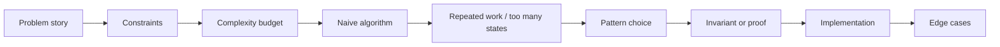

# 01 - Complexity Foundations, Arrays, Strings, Sorting, and Hashing

## Why This Chapter Matters

Competitive programming begins before coding. It begins when you read the constraints and decide what kind of algorithm can possibly pass.

The sample tests tell you what the problem means. The constraints tell you what strategy is allowed.

Cause -> Mechanism -> Immediate Result -> Long-Term Impact -> Next Connected Topic:

```text
brute force follows the story but ignores scale
-> constraints reveal time and memory budget
-> complexity analysis eliminates impossible approaches
-> arrays, strings, sorting, and hashing become first pattern tools
-> binary search, two pointers, DP, graphs, and range data structures
```

Source baseline:

- cp-algorithms main index: <https://cp-algorithms.com/>
- cp-algorithms sorting/search/data structure references are used as backbone.
- C++ STL references from cppreference apply to implementation details.

Version assumption: examples use C++17/C++20-compatible competitive programming style. Some contest shortcuts such as `bits/stdc++.h` are common but non-standard.

## The Big Picture

```text
problem statement -> constraints -> naive idea -> bottleneck -> optimized pattern -> proof -> implementation -> edge cases
```



## First-Principles Explanation

### Why Complexity Comes First

If `n <= 20`, exponential backtracking may work.

If `n <= 2e5`, O(n^2) usually will not.

If `n <= 1e6`, O(n log n) may work but memory matters.

If there are many test cases, total input size matters more than one test.

Approximate guide:

| Constraint | Often feasible |
| --- | --- |
| `n <= 20` | O(2^n), bitmask, backtracking |
| `n <= 500` | O(n^3) sometimes |
| `n <= 5000` | O(n^2) sometimes |
| `n <= 2e5` | O(n log n), O(n) |
| `n <= 1e6` | O(n), careful memory |

These are not laws. Time limit, language, constants, and total input matter.

### Arrays as the First Data Model

Most CP problems reduce to:

```text
sequence of values
-> query, transform, count, partition, sort, search, or optimize
```

Array questions often hide:

- repeated range calculations
- duplicate detection
- order constraints
- local vs global optimum
- monotonicity
- frequency counting

### Sorting as Structure Creation

Sorting is not only arranging values. Sorting creates exploitable structure:

- equal items become adjacent
- smaller/larger relationship becomes explicit
- greedy choices become easier
- binary search becomes possible
- two pointers become possible

### Hashing as Fast Memory

Hash maps/sets let you remember what you have seen:

- duplicate detection
- frequency counting
- prefix-sum lookup
- graph adjacency labels
- string fingerprints, with collision caveats

## Core Vocabulary

| Term | Meaning | Why it matters |
| --- | --- | --- |
| Time complexity | Growth of operations with input size. | Predicts feasibility. |
| Space complexity | Growth of memory use. | Prevents MLE. |
| Invariant | Statement kept true during algorithm. | Proof and debugging tool. |
| Frequency map | Count of occurrences. | Common hashing pattern. |
| Stable sort | Equal elements keep relative order. | Sometimes needed for tie behavior. |
| Comparator | Defines ordering. | Wrong comparator causes wrong sort. |
| Hash collision | Different keys map to same bucket/hash. | Usually handled by containers, but string rolling hash needs care. |
| Edge case | Small or extreme input that breaks assumptions. | Source of hidden test failures. |

## Algorithm Template

For every solution, force this sequence:

1. Naive approach.
2. Why naive fails.
3. Optimized idea.
4. Proof intuition.
5. Complexity.
6. Dry run.
7. Implementation.
8. Edge cases.
9. Common bugs.

## Pattern 1: Frequency Counting

### Problem Family

Given values, count occurrences or decide whether duplicates/requirements exist.

### Naive Approach

For each item, scan all previous items.

Complexity: O(n^2).

### Why Naive Fails

For `n = 2e5`, O(n^2) is too large.

### Optimized Idea

Use a hash map or array frequency table.

### Implementation

```cpp
std::unordered_map<int, int> freq;
for (int x : a) {
    ++freq[x];
}
```

If values are small and non-negative:

```cpp
std::vector<int> freq(max_value + 1);
for (int x : a) {
    ++freq[x];
}
```

### Edge Cases

- negative values
- very large values
- many test cases
- integer overflow in counts

### Common Bugs

- using vector frequency when values are huge
- forgetting to clear map between test cases
- assuming unordered_map worst-case is impossible

## Pattern 2: Sorting for Greedy Structure

### Problem Family

Choose pairs, intervals, minimum removals, scheduling, or nearest values.

### Naive Approach

Try all pairings or schedules.

### Why Naive Fails

Choices explode combinatorially.

### Optimized Idea

Sort by a key that makes the local decision safe.

Example interval scheduling:

```text
sort by finishing time
choose earliest finishing interval compatible with previous choice
```

### Proof Intuition

The earliest finishing interval leaves at least as much room for future intervals as any later finishing choice.

### Implementation

```cpp
std::sort(intervals.begin(), intervals.end(), [](const auto& a, const auto& b) {
    if (a.end != b.end) return a.end < b.end;
    return a.start < b.start;
});
```

Comparator rule:

```text
must define strict weak ordering
```

Bad comparator can make sort behavior invalid.

## Pattern 3: String Scanning

### Problem Family

Count characters, validate pattern, find longest segment, compare transformed strings.

### Naive Approach

For each substring, inspect characters.

### Why Naive Fails

There are O(n^2) substrings, and inspecting each can become O(n^3).

### Optimized Ideas

- frequency arrays for small alphabets
- two pointers/sliding window
- prefix counts
- hashing or KMP/Z for advanced pattern matching

### Simple Implementation

```cpp
std::array<int, 26> freq{};
for (char c : s) {
    ++freq[c - 'a'];
}
```

### Edge Cases

- uppercase/lowercase
- non-English characters if problem allows
- empty string
- one-character string
- repeated same character

## Small Details That Matter Later

- Read total constraints across test cases.
- Sorting O(n log n) is often good enough for `2e5`.
- Comparator must be strict; do not use `<=` in comparator.
- Use `long long` for sums and products when constraints demand.
- `unordered_map` has average O(1), not guaranteed worst-case O(1).
- Coordinate compression converts large values into compact indexes.
- String indexing can go out of bounds easily at boundaries.
- `size_t` is unsigned; mixing with int can create bugs.
- Always initialize arrays/vectors.
- When using multiple test cases, reset all per-case structures.
- Samples rarely cover maximum constraints.

## Common Misunderstandings

### Misunderstanding 1: "If it passes samples, complexity is fine."

Samples are semantic checks, not scale checks.

### Misunderstanding 2: "Sorting loses information."

Sorting loses original order unless you store indices. Sometimes original order matters, sometimes it does not.

### Misunderstanding 3: "Hash map is always safe."

Hash maps have overhead, can TLE under adversarial cases, and do not preserve order.

## Failure Modes / Mistakes / Traps

### Trap 1: Comparator Bug

```cpp
return a.end <= b.end; // wrong
```

Use strict comparison:

```cpp
return a.end < b.end;
```

### Trap 2: Overflow Before Assignment

```cpp
long long area = width * height;
```

If `width` and `height` are int, multiplication can overflow first.

Fix:

```cpp
long long area = 1LL * width * height;
```

### Trap 3: Per-Test State Leak

Global arrays/maps not reset between test cases.

## Debugging / Analysis / Answer-Writing Method

When solution gets TLE:

1. Compute complexity.
2. Multiply by total input size.
3. Find nested loops.
4. Check hidden O(n) operations inside loops.
5. Replace repeated scans with counts/prefix/sort/hash if valid.

When solution gets WA:

1. Test smallest cases.
2. Test duplicates.
3. Test sorted/reverse.
4. Test all equal.
5. Test max values for overflow.
6. Print invariant variables on a tiny counterexample.

## Real-World or Exam Relevance

Competitive programming builds the habit:

```text
constraints first, code second
```

This also helps real engineering: you choose data structures by access pattern, not habit.

## Connected Topics

- [Search Windows Prefix Sums and Monotonicity](02%20-%20Search%20Windows%20Prefix%20Sums%20and%20Monotonicity.md)
- [Recursion Backtracking Greedy and Dynamic Programming](03%20-%20Recursion%20Backtracking%20Greedy%20and%20Dynamic%20Programming.md)
- [Graphs Trees DSU and Shortest Paths](04%20-%20Graphs%20Trees%20DSU%20and%20Shortest%20Paths.md)

## Chapter Summary

The first CP skill is feasibility analysis.

Core rules:

```text
read constraints
derive complexity budget
identify repeated work
use arrays, sorting, and hashing to create structure
prove why the optimized pattern is valid
test edge cases before submitting
```

## Questions to Test Understanding

1. Why read constraints before coding?
2. Why is O(n^2) usually bad for `n = 2e5`?
3. What does sorting give you?
4. When should you use a frequency map?
5. Why is `<=` wrong in a sort comparator?
6. Why can `long long area = width * height` still overflow?
7. What is coordinate compression?
8. Why are samples not enough?
9. What state must be reset between test cases?
10. What is an invariant?

## Answers and Reasoning

1. Constraints determine feasible complexity.
2. It means about 4e10 operations, far beyond typical limits.
3. Ordered structure: adjacency of equals, monotonic order, greedy/binary-search/two-pointer possibilities.
4. When values are large/unbounded but you need counts or membership.
5. Comparators must be strict weak order; `<=` says an item is less than itself.
6. Multiplication happens in int before assignment unless promoted.
7. Mapping large values to compact ranks while preserving order/equality relationships.
8. Samples check basic interpretation, not all edge cases or scale.
9. Arrays, maps, visited flags, answers, queues, and temporary containers.
10. A statement kept true during algorithm execution, used for correctness proof.

