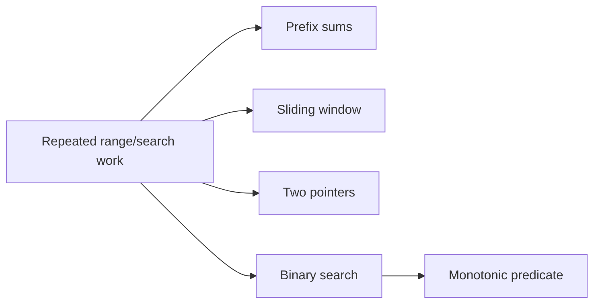

# 02 - Search, Windows, Prefix Sums, and Monotonicity

## Why This Chapter Matters

Binary search, two pointers, sliding windows, and prefix sums are the first major jump from brute force to pattern solving.

These techniques all remove repeated work:

```text
binary search -> discard half the answer space
two pointers -> move each pointer mostly once
sliding window -> update current segment instead of recomputing
prefix sums -> answer range sums by subtraction
```

Cause -> Mechanism -> Immediate Result -> Long-Term Impact -> Next Connected Topic:

```text
naive range/subarray/search scans repeat work
-> monotonicity and cumulative state let us reuse information
-> O(n^2) or O(n log answer) solutions become O(n), O(log n), or O(n log n)
-> DP, graph search, range trees, and optimization problems become approachable
```

Source baseline:

- cp-algorithms binary search: <https://cp-algorithms.com/num_methods/binary_search.html>
- cp-algorithms Fenwick tree for dynamic prefix sums: <https://cp-algorithms.com/data_structures/fenwick.html>

## The Big Picture



The hidden word is monotonicity:

```text
once true, always true
or
once false, always false
```

## Pattern 1: Prefix Sums

### Problem Family

Many range-sum queries on a static array.

### Naive Approach

For each query `[l, r]`, loop from `l` to `r`.

Complexity: O(qn) worst case.

### Why Naive Fails

Large `q` and `n` repeat the same additions.

### Optimized Idea

Precompute:

```text
pref[i + 1] = sum of a[0..i]
```

Then:

```text
sum(l, r) = pref[r + 1] - pref[l]
```

### Implementation

```cpp
std::vector<long long> pref(n + 1, 0);
for (int i = 0; i < n; ++i) {
    pref[i + 1] = pref[i] + a[i];
}

auto range_sum = [&](int l, int r) {
    return pref[r + 1] - pref[l];
};
```

### Edge Cases

- `l = 0`
- `r = n - 1`
- negative values
- overflow
- one-element range

### Common Bugs

- mixing 0-based and 1-based indexing
- using int for sums
- wrong `r + 1`

## Pattern 2: Difference Array

### Problem Family

Many range-add updates, final array needed after all updates.

### Naive Approach

For each update, modify every index in `[l, r]`.

### Optimized Idea

Mark only boundaries:

```text
diff[l] += x
diff[r + 1] -= x
```

Then prefix-sum the diff.

### Implementation

```cpp
std::vector<long long> diff(n + 1);
for (auto [l, r, x] : updates) {
    diff[l] += x;
    if (r + 1 < n) diff[r + 1] -= x;
}

std::vector<long long> a(n);
long long cur = 0;
for (int i = 0; i < n; ++i) {
    cur += diff[i];
    a[i] = cur;
}
```

## Pattern 3: Sliding Window

### Problem Family

Find longest/shortest subarray satisfying a condition where window can be adjusted monotonically.

Example: longest subarray with sum <= K for non-negative numbers.

### Naive Approach

Try every `[l, r]` and compute sum.

### Why Naive Fails

O(n^2) ranges.

### Optimized Idea

Maintain a window `[l, r]`. Expand right; shrink left until valid.

### Implementation

```cpp
int best = 0;
long long sum = 0;
int l = 0;

for (int r = 0; r < n; ++r) {
    sum += a[r];
    while (sum > k) {
        sum -= a[l++];
    }
    best = std::max(best, r - l + 1);
}
```

### Proof Intuition

With non-negative values, increasing `r` cannot decrease sum, and increasing `l` cannot increase sum. Each pointer moves at most `n` times.

### Trap

This exact method fails with negative numbers because monotonicity breaks.

## Pattern 4: Two Pointers After Sorting

### Problem Family

Pair sum, closest pair, count pairs satisfying inequality.

### Example: Pair Sum

```cpp
std::sort(a.begin(), a.end());
int l = 0, r = n - 1;
while (l < r) {
    long long sum = 1LL * a[l] + a[r];
    if (sum == target) {
        return true;
    } else if (sum < target) {
        ++l;
    } else {
        --r;
    }
}
return false;
```

Proof intuition:

- if sum too small, increasing left is the only useful move
- if sum too large, decreasing right is the only useful move

## Pattern 5: Binary Search on Answer

### Problem Family

Find minimum/maximum value satisfying a monotonic condition.

Example:

```text
minimum capacity needed to ship packages within D days
```

### Naive Approach

Try every possible capacity.

### Optimized Idea

Define predicate:

```text
can(capacity) = true if capacity is enough
```

If capacity works, any larger capacity works. Monotonic.

### Implementation

```cpp
long long lo = max_weight;
long long hi = total_weight;

while (lo < hi) {
    long long mid = lo + (hi - lo) / 2;
    if (can(mid)) {
        hi = mid;
    } else {
        lo = mid + 1;
    }
}
std::cout << lo << '\n';
```

### Common Bugs

- wrong bounds
- infinite loop
- midpoint overflow
- predicate not monotonic
- returning `hi`/`lo` without invariant clarity

## Small Details That Matter Later

- Prefix arrays of size `n + 1` simplify `l = 0` cases.
- Difference arrays are for offline updates; Fenwick/segment tree handle online updates.
- Sliding window with sum constraints usually needs non-negative values.
- Binary search is about monotonic predicate, not just sorted arrays.
- Use `mid = lo + (hi - lo) / 2` to avoid overflow.
- Decide whether searching first true, last true, first false, or maximum feasible.
- Store original indices before sorting if output requires them.
- For strings, sliding window often uses frequency arrays/maps.
- For many test cases, total `n` matters.

## Common Misunderstandings

### Misunderstanding 1: "Sliding window works for every subarray sum."

Negative numbers break monotonicity.

### Misunderstanding 2: "Binary search only searches arrays."

It searches any ordered answer space with monotonic predicate.

### Misunderstanding 3: "Prefix sums handle updates."

Static prefix sums handle static range queries. Updates require rebuilding or dynamic structures.

## Failure Modes / Mistakes / Traps

### Trap 1: Off-by-One in Prefix Sum

Wrong:

```cpp
pref[r] - pref[l]
```

for inclusive `[l, r]` with `pref[i+1]` convention.

Correct:

```cpp
pref[r + 1] - pref[l]
```

### Trap 2: Binary Search Without Invariant

Write down:

```text
lo is candidate lower bound
hi is candidate upper bound
answer is in [lo, hi]
```

### Trap 3: Window Condition Not Monotonic

If adding an element can both fix and break condition unpredictably, simple two-pointer window may fail.

## Debugging / Analysis / Answer-Writing Method

For range problems:

1. Is array static or updated?
2. Are queries online or offline?
3. Is operation invertible, like sum?
4. Can prefix/difference solve it?
5. If updates exist, consider Fenwick/segment tree.

For binary search:

1. Define predicate in one sentence.
2. Prove monotonicity.
3. Set safe low/high.
4. Choose first-true or last-true template.
5. Dry run two-element interval.

## Real-World or Exam Relevance

These are high-frequency patterns in contests and interviews because they test whether you can remove repeated work without overcomplicating the solution.

Strong answer:

```text
I first identify repeated range or search work. Prefix sums remove repeated static range sums, sliding windows work when window validity changes monotonically, two pointers exploit sorted order, and binary search works on any monotonic predicate over an ordered answer space.
```

## Connected Topics

- [Complexity Foundations Arrays Strings Sorting and Hashing](01%20-%20Complexity%20Foundations%20Arrays%20Strings%20Sorting%20and%20Hashing.md)
- [Range Data Structures Number Theory and String Patterns](05%20-%20Range%20Data%20Structures%20Number%20Theory%20and%20String%20Patterns.md)

## Chapter Summary

Prefix sums, difference arrays, sliding windows, two pointers, and binary search are all repeated-work killers.

The central skill is recognizing monotonicity and cumulative structure.

## Questions to Test Understanding

1. Why use `pref` of size `n + 1`?
2. When does sliding window fail for sum constraints?
3. What is binary search on answer?
4. Why sort before two pointers?
5. What is the difference between prefix sum and difference array?
6. Why do updates break static prefix sums?
7. What must be true about a binary-search predicate?
8. Why use `lo + (hi - lo) / 2`?
9. What is an offline update?
10. What is the first thing to write before binary search code?

## Answers and Reasoning

1. It makes empty prefix and `l = 0` ranges clean.
2. When negative values break monotonicity of window sum.
3. Searching a value domain for the first/last value satisfying a monotonic predicate.
4. Sorted order makes pointer moves logically discard impossible pairs.
5. Prefix sums answer static range queries; difference arrays apply many range updates before final reconstruction.
6. One element update changes many prefix values.
7. It must be monotonic over the search space.
8. To avoid overflow in `lo + hi`.
9. Updates are known before queries/output, so they can be processed collectively.
10. The invariant or predicate definition.

