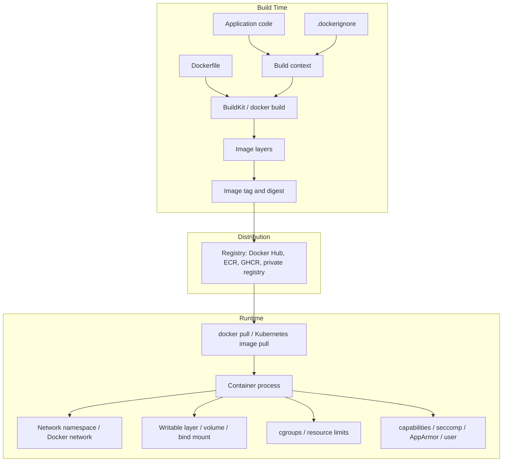

# 00 - Docker Roadmap and Source Backbone

## Why This Chapter Matters

Docker is not just a command-line tool. It is a packaging and runtime model that changed how software moves from a developer laptop to CI, staging, production, and eventually orchestration platforms such as Kubernetes.

The student who only memorizes `docker run` learns commands. The student who understands the causal chain understands modern delivery:

```text
deployment pain -> containers -> images -> layers -> registries -> orchestration -> Kubernetes
```

That chain explains why Docker exists, why its design looks the way it does, and why Kubernetes depends so heavily on container images.

## The Big Picture

Before containers became common, teams often shipped instructions instead of a repeatable runtime:

- Install this language version.
- Install these OS packages.
- Configure this environment variable.
- Put the config file in this path.
- Run this startup command.
- Hope staging and production match.

This created a predictable failure pattern:

```text
manual setup -> environment drift -> inconsistent behavior -> slow debugging -> risky deployment
```

Docker changes the unit of delivery. Instead of shipping only application code and a checklist, you build a container image that includes the runtime filesystem, dependencies, metadata, and default startup command. That image can be run as a container by Docker locally, by CI for tests, by Compose for local multi-service development, or by Kubernetes as part of a Pod.

## Version and Source Assumptions

- Source check date: 2026-05-26.
- Primary source family: current Docker documentation and Kubernetes image documentation.
- Primary runtime assumption: Linux containers on Docker Engine / Docker CLI.
- Compose assumption: Docker Compose v2 and the current Compose Specification.
- Docker Desktop note: on macOS and Windows, Docker Desktop runs Linux containers through a Linux VM. That changes some filesystem, network, host path, and performance details.
- Kubernetes note: Kubernetes consumes container images from registries. Modern Kubernetes nodes use CRI-compatible runtimes; a Docker-built image can still be pushed to a registry and used in a Pod.

When a behavior can vary by operating system, Docker Desktop, Compose version, storage driver, registry, or Kubernetes distribution, the notes mark it as version-sensitive or platform-sensitive.

## First-Principles Explanation

An application needs more than source code to run. It needs a runtime, libraries, OS-level files, environment variables, network access, storage, and a start command. If each server assembles those pieces manually, every server becomes a slightly different machine. Small differences eventually become production failures.

Docker's design is a response to that problem:

Cause: deployment environments drift.

Mechanism: put the application and its runtime filesystem into an image.

Immediate result: the same image can be run repeatedly.

Long-term impact: CI, deployment, rollback, and scaling can operate on immutable artifacts rather than hand-built servers.

Next connected topic: once images are repeatable, many machines can run them, which leads naturally to orchestration and Kubernetes.

## Core Vocabulary

| Term | Meaning | Why it matters |
| --- | --- | --- |
| Dockerfile | Text recipe for building an image. | Makes runtime setup reviewable and repeatable. |
| Build context | Files sent to the builder during `docker build`. | Large or leaky contexts slow builds and can expose secrets. |
| Image | Read-only package used to create containers. | Main deployment artifact. |
| Layer | Immutable filesystem change inside an image. | Explains cache, image size, rebuild speed, and secret leakage. |
| Container | Running instance of an image plus runtime configuration. | The actual process that consumes CPU, memory, network, and storage. |
| Registry | Service that stores and distributes images. | Lets CI build once and deploy elsewhere. |
| Tag | Human-readable image label such as `nginx:1.27`. | Convenient but mutable. |
| Digest | Content hash identifying an exact image. | Stronger for production reproducibility. |
| Volume | Docker-managed persistent storage. | Keeps important data outside the container writable layer. |
| Bind mount | Host path mounted into a container. | Useful for development, risky if writable in production. |
| Network | Docker-managed connectivity scope. | Explains container-to-container DNS and published ports. |
| Compose service | A container configuration inside a Compose file. | Replaces long `docker run` commands for local stacks. |
| Orchestrator | System that schedules and manages containers across machines. | Kubernetes is the dominant example. |

## Mental Model

Use two layers of mental model.

First, the build model:

```text
source code + Dockerfile + build context
        -> docker build / BuildKit
        -> image layers
        -> tagged image
        -> registry
```

Second, the runtime model:

```text
image + command + env + mounts + networks + limits
        -> container
        -> process running under host kernel isolation
```

A beginner often thinks "the container is the image." That is wrong in the same way that "a running program is the installer file" is wrong. The image is the packaged template. The container is the running process created from that template.

## Historical / Evolution / Causal Chain

### 1. Deployment Pain

Older deployments were often server-centric. A server was prepared by scripts, wiki pages, package installs, and manual fixes. Over time, each server accumulated differences. This created a painful question: if the same code works in one place and fails in another, is the bug in the code or in the machine?

Cause: machines were treated as long-lived pets.

Mechanism: manual package installs and configuration changes accumulated.

Immediate result: environments drifted.

Long-term impact: deployments became risky and hard to reproduce.

Next connected topic: packaging the environment with the application.

### 2. Containers

Containers made it practical to isolate an application process while still sharing the host kernel. Instead of booting a full guest OS like a VM, a container uses kernel features such as namespaces, cgroups, and capabilities to make a process believe it has its own filesystem view, process tree, network stack, and resource limits.

Cause: teams needed isolation lighter than VMs.

Mechanism: Linux kernel isolation features wrapped around normal processes.

Immediate result: faster startup and denser workloads.

Long-term impact: application packaging became portable enough for CI and cloud-native platforms.

Next connected topic: images as repeatable container templates.

### 3. Images

A container cannot be reliably created from vague instructions. It needs a filesystem and metadata. Docker images solve this by packaging files, dependencies, and defaults into a reusable artifact.

Cause: runtime setup needed to be repeatable.

Mechanism: Dockerfile instructions produce an image.

Immediate result: `docker run myapp:1.0.0` can create a predictable container.

Long-term impact: CI/CD can build, scan, tag, push, promote, and roll back artifacts.

Next connected topic: layers.

### 4. Layers

Images are built from layers because most images share common parts: base OS files, language runtimes, dependency downloads, and application code. Layers let Docker reuse unchanged filesystem changes instead of rebuilding or re-downloading everything.

Cause: images would be slow and wasteful if each build were one giant blob.

Mechanism: each build step creates or reuses immutable filesystem changes.

Immediate result: faster builds and smaller distribution when layers are shared.

Long-term impact: Dockerfile order becomes a performance and security concern.

Next connected topic: registries.

### 5. Registries

Once an image exists, other machines need to pull it. Registries solve distribution. CI can push an image, and deployment platforms can pull the exact artifact.

Cause: images need a shared distribution point.

Mechanism: push/pull image manifests and layers by name, tag, or digest.

Immediate result: any authorized environment can fetch the image.

Long-term impact: deployment becomes artifact promotion, not machine rebuilding.

Next connected topic: orchestration.

### 6. Orchestration

One container on one machine is useful. Hundreds of containers across many machines need scheduling, health management, networking, rollout, service discovery, storage coordination, policy, and recovery.

Cause: single-host container management does not solve distributed operations.

Mechanism: an orchestrator continuously compares desired state with actual state.

Immediate result: failed containers can be replaced, services discovered, deployments rolled out.

Long-term impact: Kubernetes becomes the natural next topic after Docker fundamentals.

Next connected topic: Pods, Deployments, Services, probes, ConfigMaps, Secrets, and container runtime interfaces.

## Architecture or Conceptual Structure



## Step-by-Step Learning Path

1. Learn what containers and images are.
2. Run existing images with `docker run`.
3. Inspect containers with `docker ps`, `docker logs`, `docker inspect`, and `docker exec`.
4. Build images from Dockerfiles.
5. Understand layers, cache, `.dockerignore`, tags, and digests.
6. Persist data with volumes and bind mounts.
7. Connect services with Docker networks and published ports.
8. Replace repeated `docker run` commands with Compose.
9. Debug logs, exits, DNS, mounts, permissions, builds, and disk usage.
10. Harden images and runtime settings.
11. Translate Docker knowledge into Kubernetes concepts.

## Internal Mechanics Overview

Docker is a client-server system. The `docker` CLI sends API requests to the Docker daemon. The daemon manages Docker objects such as images, containers, networks, and volumes. Under the hood, container execution is implemented through lower-level components and Linux kernel features.

Important internal layers:

- Docker CLI: user-facing command interface.
- Docker daemon: API server and object manager.
- BuildKit: modern build engine for Docker builds.
- containerd: container lifecycle manager used by Docker.
- runc: OCI runtime that creates containers using Linux kernel primitives.
- Kernel features: namespaces, cgroups, capabilities, seccomp, AppArmor/SELinux, overlay filesystems.

Do not confuse these layers. When `docker run` fails, the problem may be image pull, daemon access, container create, mount setup, network setup, runtime permissions, entrypoint execution, or application startup.

## Practical Examples

Run a short-lived command:

```bash
docker run --rm alpine:3.20 echo hello
```

Meaning:

- `docker run` creates and starts a new container.
- `--rm` removes the container after it exits.
- `alpine:3.20` is the image name and tag.
- `echo hello` overrides or supplies the runtime command.

Run a web server:

```bash
docker run -d --name web -p 8080:80 nginx:1.27
curl http://localhost:8080
docker logs web
docker stop web
docker rm web
```

Build an app image:

```bash
docker build -t myapp:dev .
docker run --rm -p 8080:8080 myapp:dev
```

Use Compose:

```bash
docker compose up -d
docker compose logs -f
docker compose down
```

## Small Details That Matter Later

- `docker run` creates a new container every time. `docker start` starts an existing stopped container.
- `latest` is just a tag, not a guarantee that the image is latest, stable, or production-safe.
- Image tags are convenient for humans; digests are better for exact reproducibility.
- Dockerfile layer order affects build cache. Put dependency manifest files before frequently changing source files.
- `.dockerignore` is both a speed tool and a security tool.
- `EXPOSE` does not publish a port. It documents an expected container port.
- Publishing a port may expose the application on all host interfaces by default, depending on the syntax and platform.
- Bind mounts can hide files that were baked into the image at the same container path.
- `docker compose down -v` can delete named volumes for the project. That can mean deleting local database data.
- Container logs are usually stdout/stderr of the main process. If the app writes only to internal files, `docker logs` may show little.

## Common Misunderstandings

| Misunderstanding | Correction |
| --- | --- |
| A container is a VM. | A Linux container is an isolated process sharing the host kernel. |
| An image is a running thing. | An image is a read-only template; a container is runtime state. |
| Docker makes apps secure automatically. | Docker provides isolation tools, but bad images, root users, secrets, privileged mode, and host mounts can still be dangerous. |
| Compose is Kubernetes for one machine. | Compose is a local multi-container app tool; Kubernetes is a distributed desired-state control system. |
| Volumes are only for databases. | Volumes are for any persistent or shared container data, but databases are the most obvious case. |
| If a container can ping the internet, the host can reach the container. | Outbound container traffic and inbound published ports are different directions. |

## Failure Modes / Mistakes / Traps

- Build fails because the file is outside the build context.
- Build is slow because `.dockerignore` is missing and the context includes `.git`, dependencies, logs, or build artifacts.
- Container exits immediately because the main process exits.
- Web app is unreachable because the app listens on `127.0.0.1` inside the container instead of `0.0.0.0`.
- Container-to-container calls use `localhost`, which points to the same container, not the other service.
- Database data disappears because it lived in the container writable layer.
- Permission errors appear because host UID/GID and container user do not match.
- A secret leaks because it was copied into an image layer.
- Production deploy changes unexpectedly because a mutable tag was reused.
- CI has host-level power because a job container mounted `/var/run/docker.sock`.

## Debugging / Analysis Method

Use this sequence before guessing:

```text
symptom -> container state -> logs -> inspect config -> networking/mounts/env -> image/build -> host/daemon
```

Commands:

```bash
docker ps -a
docker logs <container>
docker inspect <container>
docker exec -it <container> sh
docker network inspect <network>
docker volume inspect <volume>
docker system df
docker events
```

Interpretation habit:

- If the container is exited, read logs and exit code first.
- If logs are empty, inspect command/entrypoint and check whether the process started.
- If the app is unreachable, separate "container running" from "port published" from "app listening" from "host firewall".
- If data disappeared, check whether the data path was mounted.
- If build output is surprising, inspect the build context and cache boundaries.

## Real-World or Exam Relevance

Docker appears in:

- DevOps onboarding tasks.
- CI/CD pipelines.
- Cloud deployment artifacts.
- Kubernetes image workflows.
- Platform engineering interviews.
- Security reviews.
- Production incident debugging.
- Developer environment standardization.

Interviewers often use Docker questions to test whether the candidate understands operating-system boundaries, not just commands. A strong answer distinguishes image vs container, build time vs runtime, port exposure vs publishing, volume vs bind mount, tag vs digest, and Docker Compose vs Kubernetes.

## Connected Topics

- Linux namespaces and cgroups.
- OCI image and runtime specifications.
- CI/CD artifact promotion.
- Container registries.
- Kubernetes Pods, Deployments, Services, ConfigMaps, Secrets, probes, and image pull policies.
- Supply-chain security: SBOM, signing, scanning, provenance.
- Cloud container services: ECS, EKS, GKE, AKS, Cloud Run, App Runner.

## Chapter Summary

Docker exists because manual environment management failed at scale. Containers isolate processes. Images package runtime files. Layers make images efficient. Registries distribute images. Compose makes local multi-container systems manageable. Kubernetes takes the same image artifact and adds distributed orchestration.

If you remember only one thing from this roadmap, remember the causal chain:

```text
deployment pain -> container isolation -> image packaging -> layered reuse -> registry distribution -> orchestration -> Kubernetes
```

## Questions to Test Understanding

1. Why did Docker become useful even though virtual machines already existed?
2. Why is an image not the same thing as a container?
3. Why do layers matter for both performance and security?
4. Why is a registry necessary in CI/CD?
5. Why does Kubernetes care about images more than Docker commands?
6. Why can `latest` be dangerous in production?
7. Why is `docker compose down -v` risky?
8. Why does a container writing to its local filesystem not automatically persist important data?

## Answers and Reasoning

1. Docker gave teams lightweight process isolation and repeatable application packaging without booting a full guest OS for every application. VMs still matter for stronger isolation and different kernels, but containers are faster and denser for application delivery.
2. An image is a read-only package. A container is created from an image and adds runtime configuration, process state, network state, mounts, and a writable layer.
3. Layers make builds and pulls faster by reusing unchanged filesystem changes. They also matter for security because files and secrets added in an earlier layer may remain recoverable even if deleted later.
4. A registry lets CI publish a built image and lets other environments pull the same artifact. Without a registry, each environment would rebuild or manually copy images.
5. Kubernetes schedules Pods that reference images. It does not care whether the image was built by Docker, Buildah, Kaniko, or another OCI-compatible tool as long as the node runtime can pull and run it.
6. `latest` is mutable. The same deployment manifest can run different image content at different times if the tag changes.
7. `docker compose down -v` removes project volumes, which may include local database data.
8. The container writable layer belongs to that container. When the container is destroyed, data not stored in a volume, bind mount, or external storage can disappear.

## Source Backbone

- Docker overview: <https://docs.docker.com/get-started/docker-overview/>
- Docker image layers: <https://docs.docker.com/get-started/docker-concepts/building-images/understanding-image-layers/>
- Dockerfile best practices: <https://docs.docker.com/build/building/best-practices/>
- Docker storage: <https://docs.docker.com/engine/storage/>
- Docker bind mounts: <https://docs.docker.com/engine/storage/bind-mounts/>
- Docker networking: <https://docs.docker.com/engine/network/>
- Docker Compose Specification: <https://docs.docker.com/reference/compose-file/>
- Docker Engine security: <https://docs.docker.com/engine/security/>
- Docker rootless mode: <https://docs.docker.com/engine/security/rootless/>
- Kubernetes images: <https://kubernetes.io/docs/concepts/containers/images/>
