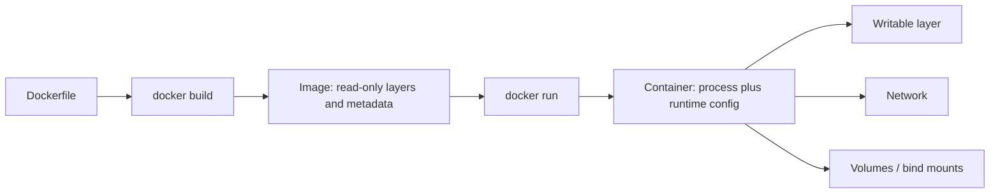

# 1 - Containers and Images

## Quick Summary

Docker helps you package an application with its dependencies into an image, then run that image as a container. This makes the application easier to run the same way on a laptop, CI server, test server, or production platform.

Beginner mental model:

```text
image = packaged app template
container = running app process created from that image
```

## Why Docker Matters

Without containers:

- App works on one machine but fails on another.
- Dependencies are installed manually.
- Multiple apps may fight over versions of Python, Node, Java, libraries, or system packages.
- CI/CD and production may use different setup steps.

With Docker:

- The app runs from a repeatable image.
- Dependencies are described in code.
- CI can build and test the same package that gets deployed.
- Local development can match the runtime more closely.

## First-Principles Explanation

An application does not run from source code alone. It needs a runtime, libraries, OS files, environment variables, a network path, and a start command. When those pieces are assembled manually on every machine, differences accumulate.

Docker's basic idea is to package the runtime filesystem and startup metadata into an image, then create a container from that image.

Cause: applications failed when machines differed.

Mechanism: package the application runtime as an image and run it through container isolation.

Immediate result: the same artifact can run on a laptop, CI worker, or server.

Long-term impact: deployment becomes image promotion rather than manual server repair.

Next connected topic: image layers and registries.

## Architecture or Conceptual Structure



The image is the packaged template. The container is what happens when Docker combines that template with runtime choices such as command, environment, ports, mounts, user, and limits.

## Container vs Virtual Machine

| Topic | Container | Virtual Machine |
| --- | --- | --- |
| Isolation | Process-level isolation using host kernel features. | Full guest operating system. |
| Startup | Usually seconds or less. | Usually slower. |
| Size | Often MBs to a few GBs. | Often GBs. |
| Kernel | Shares host kernel. | Has its own guest kernel. |
| Best for | Packaging apps and dependencies. | Stronger OS-level isolation or different operating systems. |

Containers are lighter than VMs, but they are not a complete security boundary by themselves.

## Core Terms

| Term | Meaning |
| --- | --- |
| Dockerfile | Text file containing image build instructions. |
| Image | Read-only package/template used to create containers. |
| Container | Running instance of an image. |
| Registry | Place where images are stored, such as Docker Hub, ECR, or GHCR. |
| Repository | Named image collection in a registry. |
| Tag | Image version label, such as `nginx:1.27`. |
| Layer | Reusable filesystem change created during image build. |
| Volume | Persistent storage managed by Docker. |
| Network | Docker-created network for container communication. |

## How Docker Runs An App

```text
docker run nginx
  -> Docker checks for local nginx image
  -> if missing, pulls image from registry
  -> creates a container filesystem from image layers
  -> starts the configured command
  -> attaches networking/storage as requested
```

## Image Names

Examples:

```text
nginx
nginx:1.27
python:3.12-slim
registry.example.com/team/api:v1.2.3
```

Format:

```text
[registry/][namespace/]repository[:tag]
```

If no tag is specified, Docker often uses `latest`. Do not rely on `latest` for production because it can change.

## Containers Are Ephemeral

Containers should be replaceable. If a container is deleted, data written only inside the container writable layer is usually lost.

For persistent data, use:

- Named volumes.
- Bind mounts.
- Databases or object storage.
- Managed storage in orchestrators such as Kubernetes.

Bad pattern:

```text
Store database data only inside an unnamed container filesystem.
```

Better pattern:

```text
Run database container with a named volume mounted at the data directory.
```

## When To Use Docker

Use Docker for:

- Local development environments.
- CI builds and tests.
- Packaging applications.
- Running services consistently.
- Learning Kubernetes/container basics.
- Isolating dependencies between projects.

## When Not To Use Docker

Avoid Docker when:

- A simple local script is enough.
- You need full VM isolation.
- The app depends heavily on host GUI/hardware and containerizing adds more complexity than value.
- Secrets or privileged host access would be handled carelessly.

## Benefits

- Repeatable runtime.
- Portable packaging.
- Faster local setup.
- CI/CD friendly.
- Good dependency isolation.
- Works well with orchestration tools.

## Drawbacks / Limitations

- Images can contain vulnerabilities.
- Containers still share the host kernel.
- Persistent storage must be designed explicitly.
- Networking adds another layer to debug.
- Dockerfiles can become slow or insecure if poorly written.

## Small Details That Matter Later

- A container is normally one main process, not a full system.
- Stopping a container stops the process but does not delete the image.
- Removing a container can delete data in its writable layer.
- Images are layered; bad Dockerfile order can slow builds.
- Container clocks, DNS, networking, and filesystem behavior come from the host and Docker configuration.

## Common Mistakes

| Mistake | Fix |
| --- | --- |
| Confusing image and container | Image is template; container is running instance. |
| Using `latest` everywhere | Use explicit tags. |
| Storing important data in container layer | Use volumes or external storage. |
| Treating Docker like a full VM | Run one main process and keep containers replaceable. |
| Ignoring image vulnerabilities | Rebuild, update, and scan images. |

## Interview Notes

- Docker image is immutable package; container is runtime instance.
- Containers share the host kernel.
- Dockerfile builds images.
- Registry stores images.
- Volumes persist data outside the container writable layer.
- Tags identify image versions but are mutable unless pinned by digest.

## Questions to Test Understanding

1. Why did containers become attractive even though VMs already existed?
2. Why is an image not the same as a container?
3. Why should container data be treated as ephemeral by default?
4. Why is `latest` unsafe as a production habit?
5. Why do registries matter in CI/CD?

## Answers and Reasoning

1. Containers provide process-level isolation and repeatable packaging with less overhead than booting a full guest operating system for every app.
2. An image is a read-only package. A container is a runtime instance with process state, env, mounts, network, and a writable layer.
3. Data written only to the container writable layer is tied to that container and may disappear when the container is removed.
4. `latest` is a mutable tag, not proof of newest or tested content. Production needs explicit versioning or digest discipline.
5. Registries let CI push built images and let deployment environments pull the same artifact.

## Related Topics

- [Docker CLI and Container Lifecycle](2%20-%20Docker%20CLI%20and%20Container%20Lifecycle.md)
- [Dockerfiles and Image Builds](3%20-%20Dockerfiles%20and%20Image%20Builds.md)
- [Certified Kubernetes Application Developer](../Certified%20Kubernetes%20Application%20Developer/INDEX.md)

## Official References

- [Docker overview](https://docs.docker.com/get-started/docker-overview/)
- [Docker image concepts](https://docs.docker.com/get-started/docker-concepts/the-basics/what-is-an-image/)
- [Docker container concepts](https://docs.docker.com/get-started/docker-concepts/the-basics/what-is-a-container/)
