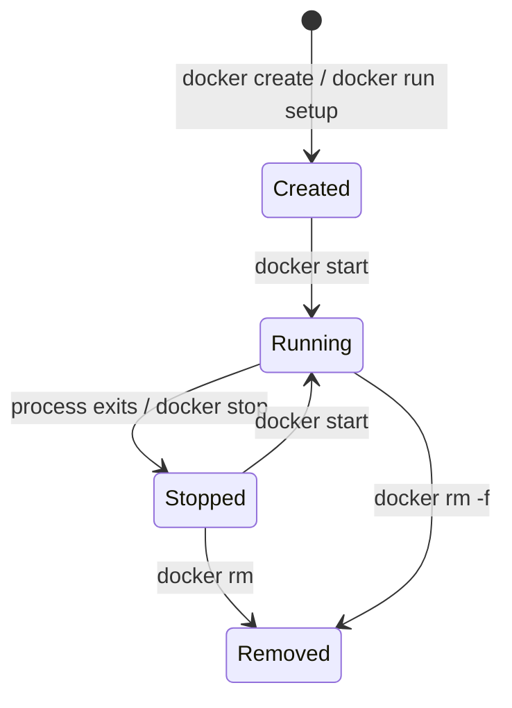

# 2 - Docker CLI and Container Lifecycle

## Quick Summary

The Docker CLI lets you pull images, run containers, inspect status, view logs, execute commands inside containers, publish ports, mount storage, and clean unused resources.

Most beginner Docker work uses this loop:

```text
docker pull -> docker run -> docker ps -> docker logs -> docker exec -> docker stop/rm
```

## Essential Commands

```bash
docker version
docker info
docker images
docker pull nginx:1.27
docker run nginx:1.27
docker ps
docker ps -a
docker stop <container>
docker rm <container>
docker rmi <image>
```

## First-Principles Explanation

The Docker CLI is a client for asking the Docker daemon to create, start, stop, inspect, and remove Docker objects. Most CLI confusion comes from not separating image operations from container operations.

Cause: a container has a lifecycle separate from the image it came from.

Mechanism: Docker stores container metadata, runtime configuration, logs, exit state, network attachments, mounts, and a writable layer.

Immediate result: a stopped container can still be inspected or restarted.

Long-term impact: operators can debug post-failure state instead of losing it immediately.

Next connected topic: logs, inspect output, and reproducible configuration.

## Lifecycle Diagram



`docker run` is a shortcut that creates and starts. `docker start` works only with a container that already exists.

## Running Containers

Run interactively:

```bash
docker run -it ubuntu:24.04 bash
```

Run in background:

```bash
docker run -d --name web nginx:1.27
```

Run and remove automatically when it exits:

```bash
docker run --rm alpine:3.20 echo hello
```

## Container Names

```bash
docker run -d --name web nginx:1.27
docker logs web
docker stop web
docker rm web
```

Names make commands easier than using long container IDs.

## Port Publishing

Containers have their own network namespace. To access a container from the host, publish a port.

```bash
docker run -d --name web -p 8080:80 nginx:1.27
```

Meaning:

```text
host port 8080 -> container port 80
```

Test:

```bash
curl http://localhost:8080
```

## Logs

```bash
docker logs web
docker logs -f web
docker logs --tail 100 web
```

Docker logs usually capture stdout and stderr from the container's main process.

## Execute A Command Inside A Container

```bash
docker exec -it web sh
```

Use this for debugging. Avoid manually changing production containers because changes are not captured in the image.

## Inspect Container Details

```bash
docker inspect web
```

Useful details:

- Image.
- Command.
- Environment variables.
- Mounts.
- Network settings.
- IP address.
- Restart policy.

## Copy Files

```bash
docker cp web:/etc/nginx/nginx.conf ./nginx.conf
docker cp ./index.html web:/usr/share/nginx/html/index.html
```

Use for debugging or quick local experiments. For repeatable changes, update the image or mount files properly.

## Container Lifecycle

```text
created -> running -> stopped -> removed
```

Commands:

```bash
docker create nginx
docker start <container>
docker stop <container>
docker restart <container>
docker rm <container>
```

## Restart Policies

```bash
docker run -d --restart unless-stopped --name web nginx:1.27
```

Common policies:

| Policy | Meaning |
| --- | --- |
| `no` | Do not restart automatically. |
| `on-failure` | Restart only if process exits non-zero. |
| `always` | Restart regardless of exit reason. |
| `unless-stopped` | Restart unless user explicitly stopped it. |

## Environment Variables

```bash
docker run -e APP_ENV=dev -e LOG_LEVEL=debug myapp:latest
```

From file:

```bash
docker run --env-file .env myapp:latest
```

Do not put real secrets in shared `.env` files.

## Cleaning Up

```bash
docker container prune
docker image prune
docker volume prune
docker network prune
docker system prune
```

Warning: prune commands delete unused resources. Be careful with volumes because they can contain important data.

## Benefits

- Fast local testing.
- Easy process isolation.
- Repeatable command patterns.
- Good troubleshooting tools.

## Drawbacks / Limitations

- CLI state can become messy without cleanup.
- Published ports can conflict.
- Debug changes inside containers are not persistent.
- Prune commands can delete useful local state.

## Small Details That Matter Later

- `docker run` creates a new container each time.
- `docker start` starts an existing stopped container.
- `docker exec` only works on running containers.
- A stopped container still exists and can be inspected.
- Removing a container does not remove its image.
- Removing an image does not remove running containers created from it.

## Common Mistakes

| Mistake | Fix |
| --- | --- |
| Running `docker run` repeatedly and creating many old containers | Use `--rm` for temporary runs or clean stopped containers. |
| Forgetting `-p` | Publish host port when needed. |
| Expecting manual container changes to survive rebuild | Put changes in Dockerfile or mounted volume. |
| Deleting volumes accidentally | Check `docker volume ls` before prune. |
| Confusing `stop` and `rm` | Stop halts; rm deletes container metadata/writable layer. |

## Troubleshooting

| Problem | Check |
| --- | --- |
| Cannot reach container | Port publishing, app bind address, firewall, logs. |
| Container exits immediately | `docker logs`, command/entrypoint, missing env/config. |
| Permission denied | File ownership, user inside container, bind mount permissions. |
| Port already allocated | Another process/container uses host port. |
| Image pull fails | Name/tag, registry auth, network, rate limits. |

## Interview Notes

- `docker ps` shows running containers; `docker ps -a` shows all.
- `docker logs` reads stdout/stderr.
- `docker exec` runs a command in a running container.
- `-p host:container` publishes a port.
- `--rm` removes the container after exit.
- `docker inspect` shows detailed JSON metadata.

## Questions to Test Understanding

1. Why does `docker run` repeatedly create many stopped containers?
2. Why might you avoid `--rm` while debugging?
3. Why does `docker exec` fail on an exited container?
4. Why is `docker inspect` more authoritative than memory of a command you typed?
5. Why can prune commands be dangerous?

## Answers and Reasoning

1. `docker run` creates a new container each time. It does not reuse the old one unless you explicitly start an existing container.
2. `--rm` deletes post-exit state, which removes inspectable evidence such as exit code, logs, mounts, and config.
3. `exec` runs a process inside an already running container; an exited container has no running process namespace to enter.
4. `inspect` shows the actual runtime metadata Docker stored, including env, mounts, ports, command, image, and state.
5. Prune commands delete unused Docker objects; volume prune can delete data you still care about.

## Related Topics

- [Containers and Images](1%20-%20Containers%20and%20Images.md)
- [Volumes and Networking](4%20-%20Volumes%20and%20Networking.md)

## Official References

- [Docker CLI reference](https://docs.docker.com/reference/cli/docker/)
- [docker run reference](https://docs.docker.com/reference/cli/docker/container/run/)
- [Docker logs reference](https://docs.docker.com/reference/cli/docker/container/logs/)
