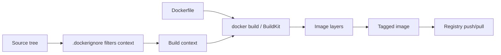

# 3 - Dockerfiles and Image Builds

## Quick Summary

A Dockerfile is a text recipe for building a Docker image. Each instruction creates or configures part of the final image. Good Dockerfiles are small, repeatable, secure, and cache-friendly.

Beginner mental model:

```text
Dockerfile + build context -> image layers -> runnable image
```

## First-Principles Explanation

A Dockerfile turns environment setup into code. Instead of telling every machine how to install dependencies manually, the Dockerfile records the build steps that produce a repeatable image.

Cause: manual runtime setup creates drift.

Mechanism: build instructions create filesystem changes and metadata in image layers.

Immediate result: the same image can be rebuilt, tagged, scanned, and pushed.

Long-term impact: CI/CD can promote artifacts instead of reassembling servers.

Next connected topic: layer cache, registries, and Kubernetes image pulls.

## Build Flow Diagram



The build context is part of the security boundary. If a secret enters the context and the Dockerfile copies it, it can enter the image.

## Basic Dockerfile

```dockerfile
FROM python:3.12-slim

WORKDIR /app

COPY requirements.txt .
RUN pip install --no-cache-dir -r requirements.txt

COPY . .

CMD ["python", "app.py"]
```

Build:

```bash
docker build -t myapp:dev .
```

Run:

```bash
docker run --rm myapp:dev
```

## Build Context

The build context is the directory sent to Docker during build.

```bash
docker build -t myapp:dev .
```

Here, `.` is the build context.

If the context contains huge files, builds become slow. Use `.dockerignore`.

## .dockerignore

Example:

```text
.git
node_modules
__pycache__
.venv
dist
*.log
```

`.dockerignore` prevents unnecessary files from entering the build context.

## Important Dockerfile Instructions

| Instruction | Purpose |
| --- | --- |
| `FROM` | Base image. |
| `WORKDIR` | Default working directory. |
| `COPY` | Copy files from build context. |
| `ADD` | Copy files with extra features; prefer `COPY` unless needed. |
| `RUN` | Execute command during image build. |
| `CMD` | Default command when container runs. |
| `ENTRYPOINT` | Main executable for the container. |
| `ENV` | Set environment variable. |
| `EXPOSE` | Document container port. |
| `USER` | Set runtime user. |
| `VOLUME` | Declare mount point. |

## CMD vs ENTRYPOINT

`CMD` provides default arguments/command.

```dockerfile
CMD ["python", "app.py"]
```

`ENTRYPOINT` makes the container behave like an executable.

```dockerfile
ENTRYPOINT ["python"]
CMD ["app.py"]
```

If you are new, start with `CMD` until you understand the difference.

## Layers And Cache

Docker builds images in layers. If a layer does not change, Docker can reuse cache.

Good pattern:

```dockerfile
COPY package*.json .
RUN npm ci
COPY . .
```

Why:

- Dependency install only reruns when dependency files change.
- App source changes do not invalidate dependency layer.

Bad pattern:

```dockerfile
COPY . .
RUN npm ci
```

Any source file change invalidates dependency install cache.

## Multi-Stage Builds

Multi-stage builds use one stage to build and another to run.

Example:

```dockerfile
FROM node:22 AS build
WORKDIR /app
COPY package*.json .
RUN npm ci
COPY . .
RUN npm run build

FROM nginx:1.27-alpine
COPY --from=build /app/dist /usr/share/nginx/html
```

Benefits:

- Smaller final image.
- Build tools stay out of runtime image.
- Better security and faster deploys.

## Base Image Choice

Choose:

- Official or trusted base images.
- Minimal image that still supports your app.
- Specific version tags.

Examples:

```dockerfile
FROM python:3.12-slim
FROM node:22-alpine
FROM nginx:1.27-alpine
```

Be careful with Alpine if native dependencies behave differently due to musl libc.

## Build Tags

```bash
docker build -t myapp:1.0.0 .
docker build -t myapp:latest .
```

Production systems should use immutable version tags or image digests.

## Benefits

- Repeatable image builds.
- Clear dependency setup.
- CI/CD friendly.
- Smaller images possible with multi-stage builds.

## Drawbacks / Limitations

- Bad Dockerfile ordering makes builds slow.
- Large base images increase attack surface.
- Secrets can leak into image layers.
- `latest` can make deployments unpredictable.

## Small Details That Matter Later

- Files copied in one layer may remain in history even if deleted in a later layer.
- Build arguments are not secret storage.
- `EXPOSE` documents a port but does not publish it.
- `WORKDIR` avoids accidental commands in unexpected directories.
- `ADD` can auto-extract archives and fetch URLs; use `COPY` for normal copies.

## Common Mistakes

| Mistake | Fix |
| --- | --- |
| No `.dockerignore` | Add one. |
| Copying whole repo before installing deps | Copy lockfiles first. |
| Running as root by default | Use `USER` where possible. |
| Putting secrets in Dockerfile | Use runtime secret injection or build secrets where supported. |
| Huge final image | Use multi-stage build and slim base. |
| Using `latest` in production | Use specific tags/digests. |

## Troubleshooting

| Problem | Check |
| --- | --- |
| Build slow | Build context size, layer cache, dependency order. |
| File missing | `.dockerignore`, `COPY` path, build context. |
| App cannot start | `CMD`, `ENTRYPOINT`, working directory, dependencies. |
| Permission denied | `USER`, file ownership, executable bit. |
| Image too large | Base image, caches, package manager cleanup, multi-stage build. |

## Interview Notes

- Dockerfile builds images.
- `FROM` chooses base image.
- `RUN` executes at build time.
- `CMD` defines default runtime command.
- `.dockerignore` reduces build context.
- Multi-stage builds reduce final image size.
- `EXPOSE` does not publish ports by itself.

## Questions to Test Understanding

1. Why does Dockerfile instruction order affect build speed?
2. Why is `.dockerignore` a security feature as well as a performance feature?
3. Why can deleting a secret in a later layer still be unsafe?
4. Why do multi-stage builds reduce attack surface?
5. Why is `EXPOSE` not enough to reach an app from the host?

## Answers and Reasoning

1. Docker can reuse unchanged layers. If frequently changing files are copied before dependency install, the expensive dependency layer is invalidated often.
2. It keeps unnecessary or sensitive files out of the build context, reducing transfer size and accidental copying.
3. The secret may still exist in an earlier image layer or build history. Rotate the secret and rebuild correctly.
4. Build tools and caches can stay in builder stages while the final image contains only runtime artifacts.
5. `EXPOSE` documents container ports. Host access needs runtime publishing with `-p` or Compose `ports`.

## Related Topics

- [Containers and Images](1%20-%20Containers%20and%20Images.md)
- [Docker Security and Best Practices](6%20-%20Docker%20Security%20and%20Best%20Practices.md)

## Official References

- [Dockerfile reference](https://docs.docker.com/reference/builder/)
- [Docker build reference](https://docs.docker.com/reference/cli/docker/buildx/build/)
- [Dockerfile best practices](https://docs.docker.com/build/building/best-practices/)
