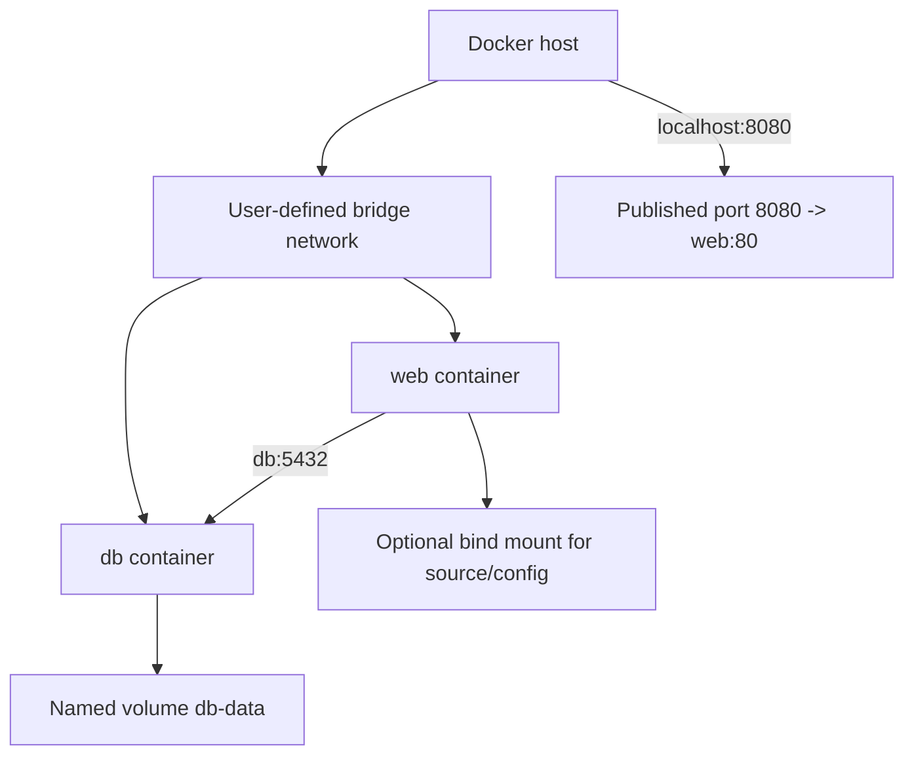

# 4 - Volumes and Networking

## Quick Summary

Docker containers are replaceable, so persistent data and networking must be designed intentionally. Volumes keep data outside the container writable layer. Networks let containers communicate with each other and with the host/outside world.

## Why It Matters

Most beginner Docker problems are storage or networking problems:

- Data disappears after deleting a container.
- App works inside container but not from browser.
- Containers cannot reach each other.
- Database data is stored in the wrong place.
- Published ports are misunderstood.

## First-Principles Explanation

Containers are replaceable processes. Data and traffic must cross the container boundary deliberately.

For storage:

Cause: the container writable layer disappears with container lifecycle.

Mechanism: mount volumes, bind mounts, or tmpfs at specific paths.

Immediate result: important data can live outside the writable layer.

Long-term impact: container replacement becomes safer.

For networking:

Cause: each container has its own network namespace by default.

Mechanism: connect containers to Docker networks and publish selected ports to the host.

Immediate result: services can talk internally while exposing only required host entry points.

Long-term impact: service wiring becomes explicit and debuggable.

## Storage and Network Diagram



## Storage Types

| Type | Meaning | Use |
| --- | --- | --- |
| Container writable layer | Default write area inside a container. | Temporary data only. |
| Named volume | Docker-managed persistent storage. | Databases, app data. |
| Bind mount | Mount host path into container. | Local development, config files. |
| tmpfs mount | Memory-backed temporary storage. | Sensitive temporary data or fast scratch. |

## Named Volumes

Create:

```bash
docker volume create db-data
```

Use:

```bash
docker run -d --name db \
  -v db-data:/var/lib/postgresql/data \
  postgres:16
```

Inspect:

```bash
docker volume inspect db-data
```

Named volumes survive container removal.

## Bind Mounts

```bash
docker run --rm -v "$PWD":/app -w /app node:22 npm test
```

Meaning:

```text
host current directory -> container /app
```

Good for:

- Local development.
- Editing code on host and running in container.
- Mounting config files.

Watch-outs:

- Host file permissions matter.
- Host path must exist as expected.
- Bind mounts can overwrite files from image at the mount path.

## Volume vs Bind Mount

| Topic | Named Volume | Bind Mount |
| --- | --- | --- |
| Managed by | Docker. | Host filesystem path. |
| Portability | More portable. | Depends on host path. |
| Best for | Persistent container data. | Local dev/source mounting. |
| Visibility | Less obvious path. | Directly visible on host. |

## Docker Networks

List networks:

```bash
docker network ls
```

Create bridge network:

```bash
docker network create app-net
```

Run containers on same network:

```bash
docker run -d --name api --network app-net myapi:dev
docker run -d --name web --network app-net myweb:dev
```

Containers on the same user-defined bridge network can usually reach each other by container name.

## Published Ports

```bash
docker run -d --name web -p 8080:80 nginx:1.27
```

Meaning:

```text
host localhost:8080 -> container port 80
```

Inside Docker network, another container may call:

```text
http://web:80
```

From host browser:

```text
http://localhost:8080
```

## Container DNS

On user-defined networks, Docker provides DNS resolution by container/service name.

Example:

```text
api container can connect to postgres container as postgres:5432
```

This is why Compose service names work as hostnames.

## Benefits

- Volumes preserve important data.
- Bind mounts support fast local development.
- Networks isolate app stacks.
- Container DNS simplifies service-to-service communication.

## Drawbacks / Limitations

- Bind mount paths differ across machines.
- Volume cleanup can accidentally remove data.
- Published ports can expose services unexpectedly.
- Docker networking differs from Kubernetes networking.

## Small Details That Matter Later

- Removing a container does not remove named volumes automatically.
- `docker compose down -v` removes volumes defined by the Compose project.
- Publishing a port is not needed for container-to-container traffic on the same network.
- Binding app to `127.0.0.1` inside container can prevent external access; apps often need to bind `0.0.0.0`.
- Host networking behaves differently and reduces isolation.

## Common Mistakes

| Mistake | Fix |
| --- | --- |
| Database data in container layer | Use named volume. |
| Publishing every port | Publish only ports needed from host/outside. |
| Using host path that does not exist | Confirm bind mount path. |
| App listens only on localhost inside container | Bind app to `0.0.0.0`. |
| Removing volumes blindly | Check volume contents and purpose before deletion. |

## Troubleshooting

| Problem | Check |
| --- | --- |
| Data disappeared | Was it in container layer or named volume? |
| Host cannot reach app | `-p`, app bind address, container logs, firewall. |
| Containers cannot reach each other | Same Docker network, service/container name, exposed internal port. |
| Permission denied on mounted files | Host permissions, container user, UID/GID. |
| Port conflict | `docker ps`, host process listening on same port. |

## Interview Notes

- Volumes persist data beyond container lifetime.
- Bind mounts map host paths into containers.
- Published ports map host ports to container ports.
- User-defined bridge networks provide container DNS.
- Container-to-container communication does not require publishing ports to host.

## Questions to Test Understanding

1. Why is the container writable layer a bad place for database data?
2. Why can a bind mount make image files appear missing?
3. Why does another container not need a published host port to reach a peer on the same network?
4. Why can `localhost` be wrong inside a container?
5. Why is `docker compose down -v` risky?

## Answers and Reasoning

1. The writable layer belongs to the container and is removed with it; databases need durable storage.
2. A bind mount overlays the target path, hiding files that were present in the image at that path.
3. Container-to-container traffic on a shared Docker network uses internal networking and service/container ports directly.
4. Inside a container, `localhost` means that same container, not the host or another container.
5. It removes Compose project volumes, which may contain database data.

## Related Topics

- [Docker CLI and Container Lifecycle](2%20-%20Docker%20CLI%20and%20Container%20Lifecycle.md)
- [Docker Compose](5%20-%20Docker%20Compose.md)

## Official References

- [Docker storage overview](https://docs.docker.com/engine/storage/)
- [Docker volumes](https://docs.docker.com/engine/storage/volumes/)
- [Docker networking overview](https://docs.docker.com/engine/network/)
