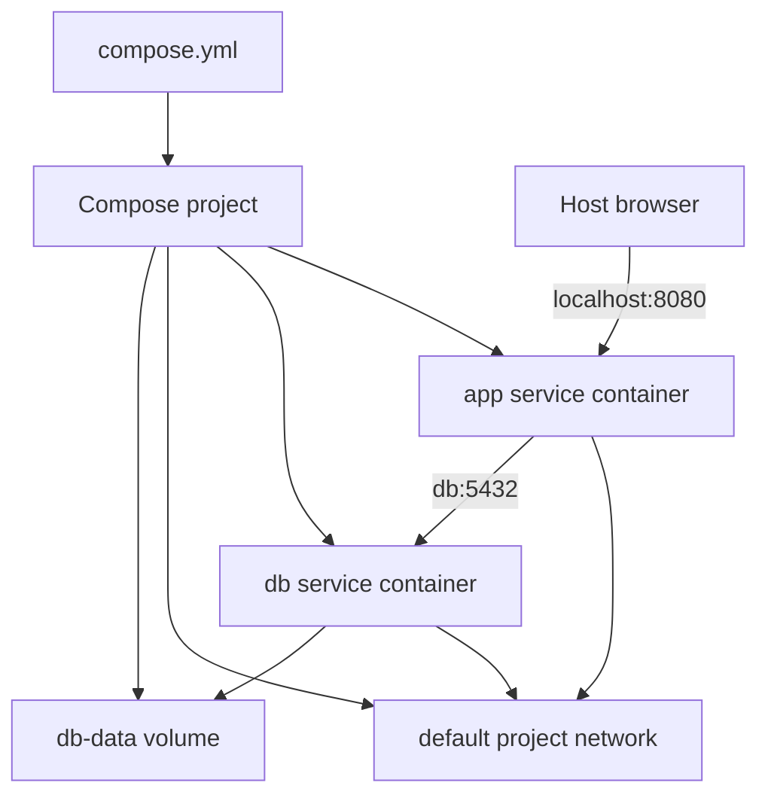

# 5 - Docker Compose

## Quick Summary

Docker Compose runs multi-container applications using a YAML file, usually `compose.yml` or `docker-compose.yml`. Instead of running many long `docker run` commands, you define services, networks, volumes, environment variables, and dependencies in one file.

Beginner mental model:

```text
compose.yml = local app stack definition
service = one container type/config
docker compose up = create and start the stack
```

## First-Principles Explanation

Compose exists because real applications rarely run as one container. A web app may need a database, cache, worker, queue, reverse proxy, and local development mounts. Writing and remembering many `docker run` commands becomes fragile.

Cause: multi-container local apps need repeatable wiring.

Mechanism: Compose declares services, networks, volumes, environment, build settings, and dependencies in YAML.

Immediate result: `docker compose up` can recreate the local stack.

Long-term impact: teams can onboard and test locally with fewer hidden setup steps.

Next connected topic: production orchestration, where Kubernetes uses a different desired-state model.

## Compose Model Diagram



## Basic Compose File

```yaml
services:
  web:
    image: nginx:1.27
    ports:
      - "8080:80"
```

Run:

```bash
docker compose up
```

Run in background:

```bash
docker compose up -d
```

Stop:

```bash
docker compose down
```

## Services

A service defines how to run one type of container.

Example app plus database:

```yaml
services:
  app:
    build: .
    ports:
      - "8080:8080"
    environment:
      DATABASE_URL: postgres://app:app@db:5432/app
    depends_on:
      - db

  db:
    image: postgres:16
    environment:
      POSTGRES_USER: app
      POSTGRES_PASSWORD: app
      POSTGRES_DB: app
    volumes:
      - db-data:/var/lib/postgresql/data

volumes:
  db-data:
```

Inside the Compose network, the app reaches PostgreSQL by hostname `db`.

## Common Commands

```bash
docker compose up
docker compose up -d
docker compose down
docker compose down -v
docker compose ps
docker compose logs
docker compose logs -f app
docker compose exec app sh
docker compose build
docker compose pull
docker compose restart
```

Warning:

```bash
docker compose down -v
```

removes volumes for the project and can delete database data.

## build vs image

Use `image` when pulling an existing image:

```yaml
services:
  redis:
    image: redis:7
```

Use `build` when building from local Dockerfile:

```yaml
services:
  app:
    build:
      context: .
      dockerfile: Dockerfile
```

## Environment Variables

```yaml
services:
  app:
    environment:
      APP_ENV: dev
      LOG_LEVEL: debug
```

From env file:

```yaml
services:
  app:
    env_file:
      - .env
```

Do not commit real secrets in `.env`.

## Networks

Compose creates a default network for the project.

Services can reach each other by service name:

```text
app -> db:5432
```

Explicit network:

```yaml
services:
  app:
    networks:
      - backend
  db:
    networks:
      - backend

networks:
  backend:
```

## Volumes

```yaml
services:
  db:
    image: postgres:16
    volumes:
      - db-data:/var/lib/postgresql/data

volumes:
  db-data:
```

Named volumes preserve data across container replacement.

## depends_on

`depends_on` controls startup order, but it does not always mean the dependency is fully ready for application use.

Example:

```yaml
depends_on:
  - db
```

Your app may still need retry logic because the database process can take time to become ready.

## Benefits

- Replaces long manual `docker run` commands.
- Easy local multi-service development.
- Built-in service DNS.
- Reproducible networks and volumes.
- Good onboarding tool for projects.

## Drawbacks / Limitations

- Compose is not the same as Kubernetes.
- Production use needs careful platform decisions.
- Secrets in local files can leak.
- `depends_on` is not full readiness orchestration.
- Local host paths can make stacks less portable.

## Small Details That Matter Later

- Compose project name prefixes network and volume names.
- `docker compose down` removes containers and networks, not named volumes by default.
- `docker compose down -v` removes volumes.
- Service names become DNS names on the Compose network.
- Compose can scale services, but port publishing must be planned.

## Common Mistakes

| Mistake | Fix |
| --- | --- |
| Expecting `depends_on` to wait for DB readiness | Add app retry logic or health checks. |
| Committing secrets in `.env` | Use placeholders and secret management. |
| Forgetting named volume for DB | Add a volume. |
| Publishing database port unnecessarily | Keep DB internal unless host access is needed. |
| Using Compose syntax as Kubernetes YAML | Learn each platform separately. |

## Troubleshooting

| Problem | Check |
| --- | --- |
| Service cannot resolve another service | Same Compose project/network and correct service name. |
| DB data lost | Volume usage and `down -v` history. |
| Port conflict | Host port already in use. |
| App starts before DB ready | Retry logic, health checks, logs. |
| Rebuild not picking changes | `docker compose build --no-cache` if needed, Dockerfile cache. |

## Interview Notes

- Compose defines multi-container apps.
- A service is a container configuration.
- Compose creates a default network.
- Service names work as DNS names.
- Named volumes preserve state.
- `docker compose up -d` starts in background.
- `docker compose down -v` removes volumes.

## Questions to Test Understanding

1. Why is Compose better than a README full of `docker run` commands?
2. Why does an app connect to `db`, not `localhost`, for a Compose database?
3. Why is `depends_on` not a complete readiness solution?
4. Why should `docker compose config` be used during debugging?
5. Why is Compose not the same as Kubernetes?

## Answers and Reasoning

1. Compose stores service config, networks, volumes, env, and build behavior in a repeatable file.
2. `localhost` means the app container itself; Compose service names resolve on the project network.
3. Startup order does not guarantee that the dependency process is ready to accept requests.
4. It shows the resolved effective config after interpolation and merging.
5. Compose runs a local project; Kubernetes is a cluster desired-state platform with controllers, scheduling, Services, probes, and policy.

## Related Topics

- [Dockerfiles and Image Builds](3%20-%20Dockerfiles%20and%20Image%20Builds.md)
- [Volumes and Networking](4%20-%20Volumes%20and%20Networking.md)

## Official References

- [Docker Compose overview](https://docs.docker.com/compose/)
- [Compose file reference](https://docs.docker.com/reference/compose-file/)
- [Docker Compose CLI reference](https://docs.docker.com/reference/cli/docker/compose/)
