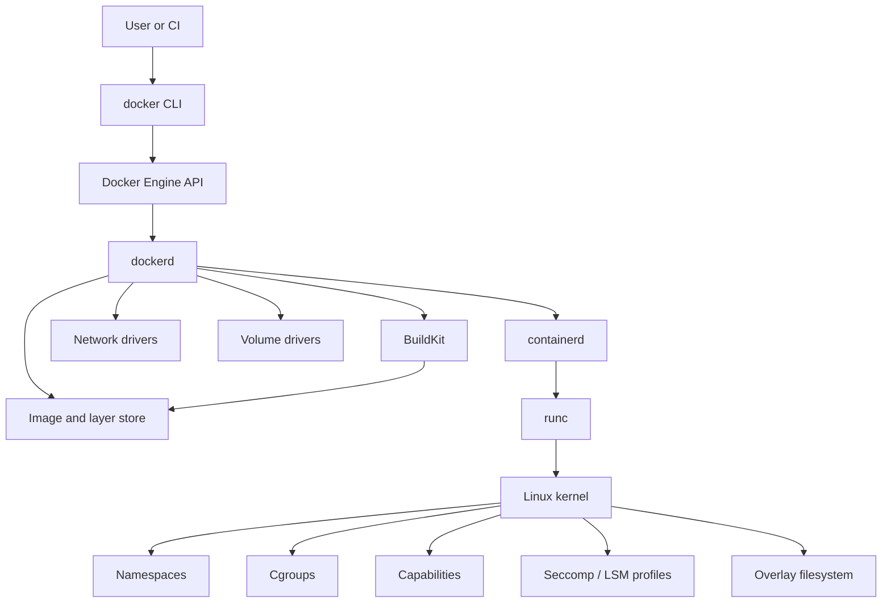
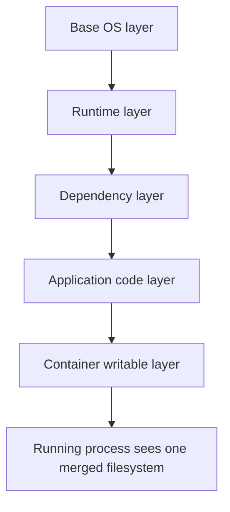

# 7 - Container Architecture Deep Dive

## Why This Chapter Matters

Docker feels simple because the commands are simple. That simplicity hides a serious architecture: a client, a daemon, an image store, a build system, a container lifecycle manager, an OCI runtime, Linux namespaces, cgroups, capabilities, security profiles, and layered filesystems.

If you understand this architecture, Docker stops being a black box. You can explain why containers are fast, why they are not full virtual machines, why some security risks remain, why bind mounts behave strangely, why `localhost` confuses beginners, and why Kubernetes can run Docker-built images without requiring Docker commands on the node.

## The Big Picture

Docker uses the host operating system kernel to run isolated application processes. It does not boot a new kernel per container.

High-level architecture:

```text
docker CLI -> Docker API -> Docker daemon -> containerd -> runc -> Linux kernel
```

Supporting systems:

- Images and layers provide the root filesystem.
- Namespaces provide isolation views.
- Cgroups provide resource accounting and limits.
- Capabilities reduce root power.
- Seccomp/AppArmor/SELinux can restrict system calls and access.
- Docker networks provide container connectivity.
- Volumes and bind mounts provide storage outside the writable layer.

## First-Principles Explanation

A normal process sees the host process table, host network interfaces, host filesystems, host hostname, host IPC objects, and host resources. A containerized process is still a process, but the kernel shows it a controlled view.

Cause: one application process should not freely see and modify everything on the host.

Mechanism: the kernel places the process into namespaces, applies cgroup constraints, restricts capabilities, and gives it a root filesystem assembled from image layers plus a writable layer.

Immediate result: the process behaves as if it has its own small machine-like environment.

Long-term impact: many applications can run consistently and densely on the same host.

Next connected topic: orchestration systems can schedule these isolated processes across machines.

## Core Vocabulary

| Term | Meaning | Example significance |
| --- | --- | --- |
| Docker client | CLI or API client that sends requests. | `docker run` is a client request, not the runtime itself. |
| Docker daemon | Long-running service that manages images, containers, networks, and volumes. | Daemon access is powerful; Docker socket access is sensitive. |
| BuildKit | Build engine for modern Docker builds. | Enables better cache, secrets, mounts, and multi-platform builds. |
| containerd | Container lifecycle manager used underneath Docker. | Kubernetes commonly uses containerd through CRI. |
| runc | OCI runtime that creates the container process. | Talks to kernel primitives. |
| Namespace | Kernel isolation view. | PID, network, mount, user, UTS, IPC. |
| Cgroup | Kernel resource control and accounting. | CPU/memory limits and `docker stats`. |
| Capability | Fine-grained privilege unit. | Avoid full root power. |
| Seccomp | System call filter. | Blocks risky kernel interfaces. |
| Overlay filesystem | Layered filesystem model. | Explains image layers and writable container layer. |
| OCI | Open Container Initiative standards. | Explains portability across runtimes. |

## Mental Model

Do not picture a container as a tiny computer. Picture it as:

```text
one or more host processes
  + isolated views
  + controlled resources
  + packaged root filesystem
  + runtime metadata
```

The container does not contain a kernel. The container uses the host kernel. This is why Linux containers require a Linux kernel, why Docker Desktop uses a Linux VM on non-Linux hosts, and why kernel vulnerabilities matter to container security.

## Historical / Evolution / Causal Chain

### From Servers to Virtual Machines

Physical servers gave strong boundaries but poor utilization. VMs improved isolation and allowed multiple guest operating systems on one host, but each VM still booted a full OS and carried heavy overhead.

Cause: applications needed isolation.

Mechanism: hypervisors ran guest operating systems.

Immediate result: better server utilization and stronger OS-level separation.

Long-term impact: infrastructure became more programmable, but deployments could still be slow and image-heavy.

Next connected topic: containers reused the host kernel for lighter isolation.

### From VMs to Containers

Containers use process isolation instead of full OS virtualization. They are faster because the kernel is already running. They are smaller because the image contains the application filesystem, not a whole virtual disk with a separate kernel.

Cause: teams wanted faster startup, higher density, and reproducible app environments.

Mechanism: namespaces, cgroups, capabilities, and layered filesystems.

Immediate result: app packaging became lightweight enough for everyday CI and development.

Long-term impact: container images became the standard application artifact.

Next connected topic: Kubernetes and cloud-native orchestration.

## Architecture or Conceptual Structure



## Step-by-Step Explanation: What `docker run` Actually Does

Command:

```bash
docker run -d --name web -p 8080:80 -v web-data:/usr/share/nginx/html nginx:1.27
```

Conceptual flow:

1. The CLI sends a request to the Docker daemon.
2. The daemon resolves the image name `nginx:1.27`.
3. If needed, it pulls image metadata and layers from a registry.
4. It prepares a container root filesystem from read-only image layers plus a writable layer.
5. It creates or attaches the named volume.
6. It creates a network endpoint and port publishing rules.
7. It asks the lower-level runtime stack to create the process with namespace, cgroup, and security settings.
8. The container starts the image's configured command or entrypoint.
9. Docker tracks logs, status, exit code, mounts, networks, and metadata.

This explains why the same command can fail at different stages:

- registry/auth problem before container creation
- mount problem before process start
- port conflict during network setup
- permission problem during runtime setup
- application crash after process start

## Internal Mechanics

### Namespaces

Namespaces make one process see a limited view of a shared host.

| Namespace | What it isolates | Why it matters |
| --- | --- | --- |
| PID | Process IDs and process tree. | Container process can appear as PID 1 inside the container. |
| Network | Interfaces, IPs, routes, ports. | Container has its own network stack unless using host networking. |
| Mount | Filesystem mount points. | Container sees its image filesystem and mounts. |
| UTS | Hostname and domain name. | Container can have its own hostname. |
| IPC | Shared memory and message queues. | Prevents accidental cross-process IPC sharing. |
| User | User and group ID mapping. | Root inside can map to non-root outside when configured. |
| Cgroup namespace | View of cgroup hierarchy. | Avoids exposing full host cgroup details. |

Small but important: namespaces isolate views, not necessarily all power. A process with dangerous capabilities, privileged mode, host mounts, host PID namespace, or Docker socket access can still escape the safe mental model.

### Cgroups

Cgroups control and measure resource usage. They are why Docker can report:

```bash
docker stats
```

They are also why you can apply limits:

```bash
docker run --memory 512m --cpus 1.5 myapp:1.0.0
```

Causal chain:

No limits -> one bad process can consume host resources -> neighboring containers suffer -> resource constraints and accounting become necessary -> cgroups provide limits and visibility.

### Capabilities

Traditional Unix treats root as extremely powerful. Linux capabilities split that power into smaller pieces. Docker starts containers with a limited set by default and lets you add or drop capabilities.

Example stricter run:

```bash
docker run --cap-drop ALL --cap-add NET_BIND_SERVICE myweb:1.0.0
```

This says: remove all extra capabilities, then add only the ability needed to bind privileged ports. Many apps do not even need that if they listen on a high port inside the container.

### Seccomp and Linux Security Modules

Seccomp can restrict system calls. AppArmor and SELinux can enforce additional access rules, depending on host configuration.

Why this matters:

- A container escape usually involves abusing the kernel or host integration.
- Reducing system calls and access paths reduces attack surface.
- Security settings can break apps that expect privileged behavior, so production hardening should be tested.

### Filesystem Layers and Copy-on-Write

Image layers are immutable. A container gets those read-only layers plus its own writable layer. When a process modifies a file that came from an image layer, the storage driver uses copy-on-write behavior so the container modifies its own copy, not the shared image layer.



Consequences:

- Multiple containers can share the same read-only image layers.
- Each container has its own writable layer.
- The writable layer is not a reliable place for persistent data.
- Files added and deleted in different image layers can still affect image size and history.

### OCI Image and Runtime Standards

OCI standards matter because they separate the image artifact from a single vendor's command line. A Docker-built image can be pushed to a registry and used by Kubernetes, because the broader ecosystem understands container image formats and runtime configuration.

Practical result:

```text
Dockerfile -> image -> registry -> Kubernetes Pod image field
```

Kubernetes does not need to know the exact `docker build` command you used. It needs a valid image reference and node runtime support.

## Practical Examples

Inspect container process identity:

```bash
docker run -d --name sleep-demo alpine:3.20 sleep 3600
docker inspect --format '{{.State.Pid}}' sleep-demo
docker exec sleep-demo ps
```

Interpretation:

- The container has a host PID and an inside-container process view.
- Inside the container, the process tree is namespaced.

Inspect resource use:

```bash
docker stats sleep-demo
```

Inspect mounts and network:

```bash
docker inspect sleep-demo
docker network inspect bridge
```

Clean up:

```bash
docker rm -f sleep-demo
```

## Small Details That Matter Later

- PID 1 inside a container has special signal-handling responsibilities. If your app does not handle signals correctly, shutdown can be messy.
- Containers share the host kernel, so kernel version and host security settings matter.
- `--privileged` is not "just make it work"; it removes many isolation boundaries.
- Mounting `/var/run/docker.sock` gives access to the Docker daemon and can become host-level power.
- `--network host` removes network namespace isolation for that container on Linux.
- `localhost` inside a container means that container, not the host and not another container.
- Docker Desktop hides a VM boundary. Bind mounts and host networking can behave differently from native Linux.
- Root inside a container is not always the same as root on the host, but careless configuration can make it dangerous.
- Cgroup v1 vs cgroup v2 can change details of resource reporting and enforcement. Verify on the actual host when debugging limits.
- The container writable layer is often slower and less suitable for heavy write workloads than a properly configured volume.

## Common Misunderstandings

| Misunderstanding | Correct understanding |
| --- | --- |
| Docker invented containers from nothing. | Docker packaged existing kernel primitives into a developer-friendly workflow. |
| A container has its own kernel. | Linux containers share the host kernel. |
| Root in a container is always safe. | It is safer than unconstrained host root only when namespaces, capabilities, mounts, and profiles are sane. |
| If `docker ps` shows running, the app is healthy. | Running only means the main process has not exited. It may still be misconfigured, stuck, or unreachable. |
| Layers are only about speed. | Layers also affect storage, bandwidth, reproducibility, and secret leakage. |
| Kubernetes is Docker at scale. | Kubernetes is an orchestrator that uses container images and CRI runtimes; Docker CLI commands are not its control model. |

## Failure Modes / Mistakes / Traps

| Failure | Architecture cause | Better diagnostic |
| --- | --- | --- |
| Container exits instantly | Main process ended or entrypoint failed. | `docker ps -a`, `docker logs`, inspect exit code. |
| Web app unreachable | Port not published, app bound to loopback, wrong network path. | `docker port`, `docker inspect`, `docker exec` curl inside. |
| Permission denied on files | UID/GID mismatch or read-only mount. | Inspect `User`, mounts, host ownership. |
| Disk fills up | Old images, build cache, volumes, logs. | `docker system df`, prune carefully. |
| Build repeats dependency install | Cache invalidated by Dockerfile order. | Copy lockfiles before source files. |
| Container can control host Docker | Docker socket mounted. | Remove socket mount or isolate builder. |
| App works in Docker but fails in Kubernetes | Hidden Docker-specific assumptions. | Check env, probes, ports, filesystem writes, PID 1, user, image pull policy. |

## Debugging / Analysis Method

Ask which layer failed:

1. Client/daemon access: can the CLI talk to Docker?
2. Image resolution: can Docker find and pull the image?
3. Container creation: are mounts, networks, ports, users, and limits valid?
4. Runtime launch: does the entrypoint exist and have permissions?
5. Application startup: does the app config work?
6. Service access: is the network path correct?
7. Persistence: is the data path mounted?

Commands:

```bash
docker version
docker info
docker image inspect <image>
docker container inspect <container>
docker logs <container>
docker events
docker system df
```

For namespace-level investigation on a Linux host, advanced operators may use tools such as `nsenter`, `lsns`, `ip netns`, and `/proc`, but these are host-level debugging tools and require care.

## Real-World or Interview Relevance

Strong Docker architecture answers usually mention:

- Docker uses client-server architecture.
- Containers are processes isolated by namespaces and cgroups.
- Images are layered read-only templates.
- A container adds runtime config and a writable layer.
- Volumes are needed for persistent data.
- Docker is not a full security boundary by default.
- Kubernetes consumes container images and uses runtime interfaces underneath.

Production relevance:

- Incident diagnosis becomes faster when you can locate the failing layer.
- Security reviews depend on understanding privilege boundaries.
- Performance tuning depends on knowing when you are hitting filesystem, network, cgroup, or application constraints.

## Connected Topics

- [Containers and Images](1%20-%20Containers%20and%20Images.md)
- [Docker CLI and Container Lifecycle](2%20-%20Docker%20CLI%20and%20Container%20Lifecycle.md)
- [Dockerfiles and Image Builds](3%20-%20Dockerfiles%20and%20Image%20Builds.md)
- [Docker Security and Best Practices](6%20-%20Docker%20Security%20and%20Best%20Practices.md)
- [Production Gotchas and Kubernetes Connection](9%20-%20Production%20Gotchas%20and%20Kubernetes%20Connection.md)

## Chapter Summary

A Docker container is not magic. It is a host process with an image-provided filesystem, isolated namespace views, cgroup accounting, security restrictions, network configuration, mounts, and lifecycle metadata. Docker's power comes from making this machinery usable through simple commands and repeatable image artifacts.

## Questions to Test Understanding

1. Why can Linux containers start faster than virtual machines?
2. What is the role of the Docker daemon?
3. Why is access to the Docker socket sensitive?
4. What does a PID namespace isolate?
5. What do cgroups control?
6. Why can root inside a container still be risky?
7. Why does the writable layer not replace volumes?
8. How can Docker-built images run in Kubernetes?
9. Why can host networking change the security model?
10. Why does Docker Desktop behave differently from native Linux for some mounts and networking?

## Answers and Reasoning

1. Containers reuse the already-running host kernel, while VMs boot a guest operating system and kernel.
2. The daemon receives API requests and manages Docker objects such as images, containers, volumes, and networks.
3. The socket lets a process ask the daemon to create privileged containers, mount host paths, or manipulate the host's container environment.
4. It gives the container its own process ID view, so processes inside do not see the full host process tree.
5. Cgroups measure and constrain resources such as CPU and memory.
6. Root can still be dangerous if the container has powerful capabilities, host namespaces, privileged mode, sensitive mounts, or a kernel vulnerability path.
7. The writable layer is tied to the container lifecycle and is not designed as durable application storage.
8. Docker builds standard container images that can be pushed to registries; Kubernetes nodes pull and run those images through compatible runtimes.
9. Host networking removes the container's separate network namespace on Linux, changing port behavior and reducing isolation.
10. Docker Desktop runs the daemon inside a Linux VM, so native host filesystems and networks cross a virtualization boundary.

## Source Backbone

- Docker overview: <https://docs.docker.com/get-started/docker-overview/>
- Docker image layers: <https://docs.docker.com/get-started/docker-concepts/building-images/understanding-image-layers/>
- Docker Engine security: <https://docs.docker.com/engine/security/>
- Docker rootless mode: <https://docs.docker.com/engine/security/rootless/>
- Kubernetes images: <https://kubernetes.io/docs/concepts/containers/images/>
