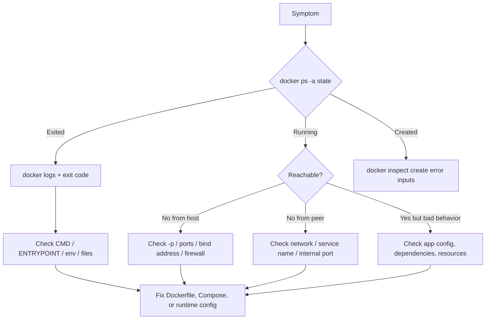

# 8 - Debugging and Operations Playbook

## Why This Chapter Matters

Docker debugging is not solved by memorizing more commands. It is solved by asking the right question in the right layer.

When a container fails, the failure may be in image pull, startup command, environment variables, file permissions, port publishing, DNS, bind mounts, volumes, resource limits, health checks, build cache, or the app itself. A good operator does not panic and does not randomly rebuild. A good operator narrows the failure path.

## The Big Picture

Most Docker incidents fall into one of these categories:

- The container never started.
- The container started and exited.
- The container is running but unhealthy.
- The app is running but unreachable.
- Containers cannot reach each other.
- Data is missing or permissions are wrong.
- The build is slow, stale, or incorrect.
- Disk, memory, CPU, or logs are exhausted.
- Compose created a different stack than expected.
- Security hardening broke an app assumption.

Debugging flow:

```text
symptom -> state -> logs -> inspect -> isolate layer -> test from inside and outside -> fix the source of truth
```

The source of truth is usually the Dockerfile, Compose file, runtime command, environment, mounted path, image tag/digest, or application config. Manual changes inside a running container are usually investigation, not a durable fix.

## First-Principles Explanation

A container is a process with controlled environment. Debugging asks: what did the process receive, what did it try to do, and which boundary blocked it?

Cause: container runtime adds boundaries around process, filesystem, network, users, and resources.

Mechanism: inspect runtime metadata and test each boundary directly.

Immediate result: the cause becomes observable instead of guessed.

Long-term impact: fixes move into Dockerfile, Compose, CI, or deployment config rather than temporary container edits.

Next connected topic: production readiness and Kubernetes troubleshooting.

## Core Vocabulary

| Term | Meaning | Debugging use |
| --- | --- | --- |
| Exit code | Numeric result of the container process. | Reveals whether the main command crashed or completed. |
| Logs | stdout/stderr from the main process. | First evidence for app startup failures. |
| Inspect | JSON metadata about image/container/network/volume. | Shows exact runtime configuration. |
| Exec | Run a command inside a running container. | Test DNS, files, env, process view. |
| Health check | Command that marks container healthy/unhealthy. | Distinguishes "process alive" from "service ready." |
| Published port | Host-to-container forwarding rule. | Required for host/browser access. |
| User-defined bridge | Docker network with container-name DNS. | Preferred for container-to-container communication. |
| Bind mount | Host path mounted into container. | Common source of permissions and hidden-file issues. |
| Volume | Docker-managed persistent data. | Common source of data retention or cleanup questions. |
| Build cache | Reused build step outputs. | Explains stale or fast/slow builds. |

## Mental Model

Think like a doctor checking vital signs before prescribing:

```text
Is it created?
Is it running?
Did it exit?
What did it log?
What command did it run?
What env did it receive?
What ports did it publish?
What mounts did it get?
What network is it on?
What user is it running as?
What limits or security rules apply?
```

Do not begin with "rebuild everything" unless the evidence points to the image build.

## Historical / Evolution / Causal Chain

Manual servers encouraged SSH debugging and hand edits. Containers encourage artifact debugging and configuration debugging.

Cause: a running container should be replaceable.

Mechanism: diagnose the running container, then encode the fix in Dockerfile, Compose, CI, or deployment configuration.

Immediate result: the next container starts correctly without manual repair.

Long-term impact: debugging becomes reproducible and teachable.

Next connected topic: Kubernetes, where manual container mutation is even less useful because Pods are routinely replaced.

## Architecture or Conceptual Structure



## Step-by-Step Explanation

### Baseline Commands

```bash
docker version
docker info
docker ps
docker ps -a
docker images
docker volume ls
docker network ls
docker system df
```

What they answer:

| Command | Question answered |
| --- | --- |
| `docker version` | Can the client talk to the daemon, and what versions are involved? |
| `docker info` | What daemon, storage driver, cgroup mode, rootless status, and resource context exist? |
| `docker ps` | Which containers are running? |
| `docker ps -a` | Which containers exist, including exited ones? |
| `docker system df` | Where is Docker disk usage coming from? |

### Container State

```bash
docker ps -a --filter name=web
docker inspect web
docker inspect --format '{{.State.Status}} {{.State.ExitCode}} {{.State.Error}}' web
```

Interpretation:

- `running`: main process is alive.
- `exited`: main process finished or crashed.
- `created`: container exists but did not start.
- `restarting`: restart policy is repeatedly trying.
- Exit code `0`: process ended successfully; maybe your command was short-lived.
- Non-zero exit code: application or entrypoint error.
- `137`: often killed, commonly due to memory pressure or forced kill; verify evidence.

### Logs

```bash
docker logs web
docker logs --tail 100 web
docker logs -f web
docker logs --since 10m web
```

Good logs should answer:

- Did the application start?
- Which port did it bind?
- Which config file did it load?
- Did dependency connection fail?
- Did permissions fail?
- Did the app receive shutdown?

Bad logging pattern:

```text
app writes only to /var/log/app.log inside container
```

Better pattern:

```text
app writes operational logs to stdout/stderr
```

### Execute Inside a Running Container

```bash
docker exec -it web sh
docker exec web env
docker exec web ps
docker exec web ls -la /app
```

Use `exec` to inspect, not to permanently repair. If you `apt install` something inside a running container, that change disappears when the container is replaced unless it is encoded in the image.

### Inspect Runtime Configuration

```bash
docker inspect web
docker inspect --format '{{json .Mounts}}' web
docker inspect --format '{{json .NetworkSettings.Networks}}' web
docker inspect --format '{{.Config.User}}' web
docker inspect --format '{{json .Config.Env}}' web
```

Look for:

- effective image
- command and entrypoint
- user
- env variables
- mounts
- network attachments
- published ports
- restart policy
- health state
- labels

## Internal Mechanics

### Why Logs May Be Empty

Logs come from stdout/stderr of the main process. Logs may be empty if:

- the process never started
- the entrypoint redirects output to a file
- the app logs only after receiving traffic
- the container uses a logging driver you did not expect
- the app exits before flushing logs

### Why `localhost` Fails

`localhost` is relative to the network namespace.

| Location | `localhost` means |
| --- | --- |
| Host shell | The host machine. |
| Container A | Container A itself. |
| Container B | Container B itself. |
| Compose service `app` | The `app` container, not `db`. |

Use service/container DNS name on a user-defined network:

```text
app -> http://db:5432
```

Use published host port from host:

```text
host browser -> http://localhost:8080
```

### Why Bind Mounts Hide Image Files

If the image contains `/app/node_modules` and you bind mount the host project at `/app`, the host project view hides the image's `/app` contents. The files are not deleted from the image; they are obscured by the mount.

This explains a classic local-dev failure:

```text
image build installed dependencies -> bind mount overlays /app -> container cannot find dependencies
```

Fix patterns:

- mount source into a different path
- use a named volume for dependencies
- install dependencies on the host too
- design the dev image/Compose file deliberately

## Practical Playbooks

### Container Exits Immediately

Commands:

```bash
docker ps -a
docker logs <container>
docker inspect --format '{{.State.ExitCode}} {{.Path}} {{json .Args}}' <container>
```

Likely causes:

- command completed normally
- wrong `CMD` or `ENTRYPOINT`
- missing executable
- permission denied
- missing env/config
- app crash

Fix the Dockerfile, image, command, or environment. Do not rely on manual shell edits.

### Cannot Reach App From Browser

Commands:

```bash
docker ps
docker port <container>
docker logs <container>
docker exec <container> sh -c 'ss -lntp || netstat -lntp'
```

Check:

- Is the container running?
- Is host port published?
- Is the app listening on the expected container port?
- Is the app bound to `0.0.0.0`, not only `127.0.0.1` inside the container?
- Is a host firewall blocking access?

Important distinction:

```text
EXPOSE 8080     documents a container port
-p 8080:8080   publishes host port 8080 to container port 8080
```

### Containers Cannot Reach Each Other

Commands:

```bash
docker network ls
docker network inspect <network>
docker inspect --format '{{json .NetworkSettings.Networks}}' <container>
docker exec <container> getent hosts <peer-name>
```

Check:

- Same user-defined bridge network?
- Correct service/container name?
- Correct internal port?
- App actually listening?
- Firewall/security software?
- Trying `localhost` by mistake?

### Database Data Disappeared

Commands:

```bash
docker inspect <db-container> --format '{{json .Mounts}}'
docker volume ls
docker volume inspect <volume>
```

Check:

- Was the database data directory mounted?
- Was `docker compose down -v` used?
- Was an anonymous volume created and then abandoned?
- Did the database image use a different data directory than expected?

### Permission Denied on Mounted Files

Commands:

```bash
docker inspect --format '{{.Config.User}}' <container>
docker exec <container> id
ls -ln <host-path>
```

Check:

- Host ownership and mode.
- Container user UID/GID.
- Read-only mount.
- SELinux labels on SELinux hosts.
- Docker Desktop file-sharing permissions.

Fix patterns:

- run the container with the intended user
- adjust host ownership/mode
- use named volumes for app-managed data
- mount read-only when writing is not needed

### Image Pull Fails

Commands:

```bash
docker pull <image>
docker login <registry>
docker image ls
```

Check:

- image name spelling
- registry hostname
- tag existence
- authentication
- network/proxy
- rate limits
- platform mismatch

### Build Is Slow or Stale

Commands:

```bash
docker build --progress=plain -t myapp:debug .
docker builder prune
docker build --no-cache -t myapp:debug .
```

Check:

- `.dockerignore` missing
- huge build context
- dependency installation after copying all source
- no lockfile
- cache invalidated by frequently changing files
- base image pulling every build

Better pattern:

```dockerfile
COPY package*.json .
RUN npm ci
COPY . .
```

### Disk Usage Too High

Commands:

```bash
docker system df
docker image ls
docker ps -a
docker volume ls
docker builder du
```

Careful cleanup:

```bash
docker container prune
docker image prune
docker builder prune
```

Danger zone:

```bash
docker volume prune
docker system prune --volumes
```

Volumes can contain databases and user data. Inspect before deleting.

### Compose Stack Behaves Unexpectedly

Commands:

```bash
docker compose config
docker compose ps
docker compose logs -f
docker compose exec <service> sh
docker compose down
```

Use `docker compose config` to render the final effective configuration after environment interpolation and file merging. This catches many wrong assumptions.

Check:

- project name
- service names
- environment values
- port mappings
- profiles
- volumes
- networks
- `depends_on` vs actual readiness

## Small Details That Matter Later

- `docker logs` is only as useful as the app's stdout/stderr behavior.
- `docker exec` requires a running container. It cannot enter an exited container.
- `docker run --rm` removes the container after exit, which is good for temporary commands but bad if you need to inspect post-exit state.
- `docker inspect` is verbose, but it is authoritative for runtime configuration.
- `docker compose config` is often more revealing than reading `compose.yml` because it shows the resolved model.
- A container can be running but useless if the app is stuck, unhealthy, or listening on the wrong interface.
- User-defined bridge networks provide container-name DNS; the default bridge is more limited.
- Bind mounts point to the daemon host, not necessarily the CLI client machine when using a remote daemon.
- `-v host:container` may create a missing host directory; `--mount` is stricter and clearer.
- Cleanup commands are not equal. Container/image/build cache cleanup is usually safer than volume cleanup.

## Common Misunderstandings

| Misunderstanding | Correction |
| --- | --- |
| If the container is running, the service is healthy. | Running means the main process is alive, not necessarily ready. |
| If I can curl from inside the container, the host can reach it. | Host access requires a published port and correct bind address. |
| Compose `depends_on` guarantees the DB is ready. | Startup order is not the same as application readiness unless health conditions/retries are designed. |
| A bind mount adds files to the image. | A bind mount is runtime-only and can hide image contents. |
| `docker system prune` is always safe. | It can remove useful unused resources; with volume options it can destroy data. |

## Failure Modes / Mistakes / Traps

| Symptom | Likely trap |
| --- | --- |
| Works with `docker run`, fails in Compose. | Different env, network name, command, build context, or volume mount. |
| Works in Compose, fails in Kubernetes. | App depends on Compose DNS, local paths, startup order, or mutable tags. |
| Works on Linux, fails on Docker Desktop. | VM boundary, path sharing, filesystem performance, line endings, architecture mismatch. |
| Works on developer laptop, fails in CI. | Build context, missing secrets, different platform, no Docker cache, registry auth. |
| Works as root, fails as non-root. | File ownership, privileged port, missing writable directories. |
| Works until restart. | State stored in container writable layer. |

## Debugging / Analysis / Answer-Writing Method

For interviews or incident writeups, use this structure:

1. State the symptom precisely.
2. Say which layer you would check first and why.
3. Name the command.
4. Explain what good output and bad output imply.
5. Explain the durable fix.

Example answer:

```text
If a web container is running but unreachable from the host, I would first check port publishing with docker ps or docker port. Then I would inspect whether the app is listening on the expected container port and bound to 0.0.0.0 inside the container. If the app listens only on 127.0.0.1 inside the container, Docker can forward traffic to the container, but the app will not accept it from the container network interface. The durable fix is to change the app bind address or config, not to rebuild randomly.
```

## Real-World or Exam Relevance

Docker debugging questions often test whether you separate:

- build time from runtime
- image from container
- host port from container port
- container DNS from host DNS
- volume from bind mount
- startup from readiness
- root in image from runtime user
- logs from internal app files

Production incidents usually reward calm layering. If you jump directly to "restart Docker" or "rebuild the image" without evidence, you may hide the real cause.

## Connected Topics

- [Docker CLI and Container Lifecycle](2%20-%20Docker%20CLI%20and%20Container%20Lifecycle.md)
- [Volumes and Networking](4%20-%20Volumes%20and%20Networking.md)
- [Docker Compose](5%20-%20Docker%20Compose.md)
- [Docker Security and Best Practices](6%20-%20Docker%20Security%20and%20Best%20Practices.md)
- [Production Gotchas and Kubernetes Connection](9%20-%20Production%20Gotchas%20and%20Kubernetes%20Connection.md)

## Chapter Summary

Docker debugging is layered investigation. Read state, logs, inspect output, mounts, networks, env, users, and resource context before changing anything. The durable fix belongs in the Dockerfile, Compose file, deployment config, CI pipeline, or application config.

## Questions to Test Understanding

1. What is the first command you run when a container "is not working"?
2. Why might `docker logs` be empty?
3. Why does `localhost` cause container-to-container confusion?
4. How do you distinguish `EXPOSE` from `-p`?
5. Why is `docker compose config` useful?
6. Why can a bind mount make files disappear inside a container?
7. Why is volume cleanup dangerous?
8. What does `docker inspect` tell you that source files may not?
9. Why should manual `docker exec` changes not be treated as a fix?
10. What is the difference between process running and app readiness?

## Answers and Reasoning

1. Usually `docker ps -a`, because state tells you whether the container is running, exited, restarting, or never started.
2. The app may log to a file, exit before writing, never start, use a different logging driver, or log only after traffic.
3. `localhost` points to the current network namespace. Inside a container, it means that same container.
4. `EXPOSE` documents a port in the image. `-p HOST:CONTAINER` creates a host forwarding rule.
5. It shows the effective Compose model after interpolation and merge behavior.
6. A bind mount overlays the container path, hiding image files at that path while the mount exists.
7. Volumes may contain durable data such as databases.
8. It shows the actual runtime configuration: env, command, image, mounts, networks, user, labels, state, and ports.
9. Container changes disappear when the container is replaced unless captured in image/config/storage.
10. A process can be alive while the service is not ready to handle traffic or dependency calls.

## Source Backbone

- Docker CLI reference: <https://docs.docker.com/reference/cli/docker/>
- Docker storage: <https://docs.docker.com/engine/storage/>
- Docker bind mounts: <https://docs.docker.com/engine/storage/bind-mounts/>
- Docker networking: <https://docs.docker.com/engine/network/>
- Docker Compose services reference: <https://docs.docker.com/reference/compose-file/services/>
