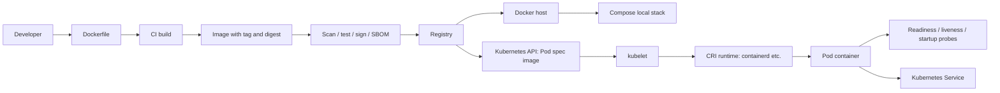

# 9 - Production Gotchas and Kubernetes Connection

## Why This Chapter Matters

Docker is easy to start and easy to misuse. The same feature that makes local development fast can become a production risk if the team treats containers as small servers, uses mutable tags, stores data in writable layers, runs as root, leaks secrets into images, or assumes Compose behavior will translate directly into Kubernetes.

This chapter connects Docker fundamentals to production reality and Kubernetes thinking.

## The Big Picture

The production chain is:

```text
source code -> Dockerfile -> image -> scan/test -> registry -> deploy -> observe -> replace/rollback
```

The Kubernetes chain is:

```text
image in registry -> Pod spec references image -> kubelet asks runtime to pull image -> container starts -> probes and controllers manage lifecycle
```

Docker remains essential because it teaches the artifact model. Kubernetes builds on that model by adding scheduling, desired state, service discovery, rollout, self-healing, policy, and multi-node networking.

## First-Principles Explanation

Production systems need repeatability, observability, security, controlled rollout, fast rollback, and failure recovery. A container image gives repeatability, but not the whole production system.

Cause: one container on one machine does not solve cluster operations.

Mechanism: build immutable images, push them to registries, run them under an orchestrator with health checks, resource boundaries, secrets, logging, and rollout policy.

Immediate result: deployments become controlled artifact promotion.

Long-term impact: Kubernetes and cloud container platforms can manage application lifecycle consistently.

Next connected topic: Kubernetes Deployments, Services, ConfigMaps, Secrets, probes, image pull policy, resource requests/limits, and Pod security context.

## Core Vocabulary

| Term | Meaning | Production significance |
| --- | --- | --- |
| Immutable image | Image content does not change after build. | Enables rollback and auditability. |
| Mutable tag | Tag that can be moved to different content. | Convenient but risky for reproducibility. |
| Digest pinning | Referencing image by content digest. | Strongest identity for exact deployment. |
| Promotion | Moving same tested image across environments. | Avoids rebuilding separately for prod. |
| SBOM | Software bill of materials. | Helps track packages and vulnerabilities. |
| Vulnerability scan | Finding known CVEs in image/dependencies. | Necessary but not sufficient for security. |
| Health check | Runtime check for service health. | Helps detect broken containers. |
| Readiness | Ability to receive traffic. | Kubernetes uses readiness probes for routing decisions. |
| Liveness | Whether container should be restarted. | Kubernetes uses liveness probes for self-healing. |
| Graceful shutdown | Handling termination signal and draining work. | Prevents dropped requests and corrupt state. |
| Resource limit | Hard cap or quota on resource consumption. | Prevents one workload from harming others. |
| Compose | Local multi-container application tool. | Useful for dev/test, not a full production orchestrator. |

## Mental Model

Docker gives you a shipping container. Production needs a port authority, routing rules, inspection, manifests, quotas, identity, and emergency procedures.

In technical terms:

```text
Docker image = artifact
Docker container = local runtime instance
Registry = artifact distribution
Compose = local stack wiring
Kubernetes = distributed desired-state control plane
```

## Historical / Evolution / Causal Chain

### From Docker to Kubernetes

Docker made containers usable for developers. Once teams began running many containers, they needed answers Docker alone did not fully provide for a multi-host system:

- Which machine should run this container?
- What happens if that machine dies?
- How do containers find each other?
- How do we roll out version 2 gradually?
- How do we roll back?
- How do we avoid sending traffic to an unready instance?
- How do we mount durable storage?
- How do we enforce resource and security policy?

Cause: containers became the standard artifact, but operations moved beyond one host.

Mechanism: Kubernetes introduced declarative desired state and controllers.

Immediate result: users describe desired Pods, Deployments, Services, and policies.

Long-term impact: container operations became platform engineering.

Next connected topic: Kubernetes control plane and reconciliation.

## Architecture or Conceptual Structure



## Step-by-Step Production Image Flow

1. Build the image in CI.
2. Tag it with a meaningful immutable version such as Git SHA or release version.
3. Optionally also attach human-friendly tags, but never rely on mutable tags alone for production evidence.
4. Scan the image and dependencies.
5. Generate or store SBOM/provenance if your platform requires it.
6. Push to a registry with controlled permissions.
7. Deploy the same tested image to staging.
8. Promote the same image to production.
9. Monitor logs, metrics, health, and error rates.
10. Roll back by selecting the previous known-good image, not by manually editing a live container.

## Internal Mechanics

### Tags vs Digests

Image tags are names. Digests are content identity.

```text
myapp:prod          human-friendly pointer
myapp@sha256:...    exact content
```

Production trap:

```text
same manifest + mutable tag -> different image content later
```

Safer pattern:

```text
deploy image by release tag tied to CI artifact, or by digest where exact identity matters
```

Kubernetes also understands tags and digests. If no tag is specified, Kubernetes assumes `latest`, which is usually not what production wants.

### Process Model and Signals

Containers should run the main app process in the foreground. The process should handle termination signals gracefully.

Why:

- Docker and orchestrators stop containers by signaling the main process.
- If PID 1 ignores or mishandles signals, shutdown may be delayed or force-killed.
- Force-kill can drop requests, interrupt jobs, or corrupt files.

Good app behavior:

- receive signal
- stop accepting new work
- finish in-flight work within timeout
- close connections
- exit cleanly

### Health Checks Are Not Magic

A health check is only as good as the question it asks.

Weak check:

```text
process exists
```

Better check:

```text
service can handle a lightweight local request and critical dependencies are in an acceptable state
```

But do not make every dependency failure a liveness failure. If a database is temporarily unavailable, restarting every app container can create a storm. In Kubernetes, readiness and liveness should answer different questions.

### Configuration and Secrets

Do not bake environment-specific config into an image. The same image should run in dev, staging, and production with different runtime configuration.

Bad:

```dockerfile
ENV DATABASE_PASSWORD=real-production-password
COPY prod-config.yml /app/config.yml
```

Better:

```text
image contains application code
runtime injects environment-specific config and secrets
```

In Docker/Compose, use env files carefully and do not commit real secrets. In Kubernetes, use ConfigMaps, Secrets, external secret operators, or cloud secret managers depending on the platform.

### Logs and Metrics

Container logs should normally go to stdout/stderr. Production platforms can then collect them. Writing only to files inside the container creates hidden logs that disappear with the container unless separately mounted and collected.

Metrics should be exposed through an application endpoint or agent pattern, depending on the platform.

### Resource Limits

Without resource discipline, one bad container can harm the host or cluster. Docker supports runtime constraints such as memory and CPU limits. Kubernetes adds requests and limits for scheduling and enforcement.

Docker example:

```bash
docker run --memory 512m --cpus 1.0 myapp:1.0.0
```

Kubernetes concept:

```yaml
resources:
  requests:
    cpu: "250m"
    memory: "256Mi"
  limits:
    cpu: "1"
    memory: "512Mi"
```

### Security Posture

Production containers should be treated as a reduced-privilege runtime:

- use trusted base images
- rebuild regularly
- scan images
- run as non-root where practical
- drop unnecessary capabilities
- avoid privileged containers
- avoid Docker socket mounts
- mount only required paths
- make filesystems read-only where possible
- inject secrets at runtime
- pin important dependencies

Strict settings should be tested. Security that breaks startup on release day will be bypassed under pressure.

## Docker to Kubernetes Mapping

| Docker / Compose concept | Kubernetes concept | Important difference |
| --- | --- | --- |
| Image | Container image in Pod spec | Kubernetes pulls from registry through node runtime. |
| Container | Container inside a Pod | Pod can contain multiple tightly coupled containers. |
| `docker run` command | Pod container `command` / `args` | Kubernetes separates command/args similarly but YAML structure differs. |
| Environment variables | Pod `env` / `envFrom` | Often sourced from ConfigMaps/Secrets. |
| Named volume | PersistentVolumeClaim or other volume source | Kubernetes storage is cluster-managed and class-driven. |
| Bind mount | `hostPath` volume | Usually discouraged except special node-level use cases. |
| Published port `-p` | Service / Ingress / Gateway | Pod ports are not automatically exposed externally. |
| Compose service DNS | Kubernetes Service DNS | Kubernetes DNS is service-oriented and cluster-scoped. |
| Compose `depends_on` | init containers, readiness probes, app retries | Kubernetes does not guarantee dependency readiness by start order. |
| Docker healthcheck | liveness/readiness/startup probes | Kubernetes splits health semantics more explicitly. |
| Restart policy | Pod restart policy and controllers | Deployments/ReplicaSets recreate Pods to match desired state. |
| Compose project | Namespace/app labels | Kubernetes uses labels/selectors and namespaces. |

## Practical Examples

### Production-Friendly Dockerfile Pattern

```dockerfile
# syntax=docker/dockerfile:1
FROM node:22 AS build
WORKDIR /app
COPY package*.json .
RUN npm ci
COPY . .
RUN npm run build

FROM nginx:1.27-alpine
COPY --from=build /app/dist /usr/share/nginx/html
USER nginx
EXPOSE 80
```

Why it is production-friendlier:

- build tools stay out of final image
- source copy happens after dependency install
- final image is smaller
- runtime user is not root, assuming the base image supports it correctly
- exposed port is documented

### Compose Health Check Example

```yaml
services:
  api:
    build: .
    ports:
      - "8080:8080"
    healthcheck:
      test: ["CMD", "curl", "-f", "http://localhost:8080/health"]
      interval: 30s
      timeout: 5s
      retries: 3
      start_period: 20s
```

Read this carefully:

- It checks from inside the container.
- It tests `localhost` inside the container, which is correct for a local process health endpoint.
- It does not prove the host firewall, external load balancer, or another service can reach it.

### Kubernetes Sketch

```yaml
apiVersion: apps/v1
kind: Deployment
metadata:
  name: api
spec:
  replicas: 3
  selector:
    matchLabels:
      app: api
  template:
    metadata:
      labels:
        app: api
    spec:
      containers:
        - name: api
          image: registry.example.com/team/api:1.2.3
          ports:
            - containerPort: 8080
          readinessProbe:
            httpGet:
              path: /ready
              port: 8080
          livenessProbe:
            httpGet:
              path: /health
              port: 8080
          resources:
            requests:
              cpu: "250m"
              memory: "256Mi"
            limits:
              cpu: "1"
              memory: "512Mi"
```

This is not a Docker replacement command. It is a desired-state declaration. Kubernetes controllers keep working toward this state.

## Small Details That Matter Later

- A container image should usually be environment-neutral; config belongs at runtime.
- Mutable tags can break rollback evidence.
- Digest pinning improves reproducibility but requires update automation.
- `latest` can trigger surprising pull behavior in Kubernetes. Be explicit.
- A process running as PID 1 must handle signals well or use a minimal init where appropriate.
- Health check design matters. Do not make liveness depend on every external dependency unless you want restart storms.
- A database in Compose is fine for local development; production data needs explicit backup, restore, durability, and access planning.
- Bind mounts are convenient locally but risky and non-portable in production.
- Docker socket mounts are effectively platform-control mounts.
- Running as non-root can expose hidden write-path assumptions, especially `/tmp`, app directories, package cache directories, and log directories.
- Resource limits can reveal memory leaks, thread explosions, and unbounded caches.
- Kubernetes `hostPath` is not "just a bind mount in YAML"; it couples workloads to node filesystem layout and can be a security risk.

## Common Misunderstandings

| Misunderstanding | Correction |
| --- | --- |
| Docker image means production-ready. | An image is only one artifact; production also needs health, config, security, resources, rollout, and observability. |
| Compose can be copied into Kubernetes mentally. | Kubernetes uses different primitives and a desired-state model. |
| `depends_on` solves startup order permanently. | Real systems need retries, health checks, and graceful degradation. |
| A scanner finding zero critical CVEs means the app is secure. | Scanning is one control. Runtime privileges, secrets, code bugs, and config still matter. |
| Non-root always works by adding `USER app`. | File ownership, ports, directories, and base image behavior must support it. |
| If a tag says `prod`, it identifies the exact artifact. | Only a digest identifies exact content. |

## Failure Modes / Mistakes / Traps

| Trap | Production consequence | Better pattern |
| --- | --- | --- |
| Rebuilding separately per environment | Dev/staging/prod artifacts differ. | Build once, promote same image. |
| Using `latest` | Uncontrolled changes and rollback confusion. | Version tags or digest pinning. |
| Baking secrets into image | Secret persists in image history/registry. | Runtime secret injection and rotation. |
| Running as root with broad mounts | Larger blast radius. | Non-root, minimal mounts, capability drops. |
| No graceful shutdown | Dropped requests or corrupt work during deploy. | Signal handling and termination tests. |
| Logs written only to files | Missing centralized logs. | stdout/stderr plus platform collection. |
| No resource boundaries | Noisy-neighbor failures. | CPU/memory limits and monitoring. |
| Compose-only readiness assumptions | Race conditions in Kubernetes. | App retries and readiness probes. |

## Debugging / Analysis / Answer-Writing Method

When asked "How would you productionize this Docker app?", answer in layers:

1. Image: Dockerfile, base image, multi-stage build, `.dockerignore`, tag/digest, scan.
2. Runtime: env/config, secrets, user, capabilities, mounts, ports, resource limits.
3. Process: foreground process, signal handling, health endpoints, logging.
4. Data: volumes, backups, migration, external managed services where appropriate.
5. Network: service discovery, published ports, TLS, ingress/load balancing.
6. Delivery: CI build once, push to registry, promote, deploy, roll back.
7. Orchestration: Kubernetes probes, Deployment, Service, ConfigMap/Secret, PVC, policy.
8. Observability: logs, metrics, traces, alerts, dashboards.

## Real-World or Interview Relevance

Common interview prompts:

- "How do you reduce Docker image size?"
- "Why should containers run as non-root?"
- "How do you pass secrets to containers?"
- "What is the difference between Docker Compose and Kubernetes?"
- "How does Kubernetes use Docker images?"
- "What is the problem with `latest`?"
- "Why did my Docker app fail in Kubernetes?"
- "What should a container do during shutdown?"

A strong answer connects mechanics to risk. For example, do not merely say "use multi-stage builds." Say that multi-stage builds separate build dependencies from runtime artifacts, reducing image size, pull time, and attack surface.

## Connected Topics

- [Docker Security and Best Practices](6%20-%20Docker%20Security%20and%20Best%20Practices.md)
- [Container Architecture Deep Dive](7%20-%20Container%20Architecture%20Deep%20Dive.md)
- [Debugging and Operations Playbook](8%20-%20Debugging%20and%20Operations%20Playbook.md)
- [Certified Kubernetes Administrator](../Certified%20Kubernetes%20Administrator/INDEX.md)
- [Certified Kubernetes Application Developer](../Certified%20Kubernetes%20Application%20Developer/INDEX.md)

## Chapter Summary

Docker gives you the portable artifact. Production requires disciplined artifact promotion, controlled runtime configuration, secure defaults, health semantics, graceful shutdown, resource boundaries, observability, and an orchestrator for distributed systems. Kubernetes is the natural next step because it consumes container images and manages desired state across a cluster.

## Questions to Test Understanding

1. Why is "build once, promote many times" better than rebuilding per environment?
2. Why are image digests stronger than tags?
3. Why should secrets not be copied into images?
4. Why is a health check not automatically a readiness check?
5. Why can `depends_on` still produce startup races?
6. What changes when moving from Compose networking to Kubernetes Services?
7. Why should logs go to stdout/stderr?
8. Why can non-root runtime break an app?
9. Why is the Docker socket dangerous in CI?
10. How does Kubernetes use a Docker-built image?

## Answers and Reasoning

1. Rebuilding per environment can produce different artifacts. Promoting the same image means staging and production run the tested artifact.
2. Tags can be moved. Digests are content hashes for exact image identity.
3. Image layers and registry history can retain secrets even if later deleted. Leaked secrets must be rotated.
4. Liveness asks whether a process should be restarted. Readiness asks whether it should receive traffic. These are related but not identical.
5. Startup order does not guarantee dependency readiness. Apps need retries and/or health-aware orchestration.
6. Compose service names resolve within a local project network. Kubernetes uses Services, labels/selectors, cluster DNS, and network policy.
7. Container platforms collect stdout/stderr naturally. File-only logs may disappear or require extra mounting and agents.
8. The app may need write access, privileged ports, package cache paths, or root-owned files. Image ownership must be designed.
9. The Docker socket can let a container control the daemon and create containers with host mounts or elevated privileges.
10. The image is pushed to a registry. A Kubernetes Pod spec references it. The node runtime pulls and runs it.

## Source Backbone

- Dockerfile best practices: <https://docs.docker.com/build/building/best-practices/>
- Docker Compose Specification: <https://docs.docker.com/reference/compose-file/>
- Compose services and healthcheck reference: <https://docs.docker.com/reference/compose-file/services/>
- Docker Engine security: <https://docs.docker.com/engine/security/>
- Docker rootless mode: <https://docs.docker.com/engine/security/rootless/>
- Kubernetes images: <https://kubernetes.io/docs/concepts/containers/images/>
