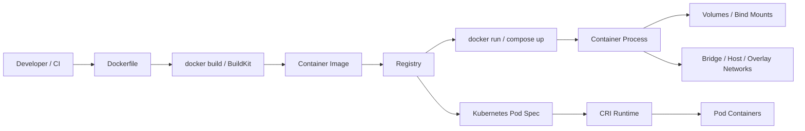

# Docker

## Why This Folder Matters

Docker is the bridge between "it works on my machine" and a repeatable deployment artifact. It packages an application, its runtime, and its operating-system-level dependencies into an image, then runs that image as an isolated process called a container.

This folder is now organized as a mastery path: first principles, architecture, daily commands, image construction, storage, networking, Compose, debugging, security, production gotchas, Kubernetes connection, labs, interview practice, revision, and glossary.

## Version and Source Assumptions

- Docker behavior is described primarily for Linux containers on Docker Engine / Docker CLI, with Docker Compose v2.
- Docker Desktop on Windows and macOS adds a Linux VM layer, so filesystem paths, bind-mount performance, host networking, and permissions can differ from native Linux.
- Compose syntax follows the current Compose Specification, not the old standalone `docker-compose` v1 mental model.
- Kubernetes sections explain how Docker-built OCI-style images are consumed by Kubernetes, not how Kubernetes uses Docker as a node runtime. Modern Kubernetes talks to CRI-compatible runtimes rather than requiring the Docker Engine on worker nodes.
- Source check date: 2026-05-26. Version-sensitive behavior is marked in the relevant chapters.

## Learning Order

| Order | Note | Focus |
| --- | --- | --- |
| 0 | [Docker Roadmap and Source Backbone](00%20-%20Docker%20Roadmap%20and%20Source%20Backbone.md) | Whole-course roadmap, official-source map, and the causal chain from deployment pain to Kubernetes. |
| 1 | [Containers and Images](1%20-%20Containers%20and%20Images.md) | What containers are, what images are, and why Docker changed application delivery. |
| 2 | [Docker CLI and Container Lifecycle](2%20-%20Docker%20CLI%20and%20Container%20Lifecycle.md) | Running, stopping, inspecting, logging, executing, cleaning, and reading lifecycle state. |
| 3 | [Dockerfiles and Image Builds](3%20-%20Dockerfiles%20and%20Image%20Builds.md) | Dockerfile instructions, build context, layers, cache, multi-stage builds, and build hygiene. |
| 4 | [Volumes and Networking](4%20-%20Volumes%20and%20Networking.md) | Persistent data, bind mounts, named volumes, tmpfs, bridge networks, DNS, and published ports. |
| 5 | [Docker Compose](5%20-%20Docker%20Compose.md) | Multi-container apps, services, networks, volumes, environment variables, health checks, and local stack design. |
| 6 | [Docker Security and Best Practices](6%20-%20Docker%20Security%20and%20Best%20Practices.md) | Smaller images, non-root runtime, capabilities, secrets, scanning, rootless mode, and Docker socket risk. |
| 7 | [Container Architecture Deep Dive](7%20-%20Container%20Architecture%20Deep%20Dive.md) | Namespaces, cgroups, capabilities, copy-on-write filesystems, OCI, Docker daemon, containerd, and runc. |
| 8 | [Debugging and Operations Playbook](8%20-%20Debugging%20and%20Operations%20Playbook.md) | Failure analysis, logs, inspect output, DNS/network checks, storage diagnosis, Compose diagnosis, and cleanup. |
| 9 | [Production Gotchas and Kubernetes Connection](9%20-%20Production%20Gotchas%20and%20Kubernetes%20Connection.md) | Production readiness, image promotion, signals, health checks, resource limits, Kubernetes mapping, and orchestration tradeoffs. |
| 10 | [Hands-on Labs](10%20-%20Hands-on%20Labs.md) | Practical labs for containers, builds, layers, volumes, networks, Compose, debugging, security, and Kubernetes translation. |
| 11 | [Practice Questions and Answers](11%20-%20Practice%20Questions%20and%20Answers.md) | MCQs, scenario questions, interview questions, and reasoning-backed answers. |
| 12 | [Cheatsheet](12%20-%20Cheatsheet.md) | High-density revision tables, command patterns, Dockerfile patterns, Compose template, and troubleshooting cues. |
| 13 | [Glossary](13%20-%20Glossary.md) | Docker vocabulary with exam, interview, and production significance. |
| 14 | [CHANGELOG](CHANGELOG.md) | What was upgraded, what was added, and which assumptions need future verification. |

## The Master Mental Model

```text
deployment pain -> container -> image -> layer -> registry -> orchestrator -> Kubernetes
```

- A Dockerfile is the recipe for a runtime environment.
- An image is the immutable package built from that recipe.
- A layer is a reusable filesystem change inside the image.
- A registry is the distribution point for images.
- A container is a running process created from an image plus runtime configuration.
- Compose describes a local multi-container application.
- Kubernetes takes the same image idea and adds scheduling, desired state, service discovery, rollout, self-healing, and policy.

## Architecture Map



## Small Details That Matter Later

- Docker is not a magic mini-VM. A Linux container is still a process using the host kernel with isolation features around it.
- An image tag is a name pointer. A digest is content identity. Tags can move; digests are fixed for a specific image content.
- The container writable layer is not a database. If the container is removed, data not stored in a volume, bind mount, or external service is gone.
- `EXPOSE` documents intent in an image; `-p` or Compose `ports` publishes a port from host to container.
- Compose is excellent for local multi-service development, but Kubernetes is a different control model, not merely a larger Compose file.
- Docker Desktop path and network behavior can differ from native Linux because the daemon runs in a VM.
- Security begins at build time: base image choice, `.dockerignore`, secret handling, non-root users, capabilities, and mounted host paths all matter before production.

## Official References

- Docker overview: <https://docs.docker.com/get-started/docker-overview/>
- Dockerfile reference: <https://docs.docker.com/reference/builder/>
- Dockerfile best practices: <https://docs.docker.com/build/building/best-practices/>
- Image layers: <https://docs.docker.com/get-started/docker-concepts/building-images/understanding-image-layers/>
- Docker storage: <https://docs.docker.com/engine/storage/>
- Docker networking: <https://docs.docker.com/engine/network/>
- Docker Compose Specification: <https://docs.docker.com/reference/compose-file/>
- Docker security: <https://docs.docker.com/engine/security/>
- Docker rootless mode: <https://docs.docker.com/engine/security/rootless/>
- Kubernetes images: <https://kubernetes.io/docs/concepts/containers/images/>
