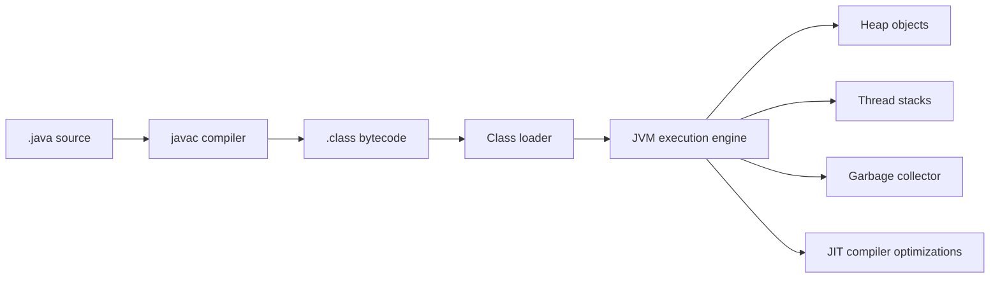

# 01 - JVM, Compilation, Bytecode, and Runtime Foundations

## Why This Chapter Matters

Java is not just a syntax for writing classes. Java is a language plus a runtime architecture.

The important chain is:

```text
source code -> javac compiler -> bytecode -> class loading -> JVM execution -> managed memory -> runtime services
```

If you understand this chain, Java errors become less mysterious:

- `ClassNotFoundException`
- `NoClassDefFoundError`
- `NoSuchMethodError`
- `OutOfMemoryError`
- classpath conflicts
- GC pauses
- stack overflows
- version mismatch

Cause -> Mechanism -> Immediate Result -> Long-Term Impact -> Next Connected Topic:

```text
C/C++ portability and memory-safety pain
-> Java compiles to JVM bytecode and runs on a managed virtual machine
-> code can run across compatible platforms with runtime services
-> enterprise systems gain portability, tooling, GC, reflection, and observability
-> OOP, generics, collections, exceptions, streams, concurrency, and memory model
```

Official source baseline:

- Java SE specifications: <https://docs.oracle.com/javase/specs/>
- Java SE 25 docs: <https://docs.oracle.com/en/java/javase/25/>
- Java SE 21 docs: <https://docs.oracle.com/en/java/javase/21/>
- Java Language Specification SE 21: <https://docs.oracle.com/javase/specs/jls/se21/html/index.html>
- JVM Specification SE 21: <https://docs.oracle.com/javase/specs/jvms/se21/html/index.html>

Version assumption: source checked on 2026-05-27. Current Oracle specification pages include newer Java SE editions than 21, while many enterprise systems still use Java 17 or 21 LTS baselines. Examples here stay Java 21-compatible unless a version-sensitive feature is explicitly marked.

## The Big Picture



Java's central idea:

```text
compile once to a portable intermediate form, then let a JVM execute and optimize it for the actual machine
```

This creates a split:

| Layer | Main job |
| --- | --- |
| Java language | Source syntax, types, classes, interfaces, methods, expressions. |
| `javac` | Compile source to bytecode and report compile-time errors. |
| Bytecode | Portable instruction set for JVM. |
| JVM | Load, verify, execute, optimize, and manage memory. |
| JDK | Developer kit: compiler, runtime, tools, libraries. |
| Libraries | Standard APIs and third-party code. |

## First-Principles Explanation

### Why Bytecode Exists

Native C/C++ model:

```text
source -> compiler for OS/CPU -> native binary
```

Problem:

```text
different OS/CPU targets require different binaries and toolchains
```

Java model:

```text
source -> bytecode -> compatible JVM on each platform
```

The JVM absorbs platform differences.

Tradeoff:

- portability and runtime services improve
- startup, warmup, GC, and runtime tuning become important

### JDK vs JRE vs JVM

| Term | Meaning | Practical note |
| --- | --- | --- |
| JVM | Virtual machine that executes bytecode. | Runtime engine. |
| JRE | Runtime environment concept containing JVM and libraries. | Modern Java distributions often focus on JDK and custom runtimes rather than separate public JRE downloads. |
| JDK | Development kit with compiler, runtime, tools, and libraries. | Use this to build Java programs. |

Simple rule:

```text
JDK builds and runs.
JVM executes.
JRE is the runtime-environment concept.
```

### Why Class Loading Exists

Java does not load every possible class at process startup. Classes are loaded when needed.

This allows:

- modular applications
- lazy loading
- application servers
- plugin systems
- reflection frameworks

It also creates classpath/module path problems.

## Core Vocabulary

| Term | Meaning | Why it matters |
| --- | --- | --- |
| `javac` | Java compiler. | Produces `.class` files. |
| Bytecode | JVM instruction format. | Portable compiled form. |
| `.class` file | Compiled class/interface/record/etc. | Unit loaded by JVM. |
| JVM | Virtual machine executing bytecode. | Runtime and memory manager. |
| Class loader | Loads class definitions. | Explains classpath conflicts. |
| Classpath | Locations where classes/resources are searched. | Common source of runtime errors. |
| Module path | Java module system path. | Stronger boundaries than classpath. |
| Heap | Memory for objects. | GC, leaks, allocation pressure. |
| Stack | Per-thread call frames. | Method calls, recursion, local variables. |
| GC | Garbage collection. | Reclaims unreachable objects. |
| JIT | Just-in-time compiler. | Optimizes hot bytecode to native code. |

## Mental Model

Think of Java execution as a managed factory:

```text
source code is blueprint
javac makes portable machine instructions for JVM
class loader brings pieces into the factory
JVM verifies and runs them
heap stores objects
stack stores method-call frames
GC cleans unreachable objects
JIT optimizes hot paths
```

## Historical / Evolution / Causal Chain

### Native Deployment Pain

Before Java's rise, cross-platform applications often faced:

- manual memory management
- segmentation faults
- platform-specific builds
- dependency and binary compatibility issues
- weaker standard runtime services

Java responded with:

```text
strong static typing
bytecode portability
managed memory
standard class library
runtime verification
```

### Enterprise Adoption

Enterprise systems needed long-lived services, database access, networking, thread support, and tooling. Java's managed runtime and ecosystem made it attractive.

Cause -> Mechanism -> Impact:

```text
business applications needed portability and safety
-> JVM and standard libraries provided consistent runtime behavior
-> Java became common in backend systems, app servers, Android history, big data tools, and enterprise platforms
```

## Architecture or Conceptual Structure

### Compile and Run Example

`Hello.java`:

```java
public class Hello {
    public static void main(String[] args) {
        System.out.println("Hello, Java");
    }
}
```

Compile:

```bash
javac Hello.java
```

Run:

```bash
java Hello
```

What happens:

```text
javac creates Hello.class
java starts JVM
JVM class loader loads Hello
JVM calls public static void main(String[] args)
```

### Method Execution

Each thread has a stack. Each method call creates a frame.

```text
main frame
-> calls parse
-> parse frame
-> calls validate
-> validate frame
```

If recursion never ends, stack frames grow until `StackOverflowError`.

### Object Allocation

```java
User user = new User("jay");
```

Conceptually:

```text
new allocates object on heap
constructor initializes state
local variable user stores a reference value
```

Java passes values. For objects, the value is a reference.

## Step-by-Step Explanation

### Class Loading Phases

Simplified phases:

1. Loading: find and read class bytes.
2. Linking: verify, prepare, and resolve references.
3. Initialization: run static initializers and initialize static fields.

Static initializer trap:

```java
class Config {
    static String token = loadTokenFromNetwork();
}
```

This does work during class initialization. If it fails, the class can fail to initialize and later produce confusing errors.

### Runtime Errors From Loading

`ClassNotFoundException`:

```text
code explicitly tried to load class by name and it was not found
```

`NoClassDefFoundError`:

```text
class existed at compile time or earlier but is missing or failed at runtime
```

`NoSuchMethodError`:

```text
compiled code expects a method that the runtime class version does not have
```

Often caused by dependency version mismatch.

### Stack vs Heap

Stack:

- one per thread
- method frames
- local variables and operand stack
- grows/shrinks with calls

Heap:

- objects
- arrays
- shared across threads
- managed by GC

Important:

```text
local variable can live on stack, but object it references lives on heap conceptually
```

## Internal Mechanics

### Garbage Collection Does Not Prevent Memory Leaks

GC reclaims unreachable objects. If an object remains reachable accidentally, GC must keep it.

Leak chain:

```text
static map stores user sessions
-> expired sessions are never removed
-> map still references session objects
-> GC sees them reachable
-> heap grows
```

Java memory leak means:

```text
objects are no longer useful but remain reachable
```

### JIT Compilation

The JVM can interpret bytecode and compile hot paths to optimized native code.

This explains:

- warmup behavior
- benchmarks needing care
- long-running service performance improving after startup
- profiling being better than guessing

### Verification

The JVM verifies class files for safety constraints before execution. This is part of the managed runtime promise.

## Practical Examples

### Inspect Java Version

```bash
java -version
javac -version
```

Purpose:

- confirm runtime and compiler versions
- diagnose "compiled by newer Java" errors

Bad pattern:

```text
javac 21, java 17
```

You may compile bytecode the older runtime cannot execute unless target settings are used.

### Compile for an Older Release

```bash
javac --release 17 App.java
```

Purpose: compile using Java 17 language/API target from a newer JDK.

Important: verify toolchain and build system settings in real projects.

### Inspect Bytecode

```bash
javap -c Hello
```

Purpose: disassemble bytecode for learning and debugging.

Use in interviews to explain that Java source is not directly executed as text.

## Small Details That Matter Later

- Java passes reference values by value. It does not pass objects by reference.
- `String[] args` is the command-line argument array for `main`.
- `public static void main(String[] args)` is the traditional entry point.
- Source file name must match a public top-level class name.
- Runtime Java version must be compatible with compiled class file version.
- `classpath` conflicts can produce runtime errors even if compilation succeeded.
- Static initialization can fail and poison class loading.
- GC removes unreachable objects, not unwanted reachable objects.
- `StackOverflowError` usually means uncontrolled recursion or deep call chains.
- `OutOfMemoryError` can be heap, metaspace, direct memory, threads, or other resource pressure depending on message.
- JIT warmup affects performance measurements.
- Modern Java has modules, but many enterprise apps still rely heavily on classpath.

## Common Misunderstandings

### Misunderstanding 1: "Java is interpreted."

More accurate:

```text
Java source is compiled to bytecode. The JVM executes bytecode through interpretation and JIT compilation.
```

### Misunderstanding 2: "GC means no memory leaks."

GC cannot collect objects that are still reachable.

### Misunderstanding 3: "JDK and JVM are the same."

The JVM runs code. The JDK includes development tools and runtime pieces.

### Misunderstanding 4: "Java passes objects by reference."

Java passes values. For object variables, the value is a reference.

## Failure Modes / Mistakes / Traps

### Trap 1: Version Mismatch

```text
compile with newer JDK
-> run with older JVM
-> UnsupportedClassVersionError
```

### Trap 2: Dependency Conflict

```text
compile against library v2
-> runtime loads library v1
-> NoSuchMethodError
```

### Trap 3: Static Initializer Does Too Much

```text
class loads
-> static block calls network/database
-> failure prevents class initialization
```

### Trap 4: Accidental Reachability

```text
cache grows forever
-> objects remain reachable
-> GC cannot reclaim
```

## Debugging / Analysis / Answer-Writing Method

For runtime class errors:

1. Check `java -version` and `javac -version`.
2. Check build target/release.
3. Inspect dependency tree.
4. Search for duplicate class versions.
5. Identify class loader boundary if using app server/plugin framework.
6. Read full error type, not only the message.

For memory issues:

1. Read exact `OutOfMemoryError` message.
2. Check heap size and GC logs.
3. Take heap dump when safe.
4. Find retaining references.
5. Inspect caches, static collections, thread locals, queues.

## Real-World or Exam Relevance

Interviewers commonly ask:

- What is JVM?
- What is bytecode?
- JDK vs JRE vs JVM?
- Stack vs heap?
- Does Java pass by reference?
- How can Java leak memory with GC?
- What is class loading?
- Why can code compile but fail at runtime?

Strong answer:

```text
Java source compiles to bytecode. A JVM loads, verifies, executes, and optimizes that bytecode while managing heap memory through GC. The JDK contains compiler and tools; the JVM is the runtime engine. Objects live on the heap, method frames live on thread stacks, and object variables hold reference values passed by value.
```

## Connected Topics

- [OOP Generics Collections Exceptions and Streams](02%20-%20OOP%20Generics%20Collections%20Exceptions%20and%20Streams.md)
- [Concurrency Memory Model and Production Debugging](03%20-%20Concurrency%20Memory%20Model%20and%20Production%20Debugging.md)
- C++ compilation/linking and manual memory.
- Python interpreter/object model.
- Jenkins build pipelines and Java toolchains.

## Chapter Summary

Java is a managed runtime platform.

The essential chain:

```text
.java -> javac -> .class bytecode -> class loader -> JVM execution -> heap/stack/GC/JIT
```

Most real Java debugging depends on knowing which layer failed: source, compile, bytecode compatibility, class loading, dependency version, memory, or runtime execution.

## Questions to Test Understanding

1. Why does Java compile to bytecode?
2. What is the difference between JDK and JVM?
3. What is a class loader?
4. What lives on heap?
5. What lives on thread stack?
6. Why can Java still leak memory?
7. What causes `UnsupportedClassVersionError`?
8. Why can `NoSuchMethodError` happen after successful compilation?
9. What does JIT compilation do?
10. Does Java pass objects by reference?

## Answers and Reasoning

1. Bytecode gives a portable compiled form that compatible JVMs can execute on different platforms.
2. JDK is the development kit with compiler/tools/runtime; JVM is the virtual machine executing bytecode.
3. It finds, loads, links, and initializes class definitions at runtime.
4. Objects and arrays conceptually live on the heap.
5. Method call frames and local variables live on each thread's stack.
6. Objects can remain reachable through static fields, caches, collections, thread locals, or queues even when no longer useful.
7. The class was compiled for a newer Java version than the runtime JVM supports.
8. Runtime loads a different library/class version than the one compiled against.
9. It compiles frequently executed bytecode paths to optimized native code at runtime.
10. No. Java passes values; object variables hold reference values, and those reference values are passed by value.

