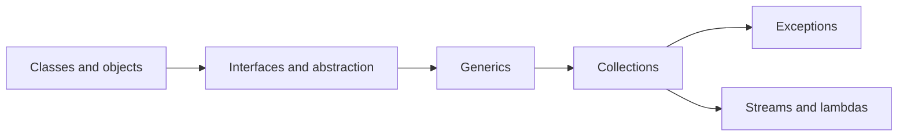
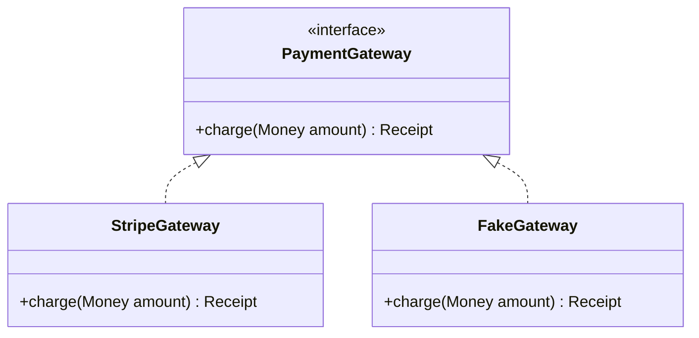

# 02 - OOP, Generics, Collections, Exceptions, and Streams

## Why This Chapter Matters

Most Java code is not raw bytecode or JVM tuning. Most Java code is classes, interfaces, collections, exceptions, generics, lambdas, and streams.

These features are powerful because they help large teams express structure. They are dangerous when used mechanically:

- inheritance without substitutability
- `==` used for object equality
- `equals` without `hashCode`
- raw types bypassing generics
- checked exceptions leaking poor API design
- streams hiding side effects

Cause -> Mechanism -> Immediate Result -> Long-Term Impact -> Next Connected Topic:

```text
large applications need structure and reusable abstractions
-> Java provides classes, interfaces, static types, generics, collections, exceptions, lambdas, and streams
-> teams can model domains and APIs consistently
-> correctness depends on equality, type erasure, collection contracts, exception boundaries, and side-effect discipline
-> concurrency, memory visibility, production debugging, and framework design
```

Official source baseline:

- Java Language Specification: <https://docs.oracle.com/javase/specs/jls/se21/html/index.html>
- Java SE API docs: <https://docs.oracle.com/en/java/javase/21/docs/api/>
- Java Collections Framework docs: <https://docs.oracle.com/en/java/javase/21/docs/api/java.base/java/util/package-summary.html>
- Java Streams docs: <https://docs.oracle.com/en/java/javase/21/docs/api/java.base/java/util/stream/package-summary.html>

Version assumption: examples stay Java 21-compatible. Newer Java releases add language/API features, but the core OOP/generics/collections concepts remain central across modern Java versions.

## The Big Picture



Java's everyday design question:

```text
How do I model behavior and data so the compiler helps me and future maintainers do the right thing?
```

## First-Principles Explanation

### Why OOP Exists

OOP groups state and behavior:

```java
class Account {
    private long balanceCents;

    void deposit(long cents) {
        if (cents <= 0) {
            throw new IllegalArgumentException("deposit must be positive");
        }
        balanceCents += cents;
    }
}
```

This keeps rules near the data they protect.

Bad alternative:

```text
public mutable fields everywhere
-> rules scattered across codebase
-> any caller can put object into invalid state
```

### Why Interfaces Exist

An interface describes behavior without committing to implementation.

```java
interface PaymentGateway {
    Receipt charge(Money amount);
}
```

This lets code depend on a contract, not a concrete implementation.

Cause -> Mechanism -> Result:

```text
code needs replaceable behavior
-> interface defines required methods
-> implementation can change without changing callers
```

### Why Generics Exist

Without generics:

```java
List names = new ArrayList();
names.add("jay");
String first = (String) names.get(0);
```

With generics:

```java
List<String> names = new ArrayList<>();
names.add("jay");
String first = names.get(0);
```

Generics move many type mistakes from runtime to compile time.

## Core Vocabulary

| Term | Meaning | Why it matters |
| --- | --- | --- |
| Class | Blueprint for objects. | Encapsulates state and behavior. |
| Object | Instance of a class. | Runtime entity on heap. |
| Encapsulation | Hide representation behind methods. | Protects invariants. |
| Inheritance | Subclass reuses/extends superclass. | Useful but easily overused. |
| Polymorphism | Same interface, different implementations. | Enables flexible design. |
| Interface | Behavioral contract. | Decouples callers from implementation. |
| Abstract class | Partial implementation plus abstraction. | Useful for shared state/behavior with caution. |
| Generic | Type parameterized class/method. | Type safety and reusable code. |
| Type erasure | Generic type info mostly removed at runtime. | Explains limitations. |
| Collection | Object storing groups of elements. | Core data handling. |
| Checked exception | Must be caught or declared. | API design pressure. |
| Lambda | Function-like expression. | Enables concise behavior passing. |
| Stream | Declarative data-processing pipeline. | Good for transformations; poor for hidden side effects. |

## Mental Model

Use these design rules:

```text
class -> own state and invariants
interface -> behavior contract
inheritance -> true substitutability
composition -> reuse without fragile hierarchy
generics -> compile-time type safety
collections -> choose by access pattern
exceptions -> fail with meaningful recovery boundaries
streams -> transform data clearly
```

## Architecture or Conceptual Structure

### OOP Relationship Map



Callers should depend on `PaymentGateway`, not `StripeGateway`, when they only need the behavior contract.

### Collections Decision Table

| Need | Common choice |
| --- | --- |
| Ordered dynamic list | `ArrayList` |
| Frequent middle insert/remove | `LinkedList` rarely, often another design |
| Unique elements | `HashSet` |
| Sorted unique elements | `TreeSet` |
| Key-value lookup | `HashMap` |
| Sorted key lookup | `TreeMap` |
| FIFO queue | `ArrayDeque` |
| Thread-safe queue | `ConcurrentLinkedQueue`, `BlockingQueue` variants |

## Step-by-Step Explanation

### Encapsulation

Bad:

```java
class User {
    public String email;
}
```

Any caller can set invalid email.

Better:

```java
class User {
    private final String email;

    User(String email) {
        if (email == null || !email.contains("@")) {
            throw new IllegalArgumentException("invalid email");
        }
        this.email = email;
    }

    String email() {
        return email;
    }
}
```

The object protects its invariant.

### Inheritance vs Composition

Inheritance asks:

```text
is subclass truly substitutable for superclass?
```

Composition asks:

```text
can this class use another object to do part of its work?
```

Prefer composition unless inheritance is truly a type relationship.

### `==`, `.equals`, and `hashCode`

```java
String a = new String("java");
String b = new String("java");

System.out.println(a == b);       // false
System.out.println(a.equals(b));  // true
```

For objects:

- `==` compares reference identity
- `.equals()` compares logical equality if implemented

If a class overrides `.equals()`, it must also override `.hashCode()` consistently for hash collections.

### Generics and Type Erasure

```java
List<String> names = new ArrayList<>();
```

At runtime, generic type information is mostly erased. This explains why you cannot normally do:

```java
if (obj instanceof List<String>) { ... } // not allowed
```

You can check raw type:

```java
if (obj instanceof List<?>) { ... }
```

### Wildcards

Producer extends:

```java
void printAll(List<? extends Number> values) {
    for (Number value : values) {
        System.out.println(value);
    }
}
```

Consumer super:

```java
void addIntegers(List<? super Integer> values) {
    values.add(1);
}
```

Memory hook:

```text
PECS: Producer Extends, Consumer Super
```

### Exceptions

Checked exception:

```java
void read() throws IOException {
    Files.readString(Path.of("config.txt"));
}
```

Unchecked exception:

```java
throw new IllegalArgumentException("bad input");
```

Design principle:

```text
throw exceptions that callers can understand and recover from
```

Do not catch broadly and continue with corrupted state.

### Lambdas and Functional Interfaces

```java
List<String> names = List.of("jay", "ana", "zoe");
names.forEach(name -> System.out.println(name));
```

A lambda works where Java expects a functional interface, meaning an interface with one abstract method.

Example:

```java
Predicate<String> nonEmpty = s -> !s.isBlank();
```

### Streams

```java
List<String> activeEmails = users.stream()
    .filter(User::active)
    .map(User::email)
    .map(String::toLowerCase)
    .toList();
```

Use streams for clear transformations.

Avoid streams for:

- complex branching
- mutation-heavy logic
- code that needs step-by-step debugging clarity
- hidden I/O side effects

## Internal Mechanics

### Object Reference Equality

Object variables hold reference values. `==` compares those reference values.

This is why two objects with same content may not be `==`.

### Hash Collection Contract

For `HashMap`/`HashSet`:

```text
if a.equals(b) is true, a.hashCode() must equal b.hashCode()
```

If not, objects can disappear from hash-based collections logically.

### Generic Invariance

`List<Integer>` is not a subtype of `List<Number>`.

Why:

```java
List<Integer> ints = new ArrayList<>();
// If this were allowed:
List<Number> nums = ints;
nums.add(3.14);
Integer x = ints.get(0); // broken
```

Wildcards solve safe producer/consumer cases.

### Streams Are Lazy Until Terminal Operation

Intermediate operations do not run until terminal operation:

```java
Stream<String> stream = names.stream()
    .filter(name -> {
        System.out.println(name);
        return true;
    });
```

No output yet.

Terminal operation:

```java
stream.toList();
```

Now it runs.

## Practical Examples

### Value Object

```java
import java.util.Objects;

final class Email {
    private final String value;

    Email(String value) {
        if (value == null || !value.contains("@")) {
            throw new IllegalArgumentException("invalid email");
        }
        this.value = value.toLowerCase();
    }

    String value() {
        return value;
    }

    @Override
    public boolean equals(Object other) {
        if (this == other) return true;
        if (!(other instanceof Email email)) return false;
        return value.equals(email.value);
    }

    @Override
    public int hashCode() {
        return Objects.hash(value);
    }
}
```

Why this matters:

- invariant at construction
- immutable
- equality based on value
- hashCode consistent

### Collection Choice

```java
Set<String> seen = new HashSet<>();
for (String id : ids) {
    if (!seen.add(id)) {
        System.out.println("duplicate id: " + id);
    }
}
```

`Set.add` returns false if value was already present.

### Stream With Clear Contract

```java
Map<String, Long> countsByTeam = users.stream()
    .collect(Collectors.groupingBy(
        User::team,
        Collectors.counting()
    ));
```

Use collectors when grouping/summing/counting; avoid hand-mutating external maps inside streams.

## Small Details That Matter Later

- `final` on a reference prevents rebinding, not mutation of the object referenced.
- `String` is immutable; use `StringBuilder` for repeated building in loops.
- Always override `hashCode` when overriding `equals`.
- `record` classes are useful for transparent immutable data carriers in modern Java.
- `List.of` returns an unmodifiable list.
- `Arrays.asList` returns a fixed-size list backed by the array.
- `Optional` is usually for return values, not fields or parameters by default.
- Generic type erasure limits runtime checks.
- Raw types remove generic safety and should be avoided.
- Streams are lazy until terminal operations.
- Parallel streams are not automatic performance wins.
- Checked exceptions are part of method API design.
- `NullPointerException` is often an API design smell.

## Common Misunderstandings

### Misunderstanding 1: "Inheritance is the main way to reuse code."

Composition is often safer. Inheritance should model substitutable type relationships.

### Misunderstanding 2: "`final` makes an object immutable."

`final` makes the variable/reference not reassignable. The object can still mutate unless the object itself is immutable.

### Misunderstanding 3: "Generics exist at runtime like in source."

Java generics use type erasure in many cases, so runtime generic checks are limited.

### Misunderstanding 4: "Streams are always better than loops."

Streams are better when they clarify transformations. Loops are better when logic is procedural, stateful, or needs explicit control flow.

## Failure Modes / Mistakes / Traps

### Trap 1: `equals` Without `hashCode`

Hash collections behave incorrectly.

### Trap 2: Mutable Key in HashMap

```java
Map<User, String> map = new HashMap<>();
user.setEmail("new@example.com");
```

If equality/hash depends on mutable email, lookup can break.

### Trap 3: Raw Types

```java
List list = new ArrayList();
list.add(123);
String s = (String) list.get(0);
```

Runtime `ClassCastException`.

### Trap 4: Swallowed Exception

```java
try {
    save();
} catch (Exception ignored) {
}
```

This hides failure and corrupts observability.

## Debugging / Analysis / Answer-Writing Method

For collection/equality bugs:

1. Check `equals` and `hashCode`.
2. Check key mutability.
3. Check concrete collection type.
4. Check null handling.
5. Check generic raw types/warnings.

For stream bugs:

1. Identify source.
2. List intermediate operations.
3. Find terminal operation.
4. Check side effects.
5. Replace with loop temporarily if debugging clarity matters.

## Real-World or Exam Relevance

Common interview prompts:

- Difference between interface and abstract class.
- Overloading vs overriding.
- `==` vs `.equals()`.
- Why override `hashCode`.
- ArrayList vs LinkedList.
- HashMap vs TreeMap.
- Checked vs unchecked exceptions.
- What is type erasure?
- What is a functional interface?
- When not to use streams?

Strong answer:

```text
Java uses classes for state and behavior, interfaces for contracts, generics for compile-time type safety, and collections for data structure choices. Object equality should use `.equals`, identity uses `==`, and hash-based collections require consistent `hashCode`. Streams are lazy transformation pipelines and should stay side-effect-light.
```

## Connected Topics

- [JVM Compilation Bytecode and Runtime Foundations](01%20-%20JVM%20Compilation%20Bytecode%20and%20Runtime%20Foundations.md)
- [Concurrency Memory Model and Production Debugging](03%20-%20Concurrency%20Memory%20Model%20and%20Production%20Debugging.md)
- C++ STL and object lifetime.
- Python data model and containers.

## Chapter Summary

Java's everyday power comes from disciplined structure:

```text
classes protect invariants
interfaces define contracts
composition usually beats inheritance
generics improve compile-time safety
collections require equality/hash discipline
exceptions define failure contracts
streams clarify transformations when side effects stay controlled
```

## Questions to Test Understanding

1. What is encapsulation?
2. When should you prefer composition over inheritance?
3. What is the difference between `==` and `.equals()`?
4. Why must `hashCode` match `equals`?
5. What is type erasure?
6. Why is `List<Integer>` not a subtype of `List<Number>`?
7. What does PECS mean?
8. What is a functional interface?
9. When do stream intermediate operations run?
10. Why can swallowing exceptions be dangerous?

## Answers and Reasoning

1. Hiding internal representation and exposing controlled behavior to protect invariants.
2. When you need reuse or delegation without a true substitutable type relationship.
3. `==` compares primitive values or object reference identity; `.equals()` checks logical equality when implemented.
4. Hash collections use hashCode to locate buckets; equal objects must have same hash to be found correctly.
5. Java removes much generic type information at runtime, preserving compile-time type checks but limiting runtime generic inspection.
6. It would allow inserting non-Integer Numbers into an Integer list through a Number reference.
7. Producer Extends, Consumer Super: use `? extends T` for reading producers and `? super T` for writing consumers.
8. An interface with one abstract method, usable as a lambda target.
9. They are lazy and run only when a terminal operation executes.
10. It hides failure, makes recovery impossible, and can leave the system in bad state.

