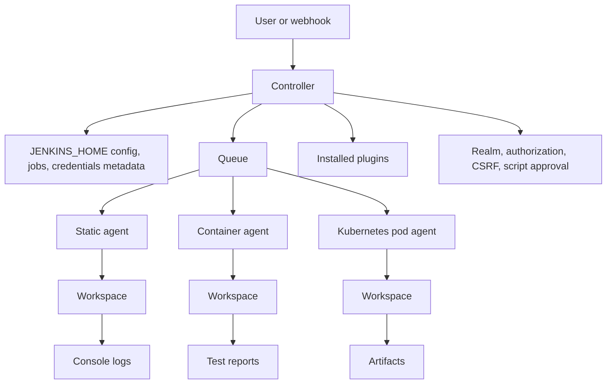
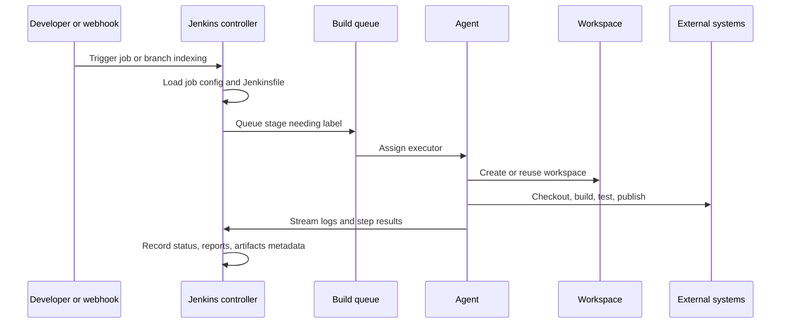

# 7 - Pipeline Operations, Security, and Troubleshooting Runbooks

## Why This Chapter Matters

The first Jenkins skill is writing a working Pipeline. The professional Jenkins skill is keeping that Pipeline trustworthy when agents disconnect, plugin versions drift, credentials are involved, Docker builds need isolation, tests become flaky, disks fill up, and a release waits on a red build.

Jenkins is powerful because it lets teams turn build and release knowledge into executable automation. That same power creates risk. A Pipeline can deploy to production, print a secret, delete a workspace, saturate every executor, or run unreviewed shell code on a trusted agent. This chapter teaches the operational habits that keep Jenkins from becoming a fragile button-clicking machine.

Source snapshot: 2026-05-27. Jenkins behavior is version-sensitive because Pipeline steps, credential bindings, agents, Kubernetes clouds, Docker integrations, and script-security behavior come from a combination of Jenkins core and plugins. Verify commands and UI paths against the current Jenkins documentation and your installed plugin versions.

Official references:

- Jenkins documentation: <https://www.jenkins.io/doc/>
- Jenkins Pipeline: <https://www.jenkins.io/doc/book/pipeline/>
- Jenkinsfile: <https://www.jenkins.io/doc/book/pipeline/jenkinsfile/>
- Pipeline syntax: <https://www.jenkins.io/doc/book/pipeline/syntax/>
- Jenkins credentials: <https://www.jenkins.io/doc/book/using/using-credentials/>
- Jenkins Script Console: <https://www.jenkins.io/doc/book/managing/script-console/>

## The Big Picture

Jenkins has four major operational surfaces:

```mermaid
flowchart LR
    Dev[Developer change] --> SCM[Source control]
    SCM --> Job[Pipeline or multibranch job]
    Job --> Controller[Jenkins controller]
    Controller --> Queue[Build queue]
    Queue --> Agent[Agent and executor]
    Agent --> Workspace[Workspace]
    Workspace --> Tools[Build tools and tests]
    Tools --> Reports[Test reports and artifacts]
    Reports --> Gate[Quality or release gate]
    Gate --> Deploy[Deployment or publication]
```



If a Jenkins build fails, do not stare only at the last stack trace. Ask which surface failed:

| Surface | Typical failure | Correct investigation |
| --- | --- | --- |
| SCM and Jenkinsfile | Syntax error, wrong branch, missing Jenkinsfile, PR discovery failure | Check multibranch scan logs, branch source config, Jenkinsfile path, webhook events. |
| Controller and queue | Build stuck, UI slow, plugin error, credentials missing | Check queue reason, controller logs, plugin compatibility, permissions, credential scope. |
| Agent and workspace | Label mismatch, disconnected agent, missing tool, stale files | Check node status, labels, executors, workspace path, permissions, tool versions. |
| Build logic | Tests fail, artifact missing, deploy blocked | Check stage logs, shell exit codes, test reports, artifact paths, gate conditions. |
| Security and governance | Secret leak, overbroad access, unsafe script approval | Check credential usage, RBAC, folder scope, Script Console access, plugin advisories. |

## First-Principles Explanation

Manual CI/CD fails for the same reason manual operations fail: the real process lives in people's memory. One person knows how to build. Another knows which tests are optional. Someone else knows which environment variable must never be printed. During an incident, that hidden knowledge turns into inconsistent releases.

Jenkins solves the repeatability problem by making the process executable:

Manual steps -> Jenkinsfile -> repeatable stages -> visible logs and artifacts -> faster diagnosis -> safer releases.

But Jenkins does not automatically solve correctness. It only runs what it is told to run. If the Jenkinsfile mixes secrets into Groovy strings, Jenkins can still expose risk. If the controller runs heavy builds, the automation platform becomes part of the failure. If all agents share mutable state, one build can poison the next.

So the real Jenkins mental model is:

Desired automation -> scheduled by controller -> executed on agents -> observed through logs/reports/artifacts -> governed by permissions and review.

Every production Jenkins decision should protect one of those pieces.

## Core Vocabulary

| Term | Meaning | Why it matters |
| --- | --- | --- |
| Controller | The Jenkins server that stores configuration, serves UI/API, schedules jobs, and manages plugins. | It is stateful and security-critical. Do not treat it like a disposable build box unless you have full configuration-as-code and backup discipline. |
| Agent | A machine, container, VM, or Kubernetes Pod that runs build steps. | Build tools and untrusted code belong here, not on the controller. |
| Executor | A build slot on a node. | Queue pressure usually means not enough matching executors or agents. |
| Workspace | Directory used by a job on an agent. | Stale files, permissions, and hidden caches often explain "works on rerun" failures. |
| Jenkinsfile | Pipeline definition stored as code. | Gives review history and avoids invisible UI-only build logic. |
| Multibranch Pipeline | Job type that discovers branches and pull requests with Jenkinsfiles. | Preferred for repository-driven CI. |
| Credential ID | Stable identifier used by Pipeline to request a stored secret. | Pipelines should reference IDs, not literal secret values. |
| Plugin | Extension that adds Jenkins features and Pipeline steps. | Step availability and behavior depend on plugin versions. |
| Script Console | Admin Groovy console running inside Jenkins. | It has controller-level power and must be protected as a privileged interface. |
| Artifact | Build output kept by Jenkins or published elsewhere. | Release artifacts should usually be stored in an external registry/repository, not only in Jenkins. |

## Mental Model

Think of Jenkins as an airport control tower, not as the aircraft engine.

The controller decides what should run, where it should run, and what result it has. Agents do the noisy work. The Jenkinsfile is the flight plan. Credentials are sealed documents handed to a flight only when needed. Logs, test reports, and artifacts are the black-box record. Plugins are equipment added to the airport. Some equipment is essential; too much unmaintained equipment creates risk.

Operational rule:

If a build step compiles, tests, packages, scans, or deploys, it should normally run on an agent. If a step changes global Jenkins configuration, credentials, plugins, users, or jobs, it is controller-level administration and should be reviewed separately.

## Historical / Evolution / Causal Chain

Old build servers often stored automation in UI forms. That worked for simple projects, but it created serious weaknesses:

UI-only job config -> hidden process -> poor reviewability -> hard recovery -> fragile releases.

Jenkins Pipeline changed the center of gravity:

Jenkinsfile in source control -> code review and branch history -> consistent CI behavior per branch -> easier reproduction -> better auditability.

Then teams scaled:

More repositories -> more builds -> controller overload -> agents and cloud executors -> label and capacity management.

Then security became central:

More deployment credentials -> higher blast radius -> credentials store and scoped permissions -> folder-level governance -> script approval and restricted admin surfaces.

Then cloud-native delivery grew:

Containerized apps -> image builds and Kubernetes deployments -> Docker/Kubernetes agents -> ephemeral workspaces -> stronger need for reproducible tooling and external artifact registries.

Jenkins remains useful because it can integrate many tools, but that flexibility creates the main tradeoff: you must govern plugins, agents, credentials, and Pipeline patterns deliberately.

## Architecture or Conceptual Structure



Important separation:

| Layer | Owns | Should not own |
| --- | --- | --- |
| Controller | Scheduling, configuration, plugin loading, credentials store, UI/API | Heavy builds, untrusted compilation, mutable application state. |
| Agent | Build execution, tests, packaging, local workspace | Global Jenkins configuration or long-lived secrets. |
| External systems | SCM, artifact registry, container registry, cloud, deployment target | Jenkins-only source of release truth. |

## Step-by-Step Explanation

### A Production-Ready Pipeline Shape

```groovy
pipeline {
    agent none

    options {
        timeout(time: 30, unit: 'MINUTES')
        buildDiscarder(logRotator(numToKeepStr: '30', artifactNumToKeepStr: '10'))
        disableConcurrentBuilds()
        timestamps()
    }

    stages {
        stage('Checkout') {
            agent { label 'linux && git' }
            steps {
                checkout scm
                sh 'git rev-parse --short HEAD'
                stash name: 'source', includes: '**/*', useDefaultExcludes: false
            }
        }

        stage('Test') {
            agent { label 'linux && python' }
            steps {
                unstash 'source'
                sh 'python -m pip install -r requirements.txt'
                sh 'python -m pytest --junitxml=reports/junit.xml'
            }
            post {
                always {
                    junit allowEmptyResults: false, testResults: 'reports/junit.xml'
                }
            }
        }

        stage('Package') {
            agent { label 'linux && docker' }
            when {
                branch 'main'
            }
            steps {
                unstash 'source'
                sh 'docker build -t example/app:${BUILD_NUMBER} .'
            }
        }

        stage('Publish') {
            agent { label 'linux && docker' }
            when {
                branch 'main'
            }
            steps {
                withCredentials([string(credentialsId: 'registry-token', variable: 'REGISTRY_TOKEN')]) {
                    sh 'printf "%s" "$REGISTRY_TOKEN" | docker login registry.example.com -u ci-bot --password-stdin'
                    sh 'docker push registry.example.com/example/app:${BUILD_NUMBER}'
                }
            }
        }
    }

    post {
        always {
            archiveArtifacts artifacts: 'reports/**/*', allowEmptyArchive: true
        }
        cleanup {
            cleanWs(deleteDirs: true, disableDeferredWipeout: true)
        }
    }
}
```

The pattern matters more than this exact file:

| Pattern | Why it exists |
| --- | --- |
| `agent none` globally | Prevents accidental controller or random-agent execution. Each stage chooses the right environment. |
| `timeout` | Stops broken builds from occupying executors forever. |
| `buildDiscarder` | Protects disk. Jenkins failures often begin as storage failures. |
| `disableConcurrentBuilds` | Prevents two builds from fighting over shared state when the job is not concurrency-safe. |
| `stash` / `unstash` | Moves short-lived files between agents inside one Pipeline run. Do not treat it as a long-term artifact store. |
| `junit` | Turns test XML into visible Jenkins test history. |
| `archiveArtifacts` | Keeps diagnostic files near the build record. |
| `withCredentials` | Binds secrets only around the step that needs them. |
| `cleanWs` | Reduces stale workspace failures. Requires the Workspace Cleanup plugin. |

Safety note: the `printf ... | docker login --password-stdin` pattern keeps the secret in the shell environment rather than in Groovy interpolation. The exact command can vary by shell and Docker client version. The key rule is to avoid placing secrets directly into Groovy-interpolated command strings.

## Internal Mechanics

### How a Pipeline Run Actually Moves



This explains common failures:

- If the build never starts, inspect queue, label, executors, and agent status.
- If checkout fails, inspect SCM credentials, branch source config, and workspace permissions.
- If a step is unknown, inspect plugins and Pipeline syntax.
- If a secret is missing, inspect credential ID and scope.
- If the result is unstable, inspect test report parsing and quality gates.

### Jenkinsfile Evaluation vs Shell Execution

Pipeline Groovy and shell commands are not the same layer.

```groovy
withCredentials([string(credentialsId: 'api-token', variable: 'API_TOKEN')]) {
    sh 'curl -H "Authorization: Bearer $API_TOKEN" https://example.com'
}
```

In this safer pattern, Groovy receives a literal string and the shell expands `$API_TOKEN` at runtime. That keeps the secret out of the Groovy interpolation path.

Risky pattern:

```groovy
withCredentials([string(credentialsId: 'api-token', variable: 'API_TOKEN')]) {
    sh "curl -H 'Authorization: Bearer ${API_TOKEN}' https://example.com"
}
```

This uses a Groovy GString. Secrets may appear in process arguments or logs depending on command behavior, plugin behavior, shell behavior, and masking limits. Jenkins masking reduces accidental disclosure, but masking is not a complete security boundary. Do not design around "the log will hide it."

### Controller State

The controller stores or coordinates:

- job definitions
- build metadata
- credentials metadata and encrypted secret material
- plugin files and configuration
- user and security configuration
- node definitions
- global tools
- queue and runtime state

This is why `JENKINS_HOME` backup matters. A backup that omits secrets or key material can restore job names but not working credentials.

## Practical Examples

### Check Why a Build Is Stuck in Queue

Use this when the build says "pending" or "waiting for next available executor."

What to check:

1. Open the queued build page and read the queue reason.
2. Confirm the Pipeline `agent` or stage `agent` label.
3. Go to Manage Jenkins -> Nodes and verify an online node has that label.
4. Check available executors on matching nodes.
5. Check whether another build is holding an executor.
6. Check whether the job has `disableConcurrentBuilds()` or a lock step.

Good output or state:

- A matching online agent exists.
- At least one executor is idle.
- The queued item starts after capacity becomes available.

Bad output or state:

- Label expression matches no node.
- Node is offline.
- Node has zero executors.
- Agent failed to connect.
- All executors are consumed by long-running builds.

Why it matters:

Builds do not run on "Jenkins" abstractly. They run on a matching executor. Queue issues are usually scheduling issues, not test issues.

### Diagnose a Missing Pipeline Step

Symptom:

```text
java.lang.NoSuchMethodError: No such DSL method 'cleanWs'
```

Mechanism:

`cleanWs` is not a Jenkins core step. It is supplied by a plugin. If the plugin is missing, disabled, incompatible, or not loaded, the Pipeline DSL does not know the step.

Investigation:

- Check Pipeline Syntax in the Jenkins UI to see whether the step exists.
- Check Manage Jenkins -> Plugins for the required plugin.
- Check plugin compatibility with the Jenkins core version.
- Search old successful build logs for plugin/version changes around the failure.

Fix:

- Install or update the required plugin through a tested plugin governance process.
- Or remove/replace the step with a supported pattern.

Small detail:

Do not install plugins casually on production Jenkins to fix one failed build. Plugins run inside the controller and can affect security, performance, and compatibility.

### Diagnose a Credential Not Found

Symptom:

```text
ERROR: Could not find credentials entry with ID 'deploy-token'
```

Investigation:

- Confirm the exact credential ID, not only the display name.
- Check whether the credential is global, folder-scoped, or item-scoped.
- Check whether the Pipeline job lives in the folder that can see it.
- Confirm the job has permission to use credentials.
- Check whether a Configuration as Code reload, restore, or folder move changed scope.

Corrective action:

- Use a stable credential ID.
- Scope credentials as narrowly as practical.
- Document which jobs depend on deployment credentials.
- Avoid renaming IDs casually; Jenkinsfiles refer to IDs directly.

### Diagnose Tests That Pass Locally But Fail on Jenkins

Cause chain:

Local machine assumptions -> different agent OS/tools/env -> different dependencies or paths -> failing tests.

Checklist:

- Print tool versions intentionally: `java -version`, `node --version`, `python --version`, `docker version`.
- Print the workspace path: `pwd`.
- Print only safe environment variables. Do not dump all env vars in secret-heavy jobs.
- Compare dependency lockfiles and install commands.
- Check line endings and filesystem case sensitivity.
- Check time zone and locale if date/string tests fail.
- Check whether tests depend on network access or external services.
- Clean workspace and rerun.

Bad debugging move:

Adding retries before identifying the mismatch. Retries hide nondeterminism until the release job fails under pressure.

### Diagnose Missing Artifacts

Symptom:

Build succeeds but `archiveArtifacts` stores nothing, or a deploy stage cannot find a package.

Checklist:

- Confirm the artifact path relative to the current workspace.
- Check whether the file is created on a different agent or stage.
- Use `stash`/`unstash` for short-lived Pipeline transfer.
- Use external artifact storage for release artifacts.
- Confirm `allowEmptyArchive` is not hiding a broken path.

Interpretation:

`archiveArtifacts allowEmptyArchive: true` can be useful during early experimentation, but it can hide a broken package stage in production. For required release outputs, fail when the artifact is missing.

### Diagnose Script Console Use

Script Console is not a normal debugging shell. It executes Groovy inside Jenkins and can read or modify controller state.

Use only when:

- You are an authorized Jenkins administrator.
- The action cannot be done safely through normal UI/API/configuration.
- You have a tested backup or rollback plan.
- The script is reviewed.

Never use Script Console as a casual shortcut for Pipeline logic.

## Command and UI Runbook

### Pipeline Syntax Generator

Where:

```text
Job -> Pipeline Syntax
```

Use it when:

- You need the correct step syntax.
- You are binding credentials.
- You are not sure which arguments a plugin step supports.

Expected result:

- Jenkins generates a Pipeline snippet matching installed plugins.

Bad result:

- The desired step is absent, which usually means the plugin is missing or incompatible.

### Replay a Failed Stage

Where:

```text
Build page -> Restart from Stage
```

Use it when:

- A later stage failed because of a transient external issue.
- Earlier stages produced reusable state.

Do not use it when:

- The failure came from a changed source commit.
- The build was not designed for idempotent reruns.
- The failed stage deployed partial state and needs manual cleanup first.

### Jenkins CLI

The Jenkins CLI can inspect and operate Jenkins remotely, but access depends on server configuration and authentication.

Typical use cases:

- list jobs
- trigger builds
- inspect nodes
- run safe administrative commands

Safety:

- Use least-privilege tokens.
- Prefer read-only operations for troubleshooting.
- Avoid embedding tokens in shell history.

### Controller Logs

Use logs when:

- Plugin startup fails.
- Agent connection fails.
- Jenkins UI throws errors.
- Configuration reload behaves unexpectedly.

Interpretation:

Pipeline console logs tell you what the build did. Controller logs tell you what Jenkins itself did.

## Small Details That Matter Later

- A Jenkinsfile stored in source control is reviewable. A Pipeline script typed into the UI is controller state and may be missed during code review.
- `agent any` can run on any eligible agent. That is convenient for learning but risky when jobs need a specific toolchain or trust level.
- `agent none` means every stage that runs steps must define its own agent.
- Shell commands run on the agent, not on the controller, unless the selected node is the controller.
- Plugins provide many Pipeline steps. Unknown-step errors are often plugin problems.
- Plugin updates can change behavior even when the Jenkinsfile did not change.
- Credentials masking is not full data-loss prevention. A malicious or careless script can still exfiltrate secrets.
- Credential display names and credential IDs are not the same thing. Jenkinsfiles use IDs.
- Folder-scoped credentials can disappear from a job after a folder move or job copy.
- Workspace reuse can hide stale files. Clean workspaces where reproducibility matters.
- `stash` is for short-lived transfer inside a Pipeline run. It is not a release artifact repository.
- `archiveArtifacts` keeps files with the Jenkins build record. It is not a substitute for a package registry, container registry, Maven repository, or object storage.
- `allowEmptyArchive: true` can hide broken artifact paths.
- A green build can still be unsafe if tests were skipped, credentials were overbroad, or artifacts were not traceable.
- The controller is stateful. Back up `JENKINS_HOME`, secrets, plugin versions, job config, and security config.
- A backup is incomplete until restore has been tested.
- Running Docker by mounting `/var/run/docker.sock` into a build container gives the job very high power on the host. Treat it as privileged.
- Script Console access is administrative power. It can inspect secrets, alter jobs, and modify system behavior.
- Kubernetes agents are often ephemeral. That reduces workspace drift but makes caching and artifact handling more explicit.
- Agent labels are scheduling contracts. Keep them meaningful: `linux && docker` is better than a vague `builder` when tool requirements matter.
- Test report parsing can change build status to unstable even when shell exit codes passed.
- `post { always { ... } }` is where cleanup and report collection belong, but a broken post step can still affect the final result.

## Common Misunderstandings

| Misunderstanding | Correction |
| --- | --- |
| "Jenkins failed, so the application code is broken." | Jenkins has many layers. Agent, plugin, credentials, SCM, workspace, and test environment can fail independently of application code. |
| "Secrets are safe because Jenkins masks them." | Masking reduces accidental log exposure. It does not prevent all leaks, artifacts, process arguments, or intentional exfiltration. |
| "Installing a plugin is harmless." | Plugins run inside Jenkins and affect compatibility, performance, and security. |
| "Artifacts in Jenkins are enough for releases." | Jenkins artifacts are useful build records. Release artifacts should usually live in a proper registry or repository. |
| "The controller is just another build node." | The controller is the control and state plane. Heavy or untrusted builds should run on agents. |
| "A rerun proves the problem is solved." | A rerun may only hide a flaky dependency, race condition, or capacity issue. |

## Failure Modes / Mistakes / Traps

| Failure mode | Cause | Prevention |
| --- | --- | --- |
| Builds stuck in queue | No matching online agent, no idle executors, label mismatch | Maintain labels, capacity, and agent monitoring. |
| Controller becomes slow | Heavy builds on controller, too many plugins/jobs, disk pressure | Use agents, monitor controller, control plugin set, rotate logs/artifacts. |
| Secret appears in logs | Echoing env vars, Groovy interpolation, verbose tools | Use `withCredentials`, avoid env dumps, redact tool output. |
| "No such DSL method" | Missing plugin or changed plugin version | Maintain plugin baseline, use Pipeline Syntax, test upgrades. |
| Deploy uses wrong artifact | Rebuilding between test and deploy, mutable tags | Build once, promote the same immutable artifact. |
| Workspace pollution | Reused workspace, no cleanup, generated files | Use clean workspaces or isolated ephemeral agents. |
| Flaky tests normalized | Retry added without root cause | Track flake rate, isolate tests, fix nondeterminism. |
| Jenkins restore fails | Backup omitted secrets or plugins | Test restore and capture plugin versions. |
| Overbroad admin access | Everyone can edit jobs/plugins/credentials | Use role-based authorization and folder boundaries. |
| Docker build escapes isolation | Docker socket mounted into untrusted job | Use isolated agents/builders and least privilege. |

## Debugging / Analysis / Answer-Writing Method

Use this order when answering an interview question or debugging a real incident:

1. State the failed layer: SCM, Jenkinsfile, controller, queue, agent, workspace, toolchain, credentials, test, artifact, deploy, or external system.
2. Identify the mechanism: scheduling, plugin resolution, shell exit code, credentials binding, report parsing, or external API failure.
3. Collect evidence: queue reason, console log, controller log, node status, plugin list, credential scope, artifact path, test report.
4. Explain the immediate fix.
5. Explain the prevention: better labels, plugin governance, workspace cleanup, credential scoping, artifact immutability, monitoring, backup.

Example answer:

"The build is stuck because the stage requires `linux && docker`, but no online agent has both labels. Jenkins is not failing the tests; it is unable to schedule the stage. I would confirm the queue reason, inspect node labels and executor availability, bring up a correctly labeled agent, and then prevent recurrence by monitoring agent capacity and treating labels as documented tool contracts."

## Real-World or Interview Relevance

Jenkins interview questions often test whether you understand the difference between writing a Jenkinsfile and operating Jenkins:

- Explain controller vs agent.
- Why avoid builds on the controller?
- How do credentials work in Pipelines?
- How do you debug a job stuck in queue?
- How do you handle artifacts?
- How do you make Pipelines reproducible?
- How do you upgrade plugins safely?
- What is the risk of Script Console?
- How do you design a deployment Pipeline?
- How do you prevent secrets from leaking?

Production Jenkins questions are usually scenario questions. The expected answer is not "restart Jenkins." The expected answer is a layered diagnosis.

## Connected Topics

- [CI-CD Pipelines and Testing Practices](1%20-%20CI-CD%20Pipelines%20and%20Testing%20Practices.md)
- [Using and Managing Jenkins](3%20-%20Using%20and%20Managing%20Jenkins.md)
- [Running Jenkins in Docker](4%20-%20Running%20Jenkins%20in%20Docker.md)
- [Using Declarative Jenkins Pipeline](5%20-%20Using%20Declarative%20Jenkins%20Pipeline.md)
- [Automating Jenkins with Groovy](6%20-%20Automating%20Jenkins%20with%20Groovy.md)
- [10 - Cheatsheet](10%20-%20Cheatsheet.md)
- [11 - Glossary](11%20-%20Glossary.md)

## Chapter Summary

Jenkins is a CI/CD control plane. The controller schedules and stores state; agents execute work; Jenkinsfiles define automation; credentials provide scoped access; plugins supply many capabilities; logs, test reports, and artifacts make outcomes observable.

Reliable Jenkins operations come from respecting those boundaries. Run builds on agents. Keep Jenkinsfiles in source control. Use credentials by ID and scope. Govern plugins. Clean or isolate workspaces. Store release artifacts outside Jenkins. Back up and test restore. Treat Script Console as an administrative power tool, not a build convenience.

## Questions to Test Understanding

1. A Pipeline is stuck in queue with the message "There are no nodes with the label docker." What failed layer is this?
2. Why is `agent none` useful in a multi-stage Pipeline?
3. Why can a secret still leak even when Jenkins masks credentials in logs?
4. A Pipeline fails with `No such DSL method 'junit'`. What should you check?
5. Why is `archiveArtifacts` not a replacement for a release artifact repository?
6. What should be included in a Jenkins backup?
7. Why is mounting the Docker socket into a Jenkins agent risky?
8. When should you use Script Console?
9. Why can a test pass locally but fail only on Jenkins?
10. What does `disableConcurrentBuilds()` protect against?

## Answers and Reasoning

1. This is a scheduling and agent-label problem. Jenkins cannot find an online node matching the requested label, so no build executor can run the stage.
2. `agent none` prevents accidental execution on an arbitrary node and forces each stage to declare the environment it needs.
3. Masking is a log-safety feature, not a complete security boundary. Secrets can leak through artifacts, process arguments, encoded output, external requests, or intentionally malicious scripts.
4. Check whether the plugin that provides the step is installed, enabled, compatible, and loaded. Also check Pipeline Syntax for available steps.
5. Jenkins artifacts are attached to build records and retention policies. Release artifacts need stronger immutability, distribution, access control, and lifecycle management in a registry or repository.
6. Back up `JENKINS_HOME`, job config, credentials and key material, plugin list and versions, security config, node config, and global tool/configuration state. Test restore.
7. A job with access to the host Docker socket can often control containers and host resources with high privilege. It is not simple build isolation.
8. Use Script Console only for reviewed administrative actions by authorized admins, ideally with backup/rollback. It runs inside Jenkins with high power.
9. Jenkins may use a different OS, tool version, dependency cache, path, locale, time zone, permissions model, or network environment.
10. It prevents overlapping runs of the same job when shared resources, deployment targets, workspaces, or mutable environments are not concurrency-safe.
