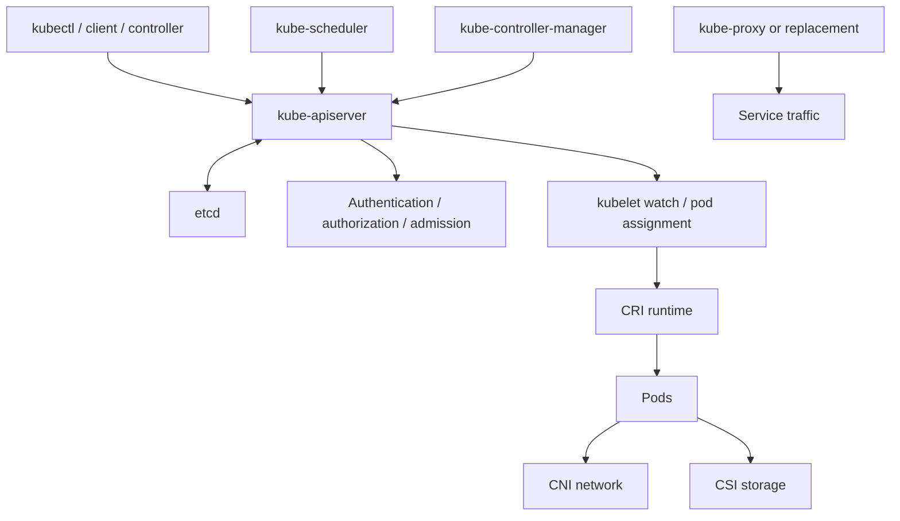

# 00 - Roadmap and Source Backbone

## Why This Chapter Matters

Kubernetes looks like a pile of YAML until you understand its core promise: a distributed system continuously compares desired state with actual state and moves the cluster toward the requested state.

This folder exists to make Kubernetes architecture feel like a system with causes, mechanisms, feedback loops, and failure boundaries.

## The Big Picture

```text
manual container operations -> desired state API -> persistent state in etcd -> controllers and scheduler -> kubelet execution -> service/network/storage abstraction
```

Kubernetes exists because containerized applications across many machines create problems that one-host Docker cannot solve: placement, recovery, rollout, service discovery, configuration, secrets, storage attachment, policy, and multi-team control.

## First-Principles Explanation

Cause: containers made packaging repeatable, but not cluster operation.

Mechanism: Kubernetes accepts declarative desired state through an API server, stores that state in etcd, and uses controllers plus node agents to reconcile actual state.

Immediate result: users describe outcomes instead of manually starting every container.

Long-term impact: platform teams can offer scheduling, self-healing, rollout, networking, security, and storage as a shared control plane.

Next connected topic: API server, etcd, controllers, scheduler, kubelet, CNI, CSI, and admission.

## Core Vocabulary

| Term | Meaning | Why it matters |
| --- | --- | --- |
| Desired state | What the user declares through Kubernetes objects. | Controllers work toward this. |
| Actual state | What is currently running in the cluster. | Drift creates reconciliation work. |
| Reconciliation loop | Repeated compare-and-act control loop. | The heart of Kubernetes behavior. |
| API server | Front door for Kubernetes API. | All state changes flow through it. |
| etcd | Consistent key-value store for cluster data. | Losing etcd means losing cluster state. |
| Controller | Process that watches objects and acts on differences. | Explains Deployments, Nodes, Jobs, endpoints. |
| Scheduler | Assigns unscheduled Pods to Nodes. | Converts Pod requirements into placement. |
| kubelet | Node agent that makes assigned Pods run. | Connects control plane to node runtime. |
| CNI | Container Network Interface. | Implements Pod networking. |
| CSI | Container Storage Interface. | Implements external storage provisioning and attachment. |
| Admission | API request mutation/validation stage. | Policy and defaulting happen here. |

## Architecture Diagram



## Required Chapters

1. Foundations: why Kubernetes exists, desired vs actual state, object model, labels/selectors.
2. API machinery: API server, authentication, authorization, admission, validation, watch.
3. etcd and persistence: consistency, backup, restore, failure impact.
4. Controllers: ReplicaSet, Deployment, Node, Job, endpoints, garbage collection.
5. Scheduler: filtering, scoring, taints/tolerations, affinity, resources.
6. Node architecture: kubelet, CRI, container runtime, probes, Pod status.
7. Networking: CNI, Pod IPs, Services, DNS, kube-proxy, NetworkPolicy.
8. Storage: volumes, PV, PVC, StorageClass, CSI provisioning flow.
9. Security: RBAC, ServiceAccounts, TLS, admission, Pod security.
10. Failure modes: API outage, etcd loss, node NotReady, DNS failure, image pull failure, storage attach failure.

## Small Details That Matter Later

- Kubernetes state changes should go through the API server, not direct etcd edits.
- etcd stores desired and observed cluster state; backing it up is not optional in serious clusters.
- Controllers are level-driven, not one-time scripts. They keep acting until state converges.
- The scheduler chooses a node once for a Pod. kubelet then handles local execution.
- A Pod IP is not a stable service identity; Services provide stable virtual access.
- DNS failure often looks like application failure.
- Admission can reject or mutate objects before they exist.
- Kubernetes does not guarantee startup order as a substitute for readiness design.

## Source Backbone

- Kubernetes Concepts: <https://kubernetes.io/docs/concepts/>
- Kubernetes Cluster Architecture: <https://kubernetes.io/docs/concepts/architecture/>
- Kubernetes Components: <https://kubernetes.io/docs/concepts/overview/components/>
- Node/control-plane communication: <https://kubernetes.io/docs/concepts/architecture/control-plane-node-communication/>
- Kubernetes Nodes: <https://kubernetes.io/docs/concepts/architecture/nodes/>

## Questions to Test Understanding

1. Why is Kubernetes called declarative?
2. Why is etcd more critical than a normal cache?
3. What does a controller actually do?
4. Why does scheduler placement not mean the container is running?
5. Why is a Service needed if Pods already have IPs?

## Answers and Reasoning

1. Users declare desired state; Kubernetes components work to make actual state match it.
2. etcd stores cluster state. If it is lost without backup, the control plane loses authoritative knowledge.
3. A controller watches API objects, compares desired and actual state, and takes corrective action.
4. The scheduler assigns a Node; kubelet and runtime still need to pull images, create containers, mount volumes, and report status.
5. Pod IPs are ephemeral. Services provide stable discovery and load balancing.

