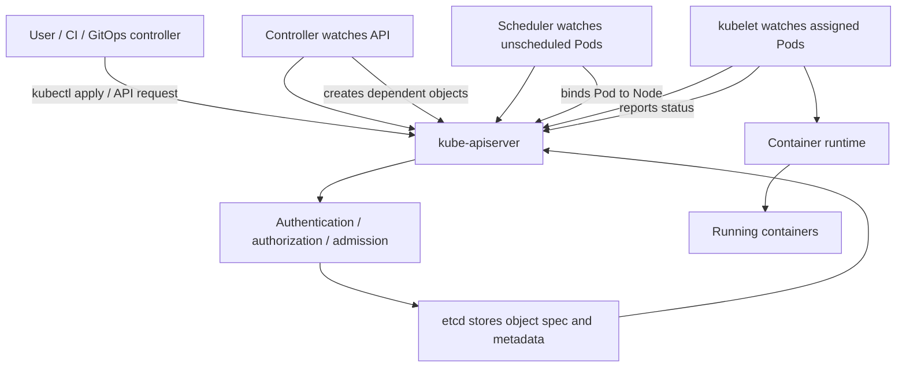

# 01 - Desired State and Reconciliation

## Why This Chapter Matters

If you understand desired state and reconciliation, Kubernetes stops looking like a command runner and starts looking like a distributed operating model.

Most beginners think `kubectl apply` "runs" an application. That is not precise. `kubectl apply` sends a desired object state to the Kubernetes API. After that, controllers, the scheduler, kubelets, and other components keep working to make actual cluster state match the declared state.

This is the reason Kubernetes can recover from failures, roll out changes, replace Pods, and expose services without the operator manually restarting everything.

## The Big Picture

```text
human or CI declares desired state
        -> API server validates and stores object
        -> controllers watch object state
        -> controllers create/update dependent objects
        -> scheduler assigns Pods to Nodes
        -> kubelet makes assigned Pods run
        -> status flows back to API
        -> control loops continue until state converges
```

Kubernetes is not built around one-time commands. It is built around persistent declarations and repeated control loops.

## First-Principles Explanation

Manual operations fail at scale because humans and scripts do not continuously watch every machine, every process, every route, every volume, every certificate, and every rollout state.

Cause: applications across many machines drift from the intended state.

Mechanism: Kubernetes stores desired state in API objects and runs reconciliation loops that compare desired state with actual state.

Immediate result: if a Pod dies, the relevant controller can create a replacement without a human typing `docker run` again.

Long-term impact: operations move from imperative repair to declarative control.

Next connected topic: API server, etcd, controllers, scheduler, kubelet, Service endpoints, and admission control.

## Core Vocabulary

| Term | Meaning | Why it matters |
| --- | --- | --- |
| Desired state | The state declared in Kubernetes objects, such as "3 replicas of this app should exist." | The target Kubernetes works toward. |
| Actual state | What is really happening in the cluster right now. | May differ because of failures, pending scheduling, image pulls, or rollout. |
| Spec | User-declared desired part of an object. | Controllers read it as intent. |
| Status | System-reported observed part of an object. | Operators read it as evidence. |
| Reconciliation | Repeated compare-and-act loop. | Core Kubernetes behavior. |
| Controller | Component that watches objects and reconciles a specific resource type or relationship. | Explains Deployments, ReplicaSets, Jobs, Nodes, endpoints. |
| Watch | API mechanism for receiving object changes. | Lets controllers react without constant blind polling. |
| Idempotency | Repeating an action safely toward the same result. | Reconciliation depends on it. |
| Drift | Difference between desired and actual state. | The condition controllers try to remove. |

## Mental Model

Use a thermostat model, but make it distributed:

```text
desired temperature = spec
current temperature = status/observed state
thermostat control loop = controller
heater/AC action = create/update/delete real resources
```

Kubernetes controllers do not "finish" in the way a shell script finishes. They keep watching and correcting.

Better mental model:

```text
Kubernetes object = intent plus observed status
Controller = loop that tries to reduce the gap
Cluster = many loops coordinating through the API server
```

## Historical / Evolution / Causal Chain

### Before Kubernetes

Teams often deployed by SSH, shell scripts, VM images, or manual release procedures. These approaches worked for smaller systems but became fragile as services multiplied.

Cause: servers were long-lived and manually changed.

Mechanism: scripts installed packages, copied files, restarted processes, and updated load balancers.

Immediate result: deployments depended on command order and human discipline.

Long-term impact: environments drifted and recovery was slow.

Next connected topic: immutable images and container orchestration.

### Containers Helped, But Did Not Finish the Job

Containers packaged applications consistently, but a container image alone does not decide where to run, how many copies should exist, whether the app is healthy, how traffic should reach it, or what happens when a node fails.

Cause: container packaging solved artifact repeatability, not distributed operations.

Mechanism: orchestration platforms introduced schedulers, controllers, service discovery, and health management.

Immediate result: operators could describe workloads rather than manually run containers.

Long-term impact: Kubernetes became a common platform for desired-state application operations.

Next connected topic: Kubernetes API and controllers.

### Kubernetes Made Desired State the Interface

Kubernetes chose API objects as the main interface. Users declare objects such as Pods, Deployments, Services, ConfigMaps, Secrets, Jobs, and PersistentVolumeClaims. Controllers watch those objects and act.

Cause: one-time deployment commands could not keep clusters correct after failures.

Mechanism: persistent API objects plus reconciliation loops.

Immediate result: replacing a failed Pod becomes normal system behavior.

Long-term impact: platform teams can extend Kubernetes by adding new APIs and controllers.

Next connected topic: custom resources and operators.

## Architecture or Conceptual Structure



The API server is the coordination point. Components do not normally coordinate by directly editing each other's memory or databases. They coordinate by reading and writing API objects.

## Step-by-Step Explanation

### Example: Deployment With 3 Replicas

Manifest:

```yaml
apiVersion: apps/v1
kind: Deployment
metadata:
  name: web
spec:
  replicas: 3
  selector:
    matchLabels:
      app: web
  template:
    metadata:
      labels:
        app: web
    spec:
      containers:
        - name: nginx
          image: nginx:1.27
```

What you declare:

```text
I want 3 Pods matching app=web, created from this Pod template.
```

What happens:

1. `kubectl apply` sends the object to the API server.
2. The API server authenticates, authorizes, validates, and admits the request.
3. The Deployment object is stored.
4. The Deployment controller notices the desired Deployment.
5. It creates or updates a ReplicaSet.
6. The ReplicaSet controller ensures the requested number of Pods exists.
7. The scheduler assigns pending Pods to Nodes.
8. Kubelets on those Nodes start containers through the runtime.
9. Kubelets report Pod status.
10. Controllers keep watching. If one Pod dies, the ReplicaSet controller tries to replace it.

The user did not manually start three containers. The user declared a desired state.

### Spec vs Status

Most Kubernetes objects separate intent from observation.

```text
spec   = what should be true
status = what the system has observed
```

Example:

```bash
kubectl get deployment web -o yaml
```

You will see fields like:

```yaml
spec:
  replicas: 3
status:
  availableReplicas: 3
  readyReplicas: 3
```

If `spec.replicas` is `3` but `status.readyReplicas` is `1`, Kubernetes is telling you:

```text
desired state is 3 ready replicas
actual observed readiness is only 1
```

That gap is the starting point for debugging.

## Internal Mechanics

### Controllers Watch, Compare, Act

Controller logic can be simplified as:

```text
watch relevant objects
read desired state
read actual/observed state
if gap exists:
    create/update/delete resources
record status/events
repeat
```

Important: controllers must be idempotent. If a controller crashes and restarts, it should be able to look at current API state and continue.

### Reconciliation Is Level-Based

Kubernetes controllers generally care about the current desired level, not every historical command.

If you change a Deployment from 3 replicas to 5 replicas, the important current fact is:

```text
spec.replicas = 5
```

The controller does not need to remember every previous command if it can compute the difference between desired and actual state now.

This is why Kubernetes is resilient to controller restarts.

### Events Are Clues, Not State

Events help explain recent activity:

```bash
kubectl get events --sort-by=.lastTimestamp
```

But the durable truth is the object spec/status and related objects. Events can expire or be noisy.

### Status Is Not User Intent

Users generally should not edit `status` manually. Status belongs to controllers and system components.

If a Pod is not Ready, do not "fix" it by editing status. Fix the cause: image pull, probe failure, app crash, config, resource pressure, network, or volume.

## Practical Examples

### Inspect Desired and Actual State

```bash
kubectl get deployment web
```

Purpose: show desired, current, and ready replica counts.

Expected output shape:

```text
NAME   READY   UP-TO-DATE   AVAILABLE   AGE
web    3/3     3            3           5m
```

Bad output example:

```text
web    1/3     3            1           5m
```

Interpretation: desired replica count is not met; inspect Pods and events.

### Inspect Controller-Created Objects

```bash
kubectl get rs -l app=web
kubectl get pods -l app=web -o wide
```

Purpose: see ReplicaSets and Pods created because of the Deployment.

Troubleshooting interpretation:

- ReplicaSet exists but Pods pending: scheduling/resource/node problem.
- Pods running but not ready: readiness probe/app problem.
- Pods ImagePullBackOff: image name, tag, registry auth, or network problem.

### Describe the Deployment

```bash
kubectl describe deployment web
```

Purpose: show rollout state, events, selector, Pod template, and replica status.

Bad output clues:

- `ProgressDeadlineExceeded`: rollout did not progress.
- no Pods created: selector/template issue or controller/admission problem.
- unavailable replicas: readiness, scheduling, or runtime problem.

## Small Details That Matter Later

- A Kubernetes object can exist successfully while its workload fails.
- `kubectl apply` success means the API accepted the object, not that the app is healthy.
- `spec` is intent; `status` is evidence.
- Controllers can be temporarily behind. Always check events and related objects.
- Labels and selectors are part of reconciliation. A wrong selector can orphan or mismatch Pods.
- Deleting a Pod managed by a ReplicaSet usually creates a replacement; deleting the controller changes desired state.
- Manual edits to generated child objects can be overwritten by the parent controller.
- Not every Kubernetes resource has the same controller behavior, but the pattern repeats across the system.
- Kubernetes reconciliation is eventual, not instantaneous.
- A GitOps controller such as ArgoCD adds another desired-state loop above Kubernetes.

## Common Misunderstandings

| Misunderstanding | Correction |
| --- | --- |
| `kubectl apply` deploys and guarantees the app is working. | It submits desired state. Controllers and kubelets still need to converge, and the app may fail. |
| A Pod managed by a Deployment should be edited directly. | Edit the Deployment Pod template; otherwise the controller may recreate from the old template. |
| Status can be fixed manually. | Status reports observations; fix the underlying cause. |
| Controllers are scripts that run once. | Controllers are long-running reconciliation loops. |
| Kubernetes immediately becomes consistent. | It is eventually consistent through watches, queues, and retries. |

## Failure Modes / Mistakes / Traps

| Symptom | Likely reconciliation clue |
| --- | --- |
| Deployment exists but no Pods | selector/template/admission/controller issue |
| Pods Pending | scheduler cannot place them or volumes are not ready |
| Pods Running but 0 Ready | readiness probe or app bind/startup issue |
| Pods repeatedly restart | liveness probe, crash, config, resource, dependency issue |
| Manual Pod changes disappear | parent controller recreated from template |
| Service has no endpoints | selector does not match Ready Pods |
| Rollout stuck | new ReplicaSet Pods are not becoming available |

## Debugging / Analysis Method

Use this sequence:

```text
object accepted? -> controller created children? -> children scheduled? -> kubelet started containers? -> app ready? -> service points to ready endpoints?
```

Commands:

```bash
kubectl get deploy,rs,pods
kubectl describe deploy <name>
kubectl describe pod <pod>
kubectl logs <pod>
kubectl get events --sort-by=.lastTimestamp
kubectl get endpoints <service>
kubectl get endpointslice -l kubernetes.io/service-name=<service>
```

Interpretation habit:

- If parent object exists, inspect child objects.
- If child Pods exist but Pending, inspect scheduling and volumes.
- If containers start but app is unavailable, inspect logs and probes.
- If Pods are Ready but Service fails, inspect labels/selectors/endpoints.

## Real-World or Exam Relevance

CKA and CKAD tasks often hide desired-state reasoning:

- scale a Deployment
- fix a broken rollout
- change an image
- repair a Service selector
- debug a Pending Pod
- find why a Job did not complete
- inspect events and status conditions

Interview relevance:

A strong Kubernetes answer says:

```text
I would check the object spec, then status, then child resources, then events/logs, because Kubernetes works by reconciliation between desired and actual state.
```

That answer is stronger than listing random commands.

## Connected Topics

- [Roadmap and Source Backbone](00%20-%20Roadmap%20and%20Source%20Backbone.md)
- [Certified Kubernetes Administrator](../Certified%20Kubernetes%20Administrator/INDEX.md)
- [Certified Kubernetes Application Developer](../Certified%20Kubernetes%20Application%20Developer/INDEX.md)
- [Docker](../Docker/INDEX.md)
- [ArgoCD](../ArgoCD/INDEX.md)

## Chapter Summary

Kubernetes is a desired-state system. The user declares intent in object specs. Controllers watch the API, compare desired and actual state, and act repeatedly. The scheduler assigns Pods. Kubelets run containers and report status. Debugging Kubernetes means finding where the desired-to-actual chain broke.

## Questions to Test Understanding

1. Why is Kubernetes not just a command runner?
2. What is the difference between `spec` and `status`?
3. Why does deleting a Deployment-managed Pod usually create a replacement?
4. Why can `kubectl apply` succeed while the application is broken?
5. Why should you edit a Deployment instead of directly editing one of its Pods?
6. Why are controllers designed to be idempotent?
7. Why can a Service have no endpoints even when Pods exist?
8. Why is reconciliation described as eventual?

## Answers and Reasoning

1. Kubernetes stores desired state and runs controllers that continuously work toward that state.
2. `spec` is user intent; `status` is system observation.
3. The ReplicaSet controller sees fewer actual Pods than desired and creates another.
4. API acceptance only proves the object was valid enough to store; scheduling, image pull, startup, probes, and app behavior can still fail.
5. The Deployment owns the Pod template; direct Pod edits are not durable through replacement.
6. Controllers may restart or see repeated events; they need to safely converge from current state.
7. Service selectors may not match Pod labels, or matching Pods may not be Ready.
8. Components communicate through API state, watches, queues, retries, and node actions; convergence takes time.

## Source Backbone

- Kubernetes Concepts: <https://kubernetes.io/docs/concepts/>
- Kubernetes Cluster Architecture: <https://kubernetes.io/docs/concepts/architecture/>
- Kubernetes Components: <https://kubernetes.io/docs/concepts/overview/components/>
- Kubernetes Nodes: <https://kubernetes.io/docs/concepts/architecture/nodes/>
