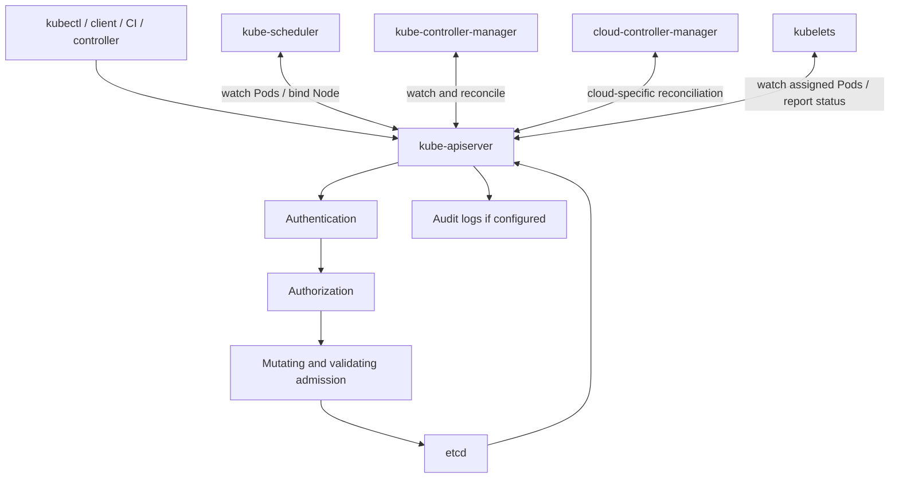

# 02 - Control Plane Internals

## Why This Chapter Matters

The Kubernetes control plane is the decision-making and coordination layer of the cluster. If you understand it, you can explain why `kubectl` sometimes works while workloads fail, why etcd backups matter, why admission policies block objects before they exist, why scheduler problems produce Pending Pods, and why controllers repair drift long after a command has finished.

Kubernetes architecture is not one process doing everything. It is a set of cooperating components that communicate mainly through the API server.

## The Big Picture

```text
client request
  -> kube-apiserver
  -> authentication / authorization / admission
  -> etcd persistence
  -> watch events
  -> scheduler and controllers act
  -> kubelets report status
```

The control plane does not normally log in to nodes and run containers directly. It stores desired state, makes decisions, and relies on node agents to execute assigned work.

## First-Principles Explanation

Distributed systems need a coordination point. If every component wrote directly to every other component, the cluster would become untestable and unsafe.

Cause: many actors need to create, read, update, watch, validate, and react to cluster state.

Mechanism: Kubernetes uses an API-centered architecture. The API server exposes the Kubernetes API, persists state through etcd, and lets controllers and schedulers watch and update objects.

Immediate result: cluster behavior becomes observable through API objects.

Long-term impact: Kubernetes can be extended with new controllers and APIs without every component directly depending on every other component.

Next connected topic: custom resources, operators, admission controllers, and GitOps tools such as ArgoCD.

## Core Vocabulary

| Term | Meaning | Why it matters |
| --- | --- | --- |
| kube-apiserver | Kubernetes API front door. | All normal cluster state changes flow through it. |
| etcd | Consistent key-value store for API data. | Authoritative cluster state. |
| kube-scheduler | Assigns unscheduled Pods to Nodes. | Explains Pending Pods. |
| kube-controller-manager | Runs core controllers. | Explains self-healing and child object creation. |
| cloud-controller-manager | Runs cloud-provider-specific controllers. | Separates cloud integration from core control plane. |
| Admission | Request mutation and validation after authn/authz. | Policy and defaults. |
| Watch | Streaming change notification from the API. | Controller efficiency. |
| Leader election | Coordination so one active controller instance acts. | HA control-plane safety. |
| API Priority and Fairness | Request management for API load. | Scale and overload behavior. |

## Mental Model

Think of the control plane as a courthouse plus dispatch center:

- API server receives and validates requests.
- etcd stores the official records.
- Admission checks policy before records are accepted.
- Controllers watch records and file follow-up actions.
- Scheduler makes placement decisions.
- Kubelets on nodes execute assigned work and report back.

The control plane is not the application runtime. It is the system that decides and records what should happen.

## Historical / Evolution / Causal Chain

### Why Not Let Nodes Decide Everything?

If each node independently decided which workloads to run, the cluster would lack a single source of truth. Two nodes might duplicate work, miss work, or violate placement constraints.

Cause: distributed nodes need coordination.

Mechanism: central API state plus controllers and scheduler.

Immediate result: nodes receive assigned work instead of inventing cluster-wide placement.

Long-term impact: cluster state becomes auditable and policy-enforceable.

Next connected topic: scheduler and kubelet boundary.

### Why Use etcd?

Kubernetes needs a durable, consistent store for API objects. If state disappears or splits across inconsistent stores, controllers cannot safely reconcile.

Cause: desired state must survive component restarts and be consistently observed.

Mechanism: etcd stores API server data.

Immediate result: control-plane components can restart and resume from stored state.

Long-term impact: etcd backup and restore become central to disaster recovery.

Next connected topic: etcd snapshots and high availability.

### Why Use Controllers?

A one-time script cannot keep a cluster correct after failures. Controllers keep watching.

Cause: actual state keeps changing after deployment.

Mechanism: controllers observe objects and repeatedly correct drift.

Immediate result: missing Pods, stale endpoints, unfinished Jobs, and node status changes can be handled automatically.

Long-term impact: Kubernetes becomes a platform for operators and custom controllers.

Next connected topic: operator pattern and custom resources.

## Architecture or Conceptual Structure



## Step-by-Step Explanation

### Request Path

Command:

```bash
kubectl apply -f deployment.yaml
```

Conceptual flow:

1. `kubectl` sends a request to the API server.
2. API server authenticates the caller.
3. Authorization checks whether the caller can perform the action.
4. Admission may mutate or validate the object.
5. The object is persisted through etcd if accepted.
6. Watchers receive object-change notifications.
7. Controllers or scheduler react if the object requires action.

If the request fails at step 2, 3, or 4, the object may never exist.

### Scheduler Path

For a new Pod without `spec.nodeName`:

1. Scheduler watches for unscheduled Pods.
2. It filters Nodes that cannot run the Pod.
3. It scores feasible Nodes.
4. It binds the Pod to a Node through the API.
5. The kubelet on that Node notices the assigned Pod and starts local work.

Important boundary:

```text
scheduler chooses a Node
kubelet starts containers
```

Scheduling success does not mean running success.

### Controller Path

For a Deployment:

1. Deployment controller watches Deployment objects.
2. It creates or updates ReplicaSets.
3. ReplicaSet controller watches ReplicaSets.
4. It creates or deletes Pods to match replica count.
5. Kubelets execute assigned Pods.
6. Status updates flow back.

This layered controller model explains why debugging a Deployment requires checking Deployment, ReplicaSet, Pods, events, and status.

## Internal Mechanics

### API Server

The API server is the front end for Kubernetes control-plane state. It exposes the Kubernetes API over HTTPS and coordinates object CRUD and watches.

Important implications:

- If the API server is unavailable, `kubectl` and controllers cannot normally change cluster state.
- Running workloads may continue for a while, but management and reconciliation are impaired.
- API server load affects the whole cluster.
- Admission webhooks can slow or block object creation.

### etcd

etcd stores Kubernetes API data. It is not a cache you can casually rebuild from running Pods.

Operational implications:

- Back up etcd.
- Protect etcd with TLS and access controls.
- Monitor etcd latency and storage.
- Avoid direct writes unless following precise recovery procedures.

CKA relevance:

```bash
ETCDCTL_API=3 etcdctl snapshot save snapshot.db
ETCDCTL_API=3 etcdctl snapshot restore snapshot.db
```

Exact flags and endpoints depend on cluster installation, certificates, and exam environment. Always inspect the static Pod manifest and official task instructions.

### Scheduler

The scheduler does not start containers. It assigns Pods to Nodes.

Common scheduling blockers:

- insufficient CPU/memory
- node selectors not matching
- taints without tolerations
- affinity/anti-affinity rules
- volume node affinity
- unschedulable/drained nodes
- topology spread constraints

Debug command:

```bash
kubectl describe pod <pod>
```

Expected clue:

```text
Warning  FailedScheduling  ...  0/3 nodes are available ...
```

### Controller Manager

The controller manager runs many controllers. Examples:

- Deployment controller
- ReplicaSet controller
- Job controller
- Node controller
- ServiceAccount controller
- Endpoints/EndpointSlice controllers
- Namespace controller
- Garbage collector

Each controller owns a specific reconciliation responsibility.

### Admission

Admission happens after authentication and authorization but before persistence.

Types:

- mutating admission: changes/defaults the object
- validating admission: accepts or rejects the object

Production examples:

- require labels
- reject privileged Pods
- inject sidecars
- enforce image policies
- validate resource requests

Failure mode:

```text
object never appears because admission rejected it
```

This is different from a Pod that appears and then fails.

## Practical Examples

### Check Control-Plane Components

In kubeadm-style clusters:

```bash
kubectl get pods -n kube-system
kubectl get componentstatuses
```

Purpose: inspect core control-plane and system Pods.

Important note: `componentstatuses` has limitations and may be deprecated/less useful depending on Kubernetes version. Prefer component Pods, logs, metrics, and health endpoints where appropriate.

### Inspect API Resources

```bash
kubectl api-resources
kubectl explain deployment.spec
kubectl explain pod.status
```

Purpose: discover what the API server knows and how fields are structured.

### Debug an Authorization Failure

```bash
kubectl auth can-i create deployments -n app
kubectl auth can-i get secrets -n app
```

Expected output:

```text
yes
no
```

Bad output interpretation:

- `no`: RBAC or identity issue.
- error connecting to server: API/config/network issue.

### Debug Pending Pod

```bash
kubectl get pod <pod> -o wide
kubectl describe pod <pod>
kubectl get nodes
kubectl describe node <node>
```

Look for:

- `FailedScheduling`
- taints
- resource pressure
- unschedulable node
- volume attach constraints

## Small Details That Matter Later

- API acceptance is not workload success.
- Admission rejection means the object may never exist.
- Scheduler success means node assignment, not container start.
- Controllers communicate through API objects, not by directly calling each other in most user-visible flows.
- etcd backup is cluster-state backup, not application-data backup.
- Multiple API servers can run for HA, but etcd consistency still matters.
- Watch-based systems can lag under load; check timestamps and events.
- A broken validating webhook can block object creation across the cluster.
- Cloud controller behavior depends on provider integration.
- Control-plane static Pods in kubeadm clusters are managed by kubelet from manifest files.

## Common Misunderstandings

| Misunderstanding | Correction |
| --- | --- |
| The scheduler runs containers. | Scheduler assigns Pods to Nodes; kubelet starts containers. |
| etcd is just a cache. | etcd is authoritative API state. |
| All failures happen after object creation. | Auth, authorization, and admission can reject before persistence. |
| Controllers are optional extras. | Core Kubernetes behavior depends on controllers. |
| If the API server is down, apps instantly die. | Existing workloads may continue, but management/reconciliation is impaired. |

## Failure Modes / Mistakes / Traps

| Symptom | Likely control-plane area |
| --- | --- |
| `kubectl` cannot connect | kubeconfig, network, API server, certs |
| `Forbidden` | RBAC / authorization |
| object rejected with policy message | admission |
| Pod stuck Pending | scheduler constraints |
| Deployment not creating Pods | controller or selector/template issue |
| Services not updating endpoints | endpoint controller, labels, readiness |
| cluster state lost after failure | etcd backup/restore issue |
| many object creations timing out | API server load or webhook latency |

## Debugging / Analysis Method

Ask where the request failed:

```text
client config -> API reachability -> authentication -> authorization -> admission -> persistence -> controller reaction -> scheduler -> kubelet
```

Commands:

```bash
kubectl cluster-info
kubectl config current-context
kubectl auth can-i <verb> <resource> -n <namespace>
kubectl get events -A --sort-by=.lastTimestamp
kubectl get pods -n kube-system
kubectl logs -n kube-system <control-plane-pod>
kubectl describe pod <pod>
```

For kubeadm control-plane static Pods, also inspect:

```bash
ls /etc/kubernetes/manifests
sudo crictl ps
sudo crictl logs <container-id>
```

Exact commands depend on exam/cluster access and runtime.

## Real-World or Exam Relevance

CKA:

- control-plane static Pods
- etcd backup/restore
- scheduler and node troubleshooting
- kubeadm upgrades
- RBAC and API access

CKAD:

- understanding why objects are rejected
- debugging Pending Pods
- interpreting Deployment/ReplicaSet/Pod status
- using `kubectl explain`

Production:

- admission webhook outages
- API server overload
- etcd latency
- controller lag
- scheduler constraints
- cloud-provider integration failures

## Connected Topics

- [Desired State and Reconciliation](01%20-%20Desired%20State%20and%20Reconciliation.md)
- [Pod Creation Lifecycle](03%20-%20Pod%20Creation%20Lifecycle.md)
- [Certified Kubernetes Administrator](../Certified%20Kubernetes%20Administrator/INDEX.md)
- [Certified Kubernetes Application Developer](../Certified%20Kubernetes%20Application%20Developer/INDEX.md)
- [ArgoCD](../ArgoCD/INDEX.md)

## Chapter Summary

The control plane is the API-centered coordination system of Kubernetes. API server receives requests, etcd stores state, admission enforces policy, scheduler assigns Pods, controllers reconcile objects, and kubelets execute assigned work. Debugging control-plane issues means locating which stage in this chain failed.

## Questions to Test Understanding

1. Why is the API server central to Kubernetes architecture?
2. Why is etcd backup critical?
3. What does the scheduler do and not do?
4. Why can admission webhook failure break deployments?
5. Why is `Forbidden` different from `FailedScheduling`?
6. Why can a Deployment exist without healthy Pods?
7. Why should control-plane components coordinate through the API?
8. Why is direct etcd editing dangerous?

## Answers and Reasoning

1. It is the normal front door for object state, validation, watches, and component coordination.
2. etcd stores authoritative cluster state; without a backup, disaster recovery can lose objects and configuration.
3. It chooses a Node for unscheduled Pods; it does not pull images or start containers.
4. Admission happens before persistence. A failing webhook can reject or time out object creation.
5. `Forbidden` means authorization denied; `FailedScheduling` means the scheduler could not place an accepted Pod.
6. Controllers may have created child objects that fail scheduling, image pull, probes, or runtime startup.
7. API coordination creates an observable, consistent, extensible control model.
8. Direct writes can violate validation, controller assumptions, and consistency; use supported backup/restore procedures.

## Source Backbone

- Kubernetes Cluster Architecture: <https://kubernetes.io/docs/concepts/architecture/>
- Kubernetes Components: <https://kubernetes.io/docs/concepts/overview/components/>
- Node/control-plane communication: <https://kubernetes.io/docs/concepts/architecture/control-plane-node-communication/>
- Kubernetes Nodes: <https://kubernetes.io/docs/concepts/architecture/nodes/>

