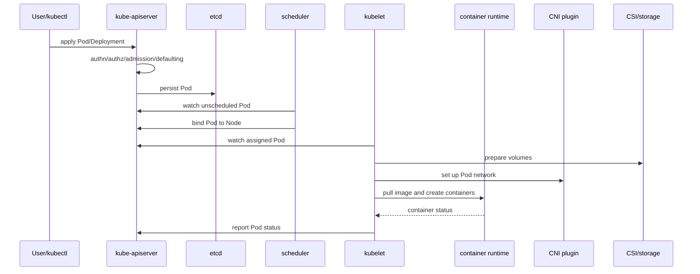

# 03 - Pod Creation Lifecycle

## Why This Chapter Matters

The Pod creation lifecycle is where Kubernetes architecture becomes concrete. When a Pod is stuck in `Pending`, `ContainerCreating`, `ImagePullBackOff`, `CrashLoopBackOff`, or `Running` but not `Ready`, the fix depends on knowing which stage failed.

If you can trace a Pod from YAML to a running container, you can debug most CKA, CKAD, and production workload failures.

## The Big Picture

```text
manifest submitted
  -> API accepted
  -> admission/defaulting
  -> Pod stored
  -> scheduler binds Node
  -> kubelet observes assigned Pod
  -> volumes prepared
  -> images pulled
  -> containers created
  -> probes run
  -> status reported
  -> Service endpoints update if Ready
```

A Pod being created is not one action. It is a chain across control plane, scheduler, node, runtime, network, storage, and application startup.

## First-Principles Explanation

A container image alone does not become a reliable workload. It needs placement, storage, network identity, secrets/config, runtime sandbox, health checks, and status reporting.

Cause: a workload needs both cluster-level decisions and node-level execution.

Mechanism: Kubernetes splits responsibilities: API server stores intent, scheduler chooses Node, kubelet prepares and runs the Pod, runtime starts containers, probes determine health, controllers update dependent objects.

Immediate result: each stage can be observed and debugged.

Long-term impact: Kubernetes can automate scheduling and recovery while exposing enough state for operators.

Next connected topic: scheduling, kubelet, CRI, CNI, CSI, probes, Services, and EndpointSlices.

## Core Vocabulary

| Term | Meaning | Debugging significance |
| --- | --- | --- |
| Pod | Smallest deployable Kubernetes workload unit. | Holds one or more containers. |
| Pending | Pod accepted but not fully running. | Scheduling or setup may be incomplete. |
| Node binding | Assignment of Pod to Node. | Scheduler output. |
| kubelet | Node agent that runs assigned Pods. | Main node-side executor. |
| CRI | Runtime interface for containers. | Path to containerd/CRI-O. |
| CNI | Network plugin interface. | Pod network setup. |
| CSI | Storage plugin interface. | Volume provisioning/attach/mount. |
| Init container | Container that runs before app containers. | Startup sequencing. |
| Probe | Health check: startup, readiness, liveness. | Traffic and restart behavior. |
| Condition | Status field such as Ready, Scheduled. | Observability clue. |

## Mental Model

Think of Pod creation like airport travel:

- API admission: ticket and security check.
- Scheduler: gate assignment.
- kubelet: boarding crew.
- CNI: network route.
- CSI: luggage/storage handling.
- container runtime: aircraft startup.
- probes: safety checks before accepting passengers.
- Service endpoints: public flight board.

If the flight is delayed, the reason matters. A gate issue is not the same as engine failure.

## Historical / Evolution / Causal Chain

### From `docker run` to Pod Lifecycle

With Docker, one host can run:

```bash
docker run nginx
```

In Kubernetes, the same workload must be scheduled, networked, monitored, and reconciled across a cluster.

Cause: multi-node workloads need more than local container start.

Mechanism: Pod lifecycle splits work across API server, scheduler, kubelet, runtime, CNI, CSI, and controllers.

Immediate result: workload state is visible as Pod phase, conditions, events, logs, and child objects.

Long-term impact: operators can debug distributed startup systematically.

Next connected topic: Pod conditions and events.

## Architecture or Conceptual Structure



## Step-by-Step Explanation

### 1. Object Submission

The lifecycle begins when a Pod is created directly or through a controller such as Deployment, Job, StatefulSet, or DaemonSet.

Command:

```bash
kubectl apply -f pod.yaml
```

Success means:

```text
the API accepted the object
```

It does not mean:

```text
the container is running and ready
```

### 2. Admission and Defaulting

Before persistence, Kubernetes may default fields or reject the object.

Examples:

- default `restartPolicy`
- reject forbidden security context
- inject sidecar
- enforce resource requests
- reject image registry

Debug clue:

```text
Error from server: admission webhook ... denied the request
```

If admission rejects, the Pod may never be created.

### 3. Scheduling

If the Pod has no assigned Node, the scheduler picks one.

It considers:

- resource requests
- node selectors
- affinity/anti-affinity
- taints/tolerations
- topology spread
- volume constraints
- node readiness/unschedulable state

Debug:

```bash
kubectl describe pod <pod>
```

Look for:

```text
Warning  FailedScheduling
```

### 4. Kubelet Observes Assigned Pod

The kubelet on the selected Node watches the API for Pods assigned to that Node.

It then works locally:

- prepare sandbox
- mount volumes
- fetch secrets/config
- set up network
- pull images
- create containers
- run probes
- report status

### 5. Volume Setup

If the Pod uses volumes, setup can involve:

- projected ConfigMap/Secret volumes
- emptyDir
- hostPath
- PVC/PV binding
- CSI attach/mount

Failure clues:

- `ContainerCreating` for a long time
- mount errors in events
- PVC Pending
- attach timeout

### 6. Network Setup

CNI provides Pod networking. If CNI fails, Pods may remain in setup states.

Failure clues:

- sandbox creation errors
- CNI plugin not initialized
- Pod has no IP
- node network unavailable

### 7. Image Pull

The runtime pulls images if needed.

Failure states:

- `ErrImagePull`
- `ImagePullBackOff`

Common causes:

- wrong image name/tag
- private registry auth missing
- network/DNS issue
- unsupported platform architecture
- registry rate limit

### 8. Container Start

The runtime starts containers with command, args, env, mounts, security context, and resource constraints.

Failure states:

- `CreateContainerConfigError`
- `CreateContainerError`
- `CrashLoopBackOff`

### 9. Probes and Readiness

Probe types:

- startupProbe: gives slow apps time to start
- readinessProbe: decides whether Pod receives traffic
- livenessProbe: decides whether container should restart

A container can be `Running` but not `Ready`.

### 10. Status and Endpoints

Kubelet reports status to the API server. Services select Ready Pods through EndpointSlices/endpoints behavior.

If a Pod is not Ready, it usually should not receive normal Service traffic.

## Internal Mechanics

### Pod Phase Is Coarse

Pod phase values such as `Pending`, `Running`, `Succeeded`, `Failed`, and `Unknown` are broad. Conditions and container statuses are more diagnostic.

Use:

```bash
kubectl get pod <pod> -o yaml
```

Inspect:

- `status.phase`
- `status.conditions`
- `status.containerStatuses`
- `status.initContainerStatuses`
- events from `kubectl describe`

### Events Explain Transitions

Events are the story of recent attempts:

```bash
kubectl describe pod <pod>
```

Look at bottom:

```text
Events:
  Type     Reason             Message
  Warning  FailedScheduling   ...
  Warning  FailedMount        ...
  Warning  Failed             Error: ImagePullBackOff
```

### Init Containers Gate App Containers

Init containers run to completion before app containers start.

Use cases:

- wait for schema migration
- prepare config
- check dependency
- fetch bootstrap data

Trap: a failing init container means the main app container may never start.

### Restart Policy and Controllers Interact

Pod restart policy controls container restart behavior inside a Pod. Higher-level controllers create replacement Pods when needed.

Examples:

- Deployment Pods normally use `Always`.
- Job Pods often use `OnFailure` or `Never`.

## Practical Examples

### Create a Pod Quickly

```bash
kubectl run nginx --image=nginx:1.27 --restart=Never
```

Purpose: create a simple Pod.

Verify:

```bash
kubectl get pod nginx -o wide
kubectl describe pod nginx
```

### Debug Image Pull

```bash
kubectl get pod <pod>
kubectl describe pod <pod>
kubectl get secret
```

Bad output:

```text
ImagePullBackOff
```

Interpretation:

- check image name/tag
- check registry credentials
- check node network/DNS
- check architecture

### Debug Readiness

```bash
kubectl get pod <pod>
kubectl describe pod <pod>
kubectl logs <pod>
kubectl get endpoints <service>
```

Bad output:

```text
READY 0/1
```

Interpretation:

- app process may be running but readiness probe fails
- Service may not route traffic

### Debug Scheduling

```bash
kubectl describe pod <pod>
kubectl get nodes
kubectl describe node <node>
```

Look for:

- insufficient CPU/memory
- taints
- unschedulable nodes
- node affinity mismatch
- PVC binding issue

## Small Details That Matter Later

- `Running` does not mean `Ready`.
- `Pending` can mean unscheduled or scheduled but still setting up.
- `ContainerCreating` often points to volume, network, or runtime setup, not application code.
- `CrashLoopBackOff` means the container started and then exited repeatedly.
- A failing init container blocks app containers.
- Readiness controls traffic; liveness controls restart.
- Liveness probes can make a bad situation worse if they restart slow-but-recovering apps.
- A Service with no endpoints is often a label/readiness problem.
- Events can expire; capture evidence when debugging incidents.
- Pod replacement creates a new name unless controlled by StatefulSet identity.

## Common Misunderstandings

| Misunderstanding | Correction |
| --- | --- |
| Pod created means app deployed. | Pod may still be unscheduled, pulling image, mounting volume, or failing probes. |
| Running means healthy. | Running only means containers are running; readiness may fail. |
| ImagePullBackOff is a Kubernetes scheduler bug. | It usually happens after scheduling, during node runtime image pull. |
| Liveness and readiness are interchangeable. | Liveness restarts; readiness controls traffic. |
| Deleting a failing Pod fixes the root cause. | Controllers recreate it; fix image/config/probe/resource cause. |

## Failure Modes / Mistakes / Traps

| State / symptom | Likely layer |
| --- | --- |
| Admission denied | policy/webhook/security validation |
| Pending with FailedScheduling | scheduler constraints |
| Pending with PVC issue | storage binding/provisioning |
| ContainerCreating stuck | volume, CNI, runtime setup |
| ImagePullBackOff | registry/image/auth/network/platform |
| CreateContainerConfigError | config reference, secret/configmap, command/env |
| CrashLoopBackOff | app exits, command wrong, dependency missing, probe too aggressive |
| Running 0/1 Ready | readiness probe/app bind/dependency issue |
| Service unreachable | selector, endpoint, DNS, network policy, app port |

## Debugging / Analysis Method

Use this chain:

```text
accepted? -> scheduled? -> volumes mounted? -> network ready? -> image pulled? -> container started? -> probes passing? -> endpoint updated?
```

Commands:

```bash
kubectl get pod <pod> -o wide
kubectl describe pod <pod>
kubectl logs <pod>
kubectl logs <pod> --previous
kubectl get events --sort-by=.lastTimestamp
kubectl get pvc
kubectl get endpoints <service>
kubectl get endpointslice -l kubernetes.io/service-name=<service>
```

Exam shortcut:

```bash
kubectl describe pod <pod>
```

This is often the fastest first command because it combines scheduling, image, mount, probe, and event clues.

## Real-World or Exam Relevance

CKAD:

- fix broken Pod manifests
- debug env/config/secret references
- repair probes
- expose Pods through Services
- inspect logs and previous logs

CKA:

- debug node/runtime/CNI/storage failures
- inspect kubelet and runtime state
- understand scheduling failures
- connect Pod state to node health

Production:

- readiness gate prevents traffic to broken apps
- liveness can create restart storms
- storage and CNI issues can look like app rollout failures
- image registry incidents block deployments

## Connected Topics

- [Desired State and Reconciliation](01%20-%20Desired%20State%20and%20Reconciliation.md)
- [Control Plane Internals](02%20-%20Control%20Plane%20Internals.md)
- [Docker](../Docker/INDEX.md)
- [Certified Kubernetes Administrator](../Certified%20Kubernetes%20Administrator/INDEX.md)
- [Certified Kubernetes Application Developer](../Certified%20Kubernetes%20Application%20Developer/INDEX.md)

## Chapter Summary

Pod creation is a chain, not a moment. The API accepts intent, scheduler assigns a Node, kubelet prepares runtime requirements, plugins provide network/storage, images are pulled, containers start, probes determine health, and status flows back to the API. Debugging means finding the broken link.

## Questions to Test Understanding

1. Why can a Pod be `Pending` for multiple different reasons?
2. Why does scheduling success not guarantee container startup?
3. Why can `Running` still mean the app is unavailable?
4. What is the difference between readiness and liveness?
5. Why might a Service have no endpoints?
6. Why does `ImagePullBackOff` usually point to node/runtime stage?
7. Why do init containers matter for startup debugging?
8. Why should you inspect events quickly during incidents?

## Answers and Reasoning

1. It may be unscheduled, waiting for volumes, or still in setup.
2. Kubelet must still mount volumes, set up network, pull images, and create containers.
3. Readiness may fail, app may listen on the wrong port, or dependencies may be unavailable.
4. Readiness controls traffic; liveness restarts containers.
5. Selectors may not match Pods, or matching Pods may not be Ready.
6. The Pod has usually been accepted and assigned; the node runtime cannot fetch the image.
7. They must complete before app containers start; failure blocks the main app.
8. Events can expire and contain the clearest recent reason for scheduling, mount, pull, and probe failures.

## Source Backbone

- Kubernetes Cluster Architecture: <https://kubernetes.io/docs/concepts/architecture/>
- Kubernetes Components: <https://kubernetes.io/docs/concepts/overview/components/>
- Kubernetes Nodes: <https://kubernetes.io/docs/concepts/architecture/nodes/>
- Kubernetes Pods: <https://kubernetes.io/docs/concepts/workloads/pods/>
- Kubernetes Pod lifecycle: <https://kubernetes.io/docs/concepts/workloads/pods/pod-lifecycle/>

