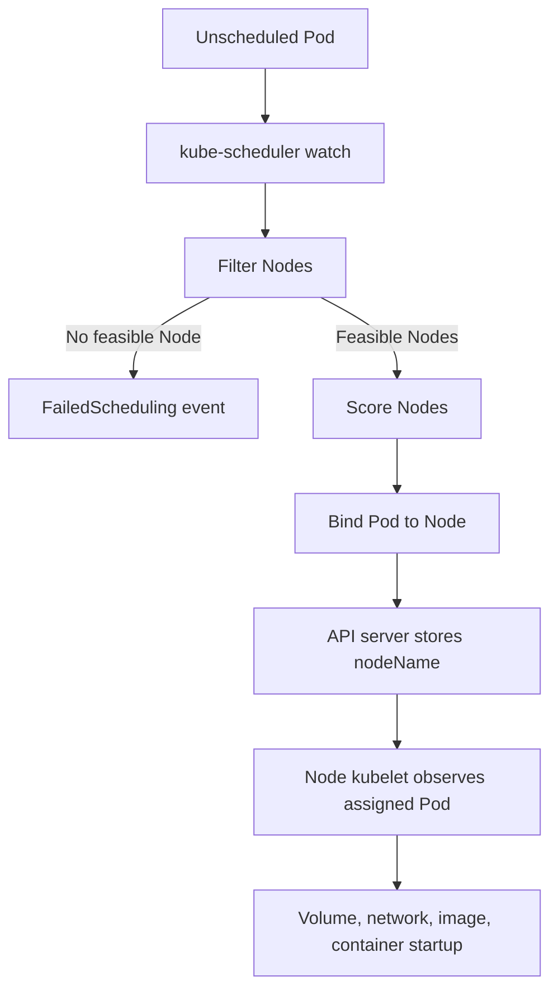

# 04 - Scheduling, Placement, and Node Pressure

## Why This Chapter Matters

The scheduler is where Kubernetes turns "I need a Pod" into "this Pod should run on that Node." Without understanding scheduling, many cluster problems look mysterious: Pods stay Pending, workloads pile onto the wrong nodes, GPU jobs do not start, evictions happen under pressure, and production incidents begin with one small `requests` field that nobody filled in.

Source snapshot: 2026-05-27. Kubernetes scheduling behavior is version-sensitive and can be extended by scheduler profiles, plugins, custom schedulers, and cloud/distribution defaults. Verify against current Kubernetes documentation for production decisions.

## The Big Picture

```text
Pod accepted by API
  -> scheduler watches unscheduled Pods
  -> filters impossible Nodes
  -> scores remaining Nodes
  -> binds Pod to one Node
  -> kubelet on that Node starts local setup
```

Scheduling success is not running success. The scheduler assigns a Node. Kubelet, CRI, CNI, CSI, image pulls, probes, and application startup still have work to do.

## First-Principles Explanation

Cause: In a cluster, many machines have different CPU, memory, labels, zones, taints, GPUs, storage access, network conditions, and workloads.

Mechanism: Kubernetes uses a scheduler that reads Pod requirements and Node state, filters out Nodes that cannot run the Pod, scores feasible Nodes, and writes the binding decision through the API.

Immediate result: The Pod gets `.spec.nodeName`.

Long-term impact: Placement becomes a declarative policy problem instead of a human SSH decision.

Next connected topic: kubelet execution, node pressure, eviction, autoscaling, topology spread, affinity, taints, and resource requests.

## Core Vocabulary

| Term | Meaning | Why it matters |
| --- | --- | --- |
| kube-scheduler | Control-plane component that assigns Pods to Nodes. | Explains Pending Pods with `FailedScheduling`. |
| Node selector | Simple label-based Node requirement. | Useful for coarse placement such as `disk=ssd`. |
| Node affinity | More expressive Node label rules. | Supports required and preferred placement logic. |
| Pod affinity | Place Pods near other Pods. | Useful for locality but can create tight constraints. |
| Pod anti-affinity | Keep Pods away from other Pods. | Useful for spreading replicas across failure domains. |
| Taint | Node-side repulsion rule. | Prevents Pods from landing unless they tolerate the taint. |
| Toleration | Pod-side permission to schedule onto tainted Nodes. | Does not force placement; only permits it. |
| Resource request | Amount of CPU/memory a Pod asks scheduler to reserve. | Main input for capacity scheduling. |
| Resource limit | Maximum resource usage enforced by kubelet/runtime. | Can cause throttling or OOM kills. |
| QoS class | Pod quality-of-service category based on requests/limits. | Influences eviction order under pressure. |
| Eviction | Kubelet termination of Pods under resource pressure. | Explains Pods killed even when app code did not crash. |

## Mental Model

Think of the scheduler as assigning seats on a train:

- Requests are seat size.
- Node labels are coach features.
- Taints are reserved coach restrictions.
- Affinity is "sit near" or "avoid sitting near."
- Topology spread is "do not put everyone in the same coach."
- Kubelet is the staff that actually helps the passenger sit down.

The scheduler does not carry luggage, start the engine, or serve food. It chooses the seat.

## Historical / Evolution / Causal Chain

Manual placement worked when applications were few:

Human chooses host -> SSH deploy -> hidden placement knowledge -> uneven load -> difficult failover.

Containers made packaging easier but not placement:

Many containers -> many hosts -> changing capacity -> manual placement breaks.

Kubernetes introduced scheduling:

Pod declares requirements -> scheduler evaluates Nodes -> binding is stored in API -> kubelet executes locally.

Then real clusters needed more control:

Heterogeneous nodes -> labels, selectors, affinity, taints -> policy-based placement.

Then reliability needed spread:

Replica concentration risk -> anti-affinity and topology spread -> safer failure-domain distribution.

Then resource contention became visible:

No resource requests -> scheduler overpacks Nodes -> node pressure and evictions -> requests, limits, QoS, monitoring.

## Architecture or Conceptual Structure



Filter examples:

- enough CPU/memory by requests
- Node selector/affinity match
- taints tolerated
- volume zone access possible
- required ports available
- Node is schedulable

Score examples:

- better resource fit
- preferred affinity
- spread policies
- plugin-specific priorities

## Step-by-Step Explanation

### 1. Pod Is Accepted Without a Node

The API server can accept a Pod that has no assigned Node.

```bash
kubectl get pod mypod -o wide
```

Expected early state:

```text
NAME    READY   STATUS    NODE
mypod   0/1     Pending   <none>
```

Interpretation:

- `NODE` is empty before binding.
- `Pending` does not always mean image pull. It may mean no scheduling decision yet.

### 2. Scheduler Watches for Unscheduled Pods

The scheduler watches the API for Pods without `.spec.nodeName`. It evaluates them against Nodes.

### 3. Filter Phase

Filter removes impossible Nodes.

Example failure:

```text
Warning  FailedScheduling  0/3 nodes are available: 3 Insufficient memory.
```

Interpretation:

- The scheduler could not find capacity based on resource requests.
- Adding memory limit alone does not help scheduling; requests are the scheduling input.

### 4. Score Phase

If multiple Nodes can run the Pod, the scheduler scores them. The highest scoring Node wins.

Small detail:

Preferred affinity influences scoring. Required affinity influences feasibility.

### 5. Binding

The scheduler writes the binding decision through the API. The Pod gets `.spec.nodeName`.

After binding:

```bash
kubectl get pod mypod -o wide
```

Possible output:

```text
NAME    READY   STATUS              NODE
mypod   0/1     ContainerCreating   worker-2
```

Interpretation:

- Scheduling succeeded.
- Kubelet is now doing local work.

## Internal Mechanics

### Requests vs Limits

Resource requests are for scheduling. Limits are for enforcement.

```yaml
resources:
  requests:
    cpu: "500m"
    memory: "512Mi"
  limits:
    cpu: "1"
    memory: "1Gi"
```

What this means:

- The scheduler reserves 500 millicores and 512 MiB for placement.
- Runtime enforcement allows up to 1 CPU and 1 GiB.
- CPU over limit can throttle.
- Memory over limit can cause OOM kill.

### QoS Classes

| QoS class | Condition | Eviction implication |
| --- | --- | --- |
| Guaranteed | Every container has equal CPU and memory request/limit. | Strongest protection under pressure. |
| Burstable | Some requests/limits set, but not Guaranteed. | Middle. |
| BestEffort | No CPU/memory requests or limits. | First target during pressure. |

The exact eviction decision also considers actual usage, priority, and pressure signals, but QoS is a major concept.

### Taints and Tolerations

Node taint:

```bash
kubectl taint nodes node1 dedicated=infra:NoSchedule
```

Pod toleration:

```yaml
tolerations:
- key: "dedicated"
  operator: "Equal"
  value: "infra"
  effect: "NoSchedule"
```

Meaning:

- The taint repels ordinary Pods.
- The toleration permits this Pod to schedule there.
- The toleration does not force the Pod to use that Node.

### Node Affinity

Required node affinity:

```yaml
affinity:
  nodeAffinity:
    requiredDuringSchedulingIgnoredDuringExecution:
      nodeSelectorTerms:
      - matchExpressions:
        - key: disk
          operator: In
          values:
          - ssd
```

Meaning:

- The Pod can only schedule onto Nodes labeled `disk=ssd`.
- `IgnoredDuringExecution` means a later label change does not automatically evict the already running Pod.

### Topology Spread

Topology spread constraints reduce concentration across zones, nodes, or custom topology keys.

Cause chain:

Replica concentration -> one node/zone failure kills many replicas -> topology spread -> better fault-domain distribution.

## Practical Examples

### Debug FailedScheduling

Commands:

```bash
kubectl describe pod mypod
kubectl get events --sort-by=.lastTimestamp
kubectl get nodes --show-labels
kubectl describe node worker-1
```

Interpretation:

- `describe pod` shows scheduling events.
- `get nodes --show-labels` shows placement labels.
- `describe node` shows allocatable resources, taints, and pressure.

Bad signs:

- `Insufficient cpu`
- `Insufficient memory`
- `node(s) had untolerated taint`
- `node(s) didn't match Pod's node affinity/selector`
- volume zone conflicts

### Debug Evictions

Commands:

```bash
kubectl get pod -A | grep Evicted
kubectl describe node worker-1
kubectl describe pod evicted-pod
```

What to inspect:

- node `MemoryPressure`, `DiskPressure`, or `PIDPressure`
- Pod QoS class
- requests/limits
- logs before eviction if available
- node filesystem usage

## Small Details That Matter Later

- Scheduler uses requests, not actual runtime usage, for basic capacity placement.
- A Pod with no requests can be scheduled too optimistically.
- `NoSchedule` blocks new placement; it does not evict already running Pods.
- `NoExecute` can evict Pods that do not tolerate it.
- Toleration permits scheduling; it does not select a node.
- Required affinity is a hard rule. Preferred affinity is a scoring preference.
- `IgnoredDuringExecution` means label changes after scheduling do not automatically move the Pod.
- The scheduler binds once. It does not constantly rebalance already running Pods by default.
- A Pod can be scheduled and still fail during image pull, network setup, volume mount, or probes.
- Node cordon makes a node unschedulable for new Pods, but does not drain existing Pods.
- Draining respects disruption rules and controller behavior.
- Local storage and zone-bound volumes can constrain scheduling.

## Common Misunderstandings

| Misunderstanding | Correction |
| --- | --- |
| The scheduler starts containers. | Scheduler only assigns a Node. Kubelet starts containers. |
| Limits reserve capacity. | Requests drive scheduling reservations. Limits enforce maximum usage. |
| Toleration means the Pod must run on the tainted node. | Toleration only allows it. Use affinity/selector to prefer or require. |
| Pending always means image pull. | Pending can mean no scheduling decision, volume binding delay, or other setup. |
| Kubernetes automatically rebalances Pods. | Kubernetes generally does not move healthy Pods just to rebalance. |

## Failure Modes / Mistakes / Traps

| Symptom | Likely cause | First check |
| --- | --- | --- |
| `FailedScheduling` with insufficient CPU | Requests exceed available allocatable CPU | `kubectl describe pod`, `kubectl describe node` |
| `FailedScheduling` with untolerated taint | Pod lacks toleration | node taints and Pod tolerations |
| Pod scheduled but `ContainerCreating` hangs | CNI, CSI, image, or kubelet problem | Pod events and kubelet/node state |
| Pods evicted | Node pressure | `kubectl describe node` pressure conditions |
| All replicas on one node | No spread/anti-affinity | Pod placement and topology constraints |
| GPU Pod pending | Missing device plugin, labels, or resource request | extended resources and node labels |

## Debugging / Analysis Method

Use this scheduling ladder:

```text
Pod accepted?
  -> has nodeName?
  -> FailedScheduling event?
  -> resource requests fit?
  -> nodeSelector/affinity match?
  -> taints tolerated?
  -> volume topology possible?
  -> node schedulable and Ready?
  -> after binding, kubelet/runtime path
```

## Real-World or Exam Relevance

CKA/CKAD and interviews often ask you to:

- place Pods on specific nodes
- tolerate taints
- cordon and drain nodes
- debug Pending Pods
- explain requests vs limits
- explain why a Pod was evicted
- use labels and selectors correctly
- spread replicas across nodes or zones

## Connected Topics

- [02 - Control Plane Internals](02%20-%20Control%20Plane%20Internals.md)
- [03 - Pod Creation Lifecycle](03%20-%20Pod%20Creation%20Lifecycle.md)
- [08 - Failure Modes and Troubleshooting Flowcharts](08%20-%20Failure%20Modes%20and%20Troubleshooting%20Flowcharts.md)

## Chapter Summary

Scheduling is the placement decision in Kubernetes. The scheduler filters and scores Nodes, binds the Pod, and then kubelet takes over. Most scheduling failures are visible in Pod events. The most important levers are requests, labels, selectors, affinity, taints, tolerations, topology, and node pressure.

## Questions to Test Understanding

1. Why does a scheduled Pod not necessarily mean a running container?
2. What is the difference between a request and a limit?
3. Why does a toleration not guarantee placement on a tainted node?
4. What does `IgnoredDuringExecution` mean?
5. Why are BestEffort Pods commonly evicted first under pressure?

## Answers and Reasoning

1. Scheduling only assigns a Node. Kubelet still needs to mount volumes, set up networking, pull images, start containers, and pass probes.
2. Requests are used for scheduling reservation. Limits are runtime enforcement caps.
3. A toleration only permits scheduling onto a tainted node. It does not express preference or requirement.
4. The rule is checked during scheduling, but later label changes do not automatically evict the Pod.
5. BestEffort Pods have no declared resource reservation, so they receive the least protection during node pressure.

## Source Backbone

- Kubernetes scheduler docs: <https://kubernetes.io/docs/concepts/scheduling-eviction/kube-scheduler/>
- Assign Pods to Nodes: <https://kubernetes.io/docs/concepts/scheduling-eviction/assign-pod-node/>
- Taints and tolerations: <https://kubernetes.io/docs/concepts/scheduling-eviction/taint-and-toleration/>
- Resource management: <https://kubernetes.io/docs/concepts/configuration/manage-resources-containers/>
- Pod QoS classes: <https://kubernetes.io/docs/concepts/workloads/pods/pod-qos/>
- Node-pressure eviction: <https://kubernetes.io/docs/concepts/scheduling-eviction/node-pressure-eviction/>
