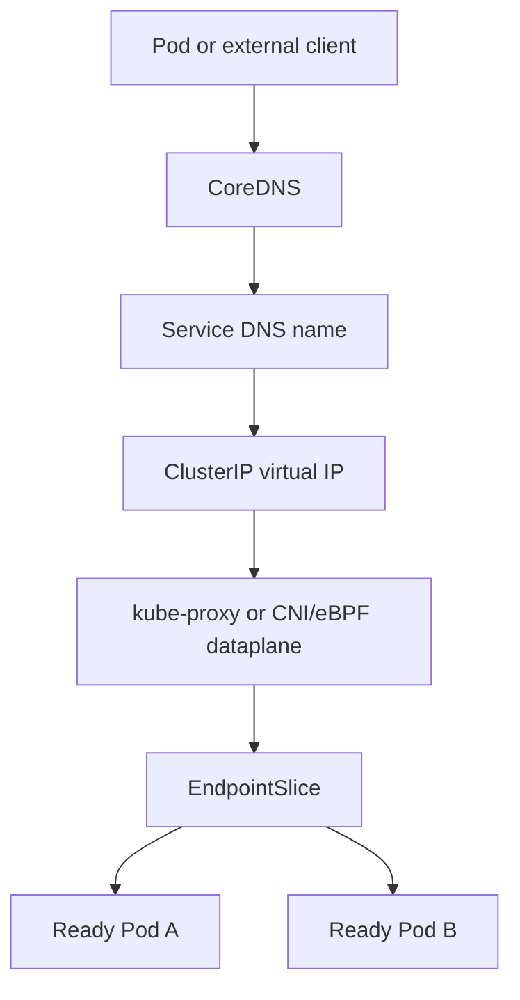
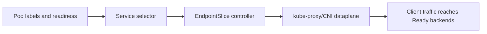

# 05 - Service Networking, DNS, and Traffic Flow

## Why This Chapter Matters

Kubernetes networking is where many students stop understanding and start memorizing commands. Pods have IPs. Services have virtual IPs. DNS names appear. kube-proxy or an eBPF replacement programs traffic rules. NetworkPolicies may block traffic. Ingress and Gateway API route external HTTP traffic. When something fails, it often looks like "the app is down," even though the real failure is selector, endpoint, DNS, policy, proxy, or port mismatch.

Source snapshot: 2026-05-27. Networking behavior depends on Kubernetes version, CNI plugin, kube-proxy mode or replacement, cloud provider, Ingress/Gateway controller, and cluster DNS implementation.

## The Big Picture

```text
Client
  -> DNS name
  -> Service virtual IP or external load balancer
  -> EndpointSlice
  -> selected Ready Pod IP
  -> application container port
```

Pod IPs are real but unstable. Services provide a stable abstraction over changing Pods.

## First-Principles Explanation

Cause: Pods are created and destroyed frequently. Their IPs change. Replicas scale up and down. Nodes fail. Clients need a stable target.

Mechanism: Kubernetes uses Services to create stable virtual identities and EndpointSlices to track the actual Pod backends. DNS maps service names to service addresses. kube-proxy or a replacement programs dataplane rules to send traffic to backends.

Immediate result: Clients can use stable names such as `api.default.svc.cluster.local` instead of chasing Pod IPs.

Long-term impact: Applications can scale, roll, and recover while clients keep using the same service identity.

Next connected topic: CNI, Service types, CoreDNS, EndpointSlices, NetworkPolicy, Ingress, Gateway API, and cloud load balancers.

## Core Vocabulary

| Term | Meaning | Why it matters |
| --- | --- | --- |
| Pod IP | IP assigned to a Pod by cluster networking. | Direct Pod IPs are ephemeral. |
| CNI | Plugin interface for container networking. | Provides Pod network setup and policy behavior depending on plugin. |
| Service | Stable network abstraction over Pods or endpoints. | Decouples clients from Pod churn. |
| ClusterIP | Internal virtual IP for a Service. | Default Service type. |
| NodePort | Opens a port on each node that forwards to the Service. | Useful for simple external exposure but not usually ideal alone. |
| LoadBalancer | Requests an external load balancer from infrastructure provider. | Common managed-cloud exposure pattern. |
| ExternalName | DNS CNAME-style mapping to an external name. | Does not create a normal proxying Service. |
| EndpointSlice | Scalable object listing backend endpoints for a Service. | Tells proxies/controllers where traffic can go. |
| CoreDNS | Common cluster DNS implementation. | Resolves service and Pod names. |
| kube-proxy | Component that implements Service forwarding in many clusters. | Programs iptables/IPVS rules or equivalent. |
| NetworkPolicy | Kubernetes object that controls allowed Pod traffic when supported by CNI. | Default behavior is allow unless policies select Pods. |
| Ingress | HTTP routing API implemented by an Ingress controller. | Requires a controller; object alone is not enough. |
| Gateway API | Newer, more expressive routing API family. | Often preferred for richer traffic management. |

## Mental Model

Kubernetes networking has two names for two jobs:

- Pod network: lets Pods talk to each other by IP across Nodes.
- Service network: gives stable identities and load balancing over changing Pods.

DNS is the phone book. EndpointSlices are the current list of actual backends. kube-proxy or its replacement is the traffic director.

## Historical / Evolution / Causal Chain

Single host containers:

Container port -> host port -> manual routing.

Clustered containers:

Pods move across nodes -> IPs change -> host-port mapping breaks.

Kubernetes Service model:

Service selector -> dynamic endpoints -> stable virtual IP/name -> clients ignore Pod churn.

Scale improvement:

Endpoints object grew too large -> EndpointSlices split backend lists -> better scaling and controller behavior.

Network security:

Flat Pod network -> too much lateral movement -> NetworkPolicy -> selected Pods get explicit ingress/egress rules.

External traffic:

NodePort and cloud LBs -> HTTP routing needs -> Ingress -> richer multi-team routing -> Gateway API.

## Architecture or Conceptual Structure



Service endpoint lifecycle:



## Step-by-Step Explanation

### 1. Pod Gets a Network Identity

When kubelet creates a Pod sandbox, the CNI plugin sets up networking and assigns a Pod IP.

Check:

```bash
kubectl get pod -o wide
```

Interpretation:

- `IP` is the Pod IP.
- `NODE` tells where the Pod runs.

### 2. Service Selects Pods

Example:

```yaml
apiVersion: v1
kind: Service
metadata:
  name: api
spec:
  selector:
    app: api
  ports:
  - port: 80
    targetPort: 8080
```

Meaning:

- clients connect to Service port 80
- traffic goes to selected Pods on target port 8080
- selection uses Pod labels

### 3. EndpointSlices Track Backends

Check:

```bash
kubectl get endpointslice -l kubernetes.io/service-name=api
kubectl describe service api
```

If no endpoints exist:

- Pod labels may not match Service selector
- Pods may not be Ready
- target namespace may be wrong
- manually managed endpoints may be absent

### 4. DNS Resolves the Service

Inside the cluster:

```bash
kubectl run dns-test --image=busybox:1.36 --restart=Never -- sleep 3600
kubectl exec dns-test -- nslookup api.default.svc.cluster.local
```

Expected:

```text
Name:   api.default.svc.cluster.local
Address: 10.x.y.z
```

Bad output:

- DNS server unreachable
- NXDOMAIN for existing Service
- wrong namespace in name

### 5. Dataplane Forwards Traffic

Traffic to ClusterIP is forwarded to one selected endpoint by kube-proxy rules or another dataplane implementation.

Important detail:

`kubectl get service` shows intent. It does not prove dataplane rules are programmed correctly on every node.

## Internal Mechanics

### Service Types

| Type | Use | Trap |
| --- | --- | --- |
| ClusterIP | Internal cluster service identity. | Not reachable directly from outside cluster. |
| NodePort | Exposes on node IP and port. | Opens every node; port range and firewall matter. |
| LoadBalancer | Requests external load balancer. | Depends on cloud/infrastructure integration. |
| ExternalName | Maps Service DNS to external DNS name. | No selector, no proxying ClusterIP behavior. |

### `port` vs `targetPort`

```yaml
ports:
- port: 80
  targetPort: 8080
```

Meaning:

- Service exposes port 80.
- Pod container listens on 8080.

Trap:

If the application actually listens on 8081, the Service can exist and DNS can resolve, but traffic fails.

### Readiness and Endpoints

Pods that are not Ready should usually not receive normal Service traffic.

Cause chain:

readiness probe fails -> Pod Ready condition false -> EndpointSlice marks/removes serving endpoint -> Service has fewer/no backends -> traffic avoids unhealthy Pod.

### NetworkPolicy Default Behavior

NetworkPolicy is enforced only if the CNI plugin supports it.

Important model:

- Without policies selecting a Pod, traffic is usually allowed.
- Once a policy selects a Pod for ingress or egress, allowed traffic becomes explicit for that direction.

### Ingress vs Gateway API

Ingress:

- HTTP/S routing API
- needs an Ingress controller
- widely used

Gateway API:

- newer API family with GatewayClass, Gateway, and route objects
- designed for richer and clearer traffic ownership
- support depends on controller/distribution

## Practical Examples

### Debug a Service With No Endpoints

Commands:

```bash
kubectl get service api -o yaml
kubectl get pods --show-labels
kubectl get endpointslice -l kubernetes.io/service-name=api
kubectl describe pod -l app=api
```

Analysis:

- Compare Service selector with Pod labels.
- Check readiness.
- Check namespace.
- Check target port.

### Debug DNS

Commands:

```bash
kubectl get pods -n kube-system -l k8s-app=kube-dns
kubectl get service -n kube-system kube-dns
kubectl exec dns-test -- nslookup kubernetes.default.svc.cluster.local
```

Bad signs:

- CoreDNS Pods not Running/Ready
- kube-dns Service missing
- NetworkPolicy blocks DNS egress to kube-system
- node/local DNS caching misconfiguration

### Debug NetworkPolicy

Commands:

```bash
kubectl get networkpolicy
kubectl describe networkpolicy
kubectl get pod --show-labels
```

Ask:

- Does any policy select the destination Pod for ingress?
- Does any policy select the source Pod for egress?
- Are namespace selectors and pod selectors correct?
- Does the CNI enforce NetworkPolicy?

## Small Details That Matter Later

- A Service selector matches Pod labels, not Deployment labels directly.
- Pod readiness controls normal endpoint availability.
- `targetPort` can be a number or named port. Named ports reduce drift if container ports change carefully.
- ClusterIP is stable for the Service lifetime, not necessarily forever across delete/recreate.
- `ExternalName` is DNS mapping, not load balancing over Pods.
- NetworkPolicy requires CNI support.
- DNS names are namespace-aware. `api` from namespace `prod` resolves differently than `api.default`.
- Ingress objects need an Ingress controller.
- Gateway API objects need a Gateway controller.
- kube-proxy mode may be iptables, IPVS, or replaced by CNI/eBPF technology.
- A Pod can reach a Service by ClusterIP even when external ingress is broken.
- NodePort exposure still depends on node reachability and firewalls/security groups.

## Common Misunderstandings

| Misunderstanding | Correction |
| --- | --- |
| A Service runs a process. | A Service is an API object and traffic abstraction. |
| Deployment labels are enough for Service routing. | Service selectors match Pod labels. |
| DNS success means the app works. | DNS may resolve while endpoints, ports, policies, or app readiness are broken. |
| NetworkPolicy blocks traffic by default. | Kubernetes default is generally allow unless policies select Pods and the CNI enforces them. |
| Ingress works without a controller. | Ingress needs a controller to implement routing. |

## Failure Modes / Mistakes / Traps

| Symptom | Likely cause | First check |
| --- | --- | --- |
| Service has no endpoints | selector mismatch or readiness failure | Service selector, Pod labels, Pod Ready |
| DNS NXDOMAIN | wrong name/namespace or Service missing | Service name and namespace |
| Connection refused | app not listening on targetPort | container ports, logs, readiness |
| Timeout | NetworkPolicy, dataplane, firewall, app hang | policies, CNI, node firewall |
| External LB pending | cloud integration missing | Service events and cloud controller |
| Ingress 404 | host/path rule mismatch | Ingress rules and controller logs |

## Debugging / Analysis Method

```text
client location
  -> DNS resolution
  -> Service exists and has ClusterIP
  -> selector matches Ready Pods
  -> EndpointSlices populated
  -> targetPort matches app listener
  -> NetworkPolicy allows path
  -> dataplane forwards traffic
  -> app handles request
```

## Real-World or Exam Relevance

You should be able to:

- create ClusterIP, NodePort, and LoadBalancer Services
- explain Service selectors and EndpointSlices
- debug no-endpoint Services
- test DNS from a temporary Pod
- explain NetworkPolicy allow rules
- explain Ingress controller requirement
- distinguish Service port from targetPort

## Connected Topics

- [03 - Pod Creation Lifecycle](03%20-%20Pod%20Creation%20Lifecycle.md)
- [08 - Failure Modes and Troubleshooting Flowcharts](08%20-%20Failure%20Modes%20and%20Troubleshooting%20Flowcharts.md)

## Chapter Summary

Kubernetes networking separates changing Pods from stable service identity. Pod networking gives Pods IPs. Services provide stable names and virtual addresses. EndpointSlices track Ready backends. DNS resolves service names. kube-proxy or replacement dataplanes forward traffic. NetworkPolicy restricts selected traffic when supported by the CNI.

## Questions to Test Understanding

1. Why do Services exist if Pods already have IPs?
2. Why can a Service have no endpoints?
3. What is the difference between `port` and `targetPort`?
4. Why can DNS work while HTTP still fails?
5. Why does NetworkPolicy behavior depend on the CNI?

## Answers and Reasoning

1. Pod IPs are ephemeral and replicas change. Services provide stable identity and load balancing.
2. Selector mismatch, wrong namespace, not-Ready Pods, or manually managed endpoint issues.
3. `port` is the Service-facing port. `targetPort` is the backend Pod port.
4. DNS only proves the name resolved. Endpoints, network policy, target port, app listener, or readiness can still fail.
5. Kubernetes defines the API, but the CNI plugin implements policy enforcement.

## Source Backbone

- Services: <https://kubernetes.io/docs/concepts/services-networking/service/>
- DNS for Services and Pods: <https://kubernetes.io/docs/concepts/services-networking/dns-pod-service/>
- EndpointSlices: <https://kubernetes.io/docs/concepts/services-networking/endpoint-slices/>
- NetworkPolicy: <https://kubernetes.io/docs/concepts/services-networking/network-policies/>
- Ingress: <https://kubernetes.io/docs/concepts/services-networking/ingress/>
- Gateway API: <https://kubernetes.io/docs/concepts/services-networking/gateway/>
