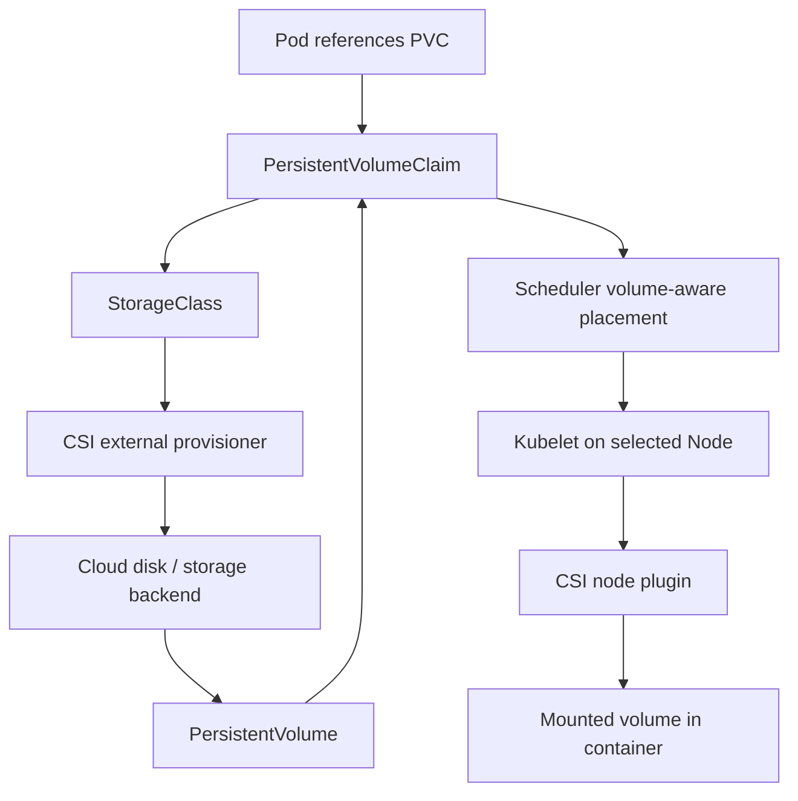

# 06 - Storage: Volumes, PV, PVC, StorageClass, and CSI

## Why This Chapter Matters

Containers are temporary, but data often is not. Kubernetes storage exists because applications need files, databases need durable disks, Pods move across Nodes, and infrastructure storage systems are different across clouds and data centers. If you do not understand PVs, PVCs, StorageClasses, CSI, access modes, reclaim policies, and zone constraints, storage failures look like random Pending Pods.

Source snapshot: 2026-05-27. Storage behavior varies by CSI driver, cloud provider, Kubernetes version, reclaim policy, volume binding mode, access mode, and storage backend.

## The Big Picture

```text
Pod needs storage
  -> Pod references PVC
  -> PVC requests storage
  -> PV satisfies request or StorageClass provisions dynamically
  -> CSI attaches/mounts volume
  -> kubelet exposes volume inside container
```

Storage is a coordination problem between the Kubernetes API, scheduler, kubelet, CSI components, and the real storage system.

## First-Principles Explanation

Cause: Local container files disappear when containers restart or move. Applications need durable or shared data independent of a single container lifetime.

Mechanism: Kubernetes separates storage request from storage implementation. A PersistentVolumeClaim expresses what a workload needs. A PersistentVolume represents actual storage. A StorageClass and CSI driver can dynamically create the storage.

Immediate result: Workloads can request storage without embedding cloud-specific disk creation in application YAML.

Long-term impact: Teams gain a portable storage API, but must still respect real storage constraints like zones, attach limits, access modes, performance, and backup.

Next connected topic: StatefulSets, database operations, backup/restore, volume expansion, snapshots, and topology-aware scheduling.

## Core Vocabulary

| Term | Meaning | Why it matters |
| --- | --- | --- |
| Volume | Storage mounted into a Pod. | Pod-level storage abstraction. |
| emptyDir | Temporary volume created with Pod and deleted with Pod. | Useful for scratch space, not durable persistence. |
| PersistentVolume | Cluster storage resource representing actual storage. | Decouples storage supply from Pod. |
| PersistentVolumeClaim | User/workload request for storage. | Workloads normally reference PVCs. |
| StorageClass | Defines dynamic provisioning behavior. | Chooses CSI provisioner, parameters, binding mode, reclaim behavior. |
| CSI | Container Storage Interface. | Standard interface for storage drivers. |
| Access mode | How volume may be mounted, such as ReadWriteOnce or ReadOnlyMany. | Controls sharing semantics, but backend support matters. |
| Reclaim policy | What happens to PV after claim release. | Prevents accidental deletion or causes intended cleanup. |
| VolumeBindingMode | When provisioning/binding happens. | Important for zone-aware storage. |

## Mental Model

PVC is a restaurant order. PV is the actual dish. StorageClass is the kitchen process. CSI is the kitchen staff and delivery route. Kubelet places the dish on the table inside the Pod.

The Pod should not need to know exactly which cloud disk or storage array was created. It only declares what it needs.

## Historical / Evolution / Causal Chain

Early containers:

Container filesystem -> deleted/recreated with container -> not suitable for durable data.

Host mounts:

Manual host paths -> node-coupled data -> Pod cannot move safely.

Kubernetes PV/PVC model:

Storage request separated from storage supply -> dynamic provisioning -> portable workload manifests.

Real infrastructure constraints:

Cloud disks are zonal, attach-limited, and access-mode specific -> scheduler and CSI need topology awareness -> WaitForFirstConsumer and volume binding rules.

Operational maturity:

Persistent data -> backup/snapshot/restore requirements -> storage class policy, snapshots, disaster recovery, and application-aware backup.

## Architecture or Conceptual Structure



## Step-by-Step Explanation

### 1. Define a StorageClass

Example shape:

```yaml
apiVersion: storage.k8s.io/v1
kind: StorageClass
metadata:
  name: fast
provisioner: example.csi.driver
volumeBindingMode: WaitForFirstConsumer
reclaimPolicy: Delete
```

Meaning:

- `provisioner` identifies the storage driver.
- `WaitForFirstConsumer` delays binding/provisioning until scheduling context is known.
- `Delete` means dynamically provisioned storage may be deleted after claim release, depending on driver behavior.

### 2. Create a PVC

```yaml
apiVersion: v1
kind: PersistentVolumeClaim
metadata:
  name: data
spec:
  accessModes:
  - ReadWriteOnce
  resources:
    requests:
      storage: 20Gi
  storageClassName: fast
```

### 3. Pod Uses the PVC

```yaml
volumes:
- name: data
  persistentVolumeClaim:
    claimName: data
containers:
- name: app
  image: example/app:1.0
  volumeMounts:
  - name: data
    mountPath: /var/lib/app
```

### 4. CSI Provisions and Mounts

Depending on binding mode:

- immediate binding can provision early
- WaitForFirstConsumer can wait until scheduler knows placement constraints

Kubelet then coordinates attach/mount with the CSI node plugin.

## Internal Mechanics

### Access Modes

| Access mode | Meaning | Trap |
| --- | --- | --- |
| ReadWriteOnce | Mounted read-write by a single node. | Multiple Pods on same node may be possible depending on backend and mode, but do not assume cross-node sharing. |
| ReadOnlyMany | Mounted read-only by many nodes. | Good for shared read data if backend supports it. |
| ReadWriteMany | Mounted read-write by many nodes. | Requires backend support such as network filesystem. |
| ReadWriteOncePod | Mounted read-write by a single Pod. | Stronger single-Pod semantics where supported. |

### Reclaim Policies

| Policy | Meaning | Risk |
| --- | --- | --- |
| Delete | Storage may be deleted after PVC release. | Dangerous for data if used carelessly. |
| Retain | PV remains after PVC deletion. | Requires manual cleanup/reuse process. |

### Volume Binding and Zones

Cloud disks are often zonal. A Pod scheduled in zone A may not be able to mount a disk in zone B.

Cause chain:

Immediate PV binding -> disk created in one zone -> scheduler later picks another zone -> attach failure or Pending -> use topology-aware binding where appropriate.

`WaitForFirstConsumer` helps by delaying provisioning until Pod scheduling context is available.

### emptyDir

`emptyDir` is created when a Pod is assigned to a Node and removed when the Pod is removed from that Node.

Good for:

- scratch space
- sharing files between containers in one Pod
- temporary build/cache data

Bad for:

- durable database storage
- data that must survive Pod deletion

## Practical Examples

### Debug a Pending PVC

Commands:

```bash
kubectl get pvc
kubectl describe pvc data
kubectl get storageclass
kubectl get pv
```

Look for:

- missing StorageClass
- no default StorageClass when `storageClassName` omitted
- unsupported access mode
- quota
- provisioner errors
- waiting for first consumer

### Debug Volume Mount Failure

Commands:

```bash
kubectl describe pod app
kubectl describe pvc data
kubectl describe node worker-1
kubectl get events --sort-by=.lastTimestamp
```

Bad signs:

- `FailedMount`
- `FailedAttachVolume`
- `Multi-Attach error`
- permission denied inside container
- filesystem mismatch
- zone mismatch

### Debug Application Permission Problems

Ask:

- What user does the container run as?
- What ownership does the mounted volume have?
- Is `fsGroup` required and supported?
- Did an init container change permissions?
- Does the storage backend support POSIX semantics expected by the app?

## Small Details That Matter Later

- PVCs are namespace-scoped. PVs are cluster-scoped.
- A Pod references a PVC by name in the same namespace.
- `storageClassName: ""` means no dynamic StorageClass, not "use default."
- Omitting `storageClassName` may use the default StorageClass if one exists.
- `Retain` protects from automatic deletion but requires manual lifecycle work.
- `Delete` can remove real storage after PVC deletion.
- Access modes describe mount capability, not application-level database safety.
- ReadWriteMany requires backend support.
- Zonal volumes constrain scheduling.
- `WaitForFirstConsumer` helps align storage provisioning with Pod placement.
- Storage expansion depends on StorageClass and driver support.
- Snapshots require snapshot CRDs/controllers and driver support.
- Backups must be application-consistent for databases; volume snapshot alone may not be enough.

## Common Misunderstandings

| Misunderstanding | Correction |
| --- | --- |
| A PVC is the disk. | A PVC is a request. The PV/backing storage is the actual supply. |
| `emptyDir` is persistent. | It is tied to Pod lifetime on a Node. |
| ReadWriteOnce means one Pod only. | It traditionally means mounted read-write by one node; use ReadWriteOncePod where supported for single-Pod semantics. |
| Deleting a PVC is always safe. | Reclaim policy and driver behavior decide what happens to real data. |
| Storage is fully portable. | Kubernetes has a portable API, but backend behavior still differs. |

## Failure Modes / Mistakes / Traps

| Symptom | Likely cause | First check |
| --- | --- | --- |
| PVC Pending | no StorageClass/provisioner, unsupported mode, WaitForFirstConsumer | `describe pvc` |
| Pod Pending with volume issue | zone or binding constraint | Pod events and PVC/PV topology |
| `FailedMount` | driver, permissions, attach, filesystem | Pod events and CSI logs |
| `Multi-Attach error` | RWO volume used across nodes | Pod placement and volume mode |
| Data deleted unexpectedly | Delete reclaim policy | PV/PVC lifecycle and backend |
| App permission denied | container user vs volume ownership | securityContext, fsGroup, init container |

## Debugging / Analysis Method

```text
Pod references PVC?
  -> PVC exists in same namespace?
  -> PVC Bound?
  -> StorageClass/provisioner exists?
  -> access mode supported?
  -> volume topology compatible?
  -> CSI attach/mount successful?
  -> container user can read/write?
  -> application data consistency/backups handled?
```

## Real-World or Exam Relevance

You should be able to:

- create PVCs and mount them into Pods
- distinguish `emptyDir` from persistent storage
- explain PV/PVC/StorageClass relationships
- debug Pending PVCs
- explain reclaim policy risk
- identify volume mount events
- understand zone-aware volume scheduling

## Connected Topics

- [03 - Pod Creation Lifecycle](03%20-%20Pod%20Creation%20Lifecycle.md)
- [04 - Scheduling Placement and Node Pressure](04%20-%20Scheduling%20Placement%20and%20Node%20Pressure.md)
- [08 - Failure Modes and Troubleshooting Flowcharts](08%20-%20Failure%20Modes%20and%20Troubleshooting%20Flowcharts.md)

## Chapter Summary

Kubernetes storage separates workload requests from storage implementation. PVCs request storage, PVs represent storage, StorageClasses define dynamic provisioning, and CSI drivers connect Kubernetes to real storage backends. Debugging storage means following the chain from Pod to PVC to PV/StorageClass to scheduler topology to CSI attach/mount to container permissions.

## Questions to Test Understanding

1. Why are PVCs namespace-scoped but PVs cluster-scoped?
2. Why can a Pod be Pending because of storage?
3. What risk does `reclaimPolicy: Delete` create?
4. Why is `WaitForFirstConsumer` useful?
5. Why is `emptyDir` unsafe for durable database data?

## Answers and Reasoning

1. PVCs are workload requests inside namespaces. PVs represent cluster storage supply that can be bound to claims.
2. The scheduler may need compatible volume topology, and CSI provisioning/attach/mount may be unresolved.
3. It can delete the backing storage after PVC release, potentially removing real data.
4. It delays binding/provisioning until scheduling context is known, reducing zone mismatch.
5. `emptyDir` disappears when the Pod is removed from the Node.

## Source Backbone

- Kubernetes storage concepts: <https://kubernetes.io/docs/concepts/storage/>
- Persistent volumes: <https://kubernetes.io/docs/concepts/storage/persistent-volumes/>
- StorageClasses: <https://kubernetes.io/docs/concepts/storage/storage-classes/>
- Volumes: <https://kubernetes.io/docs/concepts/storage/volumes/>
- CSI: <https://kubernetes.io/docs/concepts/storage/volumes/#csi>
