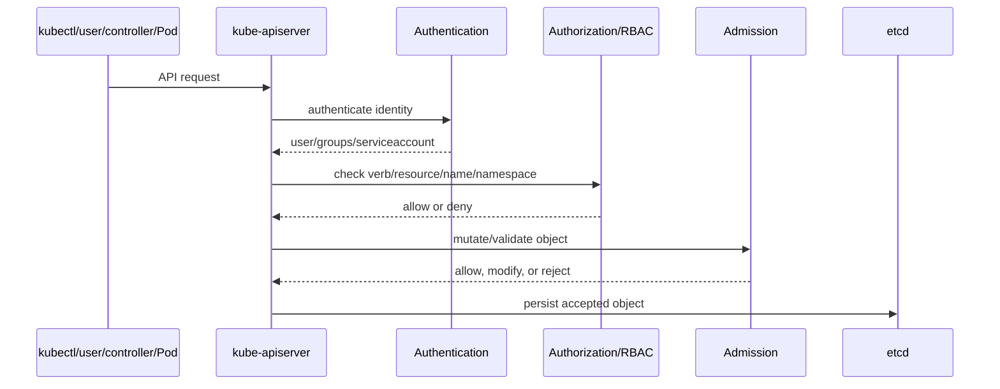
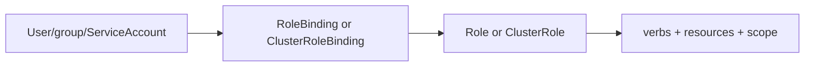

# 07 - Security: RBAC, ServiceAccounts, TLS, and Admission

## Why This Chapter Matters

Kubernetes is an API-driven system. That means security is not an optional add-on; it is part of every request. A user, controller, kubelet, or Pod either can or cannot perform an action against the API. Admission may change or reject objects. ServiceAccounts give Pods API identities. TLS protects component communication. RBAC mistakes can give a workload the power to read secrets, create Pods, or escalate privilege.

Source snapshot: 2026-05-27. Security behavior depends on Kubernetes version, enabled admission plugins, distribution defaults, authentication integration, Pod Security Admission settings, cloud IAM integration, and installed policy engines.

## The Big Picture

```text
request to API server
  -> authentication: who are you?
  -> authorization: are you allowed?
  -> admission: is this object acceptable or should it be changed?
  -> persistence in etcd
  -> controllers/kubelets act
```

Security failures often happen before an object exists.

## First-Principles Explanation

Cause: Kubernetes lets many actors create, read, update, delete, and watch powerful objects. A compromised identity can become a cluster-wide incident.

Mechanism: Kubernetes secures API access through authentication, authorization, admission, TLS, ServiceAccounts, and policy controls.

Immediate result: A request may be allowed, denied as `Forbidden`, mutated, or rejected before persistence.

Long-term impact: Cluster safety depends on least privilege, namespace boundaries, controlled admission, secret handling, and workload isolation.

Next connected topic: Pod security, NetworkPolicy, secrets management, admission webhooks, audit logs, and supply-chain controls.

## Core Vocabulary

| Term | Meaning | Why it matters |
| --- | --- | --- |
| Authentication | Proves identity. | Answers "who are you?" |
| Authorization | Checks permissions. | Answers "can you do this?" |
| RBAC | Role-based access control. | Common Kubernetes authorization model. |
| Role | Namespaced permissions. | Grants verbs on resources within one namespace. |
| ClusterRole | Cluster-scoped or reusable permission set. | Needed for cluster resources or reuse across namespaces. |
| RoleBinding | Binds Role/ClusterRole to subjects in a namespace. | Grants namespaced access. |
| ClusterRoleBinding | Binds ClusterRole cluster-wide. | High blast radius if misused. |
| ServiceAccount | Kubernetes identity for Pods and controllers. | Workloads use it to talk to the API. |
| Admission | Request-time mutation or validation after authz and before persistence. | Enforces policy and defaults. |
| Secret | Kubernetes object for sensitive data. | Requires access control and often external secret strategy. |
| TLS | Cryptographic transport security. | Protects component/API communication. |
| kubeconfig | Client config with clusters, users, and contexts. | Determines which cluster and identity `kubectl` uses. |

## Mental Model

Every Kubernetes API request passes through a guarded gate:

1. Show ID.
2. Prove you are allowed.
3. Let policy inspectors examine the object.
4. Only then write to storage.

If a request fails, the exact error matters:

- authentication failure: identity problem
- `Forbidden`: authorization problem
- admission rejection: policy problem
- validation error: object schema/spec problem

## Historical / Evolution / Causal Chain

Small clusters:

Few admins -> broad credentials -> manageable but risky.

Shared clusters:

Many teams and workloads -> broad credentials unsafe -> RBAC and namespaces.

Workloads call the API:

Pods need identity -> ServiceAccounts and tokens -> least-privilege workload permissions.

Policy needs:

RBAC says who can submit, not whether the submitted Pod is safe -> admission controllers and Pod Security Admission.

Supply-chain and multi-tenant pressure:

Untrusted images and privileged workloads -> admission policy, image policy, runtime controls, network policy, secret controls.

## Architecture or Conceptual Structure



RBAC binding structure:



## Step-by-Step Explanation

### 1. Check Current Identity and Context

```bash
kubectl config current-context
kubectl config get-contexts
```

Why:

Many Kubernetes mistakes happen because the user is in the wrong context or namespace.

### 2. Test Authorization

```bash
kubectl auth can-i create deployments -n dev
kubectl auth can-i list secrets -n prod
kubectl auth can-i delete nodes
```

Expected:

```text
yes
```

or

```text
no
```

Interpretation:

- `no` means RBAC or another authorization layer denies the action.
- It does not mean the resource does not exist.

### 3. Create a Namespaced Role

```yaml
apiVersion: rbac.authorization.k8s.io/v1
kind: Role
metadata:
  namespace: dev
  name: pod-reader
rules:
- apiGroups: [""]
  resources: ["pods"]
  verbs: ["get", "list", "watch"]
```

### 4. Bind It to a ServiceAccount

```yaml
apiVersion: rbac.authorization.k8s.io/v1
kind: RoleBinding
metadata:
  namespace: dev
  name: read-pods
subjects:
- kind: ServiceAccount
  name: app-sa
  namespace: dev
roleRef:
  kind: Role
  name: pod-reader
  apiGroup: rbac.authorization.k8s.io
```

### 5. Attach ServiceAccount to Pod

```yaml
spec:
  serviceAccountName: app-sa
```

Meaning:

The Pod uses `app-sa` identity for API calls. It does not automatically need broad permissions.

## Internal Mechanics

### RBAC Rule Anatomy

```yaml
rules:
- apiGroups: ["apps"]
  resources: ["deployments"]
  verbs: ["get", "list", "watch", "create", "update", "patch"]
```

Key dimensions:

- API group
- resource
- verb
- namespace or cluster scope
- optional resource names

### Role vs ClusterRole

| Object | Scope | Use |
| --- | --- | --- |
| Role | Namespaced | Grant access within one namespace. |
| ClusterRole | Cluster-scoped permission definition | Grant cluster resources or reuse namespaced permissions. |
| RoleBinding | Namespaced grant | Can bind a Role or ClusterRole within a namespace. |
| ClusterRoleBinding | Cluster-wide grant | High blast radius; use carefully. |

### ServiceAccount Tokens

Modern Kubernetes uses projected ServiceAccount tokens by default in many distributions. Behavior can vary by version/configuration.

Small details:

- Disable automount where Pods do not need API access.
- Use dedicated ServiceAccounts per workload.
- Do not run every workload under a broad default ServiceAccount.

### Admission

Admission can:

- add defaults
- reject unsafe specs
- enforce namespace policy
- require labels
- block privileged containers
- validate image rules

Types:

- built-in admission controllers
- mutating admission webhooks
- validating admission webhooks
- policy engines layered on admission

## Practical Examples

### Debug `Forbidden`

Symptom:

```text
Error from server (Forbidden): deployments.apps is forbidden
```

Commands:

```bash
kubectl auth can-i get deployments -n dev
kubectl auth can-i create deployments -n dev
kubectl get rolebinding,clusterrolebinding -A | grep app-sa
```

Ask:

- Which identity made the request?
- Which verb/resource/namespace was denied?
- Is the binding namespaced or cluster-wide?
- Is the ServiceAccount in the expected namespace?

### Debug Admission Rejection

Symptom:

```text
Error from server (Forbidden): violates PodSecurity "restricted"
```

Interpretation:

- Authentication and authorization may have passed.
- Admission policy rejected the object.

Check:

```bash
kubectl describe namespace dev
kubectl get validatingwebhookconfiguration
kubectl get mutatingwebhookconfiguration
```

### Reduce ServiceAccount Exposure

```yaml
spec:
  automountServiceAccountToken: false
```

Use when:

- the Pod does not call Kubernetes API
- you want to reduce token exposure

## Small Details That Matter Later

- `Forbidden` usually means authorization, not scheduling.
- A RoleBinding can bind a ClusterRole into one namespace.
- A ClusterRoleBinding grants cluster-wide effect.
- ServiceAccounts are namespaced.
- The `default` ServiceAccount exists, but should not receive broad permissions casually.
- `kubectl auth can-i` tests permissions from the current context unless impersonation flags are used.
- Admission happens after authentication and authorization but before persistence.
- Webhook failure policies can affect whether API requests fail open or fail closed.
- Secrets are base64 encoded in YAML, not inherently encrypted by that fact.
- etcd encryption at rest depends on cluster configuration.
- Pod Security Admission labels are namespace-level controls in modern Kubernetes.
- Kubeconfig context mistakes can cause operations against the wrong cluster.
- RBAC does not control network traffic. Use NetworkPolicy for traffic paths.
- RBAC does not make a container non-root. Use Pod security context/admission/runtime controls.

## Common Misunderstandings

| Misunderstanding | Correction |
| --- | --- |
| Base64 Secret data is encrypted. | Base64 is encoding, not encryption. |
| RBAC controls Pod-to-Pod traffic. | RBAC controls API actions. NetworkPolicy controls network traffic. |
| A ServiceAccount is a human user. | It is a Kubernetes identity for workloads and controllers. |
| RoleBinding is always weaker than ClusterRoleBinding. | RoleBinding can bind powerful ClusterRoles, but only in its namespace. |
| If `kubectl apply` fails, the object exists partially. | Admission/validation can reject before persistence. |

## Failure Modes / Mistakes / Traps

| Symptom | Likely cause | First check |
| --- | --- | --- |
| `Forbidden` | missing RBAC permission | `kubectl auth can-i` |
| Pod cannot list resources | ServiceAccount lacks RoleBinding | SA and bindings |
| Admission rejection | PodSecurity/webhook policy | namespace labels, webhook config |
| Secret leak | broad secret list/get permissions | RBAC and audit |
| Wrong cluster changed | kubeconfig context mistake | current context |
| Workload has API token unnecessarily | automount default | ServiceAccount and Pod spec |

## Debugging / Analysis Method

```text
Who made request?
  -> Which context/ServiceAccount?
  -> Which verb/resource/API group?
  -> Which namespace?
  -> auth can-i result?
  -> RoleBinding/ClusterRoleBinding?
  -> admission policy?
  -> object validation?
```

## Real-World or Exam Relevance

You should be able to:

- create Roles and RoleBindings
- distinguish Role from ClusterRole
- use ServiceAccounts in Pods
- test permissions with `kubectl auth can-i`
- explain admission vs authorization
- explain why Secrets need RBAC and encryption controls
- explain why Pod security is not the same as API RBAC

## Connected Topics

- [02 - Control Plane Internals](02%20-%20Control%20Plane%20Internals.md)
- [05 - Service Networking DNS and Traffic Flow](05%20-%20Service%20Networking%20DNS%20and%20Traffic%20Flow.md)
- [08 - Failure Modes and Troubleshooting Flowcharts](08%20-%20Failure%20Modes%20and%20Troubleshooting%20Flowcharts.md)

## Chapter Summary

Kubernetes security begins at the API server. Authentication identifies the actor, authorization checks whether the actor can perform the requested verb on the resource, admission mutates or validates the request, and accepted objects are persisted. RBAC, ServiceAccounts, TLS, Secrets, and admission controls form the basic security structure.

## Questions to Test Understanding

1. What is the difference between authentication and authorization?
2. Why can a RoleBinding reference a ClusterRole?
3. Why is a broad ClusterRoleBinding dangerous?
4. Why is base64 not secret encryption?
5. Why can admission reject a request even after RBAC allows it?

## Answers and Reasoning

1. Authentication proves identity. Authorization checks whether that identity can perform an action.
2. A ClusterRole can be reused as a permission template inside a namespace through RoleBinding.
3. It grants permissions across the cluster, which increases blast radius.
4. Base64 is reversible encoding. It does not protect confidentiality.
5. Admission enforces object policy and validation after authorization but before persistence.

## Source Backbone

- Kubernetes authorization overview: <https://kubernetes.io/docs/reference/access-authn-authz/authorization/>
- RBAC: <https://kubernetes.io/docs/reference/access-authn-authz/rbac/>
- ServiceAccounts: <https://kubernetes.io/docs/concepts/security/service-accounts/>
- Admission controllers: <https://kubernetes.io/docs/reference/access-authn-authz/admission-controllers/>
- Pod Security Admission: <https://kubernetes.io/docs/concepts/security/pod-security-admission/>
- Secrets: <https://kubernetes.io/docs/concepts/configuration/secret/>
