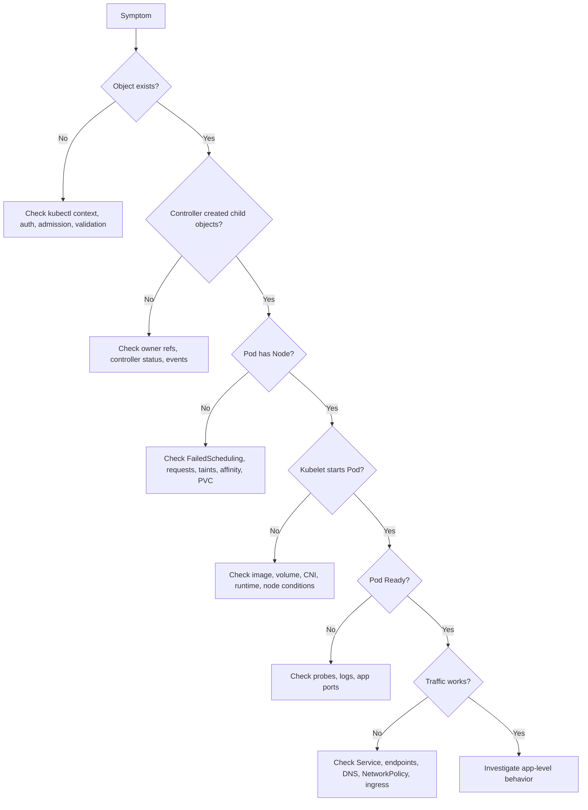
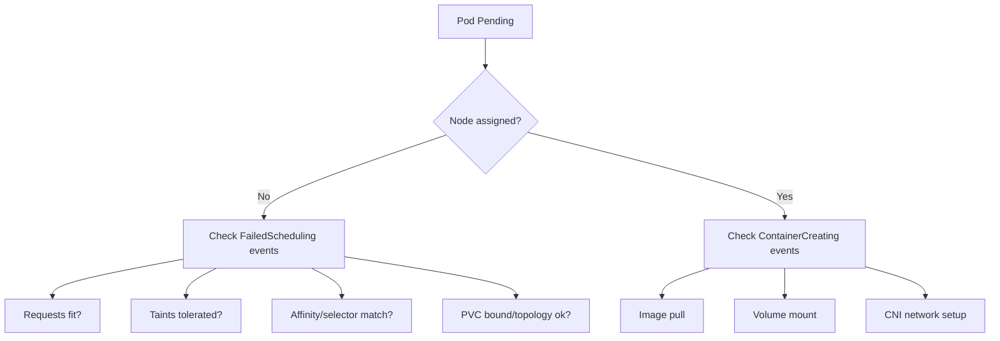
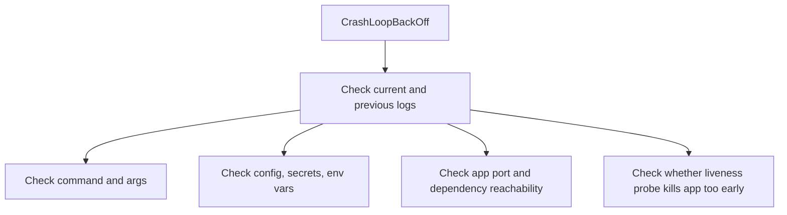
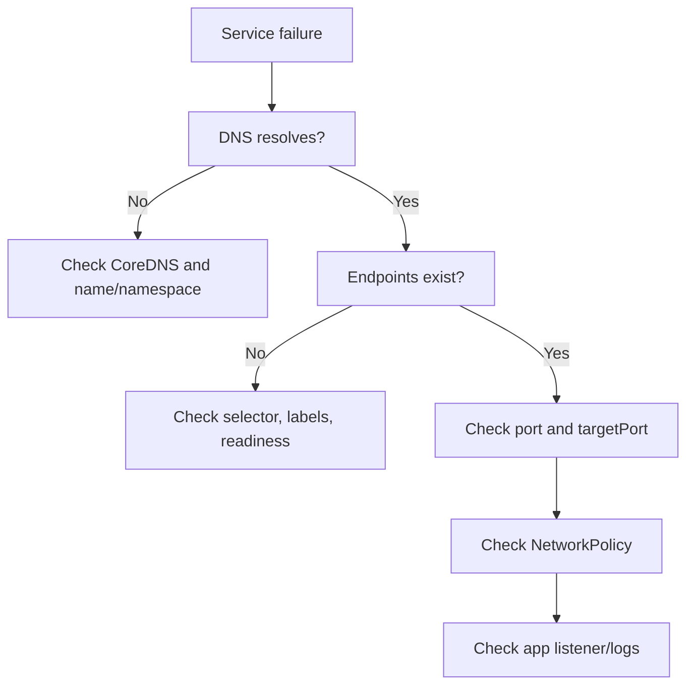
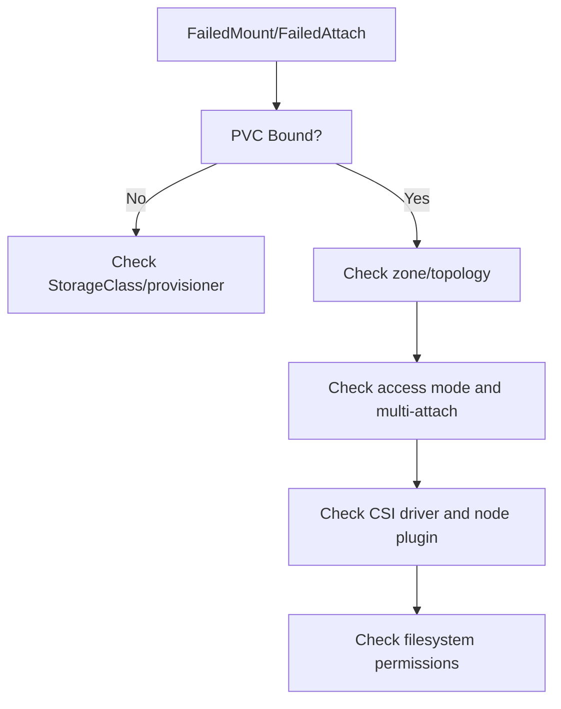

# 08 - Failure Modes and Troubleshooting Flowcharts

## Why This Chapter Matters

Kubernetes troubleshooting is not a list of random commands. It is an investigation through layers. A failing workload may be blocked by the API, scheduler, node, runtime, network, storage, security policy, or the application itself. The engineer who can locate the broken layer quickly will fix incidents faster and avoid dangerous guesswork.

Source snapshot: 2026-05-27. Troubleshooting output varies by Kubernetes version, distribution, CNI, CSI, cloud provider, runtime, and installed controllers.

## The Big Picture

```text
user intent
  -> API request
  -> authn/authz/admission
  -> persisted object
  -> controller reaction
  -> scheduling
  -> kubelet/runtime
  -> network/storage
  -> application health
  -> service exposure
```

The right question is not "what command should I run?" The right question is "which layer has evidence of failure?"

## First-Principles Explanation

Cause: Kubernetes is distributed. One symptom can have many causes.

Mechanism: Every visible state is produced by a component chain. Events, status fields, logs, endpoints, and controller conditions are evidence left by that chain.

Immediate result: Troubleshooting becomes a path search rather than command memorization.

Long-term impact: You can debug unfamiliar failures because you understand component responsibility.

Next connected topic: observability, SLOs, audit logs, controller logs, node diagnostics, and production incident response.

## Core Vocabulary

| Term | Meaning | Debugging value |
| --- | --- | --- |
| Event | Time-ordered clue emitted by components. | Often shows scheduling, pull, mount, or probe failures. |
| Condition | Structured state on objects/nodes. | Shows Ready, Available, Progressing, pressure, etc. |
| Phase | Coarse Pod lifecycle category. | Useful but not detailed enough alone. |
| Reason | Machine-readable explanation. | Examples: `FailedScheduling`, `ImagePullBackOff`, `CrashLoopBackOff`. |
| Logs | Output from containers or components. | Shows app/runtime behavior after start. |
| Describe | Human-readable object summary plus events. | First-line Kubernetes investigation tool. |
| EndpointSlice | Actual Service backends. | Explains Service traffic failures. |
| Node condition | Node health and pressure state. | Explains evictions and scheduling avoidance. |

## Mental Model

Troubleshooting Kubernetes is like following a package delivery:

- Was the order accepted?
- Did security block it?
- Did dispatch assign a driver?
- Did the local warehouse have capacity?
- Did the route exist?
- Did the package arrive?
- Did the recipient accept it?

Each step has its own logs and status.

## Architecture or Conceptual Structure



## Step-by-Step Explanation

### 1. Start With Object State

```bash
kubectl get deploy,rs,pod,svc,pvc -o wide
```

Why:

You need to see which objects exist and which layer is missing.

### 2. Describe the Most Specific Broken Object

```bash
kubectl describe pod mypod
```

Why:

`describe` includes events, conditions, node assignment, containers, mounts, and probes.

### 3. Sort Events

```bash
kubectl get events --sort-by=.lastTimestamp
```

Why:

Events show the sequence of failure. The first failure often matters more than the last repeated backoff.

### 4. Follow Owner Chain

```bash
kubectl get pod mypod -o yaml
kubectl get rs
kubectl describe deployment mydeploy
```

Why:

Deployment -> ReplicaSet -> Pod ownership explains whether a controller is doing its job.

### 5. Separate Infrastructure Failure From App Failure

Infrastructure signs:

- `FailedScheduling`
- `ImagePullBackOff`
- `FailedMount`
- `ContainerCreating`
- Node `NotReady`
- DNS failure
- no endpoints

Application signs:

- container starts then exits
- readiness probe fails
- liveness probe restarts container
- HTTP 500 from app
- app logs show exception

## Internal Mechanics

### Common Pod States

| State/reason | Meaning | First move |
| --- | --- | --- |
| Pending + no Node | Scheduling or volume binding unresolved | `describe pod` events |
| ContainerCreating | Kubelet is setting up runtime/network/storage | events, node state |
| ImagePullBackOff | Image pull failed and is backing off | image name, registry auth, node network |
| CrashLoopBackOff | Container starts then exits repeatedly | previous logs and command/args |
| Running but not Ready | Probes or readiness condition failing | readiness probe, app port, logs |
| Evicted | Kubelet evicted under pressure | node conditions and QoS |
| Completed | Process exited successfully | expected for Jobs, not Deployments |

### Useful Command Meanings

```bash
kubectl get pods -o wide
```

Shows Node, Pod IP, and status. Use it to separate scheduling from runtime.

```bash
kubectl describe pod mypod
```

Shows events and container details. Use it for first diagnosis.

```bash
kubectl logs mypod --previous
```

Shows logs from the previous container instance after a restart. Use it for CrashLoopBackOff.

```bash
kubectl exec -it mypod -- sh
```

Runs a command inside a running container. Use only when the container is running and image has a shell/tooling.

```bash
kubectl auth can-i list pods -n dev
```

Tests authorization for the current identity.

## Practical Flowcharts

### Pod Pending



### CrashLoopBackOff



### Service Not Working



### Storage Mount Failure



## Small Details That Matter Later

- The last event may be a repeated backoff; the first event may contain the root cause.
- `kubectl logs` without `--previous` can miss the crashed container's earlier output.
- `kubectl exec` proves the container is running, not that the Service path works.
- A Deployment can be healthy while one old Pod is broken and terminating.
- A Pod can be Running but not Ready.
- A Service with endpoints proves selector/readiness, not necessarily app correctness.
- DNS failure may be caused by NetworkPolicy blocking egress to DNS.
- `Forbidden` is an API permission issue, not a node issue.
- `FailedScheduling` happens before kubelet starts container setup.
- `ImagePullBackOff` happens after scheduling.
- Node pressure can evict Pods even if application code is fine.
- Restarting a Pod may hide an issue if you do not capture events and previous logs first.
- Managed Kubernetes may hide control-plane component logs from direct access.

## Common Misunderstandings

| Misunderstanding | Correction |
| --- | --- |
| `kubectl apply` runs containers. | It submits desired state. Controllers, scheduler, and kubelet do the rest. |
| Running means Ready. | Running only means containers are running; readiness may be false. |
| DNS success means Service traffic works. | Endpoints, ports, NetworkPolicy, and app health still matter. |
| CrashLoopBackOff is a Kubernetes bug. | Usually the container process exits, config is wrong, dependency missing, or probe kills it. |
| Deleting Pods is diagnosis. | Deleting may recover symptoms but can erase evidence. |

## Failure Modes / Mistakes / Traps

| Failure | Layer | Evidence |
| --- | --- | --- |
| Wrong context | Client config | `kubectl config current-context` |
| `Forbidden` | Authorization | `kubectl auth can-i` |
| Admission reject | Policy | error message, webhook/PodSecurity info |
| No Pods from Deployment | Controller/spec | Deployment conditions, ReplicaSet |
| Pending no Node | Scheduler | `FailedScheduling` event |
| Pending with PVC | Storage scheduling/provisioning | PVC events |
| ContainerCreating stuck | Kubelet/CNI/CSI/image | Pod events, node state |
| CrashLoopBackOff | App/process/probe | logs, previous logs, command |
| Service no endpoints | labels/readiness | EndpointSlices |
| External traffic failure | Ingress/LB/firewall | controller logs, Service events |

## Debugging / Analysis Method

Use the five-line incident note:

1. Symptom: what is failing from the user's perspective?
2. Broken layer: API, controller, scheduler, node/runtime, network, storage, security, or application.
3. Evidence: exact command output or event reason.
4. Immediate correction: smallest safe fix.
5. Prevention: request/limit, probe, policy, label, backup, alert, or design change.

Example:

"The API Deployment has three Pods Pending with no assigned Node. `describe pod` shows `0/4 nodes are available: 4 Insufficient memory`. This is scheduler capacity failure based on memory requests. Immediate fix is to reduce requests if they are wrong or add capacity. Prevention is to set realistic requests and monitor allocatable headroom."

## Real-World or Exam Relevance

CKA and production exams reward command evidence:

- `kubectl get`
- `kubectl describe`
- `kubectl logs --previous`
- `kubectl get events --sort-by=.lastTimestamp`
- `kubectl auth can-i`
- `kubectl get endpointslice`
- `kubectl describe node`
- `kubectl top` where metrics server exists

But the command is not the answer. The interpretation is the answer.

## Connected Topics

- [01 - Desired State and Reconciliation](01%20-%20Desired%20State%20and%20Reconciliation.md)
- [03 - Pod Creation Lifecycle](03%20-%20Pod%20Creation%20Lifecycle.md)
- [04 - Scheduling Placement and Node Pressure](04%20-%20Scheduling%20Placement%20and%20Node%20Pressure.md)
- [05 - Service Networking DNS and Traffic Flow](05%20-%20Service%20Networking%20DNS%20and%20Traffic%20Flow.md)
- [06 - Storage Volumes PV PVC StorageClass and CSI](06%20-%20Storage%20Volumes%20PV%20PVC%20StorageClass%20and%20CSI.md)
- [07 - Security RBAC ServiceAccounts TLS and Admission](07%20-%20Security%20RBAC%20ServiceAccounts%20TLS%20and%20Admission.md)

## Chapter Summary

Kubernetes troubleshooting works when you follow the system chain: API request, authorization/admission, object persistence, controller reaction, scheduling, kubelet/runtime setup, networking, storage, readiness, and service exposure. Events, conditions, logs, EndpointSlices, and node state are evidence. Do not guess; locate the layer.

## Questions to Test Understanding

1. Why should you check Pod events before deleting a broken Pod?
2. What does `CrashLoopBackOff` usually mean?
3. Why can a Pod be Running but not receive Service traffic?
4. What command helps confirm whether an identity can perform an API action?
5. Why is the first event often more useful than the last event?

## Answers and Reasoning

1. Events preserve the component-level failure sequence. Deleting a Pod can erase useful evidence.
2. The container starts and exits repeatedly, often due to app crash, config error, missing dependency, or probe behavior.
3. It may not be Ready, labels may not match the Service, ports may be wrong, or NetworkPolicy may block traffic.
4. `kubectl auth can-i`.
5. Later events may be repeated backoff messages. The first failure often identifies the root cause.

## Source Backbone

- Debug Pods: <https://kubernetes.io/docs/tasks/debug/debug-application/debug-pods/>
- Debug Services: <https://kubernetes.io/docs/tasks/debug/debug-application/debug-service/>
- Events: <https://kubernetes.io/docs/reference/kubectl/generated/kubectl_events/>
- Node pressure eviction: <https://kubernetes.io/docs/concepts/scheduling-eviction/node-pressure-eviction/>
- Troubleshooting clusters: <https://kubernetes.io/docs/tasks/debug/debug-cluster/>
