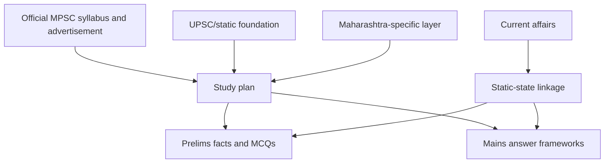

# 01 - Exam Structure, Syllabus Map, and Strategy

## Why This Chapter Matters

MPSC preparation is close enough to UPSC that many students reuse UPSC notes, but it is not the same exam. Maharashtra-specific history, geography, polity, administration, economy, social reform movements, schemes, and current affairs change the center of gravity. A student who studies only national material may understand polity and economy but miss state-specific administrative and regional questions.

Source snapshot: 2026-05-27. The official MPSC syllabus page was checked at <https://mpsc.gov.in/examination_syllabus/18>, but the page required JavaScript in this environment. Treat current pattern, dates, advertisements, and paper structure as "verify from the official MPSC PDF/advertisement" before final planning.

## The Big Picture

```text
MPSC exam preparation
  -> official advertisement and syllabus verification
  -> common national foundation
  -> Maharashtra-specific layer
  -> prelims MCQ practice
  -> mains answer writing
  -> interview/personality readiness
```

## First-Principles Explanation

Cause: State civil services require officers who understand both Indian constitutional governance and the specific social, administrative, historical, economic, and geographic realities of Maharashtra.

Mechanism: MPSC tests national foundations and Maharashtra-specific application through objective and descriptive stages depending on the current exam pattern.

Immediate result: Preparation must integrate UPSC-style static foundations with Maharashtra state depth.

Long-term impact: Strong candidates can answer both "what is federalism?" and "how does local governance or regional development operate in Maharashtra?"

Next connected topic: Maharashtra history, geography, state economy, social reform movements, local self-government, district administration, and current affairs.

## Core Vocabulary

| Term | Meaning | Why it matters |
| --- | --- | --- |
| Rajyaseva / State Services | Maharashtra state civil services examination track. | Main MPSC administrative-services focus. |
| Prelims | Screening stage, normally objective. | Tests breadth, speed, and elimination. |
| Mains | Descriptive or paper-based stage as per current pattern. | Tests depth, structure, state-specific application, and answer writing. |
| Interview | Personality assessment stage where applicable. | Tests judgement, awareness, and suitability. |
| Maharashtra-specific layer | State history, geography, economy, polity, schemes, movements, data. | Differentiates MPSC from pure UPSC preparation. |
| Official advertisement | Exam-specific legal and procedural source. | Dates, vacancies, eligibility, pattern, fees, rules. |
| Official syllabus PDF | Authoritative boundary for what to study. | Coaching summaries are secondary. |

## Mental Model

Think of MPSC as UPSC foundation plus Maharashtra administrative intelligence:

```text
Indian Constitution + Economy + History + Geography + Environment
  -> Maharashtra geography, society, reform, economy, administration
  -> current state issues
  -> answer/MCQ performance
```

## Historical / Evolution / Causal Chain

Maharashtra has a distinctive public-service context:

Maratha polity and regional history -> colonial administrative change -> social reform movements -> cooperative movement and industrialization -> regional imbalance questions -> modern state administration and welfare delivery.

This chain explains why MPSC asks state-specific questions. Officers do not serve abstract territory; they serve districts, talukas, cities, villages, regions, industries, farmers, tribal belts, coastal zones, drought-prone areas, and urban corridors.

## Architecture or Conceptual Structure



## Step-by-Step Preparation Method

### 1. Verify the Exact Exam Track

MPSC conducts multiple exams. Do not assume Rajyaseva, Group B, Group C, technical, or departmental exams have the same syllabus.

Checklist:

- exam name
- advertisement number
- year
- stage structure
- language requirements
- eligibility
- optional papers if applicable
- negative marking
- qualifying papers
- interview/personality test

### 2. Build National Foundation

Use UPSC notes for:

- Indian polity
- economy
- modern history
- geography
- environment
- science and technology basics
- ethics and governance

### 3. Add Maharashtra-Specific Layer

Must-cover areas:

- Maharashtra physical geography
- rivers, rainfall, drought-prone regions, soils, agriculture
- regional divisions: Konkan, Western Maharashtra, Marathwada, Vidarbha, North Maharashtra
- Maratha history and colonial Maharashtra
- social reformers and movements
- cooperative movement
- state administration
- local self-government
- state economy and budget themes
- state schemes and current affairs

### 4. Convert Into Exam Outputs

For every topic, create:

- Prelims facts
- MCQ traps
- Mains answer framework
- Maharashtra example
- current-affairs linkage
- revision table

## Internal Mechanics of MPSC Questions

MPSC questions often test:

- state-specific chronology
- district/region association
- act/institution/function matching
- schemes and implementing department
- geography-resource-economy linkage
- social reformer and movement linkage
- local governance structure
- Maharashtra economy and regional imbalance

## Practical Examples

### Example 1: Drought in Maharashtra

Bad answer:

"Maharashtra has drought because rainfall is low."

Better causal chain:

Rain shadow region and monsoon variability -> drought-prone districts -> groundwater stress and cropping pattern pressure -> farmer vulnerability -> state watershed, irrigation, crop insurance, and livelihood policy responses -> exam relevance in geography, economy, agriculture, disaster management, and governance.

### Example 2: Cooperative Movement

Agrarian credit and marketing problems -> cooperative institutions pool resources, credit, processing, and market power -> sugar cooperatives, credit societies, dairy, and agricultural institutions shape rural political economy -> development gains plus governance/capture/finance questions.

## Small Details That Matter Later

- Always verify whether the exam is Rajyaseva, Group B, Group C, or another MPSC track.
- Maharashtra-specific examples can upgrade generic GS answers.
- Region names matter: Konkan, Vidarbha, Marathwada, Western Maharashtra, North Maharashtra.
- Similar reformers and movements can be confused across Maharashtra and all-India history.
- State schemes change; mark them for current verification.
- District boundaries and administrative details can change.
- If the latest official syllabus is not accessible, do not rely only on coaching-site summaries.
- State budget and economic survey data are current-affairs-sensitive.
- Local self-government answers need constitutional and Maharashtra-specific legal/administrative linkage.

## Common Misunderstandings

| Misunderstanding | Correction |
| --- | --- |
| MPSC is just UPSC in Marathi/Maharashtra. | It shares foundations but needs state-specific depth. |
| Maharashtra current affairs can be done at the end. | Current affairs must be linked to static state topics continuously. |
| State geography is only maps. | It connects to agriculture, water, industry, drought, urbanization, and policy. |
| Social reform is only biography. | It is a causal chain of caste, gender, education, colonial modernity, and political awakening. |

## Failure Modes / Mistakes / Traps

| Failure | Cause | Fix |
| --- | --- | --- |
| Generic answers | UPSC-only preparation | Add Maharashtra examples and data. |
| Pattern confusion | Multiple MPSC exams | Verify exact official advertisement. |
| Weak MCQs | Poor factual revision | Maintain state fact tables and traps. |
| Poor mains output | Reading without writing | Write topic-wise answer skeletons. |
| Outdated schemes | Old current affairs | Verify from official state sources. |

## Debugging / Analysis / Answer-Writing Method

For any MPSC mains topic:

```text
definition/context
  -> Maharashtra-specific cause
  -> data/region/example
  -> administrative mechanism
  -> challenges
  -> solution/way forward
```

## Real-World or Exam Relevance

MPSC preparation should build the mind of a future state officer. Every topic should answer:

- Which Maharashtra region does this affect?
- Which department or institution handles it?
- Which communities/sectors are affected?
- What is the constitutional/legal basis?
- What policy response exists?
- What can go wrong in implementation?

## Connected Topics

- [00 - Roadmap and Source Backbone](00%20-%20Roadmap%20and%20Source%20Backbone.md)
- [02 - Maharashtra History Social Reform and State Formation](02%20-%20Maharashtra%20History%20Social%20Reform%20and%20State%20Formation.md)
- [03 - Maharashtra Geography Economy and Administration](03%20-%20Maharashtra%20Geography%20Economy%20and%20Administration.md)

## Chapter Summary

MPSC preparation needs official syllabus verification, national foundations, and Maharashtra-specific depth. The strongest answers connect state geography, history, society, economy, governance, schemes, and current affairs into causal chains.

## Questions to Test Understanding

1. Why is UPSC preparation useful but insufficient for MPSC?
2. Why must the exact exam advertisement be verified?
3. How should drought be connected across subjects?
4. Why are Maharashtra-specific examples important in mains answers?
5. What is the danger of relying only on coaching summaries?

## Answers and Reasoning

1. UPSC gives national foundation, but MPSC requires state-specific history, geography, administration, economy, and current affairs.
2. MPSC conducts multiple exams and patterns can change by track/year.
3. Drought links physical geography, agriculture, groundwater, economy, welfare, disaster management, and governance.
4. They show state awareness and make generic answers administratively relevant.
5. They may be outdated, incomplete, or wrong; official PDFs are authoritative.
