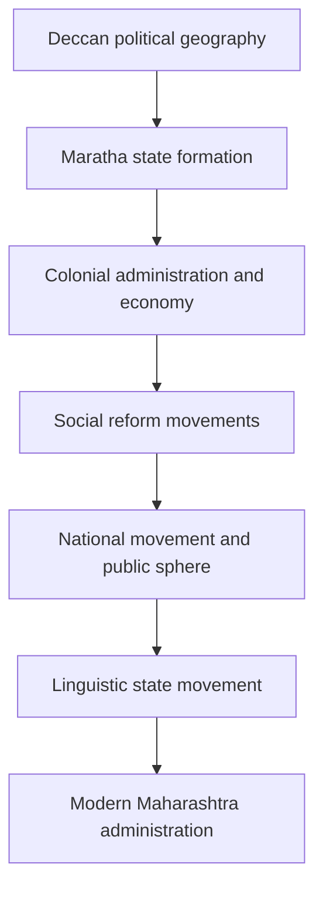

# 02 - Maharashtra History, Social Reform, and State Formation

## Why This Chapter Matters

Maharashtra history is not only a list of rulers and reformers. It explains how power, society, caste, education, language, region, economy, and administration evolved in the area that became modern Maharashtra. MPSC questions often test this chain because state administration is rooted in historical memory and regional identity.

Source snapshot: 2026-05-27. Verify exact syllabus boundaries from the latest official MPSC syllabus PDF.

## The Big Picture

```text
regional kingdoms and Maratha power
  -> colonial rule and administrative change
  -> social reform movements
  -> nationalism and regional identity
  -> Samyukta Maharashtra movement
  -> modern Maharashtra state
```

## First-Principles Explanation

Cause: Society changes when power, land, education, economy, and political representation change.

Mechanism: Maharashtra's history moved through Maratha state formation, colonial revenue and legal systems, reform movements, nationalist mobilization, labour/peasant politics, linguistic reorganization, and post-statehood development.

Immediate result: Maharashtra developed a distinctive political-social identity.

Long-term impact: Modern questions on caste, education, cooperatives, regional imbalance, urbanization, and local governance cannot be fully understood without historical context.

## Core Vocabulary

| Term | Meaning | Why it matters |
| --- | --- | --- |
| Maratha polity | Political-military formation associated with Shivaji and later Maratha power. | Key state-history foundation. |
| Bhakti movement | Devotional movement challenging ritual and social hierarchy in different ways. | Links religion, society, language, and reform. |
| Social reform | Efforts against caste oppression, gender inequality, educational exclusion, and social customs. | Central to Maharashtra modern history. |
| Satyashodhak tradition | Anti-caste and education-oriented reform current associated with Jyotirao Phule. | Major social-justice foundation. |
| Prarthana Samaj | Reform movement influenced by monotheism and social reform ideas. | Important in western India reform context. |
| Samyukta Maharashtra movement | Movement for a Marathi-speaking state with Mumbai. | Explains state formation. |
| Cooperative movement | Collective economic institutions, especially in rural Maharashtra. | Links history, economy, and politics. |

## Mental Model

Do not study Maharashtra history as "person -> achievement." Study it as:

```text
social condition
  -> reformer/movement
  -> method
  -> resistance
  -> impact
  -> later institution/policy
```

## Causal Chains

### Shivaji and State Formation

Fragmented Deccan politics and Mughal/Deccan Sultanate pressures -> regional assertion under Shivaji -> forts, revenue administration, military organization, and local legitimacy -> Maratha political expansion -> enduring state memory and administrative identity.

### Social Reform Movements

Caste hierarchy, gender exclusion, limited education, and colonial modern education contact -> reformers question social order -> schools, writings, organizations, public debate -> new political consciousness -> later social justice politics and constitutional values.

### Samyukta Maharashtra

Linguistic identity and reorganization debate -> demand for Marathi-speaking state -> mass mobilization and political pressure -> Maharashtra state formation in 1960 -> Mumbai as capital -> ongoing regional identity and development questions.

## Architecture or Conceptual Structure



## Small Details That Matter Later

- Reformers are often tested through institutions, publications, and target issues.
- Maharashtra history links strongly with geography: forts, plateau, coast, trade routes, drought regions.
- Social reform should be connected to caste, gender, education, and public sphere, not only biography.
- Samyukta Maharashtra is linked to linguistic reorganization and Mumbai.
- Cooperative movement questions can be historical, economic, and political.
- Chronology traps are common: medieval, colonial, nationalist, post-independence.
- State formation in 1960 is a key anchor, but the causes began earlier.

## Common Misunderstandings

| Misunderstanding | Correction |
| --- | --- |
| Reformers are isolated personalities. | They responded to social structures and created institutions. |
| State formation was only administrative. | It involved language, identity, economy, and political mobilization. |
| Maratha history is only battles. | Administration, forts, revenue, diplomacy, geography, and legitimacy also matter. |

## Failure Modes / Mistakes / Traps

| Trap | Avoidance |
| --- | --- |
| Mixing reformers and institutions | Maintain a reformer-institution-publication table. |
| Writing generic nationalism answer | Add Maharashtra-specific leaders, movements, and regions. |
| Ignoring caste/gender dimensions | Always identify the social problem being addressed. |
| Missing geography link | Add forts, coast, plateau, trade, and regional context. |

## Answer-Writing Method

For history questions:

```text
context
  -> cause
  -> key actors/institutions
  -> mechanism of change
  -> immediate impact
  -> long-term relevance
```

## Practice Questions

1. Explain how social reform movements in Maharashtra contributed to modern democratic consciousness.
2. Why was the Samyukta Maharashtra movement more than a language movement?
3. Discuss the role of geography in the rise of Maratha power.
4. How did the cooperative movement shape rural Maharashtra?
5. Explain the link between education and social reform in colonial Maharashtra.

## Short Answer Hints

1. Link caste/gender exclusion, education, reform organizations, public debate, rights consciousness, and later constitutional values.
2. Include language, Mumbai, regional identity, political representation, economy, and state reorganization.
3. Mention forts, Western Ghats, Deccan plateau, mobility, local support, and coastal/naval concerns.
4. Link credit, sugar, dairy, collective bargaining, political economy, and governance issues.
5. Education became a tool to challenge hierarchy and create new public participation.
