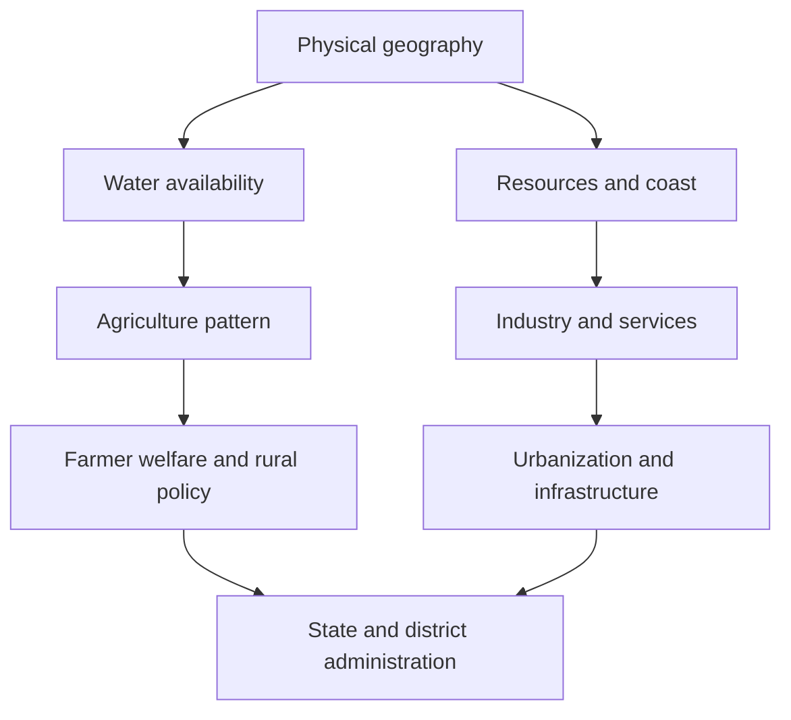

# 03 - Maharashtra Geography, Economy, and Administration

## Why This Chapter Matters

Maharashtra is not one uniform region. Konkan, Western Maharashtra, Marathwada, Vidarbha, North Maharashtra, Mumbai Metropolitan Region, tribal belts, industrial corridors, drought-prone districts, coastal zones, and agricultural regions face different development problems. MPSC questions often test whether the candidate understands these differences and can connect geography to economy and administration.

Source snapshot: 2026-05-27. Verify current state data, schemes, district details, and budget figures from official Maharashtra government sources before final use.

## The Big Picture

```text
physical geography
  -> rainfall, rivers, soil, minerals, coast
  -> agriculture and industry pattern
  -> regional development issues
  -> state policy and administration
```

## First-Principles Explanation

Cause: Geography shapes livelihood, settlement, infrastructure, water availability, agriculture, disaster risk, and industry.

Mechanism: Maharashtra's physical regions create different economic and administrative challenges: coastal flooding/cyclones, drought-prone interiors, cotton regions, sugar belt, industrial corridors, tribal development areas, and urban infrastructure stress.

Immediate result: State policy must be region-sensitive.

Long-term impact: MPSC answers need region-specific examples, not only generic Indian economy points.

## Core Vocabulary

| Term | Meaning | Why it matters |
| --- | --- | --- |
| Konkan | Coastal Maharashtra region. | Coastal economy, ports, fisheries, tourism, heavy rainfall, landslide/flood risk. |
| Western Maharashtra | Economically significant region with sugar/cooperative influence. | Agriculture, irrigation, cooperatives, politics. |
| Marathwada | Region often associated with drought and development challenges. | Water scarcity, agriculture vulnerability. |
| Vidarbha | Eastern Maharashtra region, cotton belt and mineral/forest issues in parts. | Agrarian distress, forests, regional imbalance. |
| North Maharashtra | Region with agriculture, tribal areas, and varied rainfall. | State geography and development questions. |
| Rain shadow | Area receiving lower rainfall due to Western Ghats barrier effect. | Explains drought-prone areas. |
| Cooperative sector | Member-owned economic institutions. | Key to sugar, credit, dairy, rural politics. |
| District administration | Collector-led administrative machinery. | Implementation backbone. |

## Mental Model

For every Maharashtra topic, ask:

```text
Which region?
  -> what physical constraint?
  -> what livelihood/economic pattern?
  -> what governance response?
  -> what current issue?
```

## Causal Chains

### Drought-Prone Regions

Western Ghats rainfall pattern and rain-shadow effect -> uneven water availability -> dependence on groundwater and irrigation -> crop vulnerability -> farmer distress and migration -> watershed, irrigation, crop insurance, water governance, and livelihood diversification policies.

### Urbanization and Mumbai/Pune Region

Economic concentration -> migration and service-sector growth -> housing, transport, pollution, waste, and infrastructure pressure -> metropolitan planning and local governance challenges -> questions on urban administration and sustainable development.

### Regional Imbalance

Different historical investments, irrigation access, industry location, and infrastructure -> uneven growth across regions -> political demands and policy interventions -> exam questions on inclusive development and state planning.

## Architecture or Conceptual Structure



## Step-by-Step Study Method

1. Make a Maharashtra map with regions.
2. Add rivers, rainfall pattern, soil, crops, minerals, forests, coast, and major cities.
3. Link each region to economic activity.
4. Link economic activity to policy problems.
5. Add current affairs from state budget, economic survey, schemes, and disasters.
6. Convert into MCQ and Mains notes.

## Internal Mechanics

### Geography to Economy

| Geography feature | Economic effect | Administrative issue |
| --- | --- | --- |
| Coast | ports, fisheries, tourism, trade | coastal regulation, disaster risk, infrastructure |
| Western Ghats | rainfall, biodiversity, slopes | conservation, landslides, water resources |
| Rain shadow | drought-prone agriculture | irrigation, watershed, crop planning |
| Black soil regions | cotton/sugarcane/cash crops in suitable areas | price risk, water use, farmer distress |
| Urban corridors | industry/services | housing, transport, pollution, migration |
| Forest/tribal areas | forest livelihoods, minerals, biodiversity | rights, conservation, development balance |

### Administration Layer

Key administrative angles:

- state government departments
- district collector and district planning
- local self-government bodies
- panchayats and municipalities
- disaster management authorities
- cooperative department and regulation
- welfare implementation machinery

## Small Details That Matter Later

- Maharashtra examples should identify region, not just state name.
- Water questions often need geography plus agriculture plus governance.
- Urban questions need municipal finance and planning, not only population growth.
- Vidarbha, Marathwada, Konkan, and Western Maharashtra have different development profiles.
- State data changes; mark figures for current verification.
- Cooperative movement has both development and governance dimensions.
- Tribal and forest questions need rights, livelihood, conservation, and administration.
- Disaster management differs by region: drought, flood, cyclone, landslide, heat, urban flooding.

## Common Misunderstandings

| Misunderstanding | Correction |
| --- | --- |
| Maharashtra economy is only Mumbai/Pune. | Agriculture, cooperatives, minerals, forests, ports, and regional imbalance also matter. |
| Drought is only low rainfall. | It involves rainfall pattern, water governance, crops, groundwater, and livelihoods. |
| Geography is static. | It explains current policy and economic questions. |
| Local governance is only constitutional articles. | MPSC also needs state implementation and local institutions. |

## Failure Modes / Mistakes / Traps

| Failure | Fix |
| --- | --- |
| Generic India-level answers | Add Maharashtra region, data, scheme, or institution. |
| No map awareness | Practice region/district map marking. |
| Current data outdated | Verify from official state budget/economic survey. |
| One-sided development answer | Add environment, equity, finance, and governance tradeoffs. |

## Answer-Writing Method

For geography-economy-governance answers:

```text
physical basis
  -> economic activity
  -> affected stakeholders
  -> administrative problem
  -> policy response
  -> limitations
  -> way forward
```

## Practice Questions

1. Explain how the rain-shadow effect influences agriculture and water policy in Maharashtra.
2. Discuss regional imbalance in Maharashtra with examples.
3. How does urbanization create governance challenges in Maharashtra?
4. Examine the role of cooperatives in rural development.
5. Link Maharashtra's physical geography to disaster management priorities.

## Answer Hints

1. Include Western Ghats, rainfall distribution, drought-prone regions, crop choice, irrigation, watershed, groundwater, and policy.
2. Compare regions through irrigation, industry, urbanization, agriculture, infrastructure, and social indicators.
3. Include housing, transport, solid waste, water supply, flooding, finance, and metropolitan coordination.
4. Include credit, sugar, dairy, collective bargaining, political economy, regulation, and governance issues.
5. Include drought, floods, coastal hazards, landslides, heat stress, and urban flooding.
