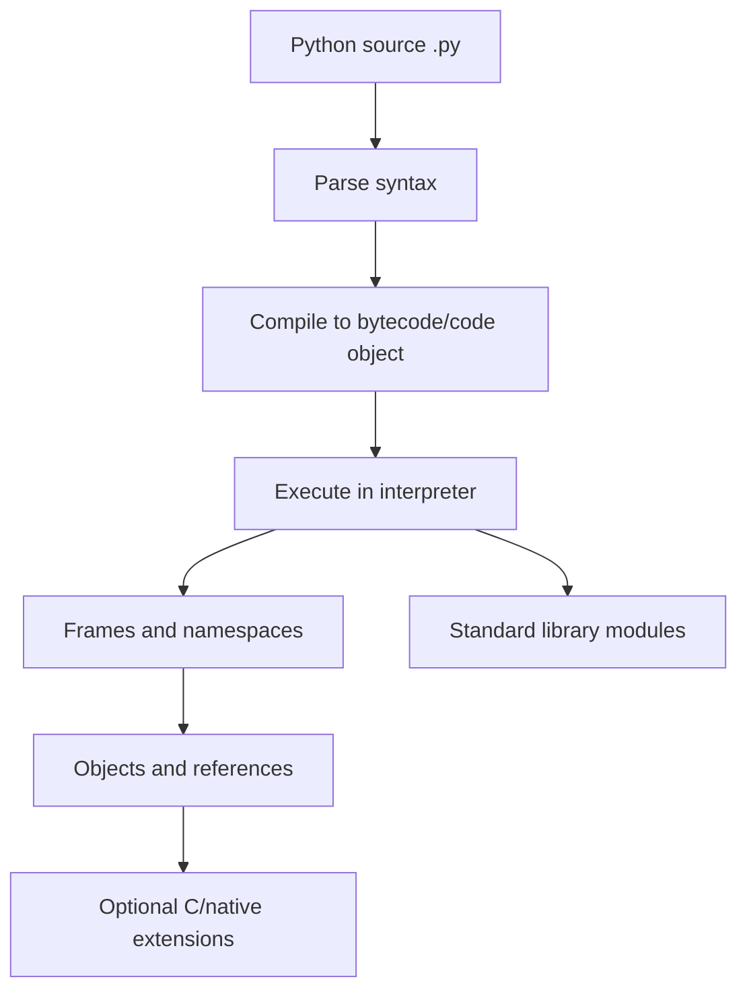

# 01 - Runtime Foundations, Objects, and References

## Why This Chapter Matters

Python is easy to start and easy to misuse for the same reason: it lets you write useful code before you understand the runtime.

If you think a Python variable "contains a value," lists "copy automatically," or threads "cannot race because of the GIL," Python will eventually surprise you. The correct mental model is simple but precise:

```text
names are bound to objects
objects have identity, type, and value
some objects mutate in place
execution happens in namespaces and frames
CPython adds implementation details such as reference counting and the GIL
```

Cause -> Mechanism -> Immediate Result -> Long-Term Impact -> Next Connected Topic:

```text
developers needed fast readable automation
-> Python chose dynamic typing, name binding, rich objects, and interpreter workflow
-> programs are quick to write
-> hidden reference, mutation, import, and runtime details become important at scale
-> data structures, functions, modules, typing, async, and DevOps automation
```

Official source baseline:

- Python documentation: <https://docs.python.org/3/>
- Python tutorial: <https://docs.python.org/3/tutorial/>
- Python data model: <https://docs.python.org/3/reference/datamodel.html>
- Python execution model: <https://docs.python.org/3/reference/executionmodel.html>
- Python glossary: <https://docs.python.org/3/glossary.html>

Version assumption: source checked on 2026-05-27. The current official docs page points to Python 3.14 documentation, while many production systems still run 3.11, 3.12, or 3.13. Unless noted, examples use standard Python 3 syntax and CPython behavior. CPython details such as reference counting and GIL behavior are implementation details, not universal language guarantees for every Python implementation.

## The Big Picture

Python's design target is not "the fastest possible machine code." It is:

```text
make correct human intent easy to express
```

That goal shaped the language:

| Design choice | What it gives | What it costs |
| --- | --- | --- |
| Dynamic typing | Fast development and flexible APIs. | Type errors may appear at runtime without tests or static checking. |
| Indentation syntax | Readable structure. | Whitespace matters. |
| Rich built-ins | Lists, dicts, sets, strings, exceptions, files. | Beginners may use them without understanding mutability/cost. |
| Interpreter workflow | Fast feedback loop. | Packaging and environment discipline become important. |
| Everything is an object | Unified object model. | Identity, aliasing, and mutation matter. |
| Batteries-included standard library | Powerful scripting and automation. | Need to learn which tools already exist. |


## First-Principles Explanation

### What Is a Python Program?

A Python program is source text that Python parses, compiles to bytecode, and executes in a runtime environment.

Simplified chain:

```text
.py file
-> parser builds syntax structure
-> compiler creates code objects / bytecode
-> interpreter executes bytecode in frames
-> names are resolved in namespaces
-> operations manipulate objects
```

You usually do not see these internals during normal scripting, but they explain errors, imports, stack traces, closures, and performance.

### What Is an Object?

In Python, meaningful runtime data is represented as objects.

An object has:

- identity: which object it is
- type: what behavior it supports
- value: its data or state

Example:

```python
x = [1, 2, 3]
print(id(x))
print(type(x))
print(x)
```

Important interpretation:

```text
x is not the list itself
x is a name bound to a list object
```

### What Is a Name?

A name is a label in a namespace that refers to an object.

```python
a = [10, 20]
b = a
b.append(30)
print(a)
```

Output:

```text
[10, 20, 30]
```

Cause -> Mechanism -> Result:

```text
b = a binds b to the same list object
-> append mutates that shared object
-> both a and b observe the change
```

This single idea explains many Python bugs.

## Core Vocabulary

| Term | Meaning | Why it matters |
| --- | --- | --- |
| Object | Runtime entity with identity, type, and value. | Everything meaningful is manipulated as objects. |
| Name | Identifier bound to an object in a namespace. | Assignment binds; it does not copy by default. |
| Namespace | Mapping from names to objects. | Explains globals, locals, imports, and class bodies. |
| Scope | Region where a name can be resolved. | Explains local/global/nonlocal behavior. |
| Frame | Runtime execution context for a function/module call. | Tracebacks are stacks of frames. |
| Mutable | Object can change in place. | Lists, dicts, sets are common mutable objects. |
| Immutable | Object value cannot change in place. | ints, strings, tuples are common immutable objects. |
| Identity | Object sameness, tested by `is`. | Different from equality. |
| Equality | Value comparison, tested by `==`. | Custom types can define it. |
| Reference | Link from a name/container to an object. | Aliasing bugs come from shared references. |
| CPython | Reference implementation of Python in C. | Many runtime details in practice come from CPython. |
| GIL | Global Interpreter Lock in many CPython builds. | Affects CPU-bound threading and native extension behavior. |

## Mental Model

Draw Python memory like this:

```text
name table:
  a  ---> list object [1, 2, 3]
  b  ---/
```

Not like this:

```text
a contains [1, 2, 3]
b contains [1, 2, 3]
```

When an object is mutable, multiple names can see the same changing state.

When an object is immutable, operations usually create new objects:

```python
s = "py"
t = s
s = s + "thon"
print(t)
print(s)
```

Output:

```text
py
python
```

The name `s` was rebound to a new string. The old string object did not change.

## Historical / Evolution / Causal Chain

### Before Python's Popularity

Many tasks were done with shell scripts, C, Perl, or heavy enterprise languages.

Each had strengths:

- shell was good for command glue but weak for complex structure
- C was fast but verbose and unsafe for quick automation
- Perl was powerful but could become hard to read
- Java was structured but heavy for small scripts

Python offered a different compromise:

```text
readable syntax
-> dynamic object model
-> rich standard library
-> useful scripts with less ceremony
```

### Why Python Became Important

Python became useful wherever humans needed to move between systems:

- DevOps automation
- testing
- data cleaning
- web services
- machine learning workflows
- teaching programming
- infrastructure glue

Cause -> Mechanism -> Long-term impact:

```text
software systems became larger and more connected
-> teams needed glue code and automation
-> Python made scripting and libraries approachable
-> Python became a default language for automation and data work
```

## Architecture or Conceptual Structure

### Execution Layers



### Name Resolution

Python resolves names using a scope chain commonly summarized as LEGB:

```text
Local -> Enclosing -> Global -> Builtins
```

Example:

```python
message = "global"

def outer():
    message = "enclosing"

    def inner():
        message = "local"
        return message

    return inner()
```

`inner` resolves `message` locally first.

If a name is assigned anywhere in a function body, Python generally treats it as local in that function unless declared `global` or `nonlocal`.

Common bug:

```python
count = 0

def increment():
    count += 1
```

This raises `UnboundLocalError` because Python treats `count` as local due to assignment, then tries to read it before local binding exists.

Fix:

```python
count = 0

def increment():
    global count
    count += 1
```

Better design: avoid global mutable state where possible.

## Step-by-Step Explanation

### Assignment

```python
x = 10
```

Means:

```text
bind name x to integer object 10
```

Not:

```text
put 10 inside x as a storage box
```

### Reassignment

```python
x = 10
x = 20
```

Means:

```text
x first refers to 10
x later refers to 20
```

The name changes binding.

### Mutating Through a Name

```python
items = []
items.append("a")
```

Means:

```text
items refers to a list object
append changes that list object in place
```

### Passing Arguments

Python passes object references by assignment.

```python
def add_item(bucket):
    bucket.append("x")

values = []
add_item(values)
print(values)
```

Output:

```text
['x']
```

Function parameter `bucket` is a local name bound to the same list object.

If the function rebinds the name, caller binding is not changed:

```python
def replace(bucket):
    bucket = ["new"]

values = []
replace(values)
print(values)
```

Output:

```text
[]
```

The local name `bucket` was rebound. The caller's `values` still refers to the original list.

## Internal Mechanics

### Identity vs Equality

```python
a = [1, 2]
b = [1, 2]
c = a

print(a == b)
print(a is b)
print(a is c)
```

Output:

```text
True
False
True
```

Reason:

- `a == b`: the two lists have equal contents
- `a is b`: they are different list objects
- `a is c`: both names refer to the same object

Use `is` for identity checks, especially `None`:

```python
if value is None:
    ...
```

Do not use `is` for ordinary string/int equality.

### Mutability

Mutable examples:

- list
- dict
- set
- bytearray
- most custom objects

Immutable examples:

- int
- float
- bool
- str
- tuple, if its contents are not themselves mutated
- frozenset
- bytes

Tuple subtlety:

```python
t = ([1, 2], "x")
t[0].append(3)
print(t)
```

Output:

```text
([1, 2, 3], 'x')
```

The tuple did not change which objects it references. The list inside it mutated.

### Reference Counting and Garbage Collection

CPython primarily uses reference counting, plus cyclic garbage collection for reference cycles.

Practical consequences:

- objects are usually freed when reference count reaches zero
- cycles need garbage collector support
- `__del__` finalizers can complicate cleanup
- relying on immediate cleanup is CPython-specific behavior

Use context managers for external resources:

```python
with open("data.txt", "r", encoding="utf-8") as f:
    text = f.read()
```

This is better than relying on garbage collection to close files.

### The GIL at a First-Principles Level

In typical CPython builds, the Global Interpreter Lock allows only one thread at a time to execute Python bytecode in one interpreter.

What this means:

- CPU-bound Python threads often do not run in parallel on multiple cores.
- I/O-bound threads can still be useful because threads release the GIL while waiting on I/O.
- native extensions can release the GIL for heavy work.
- the GIL does not make your program logically thread-safe.

Race example:

```python
counter += 1
```

This looks atomic at source level but can involve multiple bytecode-level steps. Shared mutable state still needs synchronization.

Version-sensitive note: current Python documentation discusses free-threaded CPython builds and ways to disable the GIL in specific builds. Treat GIL behavior as CPython-build-sensitive and verify for your interpreter.

## Practical Examples

### Aliasing Bug

```python
rows = [[0] * 3] * 3
rows[0][0] = 1
print(rows)
```

Output:

```text
[[1, 0, 0], [1, 0, 0], [1, 0, 0]]
```

Cause:

```text
outer list contains three references to the same inner list
```

Correct:

```python
rows = [[0] * 3 for _ in range(3)]
```

### Mutable Default Argument Bug

```python
def add_task(task, bucket=[]):
    bucket.append(task)
    return bucket

print(add_task("a"))
print(add_task("b"))
```

Output:

```text
['a']
['a', 'b']
```

Cause:

```text
default list object is created once at function definition time
```

Correct:

```python
def add_task(task, bucket=None):
    if bucket is None:
        bucket = []
    bucket.append(task)
    return bucket
```

### Local Name Binding Bug

```python
status = "idle"

def mark():
    print(status)
    status = "busy"
```

This fails because assignment makes `status` local in `mark`, so the earlier `print(status)` tries to read an unbound local variable.

## Small Details That Matter Later

- Assignment binds names to objects. It does not copy by default.
- `copy.copy` is shallow; `copy.deepcopy` recursively copies but can be expensive and surprising.
- `is` is identity; `==` is equality.
- Small integer or string interning is an implementation optimization. Do not depend on it.
- Default arguments are evaluated once at function definition time.
- Closures capture variables by reference-like binding, not frozen values unless you force binding.
- Class body execution creates a namespace before the class object exists.
- `with` should be used for files, locks, sockets, and resources needing cleanup.
- Tracebacks keep frames, and frames can keep objects alive while exceptions are referenced.
- CPython reference counting is not a portable guarantee across all Python implementations.
- The GIL does not protect your application-level invariants.
- `None` should be compared with `is`, not `==`.
- `bool` is a subclass of `int`, which can surprise numeric logic.

## Common Misunderstandings

### Misunderstanding 1: "Python variables store values."

More accurate:

```text
Python names are bound to objects.
```

### Misunderstanding 2: "Function arguments are passed by reference."

More accurate:

```text
argument passing binds local parameter names to the same objects passed by the caller
```

Mutation of a shared object is visible. Rebinding the local parameter is not.

### Misunderstanding 3: "Tuples are always deeply immutable."

Tuples are immutable in their structure, but they can contain references to mutable objects.

### Misunderstanding 4: "The GIL means no race conditions."

The GIL is not a program correctness lock. Shared mutable state can still be inconsistent without synchronization.

## Failure Modes / Mistakes / Traps

### Trap 1: Shared Inner Lists

```python
grid = [[0] * cols] * rows
```

Creates repeated references to the same inner list.

### Trap 2: Mutable Defaults

```python
def f(options={}):
    ...
```

State can leak across calls.

### Trap 3: Identity for Equality

```python
if name is "admin":
    ...
```

This is wrong. Use `==`.

### Trap 4: Global State in Automation Scripts

Small scripts often grow into production automation. Hidden globals make retries, tests, and concurrency harder.

## Debugging / Analysis / Answer-Writing Method

When a Python state bug appears, ask:

1. Which names point to the same object?
2. Is the object mutable?
3. Was the object copied or shared?
4. Was a default argument reused?
5. Is a local name accidentally shadowing an outer name?
6. Is a thread/task modifying shared state?
7. Is cleanup explicit or relying on garbage collection?

Useful commands:

```python
print(id(obj))
print(type(obj))
print(repr(obj))
```

Use `pprint` for nested structures:

```python
from pprint import pprint
pprint(data)
```

## Real-World or Exam Relevance

Interviewers like questions such as:

- Why did all rows in this matrix change?
- Why does this function remember previous calls?
- What is the difference between `is` and `==`?
- Does Python pass by value or reference?
- What is the GIL?
- Why are Python threads not ideal for CPU-bound work?

Strong answer pattern:

```text
Python binds names to objects. Passing an argument binds a local parameter to the same object. Mutating that object is visible to the caller; rebinding the local name is not. Mutable defaults are evaluated once, so they can preserve state across calls. `is` checks identity and `==` checks equality.
```

## Connected Topics

- [Core Types Functions Iterators and Modules](02%20-%20Core%20Types%20Functions%20Iterators%20and%20Modules.md)
- [Errors Files OOP Typing Async and Automation](03%20-%20Errors%20Files%20OOP%20Typing%20Async%20and%20Automation.md)
- Java memory model and references.
- C++ stack/heap, references, RAII.
- DevOps automation scripts and idempotent tooling.

## Chapter Summary

Python is readable because it hides ceremony, not because it removes runtime mechanics.

The core facts:

```text
names bind to objects
objects have identity, type, and value
mutation changes objects
assignment changes bindings
scopes control name lookup
CPython details matter in practice but are not always language guarantees
```

Once this is clear, many Python bugs stop looking mysterious.

## Questions to Test Understanding

1. What does `x = [1, 2]` do in Python?
2. Why does `b = a` not copy a list?
3. What is the difference between `is` and `==`?
4. Why is `[[0] * 3] * 3` often wrong?
5. Why are mutable default arguments dangerous?
6. What is LEGB?
7. Why should files be opened with `with`?
8. What does the GIL affect?
9. Why can a tuple contain a list that changes?
10. Why is CPython reference counting not a universal Python guarantee?

## Answers and Reasoning

1. It creates or reuses a list object and binds the name `x` to that object.
2. It binds `b` to the same object as `a`; no copy operation is requested.
3. `is` checks object identity; `==` checks equality of value according to type behavior.
4. It repeats references to the same inner list, so mutating one row appears to mutate all rows.
5. The default object is created once when the function is defined and reused across calls.
6. Local, Enclosing, Global, Builtins: the common name-resolution order.
7. `with` guarantees cleanup through a context manager even when exceptions occur.
8. In typical CPython builds it limits parallel execution of Python bytecode by threads, affecting CPU-bound threading.
9. The tuple's references are fixed, but the mutable object referenced inside can still mutate.
10. Other implementations may use different memory management; CPython implementation details should not be treated as language specification.

